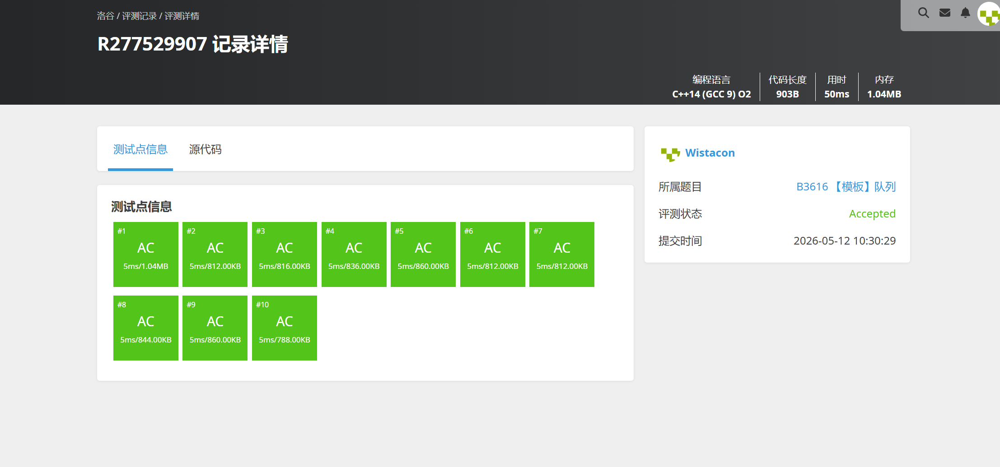

# B3616 【模板】队列

## 题目信息

题目链接：https://www.luogu.com.cn/problem/B3616

知识点：队列、STL queue

## 题目简述

> 实现一个队列，支持四种操作：
> - `push(x)`：将 $x$ 入队
> - `pop()`：弹出队首，若队列为空则输出 `ERR_CANNOT_POP`
> - `query()`：输出队首元素，若队列为空则输出 `ERR_CANNOT_QUERY`
> - `size()`：输出队列元素个数
>
> $n \le 10000$，所有插入元素值为 $[1, 1000000]$ 内的正整数。
>
> 时间限制：1S，空间限制：125MB。

## 题目分析

### 详细版

**1. 读题**

本题是队列的基本操作模板题，要求实现先进先出（FIFO）的队列结构，支持入队、出队、查询队首、查询大小四种操作，并在空队列时进行异常处理输出。

**2. 数据结构与算法选择**

队列（queue）是经典的线性数据结构，只允许在一端（队尾）插入、另一端（队首）删除。可以直接使用 C++ STL 的 `queue<int>` 容器，它底层基于 `deque` 实现，提供了 `push()`、`pop()`、`front()`、`size()`、`empty()` 等接口，正好对应题目要求的四种操作。

**3. 程序设计**

```
读入操作次数 n
循环 n 次，读入操作类型 op：
  op == 1 → 读入 x，q.push(x)
  op == 2 → 若 q.empty() 输出错误信息，否则 q.pop()
  op == 3 → 若 q.empty() 输出错误信息，否则输出 q.front()
  op == 4 → 输出 q.size()
```

**4. 时空复杂度分析**

- 时间复杂度：$O(n)$，每次操作均为 $O(1)$
- 空间复杂度：$O(n)$，队列最多存储 $n$ 个元素

### 省流版

直接使用 STL `queue<int>` 实现四种队列操作，入队、出队、查询队首、查询大小均为 $O(1)$。操作前用 `empty()` 判断空队列并输出对应错误信息即可。时间复杂度 $O(n)$。

## 代码实现



```cpp
// B3616 【模板】队列
/*
链接：https://www.luogu.com.cn/problem/B3616
知识点：队列、STL queue
*/
#include <stdio.h>
#include <stdlib.h>
#include <string.h>
#include <stack>
#include <queue>
#include <vector>
#include <map>
#include <set>
#include <algorithm>
#include <ext/pb_ds/tree_policy.hpp>
#include <ext/pb_ds/assoc_container.hpp>

using namespace std;

queue<int> num;

int main(){
    int op;
    int x;
    int n;

    scanf("%d", &n);
    for(int i = 0; i < n; i++){
        scanf("%d", &op);

        if(op == 1){
            scanf("%d", &x);
            num.push(x);
        }else if(op == 2){
            if(num.empty()){
                printf("ERR_CANNOT_POP\n");
                continue;
            }
            num.pop();
        }else if(op == 3){
            if(num.empty()){
                printf("ERR_CANNOT_QUERY\n");
                continue;
            }
            printf("%d\n", num.front());
        }else{
            printf("%d\n", num.size());
        }

    }


}
```

## 代码链接

代码发布于：https://github.com/Flutter-Misdreavus/csu_algorithm
