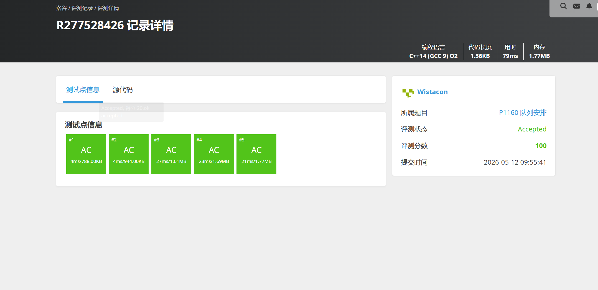

# P1160 队列安排

## 题目信息

题目链接：https://www.luogu.com.cn/problem/P1160

知识点：链表模拟、双向链表

## 题目简述

> 将 $N$ 个同学排成一列：先将 $1$ 号入列，之后 $2 \sim N$ 号同学依次入列，每人被指定插入到某位已入列同学的左边或右边。随后从队列中移除 $M$ 个同学（若已不在队列中则忽略），最后从左到右输出剩余同学的编号。
>
> 对于 $100\%$ 的数据，$1 < M \le N \le 10^5$。
>
> 时间限制：1S，空间限制：125MB。

## 题目分析

### 详细版

**1. 读题**

本题需要维护一个不断变化的序列，支持以下两种操作：
- 插入：将新元素插入到指定元素的左侧或右侧
- 删除：删除指定编号的元素（可能已删除则忽略）

最终按从左到右的顺序输出剩余元素。

**2. 性质观察**

- 插入操作只在已有元素的相邻位置进行，不涉及任意位置的随机访问
- 删除操作只标记删除，不影响其他元素的相对顺序
- 元素编号为 $1 \sim N$，范围已知，适合用数组下标直接索引

**3. 数据结构与算法选择**

选择**数组模拟双向链表**：

使用三个数组：
- `right[i]`：编号为 $i$ 的同学右侧的同学编号（0 表示到头）
- `left[i]`：编号为 $i$ 的同学左侧的同学编号（0 表示到头）
- `del[i]`：标记编号为 $i$ 的同学是否已被删除

维护一个 `head` 变量记录当前队列最左端的同学编号。

**4. 程序设计**

插入操作（将 $i$ 号插入到 $k$ 号的左边或右边）：
- 若 $p = 0$（插入左侧）：修改 $k$ 左侧元素的 `right` 指针指向 $i$，以及 $k$ 的 `left` 指针指向 $i$，并建立 $i$ 与左右邻居的链接。若 $k$ 是队首，则更新 `head = i`。
- 若 $p = 1$（插入右侧）：同理修改 $k$ 右侧元素的 `left` 指针以及 $k$ 的 `right` 指针。

删除操作：直接将 `del[x] = 1` 标记为已删除（题目允许重复删除，忽略即可）。

输出时从 `head` 开始沿 `right[]` 指针遍历，跳过 `del[head] = 1` 的元素。

**5. 时空复杂度分析**

- 时间复杂度：$O(N + M)$，插入 $N-1$ 次、标记删除 $M$ 次、遍历输出最多 $N$ 次，均为常数操作。
- 空间复杂度：$O(N)$，三个长度为 $N$ 的数组。

### 省流版

用数组模拟双向链表维护队列，插入时修改相邻元素的 `left`/`right` 指针，删除时用 `del[]` 标记，最后从队首沿 `right[]` 遍历输出未删除的元素。时间复杂度 $O(N + M)$，空间复杂度 $O(N)$。

## 代码实现



```cpp
// P1160 队列安排
/*
链接：https://www.luogu.com.cn/problem/P1160
知识点：链表模拟、双向链表
*/
#include <stdlib.h>
#include <stdio.h>
#include <string.h>
#include <list>
#include <vector>
#include <stack>
#include <queue>
#include <algorithm>
#include <map>
#include <set>

using namespace std;

int right[100010];
int left[100010];
int del[100010];
// 使用数组模拟双向链表

int main(){
    int n;
    int m;
    int k, p;
    int x;
    int head = 1; //记录第一个数

    memset(del, 0 ,sizeof(del));
    scanf("%d", &n);
    right[1] = 0;
    left[1] = 0;
    right[0] = 0;
    left[0] = 0;
    // 0代表到尽头了

    for(int i = 2; i <= n; i++){
        scanf("%d%d", &k, &p);
        if(p == 0){
            right[left[k]] = i;
            left[i] = left[k];
            left[k] = i;
            right[i] = k;

            if(k == head){
                head = i;
            }
        }else{
            left[right[k]] = i;
            right[i] = right[k];
            right[k] = i;
            left[i] = k;
        }
    }

    scanf("%d", &m);
    for(int i = 0; i < m; i++){
        scanf("%d", &x);
        del[x] = 1;
    }

    while (head != 0){
        if(!del[head]){
            printf("%d ", head);
        }
        head = right[head];
    }
    printf("\n");

}
```

## 代码链接

代码发布于：https://github.com/Flutter-Misdreavus/csu_algorithm
