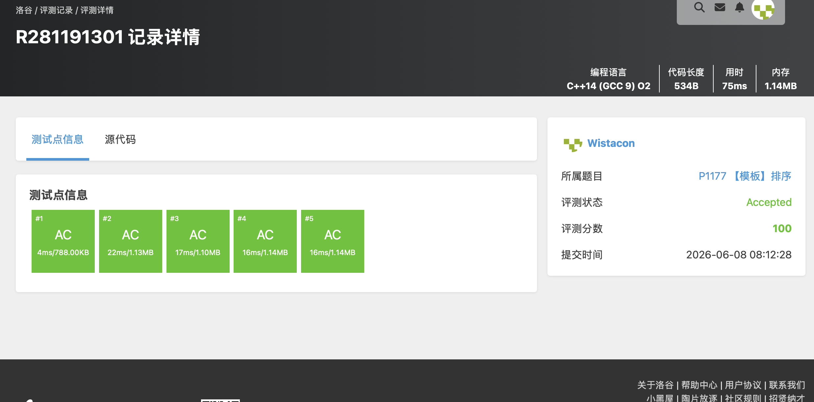

# P1177 【模板】排序

## 题目信息

题目链接：https://www.luogu.com.cn/problem/P1177

知识点：排序算法

## 题目简述

> 将读入的 $N$ 个数从小到大排序后输出。
>
> 数据范围：$1 \le N \le 10^5$，$1 \le a_i \le 10^9$。
>
> 时间限制：1S，空间限制：125MB

## 题目分析

### 详细版

**1. 读题**

本题是一道排序模板题，要求将 $N$ 个正整数从小到大排序后输出。数据规模 $N \le 10^5$，数值范围 $a_i \le 10^9$。题目没有特殊限制，是一道纯粹的排序练习。

**2. 性质观察**

本题的核心就是选择一个合适的排序算法。常见的排序算法按时间复杂度可分为两类：

- **$O(n^2)$ 排序**：冒泡排序、选择排序、插入排序。对于 $N = 10^5$ 的数据规模，$O(n^2)$ 的算法大约需要 $10^{10}$ 次操作，会超时。
- **$O(n \log n)$ 排序**：归并排序、快速排序、堆排序。对于 $N = 10^5$，$O(n \log n)$ 大约需要 $1.7 \times 10^6$ 次操作，完全可以在 1 秒内完成。

因此必须使用 $O(n \log n)$ 级别的排序算法。

**3. 数据结构与算法选择**

- **数据结构**：使用 `vector<int>` 动态数组存储待排序的数列
- **算法**：直接使用 C++ STL 的 `sort` 函数。STL 的 `sort` 底层实现是 **Introsort（内省排序）**，它是快速排序、堆排序和插入排序的混合体：
  - 以快速排序为主，平均效率极高
  - 当递归深度超过 $2 \log n$ 时切换为堆排序，避免快速排序最坏 $O(n^2)$ 的情况
  - 当子数组规模较小时切换为插入排序，减少递归开销

当然也可以手写归并排序或快速排序等其他 $O(n \log n)$ 的算法来通过本题。

**4. 程序设计**

程序逻辑非常简单，分为三步：

1. 读入 $N$ 和 $N$ 个整数，存入 `vector`
2. 调用 `sort` 对整个数组进行排序
3. 依次输出排序后的元素

核心代码：

```cpp
sort(nums.begin(), nums.end());
```

一行即可完成排序，体现了 STL 的便捷性。

**5. 时空复杂度分析**

- **时间复杂度**：$O(n \log n)$。STL `sort` 基于 Introsort，最坏情况保证 $O(n \log n)$
- **空间复杂度**：$O(n)$。`vector` 存储 $n$ 个元素需要 $O(n)$ 空间，`sort` 内部堆排序部分需要 $O(\log n)$ 的栈空间

### 省流版

排序模板题，直接用 STL 的 `sort` 函数即可，底层是 Introsort，时间复杂度 $O(n \log n)$。也可以手写归并排序或快速排序。

## 代码实现



```cpp
#include <stdio.h>
#include <string.h>
#include <stdlib.h>
#include <stack>
#include <queue>
#include <vector>
#include <list>
#include <map>
#include <set>
#include <algorithm>
#include <string>
#include <ext/pb_ds/assoc_container.hpp>
#include <ext/pb_ds/tree_policy.hpp>

using namespace std;

vector<int> nums;

int main(){
	int n;
	int a;

	scanf("%d", &n);
	for(int i = 0; i < n; i++){
		scanf("%d", &a);
		nums.push_back(a);
	}

	sort(nums.begin(), nums.end());

	for(auto& it : nums){
		printf("%d ", it);
	}
	printf("\n");
}
```

## 代码链接

代码发布于：https://github.com/Flutter-Misdreavus/csu_algorithm
