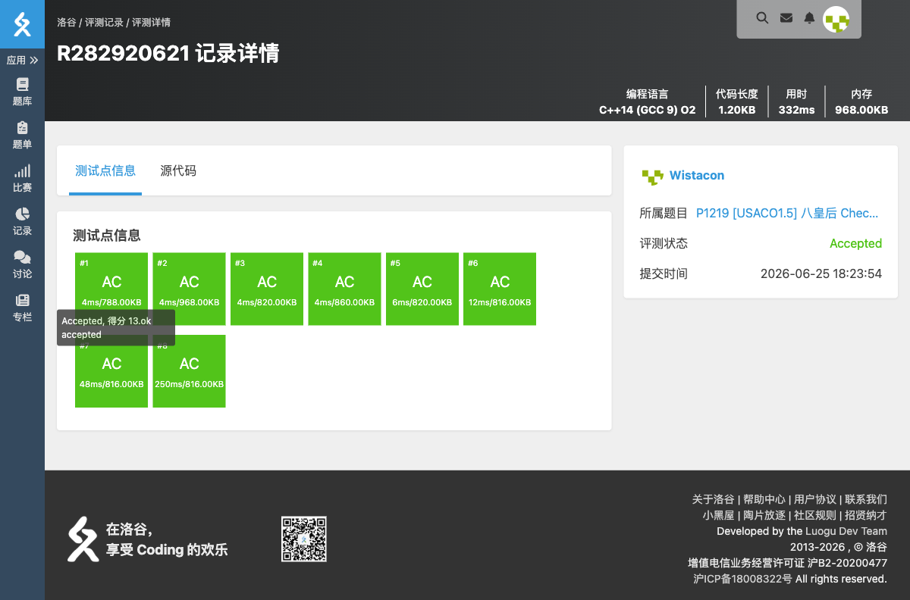

# P1219 [USACO1.5] 八皇后 Checker Challenge

## 题目信息

- **题目链接**：https://www.luogu.com.cn/problem/P1219
- **知识点**：DFS、回溯、八皇后
- **时间限制**：1.00s
- **内存限制**：125.00MB

## 题目简述

> 在 $n \times n$ 的棋盘上放置 $n$ 个皇后，使得每行、每列有且只有一个皇后，每条对角线（包括两条主对角线的所有平行线）上至多有一个皇后。
> 
> 输出前 3 个解（按字典序），以及解的总数。
> 
> 数据范围：$6 \le n \le 13$。

## 题目分析

### 详细版

**1. 读题**

本题是经典的 $n$ 皇后问题。需要用序列描述解，第 $i$ 个数字表示第 $i$ 行皇后所在的列号。要求输出字典序前 3 的解以及总解数。

**2. 性质观察**

- 每行恰好一个皇后，因此可以按行 DFS，每行枚举放置的列。
- 需要保证：列不重复、主对角线不重复、副对角线不重复。
- 对于位置 $(row, col)$：
  - 主对角线编号可以用 `row - col`（或加上偏移避免负数）；
  - 副对角线编号可以用 `row + col`。

**3. 数据结构与算法选择**

- **DFS 回溯**：逐行放置皇后，放置时检查三个约束是否满足；满足则递归到下一行，不满足则回溯。
- **标记数组**：
  - `lie[col]`：列是否被占用；
  - `zuo[row - col + n]`：主对角线是否被占用（加 $n$ 避免下标为负）；
  - `you[row + col]`：副对角线是否被占用。

**4. 程序设计**

- 从第 1 行开始 DFS。
- 对当前行的每一列尝试放置：若列、主对角线、副对角线均未被占用，则放置并标记，递归到下一行。
- 当递归到第 $n+1$ 行时，说明得到一个完整解：计数器加 1；若计数器不超过 3，则输出当前解。
- 回溯时撤销三个标记。
- 最后输出解的总数。

**5. 时空复杂度分析**

- 时间复杂度：最坏 $O(n!)$，但由于剪枝（对角线约束），实际远小于。$n \le 13$ 时可以通过。
- 空间复杂度：$O(n)$，递归栈深度和标记数组大小均为 $O(n)$。

### 省流版

按行 DFS 枚举皇后位置，用三个数组分别标记列、主对角线、副对角线是否被占用。找到一个完整解时，前 3 个输出，最后输出总解数。

## 代码实现



```cpp
// P1219 [USACO1.5] 八皇后 Checker Challenge
/*
链接：https://www.luogu.com.cn/problem/P1219
知识点：DFS、回溯、八皇后
*/
#include <stdio.h>
#include <stdlib.h>
#include <string.h>
#include <stack>
#include <string>
#include <queue>
#include <vector>
#include <list>
#include <map>
#include <set>
#include <algorithm>
#include <ext/pb_ds/assoc_container.hpp>
#include <ext/pb_ds/tree_policy.hpp>

using namespace std;

int n;
int ans[15];      // ans[i] 表示第 i 行皇后所在的列
int lie[15];      // 列是否被占用
int zuo[30];      // 主对角线是否被占用（row - col + n）
int you[30];      // 副对角线是否被占用（row + col）
int zong = 0;    // 解的个数

void dfs(int row){
	if(row == n + 1){
		zong++;
		if(zong <= 3){
			for(int i = 1; i <= n; i++){
				printf("%d", ans[i]);
				if(i != n){
					printf(" ");
				}
			}
			printf("\n");
		}
		return;
	}

	for(int col = 1; col <= n; col++){
		if(!lie[col] && !zuo[row - col + n] && !you[row + col]){
			ans[row] = col;
			lie[col] = 1;
			zuo[row - col + n] = 1;
			you[row + col] = 1;

			dfs(row + 1);

			lie[col] = 0;
			zuo[row - col + n] = 0;
			you[row + col] = 0;
		}
	}
}

int main(){
	scanf("%d", &n);

	memset(lie, 0, sizeof(lie));
	memset(zuo, 0, sizeof(zuo));
	memset(you, 0, sizeof(you));

	dfs(1);

	printf("%d\n", zong);
}
```

## 代码链接

代码发布于：https://github.com/Flutter-Misdreavus/csu_algorithm
