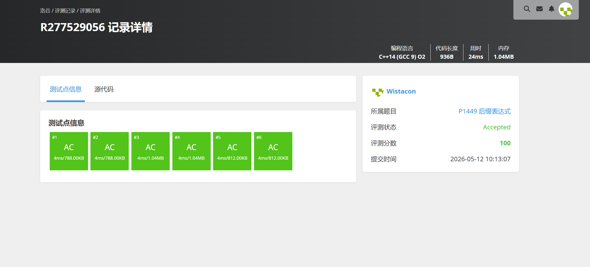

# P1449 后缀表达式

## 题目信息

题目链接：https://www.luogu.com.cn/problem/P1449

知识点：栈、后缀表达式求值

## 题目简述

> 给定一个后缀表达式字符串 $s$，其中运算符仅包含 $\texttt{+-*/}$，$\texttt{.}$ 为操作数的结束符号，$\texttt{@}$ 为表达式的结束符号。计算并输出该表达式的值。保证除数不为 0，$\texttt{/}$ 运算向 0 取整。
>
> $1 \le |s| \le 50$，答案和计算过程中每个值的绝对值不超过 $10^9$。
>
> 时间限制：1S，空间限制：125MB。

## 题目分析

### 详细版

**1. 读题**

后缀表达式（逆波兰表达式）中，运算符紧跟在两个操作数之后，无需括号和优先级规则，严格从左到右计算。输入字符串中，数字以 `.` 分隔，`@` 表示表达式结束。例如 `3.5.2.-*7.+@` 对应中缀表达式 `3*(5-2)+7`，结果为 16。

**2. 性质观察**

- 后缀表达式的求值天然适合栈结构：遇到数字则入栈，遇到运算符则弹出栈顶两个元素计算后将结果压回栈
- 操作数之间用 `.` 分隔，可逐字符读取并累积当前操作数
- 表达式合法，最终栈中恰好剩余一个元素即为结果

**3. 数据结构与算法选择**

使用 `stack<int>` 进行求值。逐字符读取输入：
- 遇到数字字符：累积到当前操作数 `an`（`an = an * 10 + (ch - '0')`）
- 遇到 `.`：将当前操作数压栈，重置 `an = 0`
- 遇到运算符：弹出栈顶两个元素（先弹出的为右操作数 $b$，后弹出的为左操作数 $a$），执行对应运算后将结果压栈

**4. 程序设计**

```
初始化栈 num，an = 0
读取字符 ch，当 ch != '@' 时循环：
  若 ch 为数字 → an = an * 10 + (ch - '0')
  若 ch 为 '.' → num.push(an), an = 0
  若 ch 为运算符 → b = num.pop(), a = num.pop()
                  → num.push(a op b)
输出 num.top()
```

**5. 时空复杂度分析**

- 时间复杂度：$O(|s|)$，遍历字符串一次，每次操作均为 $O(1)$
- 空间复杂度：$O(|s|)$，栈的最大深度为操作数个数，不超过 $|s|$

### 省流版

用栈模拟后缀表达式求值：逐字符读取，数字累积后遇 `.` 压栈，遇运算符弹出两个操作数计算并压回结果。最终栈顶即为答案。时间复杂度 $O(|s|)$，空间复杂度 $O(|s|)$。

## 代码实现



```cpp
// P1449 后缀表达式
/*
链接：https://www.luogu.com.cn/problem/P1449
知识点：栈、后缀表达式求值
*/
#include <stdio.h>
#include <stdlib.h>
#include <string.h>
#include <ctype.h>
#include <stack>
#include <queue>
#include <vector>
#include <map>
#include <set>
#include <algorithm>

using namespace std;

int main(){
    stack<int> num;
    int an = 0;
    int a, b;
    char ch;

    while((ch = getchar()) != '@'){
        if(isdigit(ch)){
            an *= 10;
            an += ch - '0';
        }
        else if(ch == '.'){
            num.push(an);
            an = 0;
        }
        else{
            b = num.top();
            num.pop();
            a = num.top();
            num.pop();

            if(ch == '+'){
                num.push(a + b);
            }else if(ch == '-'){
                num.push(a - b);
            }else if (ch == '*'){
                num.push(a * b);
            }else if (ch == '/'){
                num.push(a / b);
            }
        }
    }

    printf("%d\n", num.top());
}
```

## 代码链接

代码发布于：https://github.com/Flutter-Misdreavus/csu_algorithm
