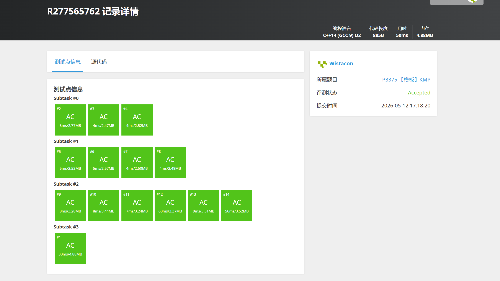

# P3375 【模板】KMP

## 题目信息

题目链接：https://www.luogu.com.cn/problem/P3375

知识点：字符串、KMP 算法

## 题目简述

> 给定文本串 $s_1$ 和模式串 $s_2$，求 $s_2$ 在 $s_1$ 中所有出现的位置（1-indexed）。同时输出 $s_2$ 每个前缀的最长 border 长度。
>
> 定义：字符串 $s$ 的 border 是 $s$ 的一个非 $s$ 本身的子串 $t$，满足 $t$ 既是 $s$ 的前缀又是 $s$ 的后缀。
>
> $1 \le |s_1|, |s_2| \le 10^6$，字符串仅包含大写英文字母。
>
> 时间限制：1S，空间限制：125MB。

## 题目分析

### 详细版

**1. 读题**

本题是 KMP 字符串匹配算法的模板题，要求完成两个任务：
- 在文本串 $s_1$ 中找出模式串 $s_2$ 所有出现的起始位置
- 输出 $s_2$ 每个前缀（长度 $1$ 到 $|s_2|$）的最长 border 长度

**2. 性质观察**

朴素匹配在失配时文本串指针回退，导致时间复杂度为 $O(n \times m)$。KMP 的核心性质是：利用已匹配的前缀信息（即 border），在失配时只回退模式串指针而文本串指针不回退，从而实现线性时间匹配。

具体地，若 $s_2[0..j-1]$ 已与 $s_1$ 匹配但在 $s_2[j]$ 处失配，而 $s_2[0..j-1]$ 的最长 border 长度为 $k$，则 $s_2[0..k-1]$ 一定已与 $s_1$ 对应位置匹配，可直接从 $s_2[k]$ 继续比较。

**3. 数据结构与算法选择**

使用 KMP 算法，核心是预处理模式串 $s_2$ 得到 next 数组（也称 $\pi$ 函数），`nxt[i]` 表示 $s_2$ 长度为 $i$ 的前缀的最长 border 长度。

next 数组的计算采用递推方式：对于位置 $i$，维护指针 $j$ 指向当前 border 长度，若 $s_2[i] \ne s_2[j]$ 则沿 next 链回退（$j = nxt[j]$），直到匹配或 $j = 0$。

**4. 程序设计**

```
读入 s1, s2，设 n = |s1|, m = |s2|

预处理 next 数组（O(m)）：
  nxt[0] = nxt[1] = 0
  遍历 i = 1..m-1：
    while j > 0 且 s2[i] != s2[j]：j = nxt[j]
    若 s2[i] == s2[j]：j++
    nxt[i+1] = j

KMP 匹配（O(n)）：
  j = 0
  遍历 i = 0..n-1：
    while j > 0 且 s1[i] != s2[j]：j = nxt[j]
    若 s1[i] == s2[j]：j++
    若 j == m：输出匹配位置 i-m+2（1-indexed），j = nxt[j]（继续找重叠匹配）

输出 nxt[1..m]
```

**5. 时空复杂度分析**

- 时间复杂度：$O(|s_1| + |s_2|)$，预处理和匹配均为线性
- 空间复杂度：$O(|s_2|)$，存储 next 数组

### 省流版

使用 KMP 算法：先在 $O(m)$ 时间内预处理模式串的 next 数组（每个前缀的最长 border 长度），然后在 $O(n)$ 时间内完成匹配，失配时沿 next 链回退模式串指针，文本串指针不回退。总时间复杂度 $O(n + m)$。

## 代码实现



```cpp
// P3375 【模板】KMP
/*
链接：https://www.luogu.com.cn/problem/P3375
知识点：字符串、KMP 算法
*/
#include <stdio.h>
#include <stdlib.h>
#include <string.h>
#include <string>
#include <stack>
#include <queue>
#include <vector>
#include <map>
#include <set>
#include <algorithm>
#include <ext/pb_ds/tree_policy.hpp>
#include <ext/pb_ds/assoc_container.hpp>

using namespace std;

const int MAXN = 1000005;
char s1[MAXN], s2[MAXN];
int nxt[MAXN];

int main() {
    scanf("%s%s", s1, s2);
    int n = strlen(s1), m = strlen(s2);

    nxt[0] = nxt[1] = 0;
    for (int i = 1, j = 0; i < m; i++) {
        while (j > 0 && s2[i] != s2[j]) j = nxt[j];
        if (s2[i] == s2[j]) j++;
        nxt[i + 1] = j;
    }

    for (int i = 0, j = 0; i < n; i++) {
        while (j > 0 && s1[i] != s2[j]) j = nxt[j];
        if (s1[i] == s2[j]) j++;
        if (j == m) {
            printf("%d\n", i - m + 2);
            j = nxt[j];
        }
    }

    for (int i = 1; i <= m; i++) {
        printf("%d%c", nxt[i], i == m ? '\n' : ' ');
    }

    return 0;
}
```

## 代码链接

代码发布于：https://github.com/Flutter-Misdreavus/csu_algorithm
