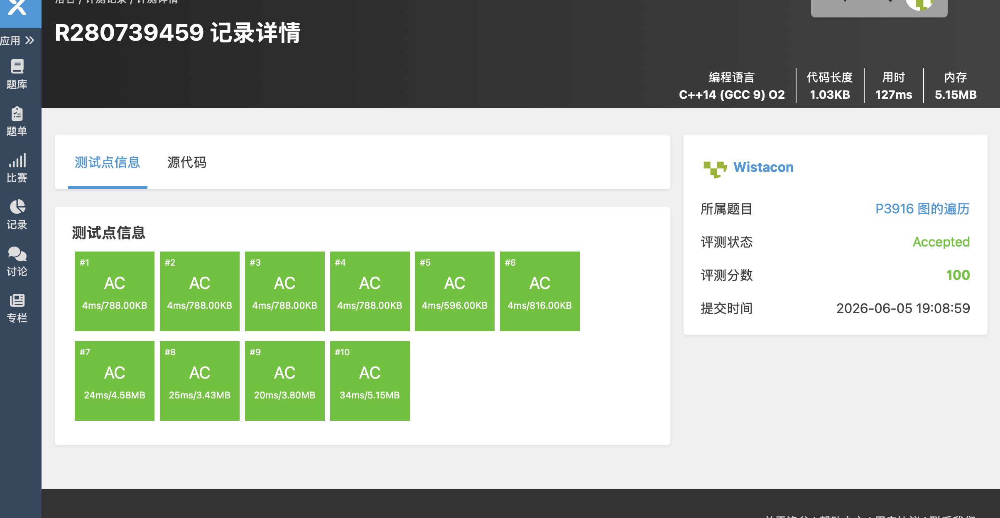

# P3916 图的遍历

## 题目信息

题目链接：https://www.luogu.com.cn/problem/P3916

知识点：图论、深度优先搜索（DFS）、反向图

## 题目简述

> 给定一个包含 $N$ 个点、$M$ 条边的有向图，点编号为 $1 \sim N$。对于每个点 $v$，定义 $A(v)$ 为从 $v$ 出发沿着有向边能到达的所有点中，编号最大的那个点。要求输出 $A(1), A(2), \dots, A(N)$。
>
> 数据范围：$1 \leq N, M \leq 10^5$
>
> 时间限制：1s，空间限制：125MB

## 题目分析

### 详细版

**1. 读题**

本题要求在一张有向图中，对每个点 $v$ 求出从 $v$ 出发能够到达的编号最大的点。一个 naive 的想法是：对每个点分别做一次 DFS/BFS，统计能到达的最大编号。但这样时间复杂度为 $O(N(N+M))$，在 $N, M \leq 10^5$ 的数据范围下显然会超时。

**2. 性质观察**

我们注意到一个关键性质：答案是具有"单调性"的。具体来说，如果点 $u$ 能到达点 $v$，且 $v$ 的编号比 $u$ 大，那么 $A(u)$ 至少不会小于 $v$。更进一步，如果我们知道某个点 $x$ 能到达的最大编号是 $y$，那么所有能到达 $x$ 的点，其答案也至少不会小于 $y$。

这启发我们换个角度思考：**不从每个点出发向外探索，而是从编号大的点出发，反向向编号小的点传播答案**。

**3. 反向图 + 从大到小 DFS**

核心思路如下：

- **建反向图**：将原图中所有的边方向反转。即原图中若存在 $u \to v$，则在反向图中建立 $v \to u$。
- **从大到小遍历**：从编号 $N$ 递减到 $1$，依次处理每个点 $i$。
- **DFS 传播**：若点 $i$ 尚未被访问（即 $maxpos[i] == 0$），则从 $i$ 开始在反向图上做 DFS。在 DFS 过程中，将访问到的所有未标记点的答案设为 $i$。

**为什么这样是对的？**

在反向图中，若从点 $i$ 出发能到达点 $j$，意味着在原图中存在一条从 $j$ 到 $i$ 的路径，即原图中 $j$ 可以到达 $i$。由于我们按编号从大到小的顺序处理，当处理到点 $i$ 时，所有编号大于 $i$ 的点都已经处理完毕。如果此时点 $j$ 还未被标记，说明 $j$ 无法到达任何比 $i$ 编号更大的点，那么 $i$ 就是 $j$ 能到达的最大编号。于是 $A(j) = i$。

这种处理方式巧妙地利用了"从大到小"的顺序，确保每个点第一次被访问时，就是它能到达的最大编号。

**4. 程序设计**

- 输入 $N, M$ 和 $M$ 条有向边。
- 建反向图：读入边 $(u, v)$ 时，在反向图中添加 $v \to u$（即 `bian[v].push_back(u)`）。
- 初始化 `maxpos` 数组为 0，表示尚未被标记。
- 循环 $i$ 从 $N$ 到 $1$：
  - 如果 `maxpos[i] == 0`，说明点 $i$ 未被之前的更大编号访问过，令 `maxpos[i] = i`，然后从 $i$ 开始在反向图上 DFS，将所有能到达的未标记点的 `maxpos` 值设为 $i$。
- 输出 `maxpos[1]` 到 `maxpos[N]`。

**5. 时空复杂度分析**

时间复杂度：$O(N + M)$。每个点最多被访问一次，每条边最多被遍历一次。

空间复杂度：$O(N + M)$。反向图的邻接表存储需要 $O(N + M)$ 空间，`maxpos` 数组需要 $O(N)$ 空间。

### 省流版

建反向图，然后从编号 $N$ 到 $1$ 倒序遍历。对每个尚未被标记的点 $i$，在反向图上从 $i$ 开始 DFS，将能到达的所有点的答案都设为 $i$。反向图中 $i$ 能到达 $j$ 等价于原图中 $j$ 能到达 $i$，由于从大到小处理，每个点第一次被访问时的编号就是它能到达的最大编号。

## 代码实现



```cpp
#include <stdlib.h>
#include <stdio.h>
#include <string.h>
#include <vector>
#include <string>
#include <list>
#include <map>
#include <stack>
#include <queue>
#include <algorithm>
#include <ext/pb_ds/assoc_container.hpp>
#include <ext/pb_ds/tree_policy.hpp>

using namespace std;

vector<int> maxpos;
vector<vector<int>> bian;

void dfs(int kaishi, int hai){
    for(auto it = bian[kaishi].begin(); it != bian[kaishi].end(); it++){
        if(maxpos[*it] == 0){
            maxpos[*it] = hai;
            dfs(*it, hai);
        }
    }
}

int main(){
    int n, m;
    int a, b;

    scanf("%d%d", &n, &m);
    maxpos.resize(n + 1, 0);
    bian.resize(n + 1);

    for(int i = 1; i <= m; i++){
        scanf("%d%d", &a, &b);
        bian[b].push_back(a);  // 建反向图：原边 a->b，反向图中添加 b->a
    }

    // 从编号大的点往编号小的点遍历
    for(int i = n; i != 0; i--){
        if(maxpos[i] == 0){
            maxpos[i] = i;
            dfs(i, i);  // 在反向图上DFS，将能到达的点的答案设为i
        }
    }

    for(auto it = (maxpos.begin()); it != maxpos.end(); it++){
        if(it == maxpos.begin()){
            continue;
        }
        printf("%d ", (*it));
    }
    printf("\n");
}
```

## 代码链接

代码发布于：https://github.com/Flutter-Misdreavus/csu_algorithm
