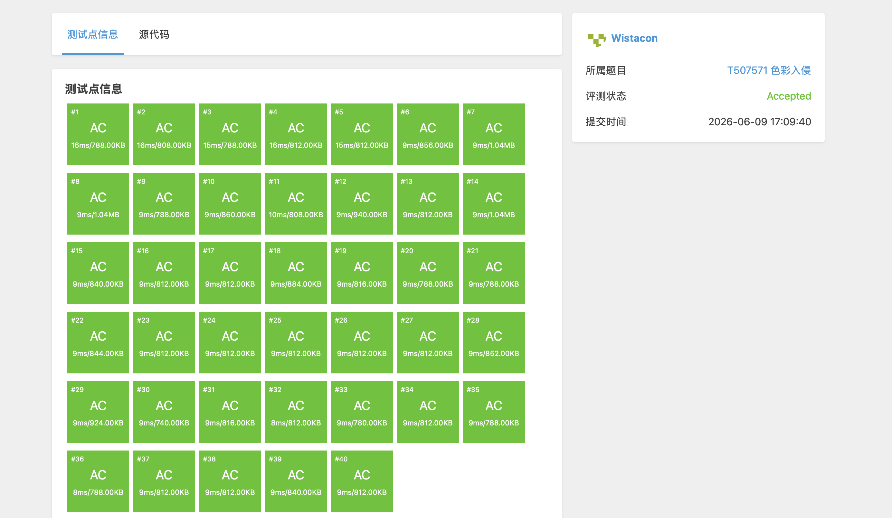

# T507571 色彩入侵

## 题目信息

题目链接：自定义训练题（无公开外部链接）

知识点：枚举、贪心、模拟

## 题目简述

> 给定 $t$ 组数据，每组数据给定一长度为 $n$ 的整数列 $c_1 \sim c_n$，代表有 $n$ 个物品排成一行，物品编号从 $1$ 到 $n$，第 $i$ 个物品的颜色为 $c_i$。
>
> 现在每次可将连续的 $k$ 个物品粉刷成任意颜色，请求得将所有物品刷成同一颜色所需最少的次数。
>
> 数据范围：$1 \le t \le 10^4$，$1 \le k \le n \le 10^5$，$1 \le c_i \le 100$，且 $\sum n \le 10^5$。
>
> 时间限制：1s，空间限制：125MB。

## 题目分析

### 详细版

**1. 读题**

本题要求把一行 $n$ 个物品全部刷成同一种颜色，每次操作可以选择任意连续 $k$ 个物品，并将它们全部刷成任意一种颜色。目标是求最少操作次数。

一个直观的想法是：确定最终所有物品变成什么颜色，然后计算把所有物品都变成该颜色所需的最少次数，最后在所有可能的目标颜色中取最小值。

**2. 性质观察**

由于题目中颜色种类 $c_i \le 100$，因此可能的目标颜色最多只有 100 种。这个数量级非常小，完全可以枚举每一种颜色作为最终颜色，然后分别计算所需次数。

对于固定的目标颜色 $cl$，问题转化为：给定一行颜色，每次可以把连续 $k$ 个位置刷成 $cl$，最少需要多少次才能让所有位置都变成 $cl$？

**3. 贪心策略**

从左到右扫描每个位置：
- 如果当前位置已经是 $cl$，则不需要处理，直接右移。
- 如果当前位置不是 $cl$，则必须进行一次粉刷，且为了覆盖尽量多的后续非 $cl$ 位置，应该从当前位置开始，向右连续刷 $k$ 个位置。这样当前位置以及后面 $k-1$ 个位置都会变成 $cl$。

这种贪心是正确的：因为当前位置不是 $cl$，任何合法方案都必须在某个时刻粉刷一个包含当前位置的连续区间。而从当前位置开始向右刷 $k$ 个，不会比其它选择更差（它覆盖了当前位置，并且尽可能向右延伸，减少了未来需要处理的次数）。

**4. 程序设计**

- 读入 $t$。
- 对每组数据：
  - 读入 $n, k$ 和颜色序列。
  - 记录颜色序列中的最大值 `clorn`，即可能的目标颜色上限。
  - 枚举目标颜色 $cl$ 从 $1$ 到 `clorn`：
    - 从左到右模拟刷漆过程，计算把所有物品刷成 $cl$ 所需次数。
  - 取所有目标颜色中的最小次数输出。

**5. 时空复杂度分析**

时间复杂度：$O(t \cdot C \cdot n / k)$，其中 $C \le 100$ 是颜色种类数。由于 $\sum n \le 10^5$，最坏情况下总操作次数约为 $10^7$ 量级，可以通过。

空间复杂度：$O(n)$，用于存储颜色序列。

### 省流版

枚举最终颜色（颜色种类不超过 100 种），对每种目标颜色从左到右贪心模拟：遇到不是目标颜色的位置，就从该位置开始连续刷 $k$ 个。取所有目标颜色中的最小次数即为答案。

## 代码实现



```cpp
#include <stdio.h>
#include <stdlib.h>
#include <string.h>
#include <stack>
#include <queue>
#include <vector>
#include <map>
#include <set>
#include <string>
#include <algorithm>
#include <ext/pb_ds/assoc_container.hpp>
#include <ext/pb_ds/tree_policy.hpp>

using namespace std;

int color[100010];

int shua(int cl, int k, int n){
    int ci = 0;
    int su = 0;

    while(su < n){
        if(color[su] == cl){
            su++;
            continue;
        }

        su += k;
        ci++;
    }

    return ci;
}

int main(){
    int t;
    int n, k;
    int clorn; //颜色种类数
    int ci; //刷的次数

    scanf("%d", &t);
    for(int i = 0; i < t; i++){
        ci = 0X7FFFFFFF;
        clorn = 0;
        scanf("%d%d", &n, &k);
        for(int j = 0; j < n; j++){
            scanf("%d", &color[j]);
            clorn = max(clorn, color[j]);
        }
        for(int j = 1; j <= clorn; j++){
            ci = min(ci, shua(j, k, n));
        }

        printf("%d\n", ci);
    }
}
```

## 代码链接

代码发布于：https://github.com/Flutter-Misdreavus/csu_algorithm
