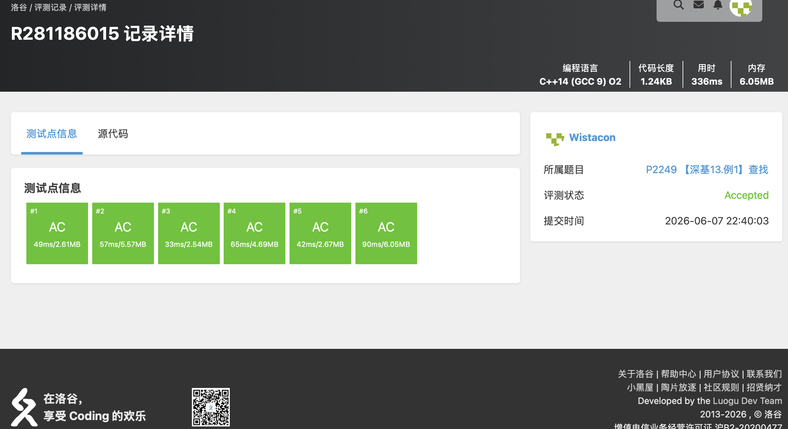

# 算法分析与设计练习题（一）— 完整题目解析报告

## 一、题单概述

### 1.1 题单信息

- **对应章节**：第 1 章绪论 + 第 3 章蛮力法
- **题目总数**：14 道
- **核心算法思想**：线性结构（队列、栈、链表）、基础图论与字符串、枚举与模拟、分治与二分查找、BFS 与 Flood Fill、DFS 回溯

### 1.2 知识点总览

| 题号 | 题目名称 | 核心知识点 | 难度 |
|------|----------|-----------|------|
| B3616 | 【模板】队列 | 队列、STL queue | 简单 |
| P1030 | [NOIP 2001 普及组] 求先序排列 | 二叉树、递归、分治 | 中等 |
| P1144 | 最短路计数 | BFS、最短路计数 | 中等 |
| P1160 | 队列安排 | 链表模拟、双向链表 | 中等 |
| P1162 | 填涂颜色 | BFS、Flood Fill | 简单 |
| P1177 | 【模板】排序 | 排序算法 | 简单 |
| P1219 | [USACO1.5] 八皇后 Checker Challenge | DFS、回溯 | 中等 |
| P1257 | 平面上的最接近点对 | 分治、计算几何 | 困难 |
| P1449 | 后缀表达式 | 栈、后缀表达式求值 | 简单 |
| P2249 | 【深基13.例1】查找 | 二分查找、STL lower_bound | 简单 |
| P3371 | 【模板】单源最短路径（弱化版） | 图论、最短路、Dijkstra | 中等 |
| P3375 | 【模板】KMP | 字符串、KMP 算法 | 中等 |
| P3916 | 图的遍历 | 图论、DFS、反向图 | 中等 |
| T507571 | 色彩入侵 | 枚举、贪心、模拟 | 中等 |

### 1.3 题单知识图谱

本题单以**基础数据结构**和**基础算法**为核心：
- **线性结构**：队列（B3616）、双向链表（P1160）、栈（P1449）
- **排序与查找**：STL sort（P1177）、二分查找（P2249）
- **字符串匹配**：KMP（P3375）
- **图论基础**：BFS 最短路计数（P1144）、DFS 反向图（P3916）、Dijkstra 最短路（P3371）
- **分治思想**：二叉树重建（P1030）、最近点对（P1257）
- **网格 Flood Fill**：P1162
- **搜索与回溯**：P1219
- **蛮力/枚举/贪心/模拟**：T507571

这些知识点是后续学习减治、分治、动态规划、贪心等高级算法的基础。

---

## 二、逐题解析

### 2.1 B3616 【模板】队列

**题目链接**：https://www.luogu.com.cn/problem/B3616

**知识点**：队列、STL queue

**题目简述**：

> 实现一个队列，支持四种操作：
> - `push(x)`：将 $x$ 入队
> - `pop()`：弹出队首，若队列为空则输出 `ERR_CANNOT_POP`
> - `query()`：输出队首元素，若队列为空则输出 `ERR_CANNOT_QUERY`
> - `size()`：输出队列元素个数
>
> $n \le 10000$，所有插入元素值为 $[1, 1000000]$ 内的正整数。

#### 详细分析

**1. 读题**

本题是队列的基本操作模板题，要求实现先进先出（FIFO）的队列结构，支持入队、出队、查询队首、查询大小四种操作，并在空队列时进行异常处理输出。

**2. 数据结构与算法选择**

队列（queue）是经典的线性数据结构，只允许在一端（队尾）插入、另一端（队首）删除。可以直接使用 C++ STL 的 `queue<int>` 容器，它底层基于 `deque` 实现，提供了 `push()`、`pop()`、`front()`、`size()`、`empty()` 等接口，正好对应题目要求的四种操作。

**3. 程序设计**

```
读入操作次数 n
循环 n 次，读入操作类型 op：
  op == 1 → 读入 x，q.push(x)
  op == 2 → 若 q.empty() 输出错误信息，否则 q.pop()
  op == 3 → 若 q.empty() 输出错误信息，否则输出 q.front()
  op == 4 → 输出 q.size()
```

**4. 时空复杂度分析**

- 时间复杂度：$O(n)$，每次操作均为 $O(1)$
- 空间复杂度：$O(n)$，队列最多存储 $n$ 个元素

#### 省流版

直接使用 STL `queue<int>` 实现四种队列操作，入队、出队、查询队首、查询大小均为 $O(1)$。操作前用 `empty()` 判断空队列并输出对应错误信息即可。时间复杂度 $O(n)$。

#### 代码实现


```cpp
// B3616 【模板】队列
/*
链接：https://www.luogu.com.cn/problem/B3616
知识点：队列、STL queue
*/
#include <stdio.h>
#include <stdlib.h>
#include <string.h>
#include <stack>
#include <queue>
#include <vector>
#include <map>
#include <set>
#include <algorithm>
#include <ext/pb_ds/tree_policy.hpp>
#include <ext/pb_ds/assoc_container.hpp>

using namespace std;

queue<int> num;

int main(){
    int op;
    int x;
    int n;

    scanf("%d", &n);
    for(int i = 0; i < n; i++){
        scanf("%d", &op);

        if(op == 1){
            scanf("%d", &x);
            num.push(x);
        }else if(op == 2){
            if(num.empty()){
                printf("ERR_CANNOT_POP\n");
                continue;
            }
            num.pop();
        }else if(op == 3){
            if(num.empty()){
                printf("ERR_CANNOT_QUERY\n");
                continue;
            }
            printf("%d\n", num.front());
        }else{
            printf("%d\n", num.size());
        }

    }


}
```


---

### 2.2 P1030 [NOIP 2001 普及组] 求先序排列

**题目链接**：https://www.luogu.com.cn/problem/P1030

**知识点**：二叉树、递归、分治

**题目简述**：

> 给出一棵二叉树的中序遍历与后序遍历序列，求出它的先序遍历序列。
>
> 约定树结点用不同的大写字母表示，且二叉树的节点个数 $n \le 8$。

#### 详细分析

**1. 读题**

本题给出了一棵二叉树的两种遍历结果——中序遍历和后序遍历，要求输出先序遍历。二叉树的节点数不超过 8 个，节点用不同的大写字母表示，保证了每个节点唯一。

**2. 性质观察**

二叉树三种遍历方式的核心特点：
- **先序遍历（根左右）**：先访问根节点，再访问左子树，最后访问右子树
- **中序遍历（左根右）**：先访问左子树，再访问根节点，最后访问右子树
- **后序遍历（左右根）**：先访问左子树，再访问右子树，最后访问根节点

本题的关键突破口在于**后序遍历的最后一个元素就是整棵树的根节点**。找到根节点后，可以在中序遍历序列中定位根的位置，从而区分出左子树和右子树的范围。

**3. 数据结构与算法选择**

- **数据结构**：使用结构体定义二叉树节点，包含字符值和左右子树指针
- **算法**：递归分治——利用后序序列确定根，利用中序序列划分左右子树区间，然后递归构建左右子树

**4. 程序设计**

核心递归函数 `find_tree(houf, zhonga, zhongb)`：
- `houf`：后序序列中当前子树根节点的位置
- `zhonga`：中序序列中当前子树区间的左边界
- `zhongb`：中序序列中当前子树区间的右边界

执行过程：
1. 取 `hou[houf]` 作为当前子树的根节点，创建节点
2. 在中序序列 `[zhonga, zhongb]` 范围内找到根节点的位置 `poshead`
3. 若 `poshead < zhongb`，说明有右子树：右子树的根在后序序列中是 `houf-1`，右子树对应中序区间为 `[poshead+1, zhongb]`
4. 若 `poshead > zhonga`，说明有左子树：左子树的根在后序序列中的位置需要减去右子树的节点数，即 `houf - 1 - (zhongb - poshead)`，对应中序区间为 `[zhonga, poshead-1]`
5. 递归构建完成后，先序遍历输出即可（根左右）

**5. 时空复杂度分析**

- 时间复杂度：$O(n^2)$，其中 $n$ 为节点数。每次递归需要在中序序列中线性查找根节点位置，最坏情况下递归深度为 $n$
- 空间复杂度：$O(n)$，递归栈的深度最坏为 $n$，以及构建二叉树所需的空间

#### 省流版

后序序列最后一个元素是当前子树的根，在中序序列中找到根的位置即可划分左右子树区间，递归构建整棵树后先序输出即可。

#### 代码实现


```cpp
#include <stdio.h>
#include <stdlib.h>
#include <string.h>
#include <string>
#include <stack>
#include <queue>
#include <map>
#include <algorithm>
#include <list>
#include <vector>
#include <ext/pb_ds/assoc_container.hpp>
#include <ext/pb_ds/tree_policy.hpp>

using namespace std;

struct TREE{
    char ch;
    TREE* left;
    TREE* right;
};

char qian1[10];
char zhong1[10];
char hou1[10];

string qian;
string zhong;
string hou;

TREE* find_tree(int houf, int zhonga, int zhongb){
    TREE* head = (TREE*)malloc(sizeof(TREE));
    head->ch = hou[houf];
    head->left = NULL;
    head->right = NULL;

    if(zhonga == zhongb){
        return head;
    }

    int poshead = zhongb;
    while(zhong[poshead] != hou[houf]){
        poshead--;
    }

    if(poshead != zhongb){
        // 有右子树
        head->right = find_tree(houf - 1, poshead + 1, zhongb);
    }

    if(poshead != zhonga){
        // 有左子树
        head->left = find_tree(houf - 1 - zhongb + poshead, zhonga, poshead - 1);
    }

    return head;
}

void show(TREE* head){
    if(head == NULL){
        return;
    }

    printf("%c", head->ch);

    show(head->left);
    show(head->right);
}

int main(){
    scanf("%s", zhong1);
    scanf("%s", hou1);

    zhong = zhong1;
    hou = hou1;

    TREE* head = find_tree(hou.size() - 1, 0, zhong.size() - 1);
    show(head);
    printf("\n");
}
```


---

### 2.3 P1144 最短路计数

**题目链接**：https://www.luogu.com.cn/problem/P1144

**知识点**：BFS、最短路计数

**题目简述**：

> 给定一个 $N$ 个顶点、$M$ 条边的无向无权图，顶点编号为 $1 \sim N$。问从顶点 $1$ 开始到每个点的最短路有几条。答案对 $100003$ 取模，无法到达输出 $0$。
>
> 数据范围：$1 \le N \le 10^6$，$1 \le M \le 2 \times 10^6$。图中可能有自环和重边。

#### 详细分析

**1. 读题**

本题给定一个无向无权图，要求从顶点 $1$ 出发到每个顶点的最短路径数量。由于边权均为 $1$，可以直接使用 BFS 求解最短距离，并在 BFS 过程中统计最短路径条数。

**2. 性质观察**

- BFS 第一次访问到某个点时，得到的就是从源点到该点的最短距离。
- 若点 $v$ 可以通过多个同为最短距离的前驱点到达，则最短路条数等于这些前驱点的最短路条数之和。
- 自环对最短路没有贡献，可以直接忽略。

**3. 数据结构与算法选择**

- **BFS**：用于求最短距离。
- **邻接表**：使用 `vector<int>` 数组存储无向图。由于 $N$ 和 $M$ 较大，需要避免使用复杂度较高的存储方式。
- **距离数组 `dis`**：记录源点到每个点的最短距离，初始化为 $-1$ 表示未访问。
- **计数数组 `cnt`**：记录最短路条数，对 $100003$ 取模。

**4. 程序设计**

- 读入 $N, M$ 和 $M$ 条边，建立无向图邻接表。自环不影响最短路，可忽略。
- 初始化 `dis[1] = 0`，`cnt[1] = 1`，将点 $1$ 入队。
- BFS：取出队首点 $u$，遍历其邻居 $v$：
  - 若 `dis[v] == -1`：说明第一次到达 $v$，设置 `dis[v] = dis[u] + 1`，`cnt[v] = cnt[u]`，并将 $v$ 入队。
  - 若 `dis[v] == dis[u] + 1`：说明 $u$ 也是 $v$ 的一个最短前驱，更新 `cnt[v] = (cnt[v] + cnt[u]) % MOD`。
- 输出 `cnt[1..N]`。

**5. 时空复杂度分析**

- 时间复杂度：$O(N + M)$，每个点和每条边最多被访问一次。
- 空间复杂度：$O(N + M)$，邻接表、距离数组、计数数组、队列。

#### 省流版

在无向无权图上从点 $1$ 做 BFS。第一次到达某点时确定最短路距离并继承前驱的计数；之后若通过同样最短距离到达，则累加前驱计数。结果对 $100003$ 取模。

#### 代码实现


```cpp
// P1144 最短路计数
/*
链接：https://www.luogu.com.cn/problem/P1144
知识点：BFS、最短路计数
*/
#include <stdio.h>
#include <stdlib.h>
#include <string.h>
#include <stack>
#include <string>
#include <queue>
#include <vector>
#include <list>
#include <map>
#include <set>
#include <algorithm>
#include <ext/pb_ds/assoc_container.hpp>
#include <ext/pb_ds/tree_policy.hpp>

using namespace std;

const int MOD = 100003;
const int MAXN = 1000005;

vector<int> bian[MAXN];
int dis[MAXN];
int cnt[MAXN];

int main(){
	int n, m;
	int x, y;

	scanf("%d%d", &n, &m);
	for(int i = 0; i < m; i++){
		scanf("%d%d", &x, &y);
		if(x == y){
			continue; // 自环不影响最短路
		}
		bian[x].push_back(y);
		bian[y].push_back(x);
	}

	memset(dis, -1, sizeof(dis));
	memset(cnt, 0, sizeof(cnt));

	queue<int> q;
	dis[1] = 0;
	cnt[1] = 1;
	q.push(1);

	while(!q.empty()){
		int u = q.front();
		q.pop();

		for(auto &v : bian[u]){
			if(dis[v] == -1){
				dis[v] = dis[u] + 1;
				cnt[v] = cnt[u];
				q.push(v);
			}else if(dis[v] == dis[u] + 1){
				cnt[v] = (cnt[v] + cnt[u]) % MOD;
			}
		}
	}

	for(int i = 1; i <= n; i++){
		printf("%d\n", cnt[i]);
	}
}
```


---

### 2.4 P1160 队列安排

**题目链接**：https://www.luogu.com.cn/problem/P1160

**知识点**：链表模拟、双向链表

**题目简述**：

> 将 $N$ 个同学排成一列：先将 $1$ 号入列，之后 $2 \sim N$ 号同学依次入列，每人被指定插入到某位已入列同学的左边或右边。随后从队列中移除 $M$ 个同学（若已不在队列中则忽略），最后从左到右输出剩余同学的编号。
>
> 对于 $100\%$ 的数据，$1 \lt M \le N \le 10^5$。

#### 详细分析

**1. 读题**

本题需要维护一个不断变化的序列，支持以下两种操作：
- 插入：将新元素插入到指定元素的左侧或右侧
- 删除：删除指定编号的元素（可能已删除则忽略）

最终按从左到右的顺序输出剩余元素。

**2. 性质观察**

- 插入操作只在已有元素的相邻位置进行，不涉及任意位置的随机访问
- 删除操作只标记删除，不影响其他元素的相对顺序
- 元素编号为 $1 \sim N$，范围已知，适合用数组下标直接索引

**3. 数据结构与算法选择**

选择**数组模拟双向链表**：

使用三个数组：
- `right[i]`：编号为 $i$ 的同学右侧的同学编号（0 表示到头）
- `left[i]`：编号为 $i$ 的同学左侧的同学编号（0 表示到头）
- `del[i]`：标记编号为 $i$ 的同学是否已被删除

维护一个 `head` 变量记录当前队列最左端的同学编号。

**4. 程序设计**

插入操作（将 $i$ 号插入到 $k$ 号的左边或右边）：
- 若 $p = 0$（插入左侧）：修改 $k$ 左侧元素的 `right` 指针指向 $i$，以及 $k$ 的 `left` 指针指向 $i$，并建立 $i$ 与左右邻居的链接。若 $k$ 是队首，则更新 `head = i`。
- 若 $p = 1$（插入右侧）：同理修改 $k$ 右侧元素的 `left` 指针以及 $k$ 的 `right` 指针。

删除操作：直接将 `del[x] = 1` 标记为已删除（题目允许重复删除，忽略即可）。

输出时从 `head` 开始沿 `right[]` 指针遍历，跳过 `del[head] = 1` 的元素。

**5. 时空复杂度分析**

- 时间复杂度：$O(N + M)$，插入 $N-1$ 次、标记删除 $M$ 次、遍历输出最多 $N$ 次，均为常数操作。
- 空间复杂度：$O(N)$，三个长度为 $N$ 的数组。

#### 省流版

用数组模拟双向链表维护队列，插入时修改相邻元素的 `left`/`right` 指针，删除时用 `del[]` 标记，最后从队首沿 `right[]` 遍历输出未删除的元素。时间复杂度 $O(N + M)$，空间复杂度 $O(N)$。

#### 代码实现


```cpp
// P1160 队列安排
/*
链接：https://www.luogu.com.cn/problem/P1160
知识点：链表模拟、双向链表
*/
#include <stdlib.h>
#include <stdio.h>
#include <string.h>
#include <list>
#include <vector>
#include <stack>
#include <queue>
#include <algorithm>
#include <map>
#include <set>

using namespace std;

int right[100010];
int left[100010];
int del[100010];
// 使用数组模拟双向链表

int main(){
    int n;
    int m;
    int k, p;
    int x;
    int head = 1; //记录第一个数

    memset(del, 0 ,sizeof(del));
    scanf("%d", &n);
    right[1] = 0;
    left[1] = 0;
    right[0] = 0;
    left[0] = 0;
    // 0代表到尽头了

    for(int i = 2; i <= n; i++){
        scanf("%d%d", &k, &p);
        if(p == 0){
            right[left[k]] = i;
            left[i] = left[k];
            left[k] = i;
            right[i] = k;

            if(k == head){
                head = i;
            }
        }else{
            left[right[k]] = i;
            right[i] = right[k];
            right[k] = i;
            left[i] = k;
        }
    }

    scanf("%d", &m);
    for(int i = 0; i < m; i++){
        scanf("%d", &x);
        del[x] = 1;
    }

    while (head != 0){
        if(!del[head]){
            printf("%d ", head);
        }
        head = right[head];
    }
    printf("\n");

}
```


---

### 2.5 P1162 填涂颜色

**题目链接**：https://www.luogu.com.cn/problem/P1162

**知识点**：BFS、Flood Fill

**题目简述**：

> 给定一个 $n \times n$ 的方阵，由数字 $0$ 和 $1$ 组成，其中 $1$ 构成一个闭合圈。要求把闭合圈内的所有 $0$ 都填成 $2$。
>
> 数据范围：$1 \le n \le 30$。

#### 详细分析

**1. 读题**

本题的关键在于区分「圈外的 $0$」和「圈内的 $0$」。闭合圈由 $1$ 组成，圈内的 $0$ 无法通过上下左右移动到达方阵边界。

**2. 性质观察**

- 从方阵边界的任意一个 $0$ 出发，沿着上下左右方向能走到的所有 $0$，都是圈外的。
- 所有剩余的 $0$（即未被访问到的 $0$）都在闭合圈内，需要被填成 $2$。

**3. 数据结构与算法选择**

- **Flood Fill（BFS/DFS）**：从边界开始，把所有圈外的 $0$ 标记为已访问。
- **队列**：用 `queue<pair<int, int>>` 实现 BFS。
- **访问数组**：`vis[i][j]` 记录每个位置是否被访问过。

**4. 程序设计**

- 读入 $n$ 和方阵。
- 在方阵外围加一圈虚拟的 $0$，从 $(0, 0)$ 开始 BFS。
- BFS 过程中，只向上下左右四个方向扩展，且只能经过值为 $0$ 且未访问的位置。
- BFS 结束后，遍历原方阵：若某位置为 $0$ 且未被访问，则该位置在闭合圈内，将其改为 $2$。
- 输出修改后的方阵。

**5. 时空复杂度分析**

- 时间复杂度：$O(n^2)$，每个位置最多被访问一次。
- 空间复杂度：$O(n^2)$，访问数组和队列大小。

#### 省流版

用 BFS 从方阵外围的 $0$ 开始 Flood Fill，标记所有圈外的 $0$；未被标记的 $0$ 就是圈内的，全部改成 $2$。

#### 代码实现


```cpp
// P1162 填涂颜色
/*
链接：https://www.luogu.com.cn/problem/P1162
知识点：BFS、 Flood Fill
*/
#include <stdio.h>
#include <stdlib.h>
#include <string.h>
#include <stack>
#include <string>
#include <queue>
#include <vector>
#include <list>
#include <map>
#include <set>
#include <algorithm>
#include <ext/pb_ds/assoc_container.hpp>
#include <ext/pb_ds/tree_policy.hpp>

using namespace std;

int ditu[35][35];
int vis[35][35];
int dx[4] = {0, 0, 1, -1};
int dy[4] = {1, -1, 0, 0};

int main(){
	int n;
	queue<pair<int, int>> q;

	scanf("%d", &n);
	for(int i = 1; i <= n; i++){
		for(int j = 1; j <= n; j++){
			scanf("%d", &ditu[i][j]);
		}
	}

	// 加一圈 0，从 (0,0) 开始 BFS，所有能到达的 0 都是圈外的
	q.push({0, 0});
	vis[0][0] = 1;
	while(!q.empty()){
		auto [x, y] = q.front();
		q.pop();

		for(int i = 0; i < 4; i++){
			int nx = x + dx[i];
			int ny = y + dy[i];

			if(nx >= 0 && nx <= n + 1 && ny >= 0 && ny <= n + 1 && !vis[nx][ny] && ditu[nx][ny] == 0){
				vis[nx][ny] = 1;
				q.push({nx, ny});
			}
		}
	}

	for(int i = 1; i <= n; i++){
		for(int j = 1; j <= n; j++){
			if(ditu[i][j] == 0 && !vis[i][j]){
				ditu[i][j] = 2;
			}
		}
	}

	for(int i = 1; i <= n; i++){
		for(int j = 1; j <= n; j++){
			printf("%d", ditu[i][j]);
			if(j != n){
				printf(" ");
			}
		}
		printf("\n");
	}
}
```


---

### 2.6 P1177 【模板】排序

**题目链接**：https://www.luogu.com.cn/problem/P1177

**知识点**：排序算法

**题目简述**：

> 将读入的 $N$ 个数从小到大排序后输出。
>
> 数据范围：$1 \le N \le 10^5$，$1 \le a_i \le 10^9$。

#### 详细分析

**1. 读题**

本题是一道排序模板题，要求将 $N$ 个正整数从小到大排序后输出。数据规模 $N \le 10^5$，数值范围 $a_i \le 10^9$。题目没有特殊限制，是一道纯粹的排序练习。

**2. 性质观察**

本题的核心就是选择一个合适的排序算法。常见的排序算法按时间复杂度可分为两类：

- **$O(n^2)$ 排序**：冒泡排序、选择排序、插入排序。对于 $N = 10^5$ 的数据规模，$O(n^2)$ 的算法大约需要 $10^{10}$ 次操作，会超时。
- **$O(n \log n)$ 排序**：归并排序、快速排序、堆排序。对于 $N = 10^5$，$O(n \log n)$ 大约需要 $1.7 \times 10^6$ 次操作，完全可以在 1 秒内完成。

因此必须使用 $O(n \log n)$ 级别的排序算法。

**3. 数据结构与算法选择**

- **数据结构**：使用 `vector<int>` 动态数组存储待排序的数列
- **算法**：直接使用 C++ STL 的 `sort` 函数。STL 的 `sort` 底层实现是 **Introsort（内省排序）**，它是快速排序、堆排序和插入排序的混合体：
  - 以快速排序为主，平均效率极高
  - 当递归深度超过 $2 \log n$ 时切换为堆排序，避免快速排序最坏 $O(n^2)$ 的情况
  - 当子数组规模较小时切换为插入排序，减少递归开销

当然也可以手写归并排序或快速排序等其他 $O(n \log n)$ 的算法来通过本题。

**4. 程序设计**

程序逻辑非常简单，分为三步：

1. 读入 $N$ 和 $N$ 个整数，存入 `vector`
2. 调用 `sort` 对整个数组进行排序
3. 依次输出排序后的元素

**5. 时空复杂度分析**

- **时间复杂度**：$O(n \log n)$。STL `sort` 基于 Introsort，最坏情况保证 $O(n \log n)$
- **空间复杂度**：$O(n)$。`vector` 存储 $n$ 个元素需要 $O(n)$ 空间，`sort` 内部堆排序部分需要 $O(\log n)$ 的栈空间

#### 省流版

排序模板题，直接用 STL 的 `sort` 函数即可，底层是 Introsort，时间复杂度 $O(n \log n)$。也可以手写归并排序或快速排序。

#### 代码实现


```cpp
#include <stdio.h>
#include <string.h>
#include <stdlib.h>
#include <stack>
#include <queue>
#include <vector>
#include <list>
#include <map>
#include <set>
#include <algorithm>
#include <string>
#include <ext/pb_ds/assoc_container.hpp>
#include <ext/pb_ds/tree_policy.hpp>

using namespace std;

vector<int> nums;

int main(){
	int n;
	int a;

	scanf("%d", &n);
	for(int i = 0; i < n; i++){
		scanf("%d", &a);
		nums.push_back(a);
	}

	sort(nums.begin(), nums.end());

	for(auto& it : nums){
		printf("%d ", it);
	}
	printf("\n");
}
```


---

### 2.7 P1219 [USACO1.5] 八皇后 Checker Challenge

**题目链接**：https://www.luogu.com.cn/problem/P1219

**知识点**：DFS、回溯、八皇后

**题目简述**：

> 在 $n \times n$ 的棋盘上放置 $n$ 个皇后，使得每行、每列有且只有一个皇后，每条对角线（包括两条主对角线的所有平行线）上至多有一个皇后。
>
> 输出前 3 个解（按字典序），以及解的总数。
>
> 数据范围：$6 \le n \le 13$。

#### 详细分析

**1. 读题**

本题是经典的 $n$ 皇后问题。需要用序列描述解，第 $i$ 个数字表示第 $i$ 行皇后所在的列号。要求输出字典序前 3 的解以及总解数。

**2. 性质观察**

- 每行恰好一个皇后，因此可以按行 DFS，每行枚举放置的列。
- 需要保证：列不重复、主对角线不重复、副对角线不重复。
- 对于位置 $(row, col)$：
  - 主对角线编号可以用 `row - col`（或加上偏移避免负数）；
  - 副对角线编号可以用 `row + col`。

**3. 数据结构与算法选择**

- **DFS 回溯**：逐行放置皇后，放置时检查三个约束是否满足；满足则递归到下一行，不满足则回溯。
- **标记数组**：
  - `lie[col]`：列是否被占用；
  - `zuo[row - col + n]`：主对角线是否被占用（加 $n$ 避免下标为负）；
  - `you[row + col]`：副对角线是否被占用。

**4. 程序设计**

- 从第 1 行开始 DFS。
- 对当前行的每一列尝试放置：若列、主对角线、副对角线均未被占用，则放置并标记，递归到下一行。
- 当递归到第 $n+1$ 行时，说明得到一个完整解：计数器加 1；若计数器不超过 3，则输出当前解。
- 回溯时撤销三个标记。
- 最后输出解的总数。

**5. 时空复杂度分析**

- 时间复杂度：最坏 $O(n!)$，但由于剪枝（对角线约束），实际远小于。$n \le 13$ 时可以通过。
- 空间复杂度：$O(n)$，递归栈深度和标记数组大小均为 $O(n)$。

#### 省流版

按行 DFS 枚举皇后位置，用三个数组分别标记列、主对角线、副对角线是否被占用。找到一个完整解时，前 3 个输出，最后输出总解数。

#### 代码实现


```cpp
// P1219 [USACO1.5] 八皇后 Checker Challenge
/*
链接：https://www.luogu.com.cn/problem/P1219
知识点：DFS、回溯、八皇后
*/
#include <stdio.h>
#include <stdlib.h>
#include <string.h>
#include <stack>
#include <string>
#include <queue>
#include <vector>
#include <list>
#include <map>
#include <set>
#include <algorithm>
#include <ext/pb_ds/assoc_container.hpp>
#include <ext/pb_ds/tree_policy.hpp>

using namespace std;

int n;
int ans[15];      // ans[i] 表示第 i 行皇后所在的列
int lie[15];      // 列是否被占用
int zuo[30];      // 主对角线是否被占用（row - col + n）
int you[30];      // 副对角线是否被占用（row + col）
int zong = 0;    // 解的个数

void dfs(int row){
	if(row == n + 1){
		zong++;
		if(zong <= 3){
			for(int i = 1; i <= n; i++){
				printf("%d", ans[i]);
				if(i != n){
					printf(" ");
				}
			}
			printf("\n");
		}
		return;
	}

	for(int col = 1; col <= n; col++){
		if(!lie[col] && !zuo[row - col + n] && !you[row + col]){
			ans[row] = col;
			lie[col] = 1;
			zuo[row - col + n] = 1;
			you[row + col] = 1;

			dfs(row + 1);

			lie[col] = 0;
			zuo[row - col + n] = 0;
			you[row + col] = 0;
		}
	}
}

int main(){
	scanf("%d", &n);

	memset(lie, 0, sizeof(lie));
	memset(zuo, 0, sizeof(zuo));
	memset(you, 0, sizeof(you));

	dfs(1);

	printf("%d\n", zong);
}
```


---

### 2.8 P1257 平面上的最接近点对

**题目链接**：https://www.luogu.com.cn/problem/P1257

**知识点**：分治、计算几何

**题目简述**：

> 给定平面上 $n$ 个点，找出其中的一对点的距离，使得在这 $n$ 个点的所有点对中，该距离为所有点对中最小的。
>
> 数据范围：$2 \le n \le 10^4$，$0 \le x, y \le 10^9$。结果四舍五入保留 4 位小数。

#### 详细分析

**1. 读题**

本题要求在平面上 $n$ 个点中找到距离最近的一对点，输出它们的欧几里得距离。$n$ 最大为 $10^4$，坐标范围很大（$0$ 到 $10^9$），结果需要保留 4 位小数。

**2. 性质观察**

最朴素的做法是枚举所有点对，计算距离取最小值，时间复杂度 $O(n^2)$。对于 $n = 10^4$，需要约 $5 \times 10^7$ 次距离计算，在 1 秒的时限内比较悬。我们需要更优的算法。

经典的做法是**分治**。核心思想是：
- 用一条垂直线将所有点分成左右两半
- 最近点对要么完全在左半部分，要么完全在右半部分，要么一个在左一个在右（跨中线）
- 前两种情况递归处理，第三种情况需要特殊处理

关键性质：设左右两半递归得到的最小距离为 $d$，那么跨中线的点对中，只需考虑**横坐标距中线不超过 $d$** 的点。更进一步，在这个宽度为 $2d$ 的条带内，将点按纵坐标排序后，每个点只需检查它**上方最近的至多 6 个点**即可。这是因为：将条带划分为 $d \times \frac{d}{2}$ 的小矩形，每个小矩形内最多只能有 1 个点（否则与 $d$ 是最小距离矛盾），因此一个点的 $d \times 2d$ 邻域内最多只有 6 个点。

**3. 数据结构与算法选择**

- **数据结构**：使用 `vector<pair<int,int>>` 存储点的坐标
- **算法**：分治法求最近点对
  - 先按 $x$ 坐标排序，便于纵向分割
  - 递归求左半和右半的最小距离 $d = \min(d_L, d_R)$
  - 收集横坐标距中线不超过 $d$ 的点，按 $y$ 坐标排序
  - 对条带内每个点，检查其上方至多 6 个邻居，更新 $d$

**4. 程序设计**

核心函数 `zuiduan(left, right)` 递归求解区间 `[left, right]` 内的最小距离（平方距离，避免浮点误差）：

1. **递归终止**：区间只有 1 个点返回极大值；只有 2 个点直接返回距离
2. **分治递归**：取中点 `mid`，分别递归左右半，取较小值 `d`
3. **合并处理**：
   - 遍历区间内所有点，筛选出与中点横坐标之差的平方 $\le d$ 的点，放入临时数组 `tmp`
   - 将 `tmp` 按 $y$ 坐标排序
   - 对 `tmp` 中每个点，向后检查至多 6 个邻居（`j <= i + 6`），更新最小距离 `d`
4. 主函数读入数据后先按 $x$ 排序，调用递归函数，最后取平方根输出

全程使用平方距离避免浮点运算带来的精度问题，只在最终输出时才开平方。

**5. 时空复杂度分析**

- **时间复杂度**：$O(n \log^2 n)$。递归深度 $O(\log n)$，每层合并时对条带内点按 $y$ 排序需要 $O(n \log n)$。如果预排序并归并，可以优化到 $O(n \log n)$
- **空间复杂度**：$O(n)$。递归栈深度 $O(\log n)$，每层合并需要 $O(n)$ 的临时空间

#### 省流版

经典分治最近点对问题。按 $x$ 排序后递归分割，合并时只需检查横坐标距中线不超过 $d$ 的点，再按 $y$ 排序后每个点最多检查 6 个邻居。全程用平方距离避免精度问题。时间复杂度 $O(n \log^2 n)$。

#### 代码实现


```cpp
#include <stdio.h>
#include <stdlib.h>
#include <string.h>
#include <stack>
#include <queue>
#include <vector>
#include <map>
#include <set>
#include <string>
#include <algorithm>
#include <ext/pb_ds/assoc_container.hpp>
#include <ext/pb_ds/tree_policy.hpp>

using namespace std;
vector<pair<int, int>> points;

long int getdis(pair<int, int> a, pair<int, int> b){
	int x1 = a.first - b.first;
	int y1 = a.second - b.second;
	x1 *= x1;
	y1 *= y1;
	return x1 + y1; //先使用平方距离
}

bool cmpy(const pair<int, int>& a, const pair<int, int>& b){
	return a.second < b.second;
}

long int zuiduan(int left, int right){
	if(left == right){
		return 0XFFFFFFFFFFFFFFF;
	}

	if(left + 1 == right){
		return getdis(points[left], points[right]);
	}

	int mid = left + right;
	mid = mid >> 1;
	long int d;
	d = min(zuiduan(left, mid), zuiduan(mid, right));

	// 扫描
	vector<pair<int, int>> tmp;
	for(int i = left; i <= right; i++){
		long int ab = points[mid].first - points[i].first;
		ab *= ab; //当前点与中间点的x坐标之差的平方

		if(ab <= d){
			tmp.push_back({points[i].first, points[i].second});
		}
	}

	sort(tmp.begin(), tmp.end(), cmpy);

	for(int i = 0; i < tmp.size() - 1; i++){
		for(int j = i + 1; j < tmp.size() && j <= i + 6; j++){
			d = min(d, getdis(tmp[i], tmp[j]));
		}
	}

	return d;
}

int main(){
	int n;
	int x, y;
	double dis;

	scanf("%d", &n);
	for(int i = 0; i < n; i++){
		scanf("%d%d", &x, &y);
		points.push_back({x, y});
	}
	sort(points.begin(), points.end());

	dis = sqrt(zuiduan(0, n - 1));
	printf("%.4lf\n", dis);
}
```


---

### 2.9 P1449 后缀表达式

**题目链接**：https://www.luogu.com.cn/problem/P1449

**知识点**：栈、后缀表达式求值

**题目简述**：

> 给定一个后缀表达式字符串 $s$，其中运算符仅包含 $\texttt{+-*/}$，$\texttt{.}$ 为操作数的结束符号，$\texttt{@}$ 为表达式的结束符号。计算并输出该表达式的值。保证除数不为 0，$\texttt{/}$ 运算向 0 取整。
>
> $1 \le |s| \le 50$，答案和计算过程中每个值的绝对值不超过 $10^9$。

#### 详细分析

**1. 读题**

后缀表达式（逆波兰表达式）中，运算符紧跟在两个操作数之后，无需括号和优先级规则，严格从左到右计算。输入字符串中，数字以 `.` 分隔，`@` 表示表达式结束。例如 `3.5.2.-*7.+@` 对应中缀表达式 `3*(5-2)+7`，结果为 16。

**2. 性质观察**

- 后缀表达式的求值天然适合栈结构：遇到数字则入栈，遇到运算符则弹出栈顶两个元素计算后将结果压回栈
- 操作数之间用 `.` 分隔，可逐字符读取并累积当前操作数
- 表达式合法，最终栈中恰好剩余一个元素即为结果

**3. 数据结构与算法选择**

使用 `stack<int>` 进行求值。逐字符读取输入：
- 遇到数字字符：累积到当前操作数 `an`（`an = an * 10 + (ch - '0')`）
- 遇到 `.`：将当前操作数压栈，重置 `an = 0`
- 遇到运算符：弹出栈顶两个元素（先弹出的为右操作数 $b$，后弹出的为左操作数 $a$），执行对应运算后将结果压栈

**4. 程序设计**

```
初始化栈 num，an = 0
读取字符 ch，当 ch != '@' 时循环：
  若 ch 为数字 → an = an * 10 + (ch - '0')
  若 ch 为 '.' → num.push(an), an = 0
  若 ch 为运算符 → b = num.pop(), a = num.pop()
                  → num.push(a op b)
输出 num.top()
```

**5. 时空复杂度分析**

- 时间复杂度：$O(|s|)$，遍历字符串一次，每次操作均为 $O(1)$
- 空间复杂度：$O(|s|)$，栈的最大深度为操作数个数，不超过 $|s|$

#### 省流版

用栈模拟后缀表达式求值：逐字符读取，数字累积后遇 `.` 压栈，遇运算符弹出两个操作数计算并压回结果。最终栈顶即为答案。时间复杂度 $O(|s|)$，空间复杂度 $O(|s|)$。

#### 代码实现


```cpp
// P1449 后缀表达式
/*
链接：https://www.luogu.com.cn/problem/P1449
知识点：栈、后缀表达式求值
*/
#include <stdio.h>
#include <stdlib.h>
#include <string.h>
#include <ctype.h>
#include <stack>
#include <queue>
#include <vector>
#include <map>
#include <set>
#include <algorithm>

using namespace std;

int main(){
    stack<int> num;
    int an = 0;
    int a, b;
    char ch;

    while((ch = getchar()) != '@'){
        if(isdigit(ch)){
            an *= 10;
            an += ch - '0';
        }
        else if(ch == '.'){
            num.push(an);
            an = 0;
        }
        else{
            b = num.top();
            num.pop();
            a = num.top();
            num.pop();

            if(ch == '+'){
                num.push(a + b);
            }else if(ch == '-'){
                num.push(a - b);
            }else if (ch == '*'){
                num.push(a * b);
            }else if (ch == '/'){
                num.push(a / b);
            }
        }
    }

    printf("%d\n", num.top());
}
```


---

### 2.10 P2249 【深基13.例1】查找

**题目链接**：https://www.luogu.com.cn/problem/P2249

**知识点**：二分查找、STL lower_bound

**题目简述**：

> 输入 $n$ 个不超过 $10^9$ 的单调不减的非负整数 $a_1,a_2,\dots,a_{n}$，然后进行 $m$ 次询问。对于每次询问，给出一个整数 $q$，要求输出这个数字在序列中第一次出现的编号，如果没有找到的话输出 $-1$。
>
> 数据保证，$1 \leq n \leq 10^6$，$0 \leq a_i,q \leq 10^9$，$1 \leq m \leq 10^5$。

#### 详细分析

**1. 读题**

本题在一个**有序序列**中查找指定元素**第一次出现的位置**，这是经典的**二分查找（Binary Search）**问题。

**2. 关键点**

1. **序列有序**：单调不减序列，可以使用二分查找
2. **找第一次出现**：存在重复元素时，需要找到最左边的那个
3. **高效查询**：$n$ 和 $m$ 都很大，暴力 $O(nm)$ 会超时

**3. 数据结构与算法选择**

**方法一：手写二分查找**

利用序列有序性，每次将搜索范围缩小一半。

**找第一次出现的位置**的关键：当 `a[mid] == target` 时，不能立即返回，因为 `mid` 可能不是第一次出现的位置。需要继续向左搜索。

```
查找目标值 x 第一次出现的位置：

left = 0, right = n-1
while left <= right:
    mid = (left + right) / 2
    if a[mid] >= x:      // 目标在左半部分（包括mid）
        right = mid - 1
    else:                 // 目标在右半部分
        left = mid + 1

最后检查 a[left] 是否等于 x
```

**方法二：使用 STL lower_bound**

`lower_bound(begin, end, x)` 返回**第一个 ≥ x 的元素的迭代器**。

```cpp
auto it = lower_bound(a.begin(), a.end(), x);
if (it != a.end() && *it == x) {
    // 找到了，位置是 it - a.begin() + 1
} else {
    // 没找到
}
```

**本质**：`lower_bound` 内部就是二分查找，找第一次出现的位置。

**4. 时空复杂度分析**

| 操作 | 复杂度 |
|------|--------|
| 读入数据 | $O(n)$ |
| 每次查询 | $O(\log n)$ |
| 总复杂度 | $O(n + m\log n)$ |

对于 $n=10^6, m=10^5$：
- 暴力：$O(nm) = 10^{11}$，超时
- 二分：$O(m\log n) = 10^5 \times 20 = 2 \times 10^6$，轻松通过

#### 省流版

在单调不减序列中查找目标值第一次出现的位置。手写二分时，当 `a[mid] >= x` 时向右边界收缩，循环结束后检查 `a[left]` 是否等于目标值。也可直接使用 `lower_bound`。

#### 代码实现



```cpp
#include <cstdio>
#include <vector>
#include <algorithm>
using namespace std;

int main() {
    int n, m;
    scanf("%d%d", &n, &m);

    vector<int> a(n);
    for (int i = 0; i < n; i++) {
        scanf("%d", &a[i]);
    }

    while (m--) {
        int x;
        scanf("%d", &x);

        auto it = lower_bound(a.begin(), a.end(), x);
        if (it != a.end() && *it == x) {
            printf("%d ", (int)(it - a.begin()) + 1);
        } else {
            printf("-1 ");
        }
    }
    printf("\n");
    return 0;
}
```


---

### 2.11 P3371 【模板】单源最短路径（弱化版）

**题目链接**：https://www.luogu.com.cn/problem/P3371

**知识点**：图论、最短路、Dijkstra 算法

**题目简述**：

> 给定一个 $n$ 个点、$m$ 条边的有向图，图中可能存在重边和自环，**边权均非负**。请求出从 $s$ 号点到其余各点的最短路径。
>
> 数据范围：$1 \le n \le 10^4$，$1 \le m \le 5 \times 10^5$，$1 \le s \le n$，$0 \le w_i \le 10^9$。

#### 详细分析

**1. 读题**

本题是单源最短路径（SSSP）的模板题。给定一个有向图，要求从源点 $s$ 出发，计算到图中每个点的最短距离。关键条件：**边权非负**——这直接决定了可以使用 Dijkstra 算法。如果边权为负数，则需要使用 SPFA 或 Bellman-Ford 算法。另外注意存在重边（两点间有多条边），需要在建图时保留或去重，本题直接 push 所有边即可，因为松弛操作会自动选择最小值。

**2. 性质观察**

Dijkstra 算法的核心贪心性质：当边权均为非负时，从源点出发，当前距离最小的未确定点，其最短距离就已经确定，不会再被更新。这是因为任何其他路径到达该点都必须经过距离不小于它的点，加上非负边权，总距离不可能更小。

**3. 数据结构与算法选择**

本题使用 **Dijkstra 算法（堆优化版本）**：

- 用 `dis[]` 数组记录从源点到每个点的当前最短距离，初始化为 INF，源点设为 0。
- 用 `book[]` 数组标记每个点的最短距离是否已经确定。
- 用 **邻接表** `vector<vector<pair<int, int>>>` 存储图，每个点维护一个边列表，存储 (目标点, 边权)。
- 用 **优先队列** `priority_queue<...greater<...>>`（小根堆）维护当前距离最小的未确定点，实现 $O(\log n)$ 的取最小值操作。

堆优化 Dijkstra 每次从小根堆中取出距离最小的点，时间复杂度 $O(m \log n)$。本题 $n \le 10^4$，$m \le 5 \times 10^5$，堆优化版本效率更高，能轻松通过时间限制。

**4. 程序设计**

- **初始化**：`dis` 全设为 `UNTROCH`（$2^{31}-1$），源点 `dis[s] = 0`；`book` 全设为 `false`；邻接表 `ditu` resize 为 $n+1$。
- **建图**：读入 $m$ 条有向边，存入邻接表。注意是有向图，只存单向。
- **主循环**：
  1. 将源点 `(0, s)` 入堆。
  2. 当堆不为空时，取出堆顶 `(距离, 点)`，若该点已确定则跳过。
  3. 标记该点为已确定，然后 `relax(u)`：遍历 $u$ 的所有出边，若 `dis[u] + w < dis[v]`，则更新 `dis[v]` 并将 `(dis[v], v)` 入堆。
  4. 重复直到堆为空。
- **输出**：依次输出 $1\sim n$ 的 `dis` 值。

**5. 时空复杂度分析**

- 时间复杂度：$O(m \log n)$。每条边最多引起一次入堆操作，堆的插入和取出均为 $O(\log n)$。
- 空间复杂度：$O(n + m)$。邻接表存储 $m$ 条边，加上 `dis`、`book` 数组和堆空间。

#### 省流版

边权非负的单源最短路模板题，直接用 Dijkstra 算法（堆优化）。邻接表存图，用优先队列维护当前距离最小的点，每次取出堆顶进行松弛。时间复杂度 $O(m \log n)$。

#### 代码实现


```cpp
#include <stdio.h>
#include <stdlib.h>
#include <string.h>
#include <string>
#include <stack>
#include <queue>
#include <vector>
#include <map>
#include <algorithm>
#include <set>
#include <ext/pb_ds/assoc_container.hpp>
#include <ext/pb_ds/tree_policy.hpp>

#define UNTORCH 0X7FFFFFFF

using namespace std;

vector<int> dis;
vector<vector<pair<int, int>>> ditu;
vector<bool> book;
priority_queue<pair<int, int>, vector<pair<int, int>>, greater<pair<int, int>>> pd;

void relax(int kaishi){
	int b, c;
	for(auto it = ditu[kaishi].begin(); it != ditu[kaishi].end(); it++){
		b = (*it).first;
		c = (*it).second;
		if(dis[b] > dis[kaishi] + c){
			dis[b] = dis[kaishi] + c;
			pd.push({dis[b], b});
		}
	}
}

int main(){
	int n, m, s;
	int a, b, c;
	scanf("%d%d%d", &n, &m, &s);

	for(int i = 0; i <= n; i++){
		dis.push_back(UNTORCH);
	}
	dis[s] = 0;
	book.resize(n+1, false);
	ditu.resize(n+1);

	for(int i = 0; i < m; i++){
		scanf("%d%d%d", &a, &b, &c);
		ditu[a].push_back({b, c});
	}

	pd.push({0, s});
	while(!pd.empty()){
		auto [c, b] = pd.top();
		pd.pop();
		if(book[b]){
			continue;
		}

		book[b] = true;
		relax(b);
	}

	for(int i = 1; i <= n; i++){
		printf("%d ", dis[i]);
	}

	printf("\n");
}
```


---

### 2.12 P3375 【模板】KMP

**题目链接**：https://www.luogu.com.cn/problem/P3375

**知识点**：字符串、KMP 算法

**题目简述**：

> 给定文本串 $s_1$ 和模式串 $s_2$，求 $s_2$ 在 $s_1$ 中所有出现的位置（1-indexed）。同时输出 $s_2$ 每个前缀的最长 border 长度。
>
> $1 \le |s_1|, |s_2| \le 10^6$，字符串仅包含大写英文字母。

#### 详细分析

**1. 读题**

本题是 KMP 字符串匹配算法的模板题，要求完成两个任务：
- 在文本串 $s_1$ 中找出模式串 $s_2$ 所有出现的起始位置
- 输出 $s_2$ 每个前缀（长度 $1$ 到 $|s_2|$）的最长 border 长度

**2. 性质观察**

朴素匹配在失配时文本串指针回退，导致时间复杂度为 $O(n \times m)$。KMP 的核心性质是：利用已匹配的前缀信息（即 border），在失配时只回退模式串指针而文本串指针不回退，从而实现线性时间匹配。

具体地，若 $s_2[0..j-1]$ 已与 $s_1$ 匹配但在 $s_2[j]$ 处失配，而 $s_2[0..j-1]$ 的最长 border 长度为 $k$，则 $s_2[0..k-1]$ 一定已与 $s_1$ 对应位置匹配，可直接从 $s_2[k]$ 继续比较。

**3. 数据结构与算法选择**

使用 KMP 算法，核心是预处理模式串 $s_2$ 得到 next 数组（也称 $\pi$ 函数），`nxt[i]` 表示 $s_2$ 长度为 $i$ 的前缀的最长 border 长度。

next 数组的计算采用递推方式：对于位置 $i$，维护指针 $j$ 指向当前 border 长度，若 $s_2[i] \ne s_2[j]$ 则沿 next 链回退（$j = nxt[j]$），直到匹配或 $j = 0$。

**4. 程序设计**

```
读入 s1, s2，设 n = |s1|, m = |s2|

预处理 next 数组（O(m)）：
  nxt[0] = nxt[1] = 0
  遍历 i = 1..m-1：
    while j > 0 且 s2[i] != s2[j]：j = nxt[j]
    若 s2[i] == s2[j]：j++
    nxt[i+1] = j

KMP 匹配（O(n)）：
  j = 0
  遍历 i = 0..n-1：
    while j > 0 且 s1[i] != s2[j]：j = nxt[j]
    若 s1[i] == s2[j]：j++
    若 j == m：输出匹配位置 i-m+2（1-indexed），j = nxt[j]（继续找重叠匹配）

输出 nxt[1..m]
```

**5. 时空复杂度分析**

- 时间复杂度：$O(|s_1| + |s_2|)$，预处理和匹配均为线性
- 空间复杂度：$O(|s_2|)$，存储 next 数组

#### 省流版

使用 KMP 算法：先在 $O(m)$ 时间内预处理模式串的 next 数组（每个前缀的最长 border 长度），然后在 $O(n)$ 时间内完成匹配，失配时沿 next 链回退模式串指针，文本串指针不回退。总时间复杂度 $O(n + m)$。

#### 代码实现


```cpp
// P3375 【模板】KMP
/*
链接：https://www.luogu.com.cn/problem/P3375
知识点：字符串、KMP 算法
*/
#include <stdio.h>
#include <stdlib.h>
#include <string.h>
#include <string>
#include <stack>
#include <queue>
#include <vector>
#include <map>
#include <set>
#include <algorithm>
#include <ext/pb_ds/tree_policy.hpp>
#include <ext/pb_ds/assoc_container.hpp>

using namespace std;

const int MAXN = 1000005;
char s1[MAXN], s2[MAXN];
int nxt[MAXN];

int main() {
    scanf("%s%s", s1, s2);
    int n = strlen(s1), m = strlen(s2);

    nxt[0] = nxt[1] = 0;
    for (int i = 1, j = 0; i < m; i++) {
        while (j > 0 && s2[i] != s2[j]) j = nxt[j];
        if (s2[i] == s2[j]) j++;
        nxt[i + 1] = j;
    }

    for (int i = 0, j = 0; i < n; i++) {
        while (j > 0 && s1[i] != s2[j]) j = nxt[j];
        if (s1[i] == s2[j]) j++;
        if (j == m) {
            printf("%d\n", i - m + 2);
            j = nxt[j];
        }
    }

    for (int i = 1; i <= m; i++) {
        printf("%d%c", nxt[i], i == m ? '\n' : ' ');
    }

    return 0;
}
```


---

### 2.13 P3916 图的遍历

**题目链接**：https://www.luogu.com.cn/problem/P3916

**知识点**：图论、DFS、反向图

**题目简述**：

> 给定一个包含 $N$ 个点、$M$ 条边的有向图，点编号为 $1 \sim N$。对于每个点 $v$，定义 $A(v)$ 为从 $v$ 出发沿着有向边能到达的所有点中，编号最大的那个点。要求输出 $A(1), A(2), \dots, A(N)$。
>
> 数据范围：$1 \leq N, M \leq 10^5$。

#### 详细分析

**1. 读题**

本题要求在一张有向图中，对每个点 $v$ 求出从 $v$ 出发能够到达的编号最大的点。一个 naive 的想法是：对每个点分别做一次 DFS/BFS，统计能到达的最大编号。但这样时间复杂度为 $O(N(N+M))$，在 $N, M \leq 10^5$ 的数据范围下显然会超时。

**2. 性质观察**

我们注意到一个关键性质：答案是具有"单调性"的。具体来说，如果点 $u$ 能到达点 $v$，且 $v$ 的编号比 $u$ 大，那么 $A(u)$ 至少不会小于 $v$。更进一步，如果我们知道某个点 $x$ 能到达的最大编号是 $y$，那么所有能到达 $x$ 的点，其答案也至少不会小于 $y$。

这启发我们换个角度思考：**不从每个点出发向外探索，而是从编号大的点出发，反向向编号小的点传播答案**。

**3. 反向图 + 从大到小 DFS**

核心思路如下：

- **建反向图**：将原图中所有的边方向反转。即原图中若存在 $u \to v$，则在反向图中建立 $v \to u$。
- **从大到小遍历**：从编号 $N$ 递减到 $1$，依次处理每个点 $i$。
- **DFS 传播**：若点 $i$ 尚未被访问（即 $maxpos[i] == 0$），则从 $i$ 开始在反向图上做 DFS。在 DFS 过程中，将访问到的所有未标记点的答案设为 $i$。

**为什么这样是对的？**

在反向图中，若从点 $i$ 出发能到达点 $j$，意味着在原图中存在一条从 $j$ 到 $i$ 的路径，即原图中 $j$ 可以到达 $i$。由于我们按编号从大到小的顺序处理，当处理到点 $i$ 时，所有编号大于 $i$ 的点都已经处理完毕。如果此时点 $j$ 还未被标记，说明 $j$ 无法到达任何比 $i$ 编号更大的点，那么 $i$ 就是 $j$ 能到达的最大编号。于是 $A(j) = i$。

这种处理方式巧妙地利用了"从大到小"的顺序，确保每个点第一次被访问时，就是它能到达的最大编号。

**4. 程序设计**

- 输入 $N, M$ 和 $M$ 条有向边。
- 建反向图：读入边 $(u, v)$ 时，在反向图中添加 $v \to u$（即 `bian[v].push_back(u)`）。
- 初始化 `maxpos` 数组为 0，表示尚未被标记。
- 循环 $i$ 从 $N$ 到 $1$：
  - 如果 `maxpos[i] == 0`，说明点 $i$ 未被之前的更大编号访问过，令 `maxpos[i] = i`，然后从 $i$ 开始在反向图上 DFS，将所有能到达的未标记点的 `maxpos` 值设为 $i$。
- 输出 `maxpos[1]` 到 `maxpos[N]`。

**5. 时空复杂度分析**

时间复杂度：$O(N + M)$。每个点最多被访问一次，每条边最多被遍历一次。

空间复杂度：$O(N + M)$。反向图的邻接表存储需要 $O(N + M)$ 空间，`maxpos` 数组需要 $O(N)$ 空间。

#### 省流版

建反向图，然后从编号 $N$ 到 $1$ 倒序遍历。对每个尚未被标记的点 $i$，在反向图上从 $i$ 开始 DFS，将能到达的所有点的答案都设为 $i$。反向图中 $i$ 能到达 $j$ 等价于原图中 $j$ 能到达 $i$，由于从大到小处理，每个点第一次被访问时的编号就是它能到达的最大编号。

#### 代码实现


```cpp
#include <stdlib.h>
#include <stdio.h>
#include <string.h>
#include <vector>
#include <string>
#include <list>
#include <map>
#include <stack>
#include <queue>
#include <algorithm>
#include <ext/pb_ds/assoc_container.hpp>
#include <ext/pb_ds/tree_policy.hpp>

using namespace std;

vector<int> maxpos;
vector<vector<int>> bian;

void dfs(int kaishi, int hai){
    for(auto it = bian[kaishi].begin(); it != bian[kaishi].end(); it++){
        if(maxpos[*it] == 0){
            maxpos[*it] = hai;
            dfs(*it, hai);
        }
    }
}

int main(){
    int n, m;
    int a, b;

    scanf("%d%d", &n, &m);
    maxpos.resize(n + 1, 0);
    bian.resize(n + 1);

    for(int i = 1; i <= m; i++){
        scanf("%d%d", &a, &b);
        bian[b].push_back(a);  // 建反向图：原边 a->b，反向图中添加 b->a
    }

    // 从编号大的点往编号小的点遍历
    for(int i = n; i != 0; i--){
        if(maxpos[i] == 0){
            maxpos[i] = i;
            dfs(i, i);  // 在反向图上DFS，将能到达的点的答案设为i
        }
    }

    for(auto it = (maxpos.begin()); it != maxpos.end(); it++){
        if(it == maxpos.begin()){
            continue;
        }
        printf("%d ", (*it));
    }
    printf("\n");
}
```


---

### 2.14 T507571 色彩入侵

**题目链接**：自定义训练题（无公开外部链接）

**知识点**：枚举、贪心、模拟

**题目简述**：

> 给定 $t$ 组数据，每组数据给定一长度为 $n$ 的整数列 $c_1 \sim c_n$，代表有 $n$ 个物品排成一行，物品编号从 $1$ 到 $n$，第 $i$ 个物品的颜色为 $c_i$。
>
> 现在每次可将连续的 $k$ 个物品粉刷成任意颜色，请求得将所有物品刷成同一颜色所需最少的次数。
>
> 数据范围：$1 \le t \le 10^4$，$1 \le k \le n \le 10^5$，$1 \le c_i \le 100$，且 $\sum n \le 10^5$。

#### 详细分析

**1. 读题**

本题要求把一行 $n$ 个物品全部刷成同一种颜色，每次操作可以选择任意连续 $k$ 个物品，并将它们全部刷成任意一种颜色。目标是求最少操作次数。

一个直观的想法是：确定最终所有物品变成什么颜色，然后计算把所有物品都变成该颜色所需的最少次数，最后在所有可能的目标颜色中取最小值。

**2. 性质观察**

由于题目中颜色种类 $c_i \le 100$，因此可能的目标颜色最多只有 100 种。这个数量级非常小，完全可以枚举每一种颜色作为最终颜色，然后分别计算所需次数。

对于固定的目标颜色 $cl$，问题转化为：给定一行颜色，每次可以把连续 $k$ 个位置刷成 $cl$，最少需要多少次才能让所有位置都变成 $cl$？

**3. 贪心策略**

从左到右扫描每个位置：
- 如果当前位置已经是 $cl$，则不需要处理，直接右移。
- 如果当前位置不是 $cl$，则必须进行一次粉刷，且为了覆盖尽量多的后续非 $cl$ 位置，应该从当前位置开始，向右连续刷 $k$ 个位置。这样当前位置以及后面 $k-1$ 个位置都会变成 $cl$。

这种贪心是正确的：因为当前位置不是 $cl$，任何合法方案都必须在某个时刻粉刷一个包含当前位置的连续区间。而从当前位置开始向右刷 $k$ 个，不会比其它选择更差（它覆盖了当前位置，并且尽可能向右延伸，减少了未来需要处理的次数）。

**4. 程序设计**

- 读入 $t$。
- 对每组数据：
  - 读入 $n, k$ 和颜色序列。
  - 记录颜色序列中的最大值 `clorn`，即可能的目标颜色上限。
  - 枚举目标颜色 $cl$ 从 $1$ 到 `clorn`：
    - 从左到右模拟刷漆过程，计算把所有物品刷成 $cl$ 所需次数。
  - 取所有目标颜色中的最小次数输出。

**5. 时空复杂度分析**

时间复杂度：$O(t \cdot C \cdot n / k)$，其中 $C \le 100$ 是颜色种类数。由于 $\sum n \le 10^5$，最坏情况下总操作次数约为 $10^7$ 量级，可以通过。

空间复杂度：$O(n)$，用于存储颜色序列。

#### 省流版

枚举最终颜色（颜色种类不超过 100 种），对每种目标颜色从左到右贪心模拟：遇到不是目标颜色的位置，就从该位置开始连续刷 $k$ 个。取所有目标颜色中的最小次数即为答案。

#### 代码实现


```cpp
#include <stdio.h>
#include <stdlib.h>
#include <string.h>
#include <stack>
#include <queue>
#include <vector>
#include <map>
#include <set>
#include <string>
#include <algorithm>
#include <ext/pb_ds/assoc_container.hpp>
#include <ext/pb_ds/tree_policy.hpp>

using namespace std;

int color[100010];

int shua(int cl, int k, int n){
    int ci = 0;
    int su = 0;

    while(su < n){
        if(color[su] == cl){
            su++;
            continue;
        }

        su += k;
        ci++;
    }

    return ci;
}

int main(){
    int t;
    int n, k;
    int clorn; //颜色种类数
    int ci; //刷的次数

    scanf("%d", &t);
    for(int i = 0; i < t; i++){
        ci = 0X7FFFFFFF;
        clorn = 0;
        scanf("%d%d", &n, &k);
        for(int j = 0; j < n; j++){
            scanf("%d", &color[j]);
            clorn = max(clorn, color[j]);
        }
        for(int j = 1; j <= clorn; j++){
            ci = min(ci, shua(j, k, n));
        }

        printf("%d\n", ci);
    }
}
```


---

## 三、算法思想总结

### 3.1 本章核心算法思想

#### 绪论部分：基础数据结构

本题单的前半部分着重训练对基础数据结构的理解与使用：

- **队列（Queue）**：B3616 展示了 FIFO 特性的基本操作。队列是 BFS、拓扑排序等算法的基础。
- **栈（Stack）**：P1449 展示了 LIFO 特性在后缀表达式求值中的应用。栈也是 DFS、括号匹配、单调栈等算法的基础。
- **链表（Linked List）**：P1160 展示了如何用数组模拟双向链表，实现高效的插入和删除。

#### 蛮力法部分：枚举、模拟与分治

- **排序与查找**：P1177 和 P2249 分别展示了 $O(n \log n)$ 排序和 $O(\log n)$ 二分查找的威力。二分查找是蛮力线性查找的高效替代。
- **字符串匹配**：P3375 的 KMP 算法通过预处理信息，将朴素匹配的 $O(nm)$ 优化到 $O(n + m)$。
- **图论基础**：P1144 的 BFS 最短路计数、P3371 的 Dijkstra 算法和 P3916 的反向图技巧，展示了图论中 BFS、贪心策略和逆向思维的运用。
- **网格搜索与 Flood Fill**：P1162 通过从边界开始 BFS，巧妙地区分闭合圈的内部与外部。
- **回溯法**：P1219 的 $n$ 皇后问题展示了按行 DFS、状态标记与撤销的经典回溯框架。
- **分治思想**：P1030 通过中序和后序重建二叉树，P1257 通过分治解决最近点对问题，都体现了“分而治之”的核心思想。
- **枚举与贪心模拟**：T507571 通过枚举目标颜色加贪心模拟解决问题。

### 3.2 题单内算法对比与联系

| 主题 | 代表题目 | 核心思想 |
|------|----------|----------|
| 线性结构 | B3616, P1160, P1449 | 用合适的结构维护序列，使插入、删除、查询高效 |
| 排序与查找 | P1177, P2249 | 利用有序性降低时间复杂度 |
| 字符串 | P3375 | 预处理和利用 border 信息避免重复比较 |
| 图论与搜索 | P1144, P3371, P3916 | BFS 最短路计数、Dijkstra 贪心最短路、反向图逆向传播 |
| 搜索与回溯 | P1162, P1219 | BFS Flood Fill / DFS 回溯与状态撤销 |
| 分治 | P1030, P1257 | 将问题分解为子问题，递归求解后合并 |
| 枚举/模拟 | T507571 | 枚举关键变量，贪心模拟过程 |

### 3.3 常见解题模式与技巧

1. **STL 的灵活运用**：队列、栈、排序、lower_bound 等 STL 工具可以大大提高编码效率。
2. **数组模拟链表**：当元素编号范围已知且连续时，用数组 `left[]` 和 `right[]` 模拟双向链表，比指针链表更省空间、更高效。
3. **二分查找模板**：找第一个 $\ge x$ 的位置、最后一个 $\le x$ 的位置是常见模式，要熟练掌握。
4. **反向图/逆向思维**：P3916 展示了从结果反向传播答案的技巧，这种思想在很多图论问题中都有应用。
5. **分治的合并步骤**：分治算法的效率往往取决于合并步骤的设计。P1257 通过“每个点只需检查 6 个邻居”的精妙分析，将合并复杂度控制在 $O(n)$。
6. **预处理避免重复计算**：KMP 的 next 数组、Dijkstra 的 dis 数组，都是通过预处理或动态维护信息来提升效率。
7. **BFS 最短路计数**：第一次访问确定最短距离，同距离前驱方案数累加（P1144）。
8. **Flood Fill 从边界开始**：从边界可达位置开始 BFS 标记外部，未标记的内部位置即为目标（P1162）。
9. **DFS 回溯与状态撤销**：逐行决策，标记占用状态，递归返回前撤销标记（P1219）。

---

