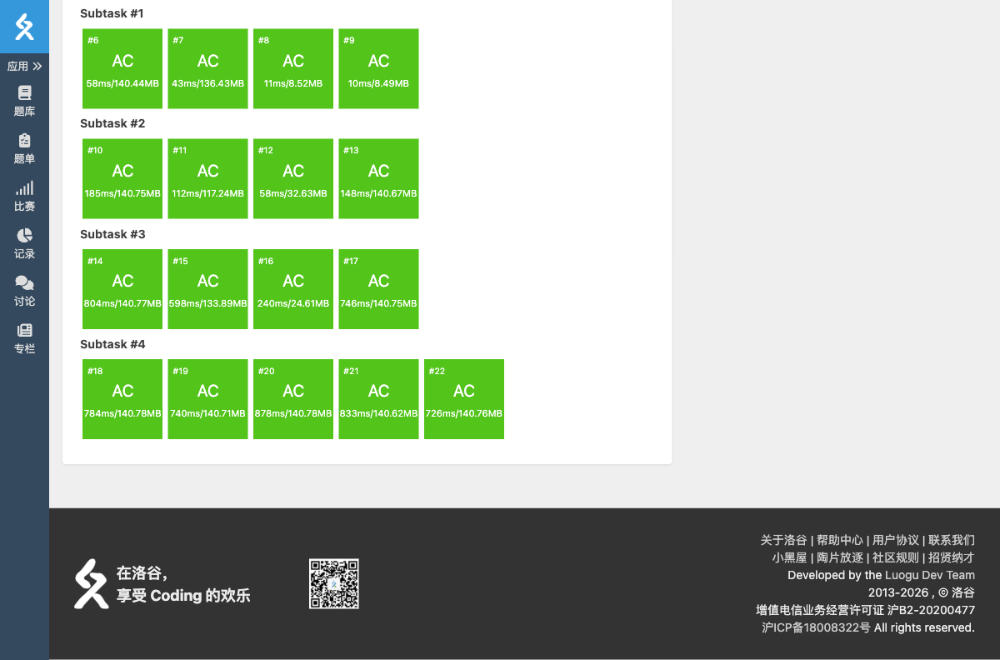

# P11615 【模板】哈希表

## 题目信息

- **题目链接**：https://www.luogu.com.cn/problem/P11615
- **知识点**：哈希表、快速读入、自然溢出
- **时间限制**：1.00s ~ 3.00s
- **内存限制**：512MB

## 题目简述

> 维护一个从 $[0, 2^{64})$ 到 $[0, 2^{64})$ 的映射 $f$，初始全为 $0$。$n$ 次操作，每次给出 $(x, y)$：先查询 $f(x)$ 的值，再令 $f(x) \leftarrow y$。输出 $\sum_{i=1}^{n} i \cdot ans_i$ 对 $2^{64}$ 取模的结果。
>
> 数据范围：$1 \le n \le 5 \times 10^6$，$0 \le x, y \lt 2^{64}$。

## 题目分析

### 详细版

**1. 读题**

需要支持 $5 \times 10^6$ 次键值对的查询与修改，普通 `unordered_map` 容易被 hack 数据卡掉，且常数较大。因此手写一个基于开放寻址法的哈希表。

**2. 哈希函数**

使用 `splitmix64` 作为哈希函数，把 64 位键均匀散列。它是被广泛验证的对抗攻击数据的哈希函数。

**3. 开放寻址法**

- 表大小取 $2^{23}$，用位运算取模。
- 对每个键计算哈希位置，若被占用且键不同则线性探测下一个位置。
- 查询时找到对应位置，若未占用则值为 $0$。
- 修改时直接写入该位置。

**4. 快速读入**

$n$ 很大，使用 `fread` 实现快速读入 64 位无符号整数。

**5. 自然溢出**

题目要求对 $2^{64}$ 取模，正好对应 `unsigned long long` 的自然溢出，计算时无需额外取模。

**6. 时空复杂度分析**

- 时间复杂度：平均 $O(n)$。
- 空间复杂度：$O(2^{23})$，约 $136$ MB。

### 省流版

手写 splitmix64 + 开放寻址哈希表，用 fread 快速读入，利用 unsigned long long 自然溢出求答案。

## 代码实现



```cpp
// P11615 【模板】哈希表
/*
链接：https://www.luogu.com.cn/problem/P11615
知识点：哈希表、快速读入、自然溢出
*/
#include <stdio.h>
#include <stdlib.h>
#include <string.h>
#include <math.h>
#include <stack>
#include <string>
#include <queue>
#include <vector>
#include <list>
#include <map>
#include <set>
#include <unordered_set>
#include <algorithm>
#include <ext/pb_ds/assoc_container.hpp>
#include <ext/pb_ds/tree_policy.hpp>

using namespace std;

static char buf[1 << 23], *p1 = buf, *p2 = buf;

inline char gc(){
    if(p1 == p2){
        p2 = (p1 = buf) + fread(buf, 1, 1 << 21, stdin);
        if(p1 == p2) return EOF;
    }
    return *p1++;
}

inline unsigned long long rd(){
    unsigned long long x = 0;
    char ch = gc();
    while(!isdigit(ch)) ch = gc();
    while(isdigit(ch)){
        x = x * 10 + (unsigned long long)(ch ^ 48);
        ch = gc();
    }
    return x;
}

const int SZ = 1 << 23;

unsigned long long keys[SZ];
unsigned long long vals[SZ];
char occ[SZ];

inline unsigned long long splitmix64(unsigned long long x){
    x += 0x9e3779b97f4a7c15ULL;
    x = (x ^ (x >> 30)) * 0xbf58476d1ce4e5b9ULL;
    x = (x ^ (x >> 27)) * 0x94d049bb133111ebULL;
    return x ^ (x >> 31);
}

int main(){
    int n = (int)rd();
    unsigned long long ans = 0;
    const int mask = SZ - 1;

    for(int i = 1; i <= n; i++){
        unsigned long long x = rd();
        unsigned long long y = rd();
        unsigned long long h = splitmix64(x);
        int idx = (int)(h & mask);
        while(occ[idx] && keys[idx] != x){
            idx = (idx + 1) & mask;
        }
        unsigned long long cur = occ[idx] ? vals[idx] : 0;
        ans += (unsigned long long)i * cur;
        keys[idx] = x;
        vals[idx] = y;
        occ[idx] = 1;
    }

    printf("%llu\n", ans);
    return 0;
}
```

## 代码链接

代码发布于：https://github.com/Flutter-Misdreavus/csu_algorithm
