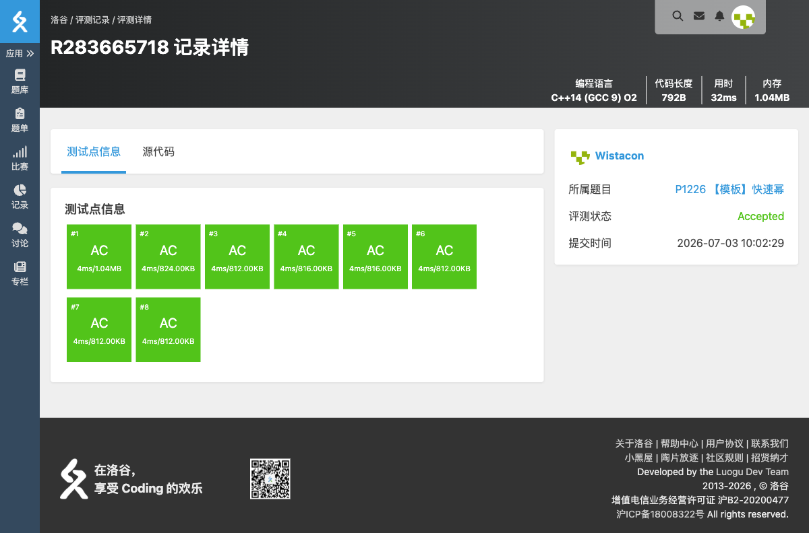

# P1226 【模板】快速幂

## 题目信息

- **题目链接**：https://www.luogu.com.cn/problem/P1226
- **知识点**：快速幂、模运算
- **时间限制**：1.00s
- **内存限制**：128MB

## 题目简述

> 给定 $a, b, p$，求 $a^b \bmod p$。
>
> 数据范围：$0 \le a, b \lt 2^{31}$，$a + b \gt 0$，$2 \le p \lt 2^{31}$。

## 题目分析

### 详细版

**1. 读题**

直接计算 $a^b$ 会溢出，需要用快速幂在计算过程中不断取模。

**2. 快速幂**

将指数 $b$ 按二进制拆分：
$$a^b = a^{2^{k_1}} \times a^{2^{k_2}} \times \cdots$$
从低位到高位扫描 $b$：
- 若当前位为 $1$，则把当前的 $a$ 乘入答案。
- 每次把 $a$ 平方，继续处理下一位。
这样只需 $O(\log b)$ 次乘法。

**3. 防止溢出**

使用 `long long` 存储中间结果，并在每次乘法后立即取模。由于 $a, p \lt 2^{31}$，$a \times a \lt 2^{62}$，在 64 位整数范围内。

**4. 时空复杂度分析**

- 时间复杂度：$O(\log b)$。
- 空间复杂度：$O(1)$。

### 省流版

二进制拆分指数，边乘边模，$O(\log b)$ 求出 $a^b \bmod p$。

## 代码实现



```cpp
// P1226 【模板】快速幂
/*
链接：https://www.luogu.com.cn/problem/P1226
知识点：快速幂、模运算
*/
#include <stdio.h>
#include <stdlib.h>
#include <string.h>
#include <math.h>
#include <stack>
#include <string>
#include <queue>
#include <vector>
#include <list>
#include <map>
#include <set>
#include <algorithm>
#include <ext/pb_ds/assoc_container.hpp>
#include <ext/pb_ds/tree_policy.hpp>

using namespace std;

long long fastpow(long long a, long long b, long long p){
    long long res = 1 % p;
    a %= p;
    while(b > 0){
        if(b & 1) res = res * a % p;
        a = a * a % p;
        b >>= 1;
    }
    return res;
}

int main(){
    long long a, b, p;
    scanf("%lld%lld%lld", &a, &b, &p);
    long long ans = fastpow(a, b, p);
    printf("%lld^%lld mod %lld=%lld\n", a, b, p, ans);
    return 0;
}
```

## 代码链接

代码发布于：https://github.com/Flutter-Misdreavus/csu_algorithm
