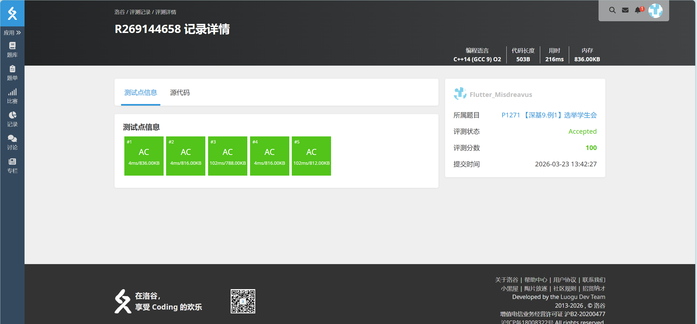

# P1271 【深基9.例1】选举学生会

## 题目信息

题目链接：https://www.luogu.com.cn/problem/P1271

知识点：桶排序、计数排序

## 题目简述

> 学校正在选举学生会成员，有 $n$（$1 \le n \le 999$）名候选人，每名候选人编号分别从 $1$ 到 $n$，现在收集到了 $m$（$1 \le m \le 2000000$）张选票，每张选票都写了一个候选人编号。现在想把这些堆积如山的选票按照投票数字从小到大排序。
>
> $1 \le n \le 999, 1 \le m \le 2000000, 1 \le a_i \le n$。
>
> 时间限制：1S，空间限制：125MB。

## 题目分析

### 详细版

本题要求将 $m$ 张选票上的候选人编号按照从小到大的顺序排序输出。

观察题目数据范围：
- 候选人编号 $n$ 的范围较小：$1 \le n \le 999$
- 选票数量 $m$ 的范围很大：$1 \le m \le 2000000$

由于 $n$ 的范围较小（最多999），而 $m$ 可以达到200万，考虑使用桶排序（计数排序）的思想：
1. 建立一个大小为 $n$ 的计数数组，用于统计每个候选人编号出现的次数
2. 遍历所有选票，对每个编号对应的计数桶进行累加
3. 按照编号从小到大的顺序，输出每个编号对应次数的选票

这种算法的时间复杂度为 $O(n + m)$，空间复杂度为 $O(n)$，非常适合本题的数据特点。

相比之下，如果使用传统的基于比较的排序算法（如快速排序、归并排序），时间复杂度为 $O(m \log m)$，在 $m$ 达到200万时虽然也能通过，但不如桶排序直接高效。

### 省流版

发现候选人数 $n \le 999$ 范围较小，而选票数 $m$ 可以很大。考虑使用桶排序（计数排序），建立大小为 $n$ 的计数数组统计每个编号出现的次数，然后按编号顺序输出。

时间复杂度 $O(n + m)$，空间复杂度 $O(n)$，可以通过本题。

## 代码实现



```cpp
// P1271 【深基9.例1】选举学生会
/*
链接：https://www.luogu.com.cn/problem/P1271
知识点：桶排序、计数排序
*/
#include <stdio.h>
#include <stdlib.h>
#include <string.h>
#include <algorithm>
#include <stack>
#include <queue>

using namespace std;

int main(){
    int humen[1000];
    memset(humen, 0, sizeof(humen));
    int n, m;
    int a;

    scanf("%d%d", &n, &m);
    for(int i = 0; i < m; i++){
        scanf("%d", &a);
        humen[a] += 1;
    }

    for(int i = 1; i <= n; i++){
        a = humen[i];
        for(int j = 0; j < a; j++){
            printf("%d ", i);
        }
    }
    printf("\n");
}
```

## 代码链接

代码发布于：https://github.com/Flutter-Misdreavus/csu_algorithm

