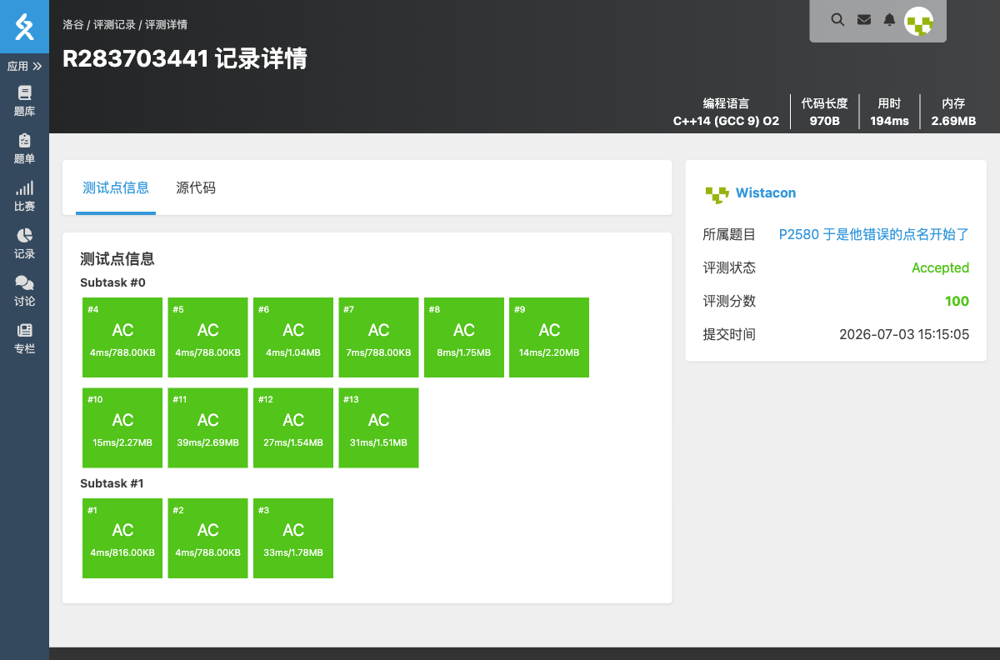

# P2580 于是他错误的点名开始了

## 题目信息

- **题目链接**：https://www.luogu.com.cn/problem/P2580
- **知识点**：哈希表、字符串查找
- **时间限制**：1.00s
- **内存限制**：128MB

## 题目简述

> 给定 $n$ 个学生姓名，再给出 $m$ 次点名。对每次点名输出：> - `OK`：姓名正确且是第一次点到；
> - `REPEAT`：姓名正确但重复点到；
> - `WRONG`：姓名错误。
>
> 数据范围：$n \le 10^4$，$m \le 10^5$，姓名长度不超过 $50$。

## 题目分析

### 详细版

**1. 读题**

需要快速判断一个字符串是否在一个集合中，以及是否已经被访问过。哈希表是最佳选择。

**2. 数据结构**

- 用 `unordered_set<string> names` 存储所有正确的姓名。
- 用 `unordered_set<string> called` 存储已经被点过的姓名。
- 对于每次点名：
  - 若不在 `names` 中，输出 `WRONG`；
  - 若在 `called` 中，输出 `REPEAT`；
  - 否则输出 `OK`，并加入 `called`。

**3. 时空复杂度分析**

- 时间复杂度：$O((n + m) \cdot L)$，其中 $L$ 为姓名长度。
- 空间复杂度：$O((n + m) \cdot L)$。

### 省流版

用两个 `unordered_set` 分别记录合法姓名和已点姓名，每次查询按规则输出即可。

## 代码实现



```cpp
// P2580 于是他错误的点名开始了
/*
链接：https://www.luogu.com.cn/problem/P2580
知识点：哈希表、字符串查找
*/
#include <stdio.h>
#include <stdlib.h>
#include <string.h>
#include <math.h>
#include <stack>
#include <string>
#include <queue>
#include <vector>
#include <list>
#include <map>
#include <set>
#include <unordered_set>
#include <algorithm>
#include <ext/pb_ds/assoc_container.hpp>
#include <ext/pb_ds/tree_policy.hpp>

using namespace std;

unordered_set<string> names;
unordered_set<string> called;

int main(){
    int n, m;
    char s[55];
    scanf("%d", &n);
    for(int i = 0; i < n; i++){
        scanf("%s", s);
        names.insert(s);
    }
    scanf("%d", &m);
    for(int i = 0; i < m; i++){
        scanf("%s", s);
        if(names.find(s) == names.end()){
            printf("WRONG\n");
        }else if(called.find(s) != called.end()){
            printf("REPEAT\n");
        }else{
            printf("OK\n");
            called.insert(s);
        }
    }
    return 0;
}
```

## 代码链接

代码发布于：https://github.com/Flutter-Misdreavus/csu_algorithm
