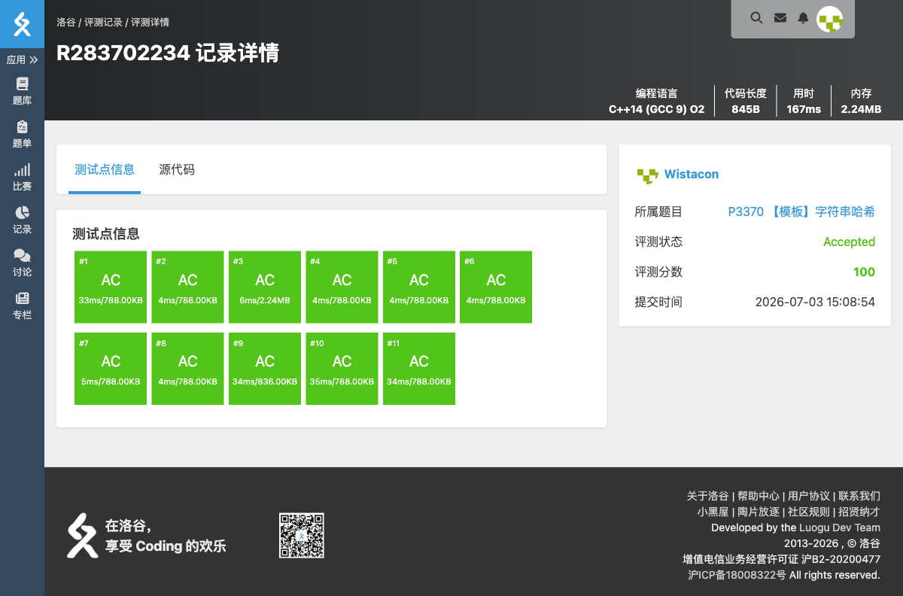

# P3370 【模板】字符串哈希

## 题目信息

- **题目链接**：https://www.luogu.com.cn/problem/P3370
- **知识点**：字符串哈希、滚动哈希
- **时间限制**：1.00s
- **内存限制**：128MB

## 题目简述

> 给定 $N$ 个字符串，统计其中有多少个不同的字符串。
>
> 数据范围：$N \le 10^4$，每个字符串长度不超过 $1500$。

## 题目分析

### 详细版

**1. 读题**

需要判断字符串是否相等。直接两两比较是 $O(N^2 L)$，虽然本题数据较小也能过，但题目意图是练习字符串哈希。

**2. 滚动哈希**

将字符串视为一个 $b$ 进制数，计算其哈希值：
$$H(s) = s_1 \cdot b^{L-1} + s_2 \cdot b^{L-2} + \cdots + s_L$$
使用无符号 64 位整数自然溢出，相当于对 $2^{64}$ 取模，碰撞概率极低。把所有哈希值放入哈希表，最后集合大小即为不同字符串个数。

**3. 时空复杂度分析**

- 时间复杂度：$O(N \cdot L)$。
- 空间复杂度：$O(N)$。

### 省流版

用滚动哈希把每个字符串映射成 64 位整数，再用 `unordered_set` 去重计数。

## 代码实现



```cpp
// P3370 【模板】字符串哈希
/*
链接：https://www.luogu.com.cn/problem/P3370
知识点：字符串哈希、滚动哈希
*/
#include <stdio.h>
#include <stdlib.h>
#include <string.h>
#include <math.h>
#include <stack>
#include <string>
#include <queue>
#include <vector>
#include <list>
#include <map>
#include <set>
#include <unordered_set>
#include <algorithm>
#include <ext/pb_ds/assoc_container.hpp>
#include <ext/pb_ds/tree_policy.hpp>

using namespace std;

unsigned long long getHash(const char* s){
    unsigned long long h = 0;
    while(*s){
        h = h * 131 + (unsigned long long)(*s);
        s++;
    }
    return h;
}

int main(){
    int n;
    scanf("%d", &n);
    unordered_set<unsigned long long> st;
    char str[2005];
    for(int i = 0; i < n; i++){
        scanf("%s", str);
        st.insert(getHash(str));
    }
    printf("%lu\n", st.size());
    return 0;
}
```

## 代码链接

代码发布于：https://github.com/Flutter-Misdreavus/csu_algorithm
