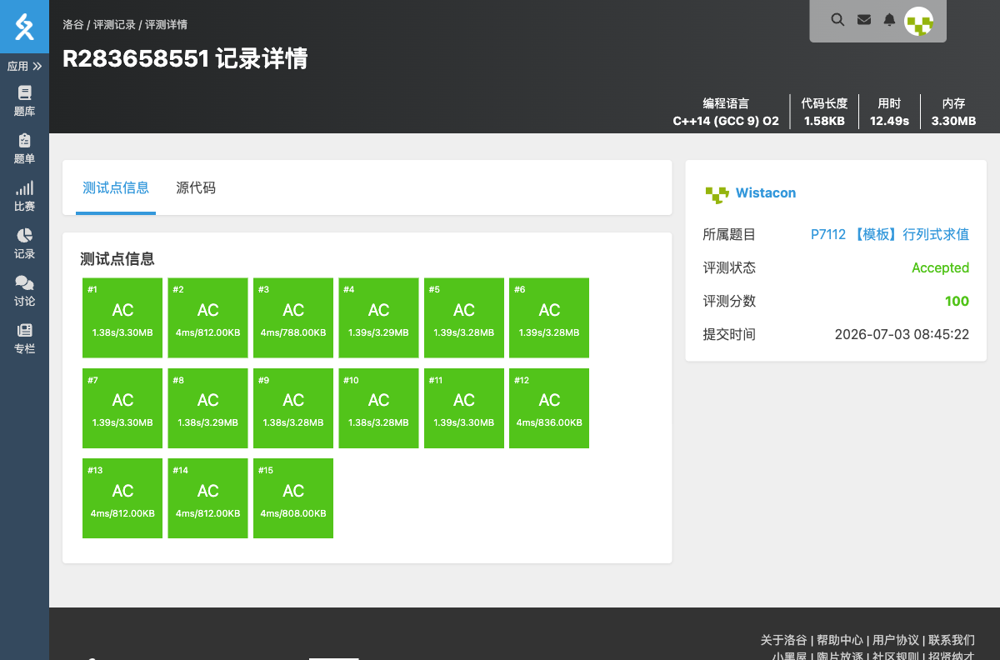

# P7112 【模板】行列式求值

## 题目信息

- **题目链接**：https://www.luogu.com.cn/problem/P7112
- **知识点**：行列式、高斯消元、辗转相除
- **时间限制**：5.00s
- **内存限制**：512MB

## 题目简述

> 给定一个 $n$ 阶行列式，求其值模 $p$ 的最小自然数值。
>
> 数据范围：$1 \le n \le 600$，$1 \le a_{ij} \lt 10^9+7$，$1 \le p \le 10^9+7$。

## 题目分析

### 详细版

**1. 读题**

求行列式模 $p$。普通高斯消元需要主元的模逆元，但本题模数 $p$ 不一定是质数，逆元可能不存在，因此不能直接用乘逆元的方法消元。

**2. 行列式基本性质**

- 交换两行，行列式变号。
- 一行加上或减去另一行的整数倍，行列式不变。
- 上三角矩阵的行列式等于主对角线元素之积。

利用这些性质，可以把矩阵消成上三角，再将对角线元素相乘。

**3. 辗转相除消元**

对两行第 $i$ 列的元素 $a_{ii}$ 和 $a_{ji}$ 做辗转相除：
- 若 $a_{ii} \gt a_{ji}$，交换这两行并记录符号变化。
- 否则令 $t = \lfloor a_{ji} / a_{ii} \rfloor$，把第 $j$ 行减去 $t$ 倍的第 $i$ 行。
- 重复直到 $a_{ji} = 0$。

这样全程只使用整数加减、取模和交换，不需要逆元。消元结束后矩阵化为上三角，对角线乘积再乘以符号即为答案。

**4. 时空复杂度分析**

- 时间复杂度：$O(n^2 (n + \log p))$，在 $n=600$ 且开启 O2 优化时可以通过。
- 空间复杂度：$O(n^2)$。

### 省流版

模数不一定是质数，用辗转相除代替乘逆元消元；把矩阵变成上三角后，对角线乘积乘符号就是行列式。

## 代码实现



```cpp
// P7112 【模板】行列式求值
/*
链接：https://www.luogu.com.cn/problem/P7112
知识点：行列式、高斯消元、辗转相除
*/
#include <stdio.h>
#include <stdlib.h>
#include <string.h>
#include <math.h>
#include <stack>
#include <string>
#include <queue>
#include <vector>
#include <list>
#include <map>
#include <set>
#include <algorithm>
#include <ext/pb_ds/assoc_container.hpp>
#include <ext/pb_ds/tree_policy.hpp>

using namespace std;

long long a[605][605];

int main(){
    int n;
    long long p;
    scanf("%d%lld", &n, &p);
    for(int i = 0; i < n; i++){
        for(int j = 0; j < n; j++){
            scanf("%lld", &a[i][j]);
            a[i][j] %= p;
            if(a[i][j] < 0) a[i][j] += p;
        }
    }

    bool neg = false;
    for(int i = 0; i < n; i++){
        for(int j = i + 1; j < n; j++){
            if(a[i][i] == 0 && a[j][i] != 0){
                for(int k = 0; k < n; k++){
                    swap(a[i][k], a[j][k]);
                }
                neg = !neg;
            }
            while(a[j][i] != 0){
                if(a[i][i] > a[j][i]){
                    for(int k = 0; k < n; k++){
                        swap(a[i][k], a[j][k]);
                    }
                    neg = !neg;
                }
                long long t = a[j][i] / a[i][i];
                for(int k = i; k < n; k++){
                    a[j][k] = (a[j][k] - (__int128)t * a[i][k] % p + p) % p;
                }
            }
        }
    }

    long long ans = 1 % p;
    for(int i = 0; i < n; i++){
        ans = ans * a[i][i] % p;
    }
    if(neg){
        ans = (p - ans) % p;
    }
    printf("%lld\n", ans);
    return 0;
}
```

## 代码链接

代码发布于：https://github.com/Flutter-Misdreavus/csu_algorithm

## 参考

- [P7112 官方题解](https://www.luogu.com.cn/article/bkuukes4)
- [P7112 题解＆浅谈行列式](https://www.cnblogs.com/hadtsti/p/17913889.html)
