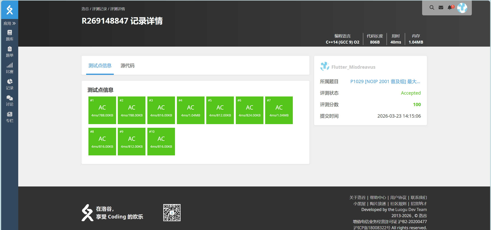
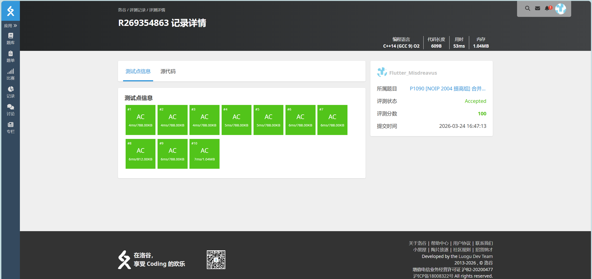
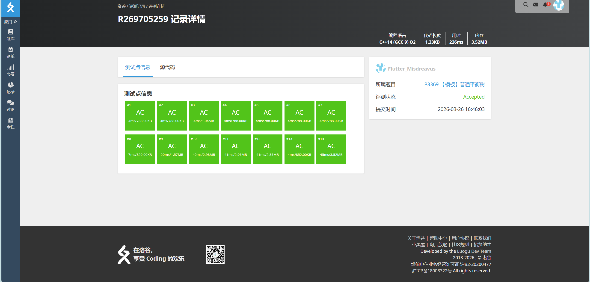
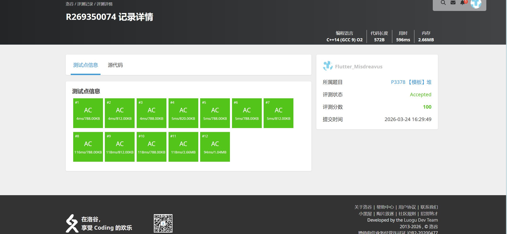
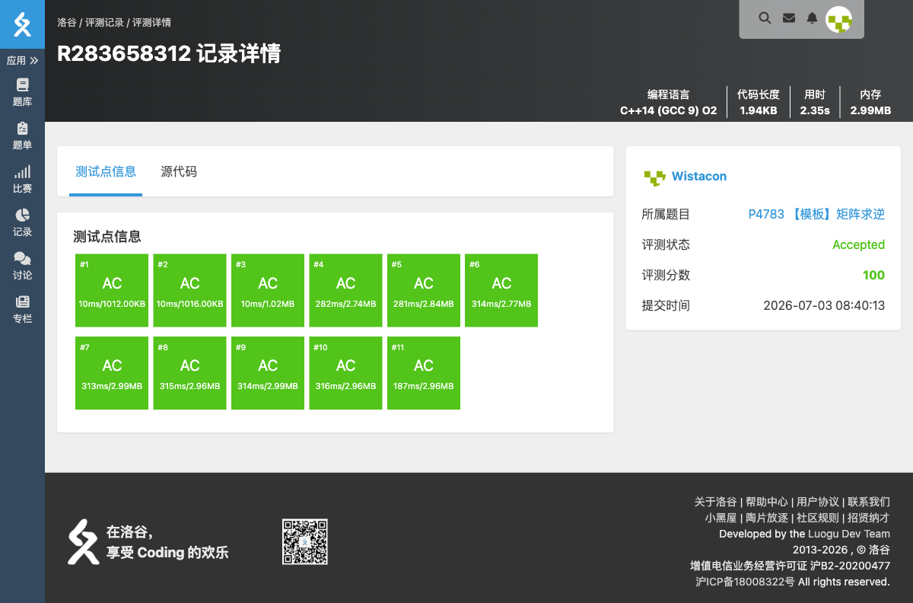

# 算法分析与设计练习题（三）— 完整题目解析报告

## 一、题单概述

### 1.1 题单信息

- **对应章节**：第 6 章变治法 + 第 7 章时空权衡
- **题目总数**：8 道
- **核心算法思想**：数论变换、贪心（哈夫曼树）、计数排序、平衡树/堆等时空权衡数据结构

### 1.2 知识点总览

| 题号 | 题目名称 | 核心知识点 | 难度 |
|------|----------|-----------|------|
| P1029 | [NOIP 2001 普及组] 最大公约数和最小公倍数问题 | 数论、GCD、LCM | 中等 |
| P1090 | [NOIP 2004 提高组] 合并果子 | 贪心、堆、哈夫曼树 | 中等 |
| P1271 | 【深基9.例1】选举学生会 | 桶排序、计数排序 | 简单 |
| P3369 | 【模板】普通平衡树 | 平衡树、PBDS | 中等 |
| P3378 | 【模板】堆 | 堆、优先队列 | 简单 |
| P3389 | 【模板】高斯消元法 | 高斯消元、线性方程组 | 中等 |
| P4783 | 【模板】矩阵求逆 | 矩阵求逆、高斯-约当消元 | 中等 |
| P7112 | 【模板】行列式求值 | 行列式、辗转相除 | 中等 |

### 1.3 题单知识图谱

本题单体现**变治法**、**时空权衡**与**矩阵代数**的思想：
- **变治法**：通过数学变换把原问题转化为更易求解的问题（P1029 将 GCD/LCM 问题转化为互质数对计数）。
- **贪心+堆**：P1090 的哈夫曼合并策略用堆维护当前最小值。
- **时空权衡**：P1271 用计数数组替代比较排序，以空间换时间；P3369、P3378 用平衡树/堆以额外空间换取 $O(\log n)$ 的动态操作效率。
- **矩阵代数**：P3389、P4783、P7112 分别用高斯消元、高斯-约当消元和辗转相除法处理线性方程组、矩阵逆和行列式，它们共同展示了把代数问题转化为矩阵行变换的技巧。

---

## 二、逐题解析

### 2.1 P1029 [NOIP 2001 普及组] 最大公约数和最小公倍数问题

**题目链接**：https://www.luogu.com.cn/problem/P1029

**知识点**：数论、最大公约数（GCD）、最小公倍数（LCM）

**题目简述**：

> 给定两个正整数 $x_0$ 和 $y_0$，求出满足条件的正整数 $P, Q$ 的个数，其中 $P, Q$ 的最大公约数为 $x_0$，最小公倍数为 $y_0$。
>
> $2 \le x_0, y_0 \le 10^5$，且保证 $x_0$ 能整除 $y_0$。

#### 详细分析

本题要求统计满足 $\gcd(P, Q) = x_0$ 且 $\operatorname{lcm}(P, Q) = y_0$ 的整数对 $(P, Q)$ 的个数。

首先有一个关键数学性质：对于任意两个正整数 $P$ 和 $Q$，有：
$$P \times Q = \gcd(P, Q) \times \operatorname{lcm}(P, Q)$$

因此，如果 $\gcd(P, Q) = x_0$，$\operatorname{lcm}(P, Q) = y_0$，则：
$$P \times Q = x_0 \times y_0$$

设 $P = x_0 \times a$，$Q = x_0 \times b$，其中 $\gcd(a, b) = 1$（因为已经提取了最大公约数），则：
- $\operatorname{lcm}(P, Q) = x_0 \times a \times b = y_0$
- $a \times b = y_0 / x_0$

令 $n = y_0 / x_0$，问题转化为：统计有多少对互质的正整数 $(a, b)$，满足 $a \times b = n$。

由于 $a$ 和 $b$ 是互质的正整数，且 $a \times b = n$，因此 $a$ 必须是 $n$ 的约数。我们可以枚举 $n$ 的所有约数 $a$，然后检查 $\gcd(a, n/a)$ 是否等于 1。

代码实现思路：
1. 如果 $x_0 = y_0$，则只有一种情况：$P = Q = x_0$
2. 令 $top = x_0 \times y_0$，枚举 $P$ 的所有可能值（从 $x_0$ 开始，每次增加 $x_0$）
3. 计算 $Q = top / P$
4. 检查 $\gcd(P, Q)$ 是否等于 $x_0$
5. 由于 $(P, Q)$ 和 $(Q, P)$ 是不同的解，最终答案乘 2

时间复杂度分析：枚举约数的复杂度为 $O(\sqrt{x_0 \times y_0})$，在题目数据范围下可以轻松通过。

#### 省流版

利用 $P \times Q = \gcd(P, Q) \times \operatorname{lcm}(P, Q) = x_0 \times y_0$ 的性质，令 $P = x_0 \times a$，$Q = x_0 \times b$，则 $a \times b = y_0 / x_0$。统计有多少对互质的 $(a, b)$ 满足 $a \times b = n$ 即可。

枚举 $n$ 的所有约数，检查 $\gcd(a, n/a) = 1$ 的个数，最终答案乘 2（考虑 $(P, Q)$ 和 $(Q, P)$ 两种排列）。

时间复杂度 $O(\sqrt{x_0 \times y_0})$，空间复杂度 $O(1)$。

#### 代码实现



```cpp
// P1029 [NOIP 2001 普及组] 最大公约数和最小公倍数问题
/*
链接：https://www.luogu.com.cn/problem/P1029
知识点：数论、最大公约数（GCD）、最小公倍数（LCM）
*/
#include <stdio.h>
#include <stdlib.h>
#include <string.h>
#include <algorithm>
#include <stack>
#include <queue>

int gcd(int a, int b){
    if(b == 0){
        return a;
    }
    return gcd(b, a % b);
}

int main(){
    int x, y;
    int n = 0;
    int p, q;
    int top;

    scanf("%d%d", &x, &y);
    if (x == y){
        // 当x和y相等时，只有一个数n满足条件，即n = 1。
        printf("1\n");
        return 0;
    }

    top = x * y;
    p = x;
    q = y;
    for(int i = 1; p <= q; i++){
        p = x * i;
        if(top % p != 0){
            // 如果p不是因数
            continue;
        }

        if(p == q){
            // 因数是对称的，当p等于q时，代表已经找了一半，直接将n乘2就可以了。
            break;
        }

        q = top / p;
        if(gcd(p, q) == x){
            n++;
        }
    }

    n = n << 1;

    printf("%d\n", n);
}
```


---

### 2.2 P1090 [NOIP 2004 提高组] 合并果子

**题目链接**：https://www.luogu.com.cn/problem/P1090

**知识点**：贪心、堆（哈夫曼树）、优先队列

**题目简述**：

> 有 $n$ 堆果子，每次可以合并两堆，消耗的体力等于两堆果子的重量之和。求把所有果子合成一堆所需的最小体力耗费值。
>
> $1 \le n \le 10^4$，$1 \le a_i \le 2\times 10^4$。

#### 详细分析

本题是经典的**合并果子**问题，要求计算将 n 堆果子合并成一堆所需的最小体力耗费值。

**贪心策略**：每次都合并当前最小的两堆果子，可以使得总代价最小。

**证明（哈夫曼树原理）**：设最小的两堆果子数量为 a 和 b，合并代价为 a + b。如果不将 a 和 b 合并，而是让其中一堆与更大的堆合并，代价会更大。因此，贪心策略是最优的。这与哈夫曼编码的原理相同。

**算法步骤**：
1. 将所有果子堆放入小根堆中
2. 每次取出堆顶的两堆（最小的两堆）
3. 合并它们，代价加上合并后的数量
4. 将合并后的结果放回堆中
5. 重复直到只剩一堆

**复杂度分析**：
- 每次操作时间复杂度为 $O(\log n)$（堆的插入/删除）
- 总共进行 $n-1$ 次合并
- 时间复杂度：$O(n \log n)$
- 空间复杂度：$O(n)$

#### 省流版

使用小根堆实现贪心算法：每次取出最小的两堆合并，将合并结果放回堆中，累加代价直到只剩一堆。

时间复杂度 $O(n \log n)$，空间复杂度 $O(n)$。

#### 代码实现



```cpp
#include <stdio.h>
#include <stdlib.h>
#include <string.h>
#include <vector>
#include <stack>
#include <queue>
#include <algorithm>

using namespace std;

int main(){
    priority_queue<int, vector<int>, greater<int>> guozidui;  // 小根堆
    int n;
    int ene = 0;  // 总代价
    int guo;      // 合并后的数量

    scanf("%d", &n);
    for(int i = 0; i < n; i++){
        scanf("%d", &guo);
        guozidui.push(guo);
    }

    // 每次合并最小的两堆
    while(guozidui.size() != 1){
        guo = guozidui.top();  // 取出最小的
        guozidui.pop();
        guo += guozidui.top();  // 加上第二小的
        guozidui.pop();

        ene += guo;  // 累加代价
        guozidui.push(guo);  // 合并结果放回堆中
    }

    printf("%d\n", ene);
}
```


---

### 2.3 P1271 【深基9.例1】选举学生会

**题目链接**：https://www.luogu.com.cn/problem/P1271

**知识点**：桶排序、计数排序

**题目简述**：

> 学校正在选举学生会成员，有 $n$ 名候选人，编号从 $1$ 到 $n$，收集到了 $m$ 张选票，每张选票写了一个候选人编号。要求把选票按照投票数字从小到大排序。
>
> $1 \le n \le 999, 1 \le m \le 2000000, 1 \le a_i \le n$。

#### 详细分析

本题要求将 $m$ 张选票上的候选人编号按照从小到大的顺序排序输出。

观察题目数据范围：
- 候选人编号 $n$ 的范围较小：$1 \le n \le 999$
- 选票数量 $m$ 的范围很大：$1 \le m \le 2000000$

由于 $n$ 的范围较小（最多999），而 $m$ 可以达到200万，考虑使用桶排序（计数排序）的思想：
1. 建立一个大小为 $n$ 的计数数组，用于统计每个候选人编号出现的次数
2. 遍历所有选票，对每个编号对应的计数桶进行累加
3. 按照编号从小到大的顺序，输出每个编号对应次数的选票

这种算法的时间复杂度为 $O(n + m)$，空间复杂度为 $O(n)$，非常适合本题的数据特点。

相比之下，如果使用传统的基于比较的排序算法（如快速排序、归并排序），时间复杂度为 $O(m \log m)$，在 $m$ 达到200万时虽然也能通过，但不如桶排序直接高效。

#### 省流版

发现候选人数 $n \le 999$ 范围较小，而选票数 $m$ 可以很大。考虑使用桶排序（计数排序），建立大小为 $n$ 的计数数组统计每个编号出现的次数，然后按编号顺序输出。

时间复杂度 $O(n + m)$，空间复杂度 $O(n)$，可以通过本题。

#### 代码实现


```cpp
// P1271 【深基9.例1】选举学生会
/*
链接：https://www.luogu.com.cn/problem/P1271
知识点：桶排序、计数排序
*/
#include <stdio.h>
#include <stdlib.h>
#include <string.h>
#include <algorithm>
#include <stack>
#include <queue>

using namespace std;

int main(){
    int humen[1000];
    memset(humen, 0, sizeof(humen));
    int n, m;
    int a;

    scanf("%d%d", &n, &m);
    for(int i = 0; i < m; i++){
        scanf("%d", &a);
        humen[a] += 1;
    }

    for(int i = 1; i <= n; i++){
        a = humen[i];
        for(int j = 0; j < a; j++){
            printf("%d ", i);
        }
    }
    printf("\n");
}
```


---

### 2.4 P3369 【模板】普通平衡树

**题目链接**：https://www.luogu.com.cn/problem/P3369

**知识点**：平衡树、PBDS（Policy-Based Data Structures）

**题目简述**：

> 需要动态维护一个可重集合 M，支持六种操作：插入 x、删除 x（删除一个）、查询 x 的排名、查询排名第 x 位的数、查询 x 的前驱、查询 x 的后继。
>
> 数据范围：$n \le 10^5$，$|x| \le 10^7$。

#### 详细分析

1. **读题**：本题要求实现一个支持可重集合的平衡树数据结构，需要支持六种基本操作：插入、删除、查询排名、查询第k大、查询前驱、查询后继。

2. **性质观察**：本题的核心挑战在于处理重复元素以及各种查询操作。使用平衡树可以在 $O(\log n)$ 时间内完成所有操作。

3. **程序设计**：读取 n 个操作，依次执行：
   - op=1: 插入元素 x
   - op=2: 删除元素 x（删除一个）
   - op=3: 查询 x 的排名（比 x 小的元素个数+1）
   - op=4: 查询排名第 x 位的数
   - op=5: 查询 x 的前驱（小于 x 的最大元素）
   - op=6: 查询 x 的后继（大于 x 的最小元素）

4. **数据结构与算法选择**：
   - 使用 GNU PBDS 中的 `tree`（平衡树）实现
   - 使用 `pair<int, int>` 存储元素，其中 first 为值，second 为唯一 id 用于区分重复元素
   - 使用 `order_of_key` 获取排名
   - 使用 `find_by_order` 获取第 k 大元素
   - 使用 `lower_bound`/`upper_bound` 查找前驱后继

5. **时空复杂度分析**：
   - 每次操作时间复杂度：$O(\log n)$
   - 总体时间复杂度：$O(n \log n)$
   - 空间复杂度：$O(n)$

#### 省流版

使用 GNU PBDS 的平衡树，用 (pair, id) 处理重复元素，通过 order_of_key、find_by_order、lower_bound 等函数实现六种操作，所有操作均为 $O(\log n)$。

#### 代码实现



```cpp
#include <stdio.h>
#include <stdlib.h>
#include <string.h>
#include <vector>
#include <set>
#include <stack>
#include <queue>
#include <algorithm>
#include <iterator>
#include <ext/pb_ds/assoc_container.hpp>
#include <ext/pb_ds/tree_policy.hpp>

using namespace std;
using namespace __gnu_pbds;
using Pinghengshu = tree<pair<int, int>, null_type, less<pair<int, int>>, rb_tree_tag, tree_order_statistics_node_update>; //定义类型别名

int main(){
    Pinghengshu m;
    int x, n, op;
    int id = 0; // 为了区分重复元素，给每一个元素一个id

    scanf("%d", &n);
    for(int i = 0; i < n; i++){
        scanf("%d%d", &op, &x);
        if(op == 1){
            id++;
            m.insert({x, id});
        }else if(op == 2){
            auto it = m.lower_bound({x, 0});
            m.erase(it);
        }else if(op == 3){
            auto it = m.lower_bound({x, 0});
            printf("%d\n", (int)(m.order_of_key(*it) + 1));
        }else if(op == 4){
            printf("%d\n", (*(m.find_by_order(x - 1))).first);
        }else if(op == 5){
            printf("%d\n", (*(--m.lower_bound({x, 0}))).first);
        }else if(op == 6){
            printf("%d\n", (*(m.upper_bound({x, 99999}))).first);
        }
    }
    return 0;
}
```


---

### 2.5 P3378 【模板】堆

**题目链接**：https://www.luogu.com.cn/problem/P3378

**知识点**：堆（Heap）、优先队列（Priority Queue）

**题目简述**：

> 给定一个数列，初始为空，支持三种操作：
> 1. 插入 $x$；
> 2. 输出数列中最小的数；
> 3. 删除数列中最小的数。
>
> $1 \le n \le 10^6$，$1 \le x \lt 2^{31}$。

#### 详细分析

本题是堆的模板题，需要实现一个支持以下三种操作的数据结构：
1. 插入一个元素
2. 获取最小元素
3. 删除最小元素

这种数据结构在算法中被称为**小根堆**（或最小堆）。

**堆（Heap）** 是一种特殊的完全二叉树结构：
- 小根堆：每个节点的值都小于等于其子节点的值，因此根节点是整个堆的最小值
- 大根堆：每个节点的值都大于等于其子节点的值

在 C++ 中，可以使用 `priority_queue` 来实现堆：
- 默认的 `priority_queue` 是大根堆
- 使用 `priority_queue<int, vector<int>, greater<int>>` 可以创建小根堆

**算法思路**：
1. 使用小根堆维护整个数列
2. 操作 1（插入）：直接将元素 push 入堆
3. 操作 2（获取最小值）：直接访问堆顶元素（top）
4. 操作 3（删除最小值）：弹出堆顶元素（pop）

堆的插入和删除操作的时间复杂度均为 $O(\log n)$，获取最小值为 $O(1)$。

#### 省流版

使用 C++ STL 中的小根堆（`priority_queue<int, vector<int>, greater<int>>`）直接模拟三种操作：
- 操作 1：`push(x)` 插入元素
- 操作 2：`top()` 获取最小值
- 操作 3：`pop()` 删除最小值

时间复杂度：$O(n \log n)$，空间复杂度：$O(n)$。

#### 代码实现



```cpp
#include <stdio.h>
#include <stdlib.h>
#include <string.h>
#include <vector>
#include <stack>
#include <queue>
#include <algorithm>

using namespace std;

int main(){
    priority_queue<int, vector<int>, greater<int>> xiaogendui; // 创建一个小根堆
    int n;
    int op;
    int x;

    scanf("%d", &n);
    for(int i = 0; i < n; i++){
        scanf("%d", &op);
        if(op == 1){
            scanf("%d", &x);
            xiaogendui.push(x);
        }else if(op == 2){
            printf("%d\n", xiaogendui.top());
        }else{
            xiaogendui.pop();
        }
    }
}
```


---

### 2.6 P3389 【模板】高斯消元法

**题目链接**：https://www.luogu.com.cn/problem/P3389

**知识点**：高斯消元、线性方程组

**题目简述**：

> 给定一个 $n \times n$ 的线性方程组，求解 $x_1, x_2, \dots, x_n$；若不存在唯一解或无解，输出 `No Solution`。
>
> 数据范围：$1 \le n \le 100$，$|a_i|, |b| \le 10^4$。

#### 详细分析

本题是线性方程组求解模板。通过**列主元高斯-约当消元**，把增广矩阵化为简化行阶梯形。若某列主元绝对值小于 `EPS`，说明不存在唯一解。消元完成后，增广矩阵最后一列即为解，按顺序输出并保留两位小数即可。

**时间复杂度**：$O(n^3)$；**空间复杂度**：$O(n^2)$。

#### 省流版

列主元高斯消元把增广矩阵化为行最简形；主元为 $0$ 输出 `No Solution`，否则输出最后一列。

#### 代码实现


```cpp
// P3389 【模板】高斯消元法
#include <stdio.h>
#include <stdlib.h>
#include <string.h>
#include <math.h>
#include <algorithm>
#include <ext/pb_ds/assoc_container.hpp>
#include <ext/pb_ds/tree_policy.hpp>

using namespace std;

const double EPS = 1e-7;

double a[105][106];

int main(){
    int n;
    scanf("%d", &n);
    for(int i = 0; i < n; i++){
        for(int j = 0; j <= n; j++){
            scanf("%lf", &a[i][j]);
        }
    }

    for(int i = 0; i < n; i++){
        int pivot = i;
        for(int r = i + 1; r < n; r++){
            if(fabs(a[r][i]) > fabs(a[pivot][i])){
                pivot = r;
            }
        }
        if(fabs(a[pivot][i]) < EPS){
            printf("No Solution\n");
            return 0;
        }
        if(pivot != i){
            for(int j = i; j <= n; j++){
                swap(a[i][j], a[pivot][j]);
            }
        }

        double div = a[i][i];
        for(int j = i; j <= n; j++){
            a[i][j] /= div;
        }

        for(int r = 0; r < n; r++){
            if(r == i) continue;
            double factor = a[r][i];
            if(fabs(factor) < EPS) continue;
            for(int j = i; j <= n; j++){
                a[r][j] -= factor * a[i][j];
            }
        }
    }

    for(int i = 0; i < n; i++){
        printf("%.2f\n", a[i][n]);
    }
    return 0;
}
```

---

### 2.7 P4783 【模板】矩阵求逆

**题目链接**：https://www.luogu.com.cn/problem/P4783

**知识点**：矩阵求逆、高斯-约当消元、模意义下逆元

**题目简述**：

> 给定一个 $N \times N$ 的整数矩阵，求它在模 $10^9+7$ 意义下的逆矩阵；若不可逆则输出 `No Solution`。
>
> 数据范围：$N \le 400$，$0 \le a_{ij} \lt 10^9+7$。

#### 详细分析

构造增广矩阵 $[A \mid I]$，对其做模意义下的高斯-约当消元。由于模数是质数，主元非零时可用快速幂求逆元。消元结束后右半部分即为逆矩阵；若某列找不到非零主元，则矩阵不可逆。

**时间复杂度**：$O(N^3)$；**空间复杂度**：$O(N^2)$。

#### 省流版

对 $[A \mid I]$ 做模意义高斯-约当消元，右半部分就是逆矩阵；主元为 $0$ 则输出 `No Solution`。

#### 代码实现



```cpp
// P4783 【模板】矩阵求逆
#include <stdio.h>
#include <stdlib.h>
#include <string.h>
#include <algorithm>
#include <ext/pb_ds/assoc_container.hpp>
#include <ext/pb_ds/tree_policy.hpp>

using namespace std;

const long long MOD = 1000000007LL;

long long a[405][805];

long long fastpow(long long base, long long exp){
    long long res = 1;
    base %= MOD;
    while(exp > 0){
        if(exp & 1) res = res * base % MOD;
        base = base * base % MOD;
        exp >>= 1;
    }
    return res;
}

int main(){
    int n;
    scanf("%d", &n);
    for(int i = 0; i < n; i++){
        for(int j = 0; j < n; j++){
            scanf("%lld", &a[i][j]);
            a[i][j] %= MOD;
        }
        a[i][n + i] = 1;
    }

    for(int i = 0; i < n; i++){
        int pivot = -1;
        for(int r = i; r < n; r++){
            if(a[r][i] != 0){
                pivot = r;
                break;
            }
        }
        if(pivot == -1){
            printf("No Solution\n");
            return 0;
        }
        if(pivot != i){
            for(int j = 0; j < 2 * n; j++){
                swap(a[i][j], a[pivot][j]);
            }
        }

        long long inv = fastpow(a[i][i], MOD - 2);
        for(int j = 0; j < 2 * n; j++){
            a[i][j] = a[i][j] * inv % MOD;
        }

        for(int r = 0; r < n; r++){
            if(r == i) continue;
            long long factor = a[r][i];
            if(factor == 0) continue;
            for(int j = 0; j < 2 * n; j++){
                a[r][j] = (a[r][j] - factor * a[i][j] % MOD + MOD) % MOD;
            }
        }
    }

    for(int i = 0; i < n; i++){
        for(int j = 0; j < n; j++){
            if(j > 0) printf(" ");
            printf("%lld", a[i][n + j]);
        }
        printf("\n");
    }
    return 0;
}
```

---

### 2.8 P7112 【模板】行列式求值

**题目链接**：https://www.luogu.com.cn/problem/P7112

**知识点**：行列式、高斯消元、辗转相除

**题目简述**：

> 给定一个 $n$ 阶行列式，求其值模 $p$ 的最小自然数值。
>
> 数据范围：$1 \le n \le 600$，$1 \le a_{ij} \lt 10^9+7$，$1 \le p \le 10^9+7$。

#### 详细分析

普通高斯消元需要主元的模逆元，但本题模数 $p$ 不一定是质数。改用**辗转相除**：对两行第 $i$ 列的两个元素反复取余、交换，把下方元素消为 $0$，全程只使用整数加减，不需要逆元。消成上三角后，对角线乘积乘以符号即为答案。

**时间复杂度**：$O(n^2 (n + \log p))$；**空间复杂度**：$O(n^2)$。

#### 省流版

模数非质数时用辗转相除代替乘逆元消元，化为上三角后求对角线乘积。

#### 代码实现


```cpp
// P7112 【模板】行列式求值
#include <stdio.h>
#include <stdlib.h>
#include <string.h>
#include <algorithm>
#include <ext/pb_ds/assoc_container.hpp>
#include <ext/pb_ds/tree_policy.hpp>

using namespace std;

long long a[605][605];

int main(){
    int n;
    long long p;
    scanf("%d%lld", &n, &p);
    for(int i = 0; i < n; i++){
        for(int j = 0; j < n; j++){
            scanf("%lld", &a[i][j]);
            a[i][j] %= p;
            if(a[i][j] < 0) a[i][j] += p;
        }
    }

    bool neg = false;
    for(int i = 0; i < n; i++){
        for(int j = i + 1; j < n; j++){
            if(a[i][i] == 0 && a[j][i] != 0){
                for(int k = 0; k < n; k++){
                    swap(a[i][k], a[j][k]);
                }
                neg = !neg;
            }
            while(a[j][i] != 0){
                if(a[i][i] > a[j][i]){
                    for(int k = 0; k < n; k++){
                        swap(a[i][k], a[j][k]);
                    }
                    neg = !neg;
                }
                long long t = a[j][i] / a[i][i];
                for(int k = i; k < n; k++){
                    a[j][k] = (a[j][k] - (__int128)t * a[i][k] % p + p) % p;
                }
            }
        }
    }

    long long ans = 1 % p;
    for(int i = 0; i < n; i++){
        ans = ans * a[i][i] % p;
    }
    if(neg){
        ans = (p - ans) % p;
    }
    printf("%lld\n", ans);
    return 0;
}
```

---

## 三、算法思想总结

### 3.1 本章核心算法思想

#### 变治法（Transform and Conquer）

变治法的核心思想是：将问题转化为另一种更容易求解的形式。

- **P1029**：通过数论变换，将“满足 GCD 和 LCM 约束的数对计数”转化为“互质数对 $(a, b)$ 满足 $a \times b = n$ 的计数”。这是变治法中**问题化简**（Problem Reduction）的典型例子。

#### 贪心算法与哈夫曼树

- **P1090 合并果子**：每次合并当前最小的两堆，是哈夫曼树的经典应用。贪心策略的正确性可以通过交换论证或哈夫曼树的性质来证明。

#### 时空权衡

时空权衡（Time-Space Tradeoff）是指通过增加空间使用来减少时间开销，或通过增加计算时间来减少空间使用。

- **P1271 选举学生会**：候选人编号范围很小（$n \le 999$），使用大小为 $n$ 的计数数组（桶排序）可以将排序时间从 $O(m \log m)$ 降到 $O(n + m)$，是典型的以空间换时间。
- **P3369 普通平衡树 / P3378 堆**：使用额外的树形数据结构维护集合，使插入、删除、查询等动态操作都能在 $O(\log n)$ 时间内完成，也是以空间换取时间效率。

#### 矩阵运算与消元

线性代数中的行列变换为求解方程组、矩阵逆和行列式提供了统一框架。

- **P3389 高斯消元**：通过行变换把增广矩阵化为行最简形，从而直接读出方程组的解。
- **P4783 矩阵求逆**：对 $[A \mid I]$ 做高斯-约当消元，左半部分变成单位矩阵时，右半部分即为 $A^{-1}$。
- **P7112 行列式求值**：利用行变换保持行列式值（或仅改变符号）的性质，把矩阵化为上三角后求对角线乘积；模数非质数时使用辗转相除避免求逆。

### 3.2 题单内算法对比与联系

| 题目 | 核心思想 | 数据结构/技巧 |
|------|----------|--------------|
| P1029 | 变治法 | 数论变换、GCD/LCM 性质 |
| P1090 | 贪心 | 小根堆维护最小值 |
| P1271 | 时空权衡 | 计数数组/桶排序 |
| P3369 | 时空权衡 | PBDS 平衡树 |
| P3378 | 时空权衡 | 小根堆 |
| P3389 | 矩阵消元 | 高斯消元 |
| P4783 | 矩阵消元 | 高斯-约当消元、快速幂逆元 |
| P7112 | 矩阵消元 | 辗转相除、行列式性质 |

### 3.3 常见解题模式与技巧

1. **数学变换降维**：遇到 GCD/LCM 相关计数问题时，先提取公共因子，把问题转化为互质数的计数。
2. **哈夫曼贪心**：合并类问题中，如果每次合并的代价与当前状态有关，通常可以考虑“每次选最小的两个合并”的贪心策略。
3. **以空间换时间**：当数据范围有明显上限时，计数排序、桶排序等线性排序往往比比较排序更高效。
4. **STL 数据结构**：`priority_queue` 和 PBDS 的 `tree` 可以快速实现堆和平衡树，避免手写复杂数据结构。
5. **矩阵行变换的统一性**：高斯消元、矩阵求逆、行列式求值都依赖初等行变换，区别在于目标形式（行最简形、上三角形）和是否需要模逆元。
5. **处理重复元素**：使用 `pair<值, id>` 是 PBDS 中处理可重集合的常用技巧。

---

*本报告由题单内各题解析综合整理而成。如需查看单题详细解析，请点击各题后的独立解析链接。*
