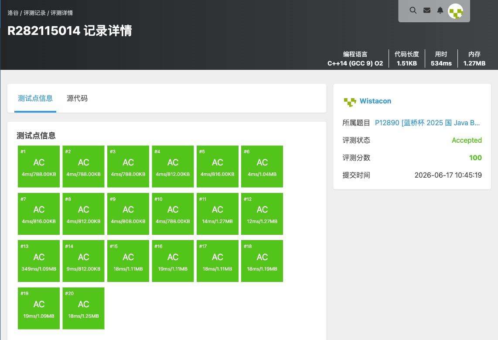

# P12890 [蓝桥杯 2025 国 Java B] 道具摆放

## 题目信息

题目链接：https://www.luogu.com.cn/problem/P12890

知识点：分治、归并排序求逆序对、数学（奇偶性分析）

## 题目简述

> 给定 $1\sim N$ 的一个排列 $P$，每次操作可交换相邻两个元素，目标是把排列还原成升序 $1,2,\ldots,N$。要求**最终的交换次数恰好是 $M$ 的整数倍**，求满足该限制的最少交换次数；若不可能则输出 $-1$。
>
> 数据范围：$1 \le N \le 10^5$，$1 \le M \le 10^9$，$P$ 是 $1\sim N$ 的排列。
>
> 时间限制：1S，空间限制：128MB。

## 题目分析

### 详细版

**1. 读题**

把排列通过相邻交换还原成升序，最少交换次数是一个经典结论；但本题额外要求交换次数是 $M$ 的倍数，因此要在「最少次数」的基础上分析还能凑出哪些次数。

**2. 性质观察**

- **关键结论一**：把一个排列通过相邻交换排成升序，最少交换次数恰好等于该排列的**逆序对数** $inv$。
- **关键结论二**：除了 $inv$ 次，我们还可以「做无用功」——任选相邻两个元素交换两次即可回到原状态，每次这样浪费会使总次数 $+2$。因此**所有可达的交换次数恰好是 $\{inv, inv+2, inv+4, \ldots\}$**，即所有 $\ge inv$ 且与 $inv$ **奇偶性相同**的整数。

于是问题转化为：求最小的 $X$，满足 $X$ 是 $M$ 的倍数、$X \ge inv$、且 $X \equiv inv \pmod 2$。

- 若 $inv=0$，答案为 $0$；
- 若 $inv$ 为偶数：需要 $M$ 的偶数倍。若 $M$ 为偶数，任意倍数都是偶数，取 $\ge inv$ 的最小倍数；若 $M$ 为奇数，则需步长 $2M$ 才能保证偶数，取 $\ge inv$ 的最小 $2M$ 倍数；
- 若 $inv$ 为奇数、$M$ 为偶数：$M$ 的倍数全为偶数，无法得到奇数，输出 $-1$；
- 若 $inv$ 为奇数、$M$ 为奇数：奇数倍 $M,3M,5M,\ldots$ 才是奇数，以 $2M$ 为步长从 $M$ 开始找 $\ge inv$ 的最小值。

**3. 数据结构与算法选择**

- 用**归并排序**在 $O(N\log N)$ 内求逆序对数 $inv$（用 `long long` 防溢出，$inv$ 最大约 $5\times 10^9$）；
- 之后按上面的奇偶性分类讨论，循环累加求最小合法倍数。

**4. 程序设计**

1. 读入排列，归并排序统计 `inx`（逆序对数）；
2. 按 `inx` 与 `m` 的奇偶性分四类讨论：
   - `inx == 0` → 输出 `0`；
   - `inx` 偶：若 `m` 为奇则令 `m <<= 1`，从 `m` 开始按步长 `m` 累加到第一个 $\ge inx$ 的值；
   - `inx` 奇且 `m` 偶 → 输出 `-1`；
   - `inx` 奇且 `m` 奇：以 `2m` 为步长、从 `m` 起累加到第一个 $\ge inx$ 的值。

**5. 时空复杂度分析**

求逆序对 $O(N\log N)$，分类讨论里的循环最多执行 $inv/M$ 次，整体可视为 $O(N\log N)$，空间 $O(N)$。$N=10^5$ 可轻松通过。

### 省流版

最少相邻交换次数 = 逆序对数 $inv$，且额外两两交换可使次数 $+2$，故可达次数为所有 $\ge inv$ 且与 $inv$ 同奇偶的数。归并排序求 $inv$ 后，按 $inv$、$M$ 的奇偶分类，找最小的、奇偶匹配的 $M$ 的倍数；奇偶冲突（$inv$ 奇、$M$ 偶）时输出 $-1$。时间复杂度 $O(N\log N)$。

## 代码实现



```cpp
#include <stdio.h>
#include <stdlib.h>
#include <string.h>
#include <stack>
#include <queue>
#include <string>
#include <list>
#include <map>
#include <set>
#include <algorithm>
#include <ext/pb_ds/assoc_container.hpp>
#include <ext/pb_ds/tree_policy.hpp>

using namespace std;

int box[100005];
int tmp[100005];
long long int inx = 0;

void msort(int left, int right){
	if(left >= right){
		return;
	}

	int mid = left + right;
	mid >>= 1;

	msort(left, mid);
	msort(mid + 1, right);

	int tmpf = 0;
	int ll = left, rr = mid + 1;
	while(ll <= mid && rr <= right){
		if(box[ll] <= box[rr]){
			tmp[tmpf] = box[ll];
			tmpf++;
			ll++;
		}else{
			tmp[tmpf] = box[rr];
			inx += mid - ll + 1;
			tmpf++;
			rr++;
		}
	}

	while(ll <= mid){
		tmp[tmpf] = box[ll];
		tmpf++;
		ll++;
	}
	while(rr <= right){
		tmp[tmpf] = box[rr];
		tmpf++;
		rr++;
	}

	for(int i = left; i <= right; i++){
		box[i] = tmp[i - left];
	}

	return;
}

int main(){
	int n, m;
	long long int ans;

	scanf("%d%d", &n, &m);
	for(int i = 0; i < n; i++){
		scanf("%d", &box[i]);
	}

	msort(0, n - 1);

	if(inx == 0){
		printf("0\n");
	}else if((inx & 1) == 0){
		if((m & 1) != 0){
			m <<= 1;
		}
		ans = m;
		while(ans < inx){
			ans += m;
		}
		printf("%lld\n", ans);
	}else if(((inx & 1 )!= 0) && ((m & 1) == 0)){
		printf("-1\n");
	}else{
		ans = m;
		m <<= 1;
		while(ans < inx){
			ans += m;
		}
		printf("%lld\n", ans);
	}
}
```

## 代码链接

代码发布于：https://github.com/Flutter-Misdreavus/csu_algorithm
