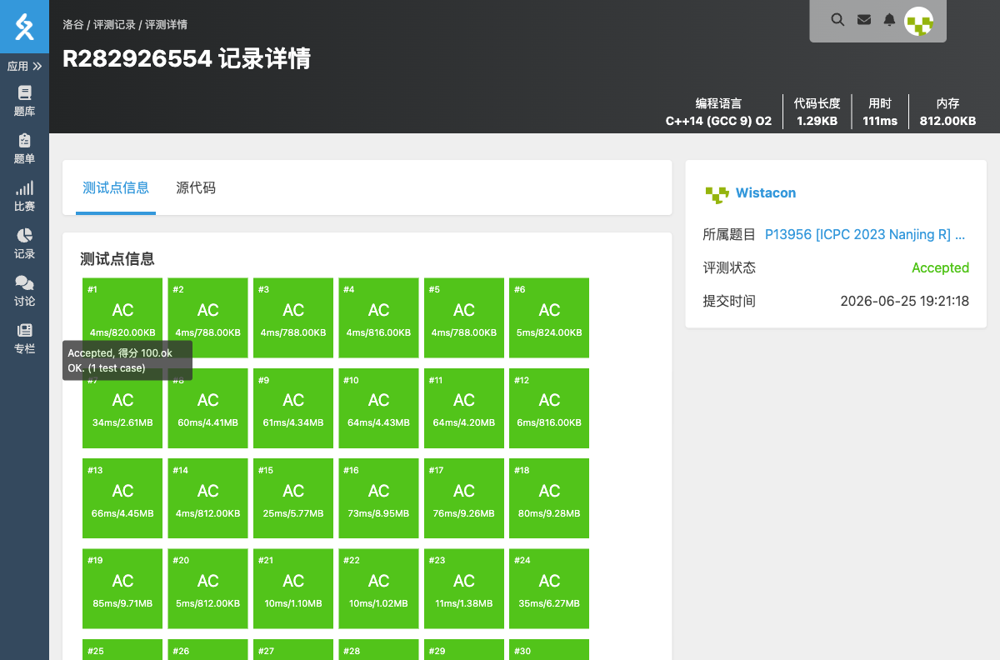

# P13956 [ICPC 2023 Nanjing R] 等价重写

## 题目信息

- **题目链接**：https://www.luogu.com.cn/problem/P13956
- **知识点**：拓扑排序、构造
- **时间限制**：2.00s
- **内存限制**：512MB

## 题目简述

> 给定 $T$ 组测试数据。每组数据有一个长度为 $m$ 的初始全 $0$ 序列和 $n$ 个操作，第 $i$ 个操作会把若干位置上的值改为 $i$。按顺序 $1,2,\dots,n$ 执行后得到结果序列 $R$。要求找出一个与恒等排列不同的 $1\sim n$ 的排列 $q$，使得按 $q$ 的顺序执行操作仍得到 $R$；若不存在则输出 `No`。
> 
> 数据范围：$1\le n,m\le 10^5$，所有数据的 $(n+m)$ 之和不超过 $2\times 10^6$，所有数据的 $p_i$ 之和不超过 $10^6$。

## 题目分析

### 详细版

**1. 读题**

原顺序下，序列每个位置的最终值等于覆盖该位置的所有操作中**下标最大**的那个。设 $last[x]$ 表示位置 $x$ 最终的值。

**2. 约束关系**

对于位置 $x$，设 $last[x]=k$，则所有覆盖 $x$ 且编号小于 $k$ 的操作必须在排列中位于 $k$ 之前；否则 $k$ 就不是最后改写 $x$ 的操作。因此每个位置只产生一条约束：覆盖它的所有操作中，除 $k$ 以外的操作都要排在 $k$ 前面。

把所有约束看成一个有向图，边总是从编号较小的点指向编号较大的点，因此该图一定是 DAG，恒等排列本身就是一个合法的拓扑序。

**3. 能否构造另一种排列？**

如果存在相邻的两项 $i$ 和 $i+1$ 之间没有约束边 $i\to i+1$，那么直接把这两项交换，得到的排列仍然满足所有约束（因为其它所有点与它们的相对位置不变，且 $i$ 与 $i+1$ 没有先后要求）。

边 $i\to i+1$ 存在的充要条件是：操作 $i$ 覆盖了某个位置 $x$，且 $last[x]=i+1$。于是只要检查每个 $i\in[1,n-1]$ 是否存在这样的位置即可。

**4. 数据结构与算法选择**

- 直接读入每个操作覆盖的位置，用一个数组 `lastx[x]` 记录位置 $x$ 最后被哪个操作覆盖。
- 再次扫描每个操作 $i$ 中的位置，若发现 `lastx[x] == i+1`，则说明存在边 $i\to i+1$。
- 一旦找到某对 $i,i+1$ 没有这条边，即可输出把 $i$ 与 $i+1$ 交换的排列。

**5. 正确性证明**

- 若找到没有边 $i\to i+1$ 的相邻对，交换后：
  - 对于任意 $k<i$，它在原排列中仍在 $i+1$ 前面，约束满足。
  - 对于任意 $k>i+1$，它在原排列中仍在 $i$ 后面，约束满足。
  - $i$ 与 $i+1$ 无直接约束，交换不产生冲突。
- 若所有相邻对都有边 $i\to i+1$，则对任意 $a<b$ 都存在路径 $a\to a+1\to\dots\to b$，拓扑序唯一，只能是恒等排列，故不存在其它合法排列。

**6. 时空复杂度分析**

- 时间复杂度：$O(\sum p_i)$，即读入与两次扫描的总代价。
- 空间复杂度：$O(n + m + \sum p_i)$。

### 省流版

每个位置要求覆盖它的操作中编号最大的那个必须在排列中位于其它覆盖者之后。相邻操作 $i$ 和 $i+1$ 若没有“$i$ 覆盖的位置最终值是 $i+1$”这种约束，就可以直接交换；所有相邻对都必须 $i$ 在 $i+1$ 前时答案唯一，输出 `No`。

## 代码实现



```cpp
// P13956 [ICPC 2023 Nanjing R] 等价重写
/*
链接：https://www.luogu.com.cn/problem/P13956
知识点：拓扑排序、构造
*/
#include <stdio.h>
#include <stdlib.h>
#include <string.h>
#include <stack>
#include <string>
#include <queue>
#include <vector>
#include <list>
#include <map>
#include <set>
#include <algorithm>
#include <ext/pb_ds/assoc_container.hpp>
#include <ext/pb_ds/tree_policy.hpp>

using namespace std;

int lastx[100005];

int main(){
	int T;
	scanf("%d", &T);

	while(T--){
		int n, m;
		scanf("%d%d", &n, &m);

		vector<vector<int> > caozuo(n + 1);
		for(int i = 1; i <= m; i++){
			lastx[i] = 0;
		}

		for(int i = 1; i <= n; i++){
			int p;
			scanf("%d", &p);
			caozuo[i].resize(p);
			for(int j = 0; j < p; j++){
				scanf("%d", &caozuo[i][j]);
				lastx[caozuo[i][j]] = i;
			}
		}

		int pos = -1;
		for(int i = 1; i < n; i++){
			bool you = false;
			for(int j = 0; j < (int)caozuo[i].size(); j++){
				if(lastx[caozuo[i][j]] == i + 1){
					you = true;
					break;
				}
			}
			if(!you){
				pos = i;
				break;
			}
		}

		if(pos == -1){
			printf("No\n");
			continue;
		}

		printf("Yes\n");
		for(int i = 1; i <= n; i++){
			int x;
			if(i == pos){
				x = pos + 1;
			}else if(i == pos + 1){
				x = pos;
			}else{
				x = i;
			}
			printf("%d", x);
			if(i != n){
				printf(" ");
			}
		}
		printf("\n");
	}
}
```

## 代码链接

代码发布于：https://github.com/Flutter-Misdreavus/csu_algorithm
