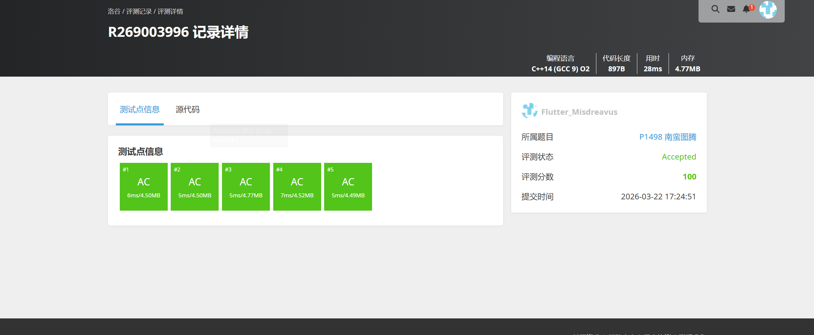

# P1498 南蛮图腾

## 题目信息

题目链接：https://www.luogu.com.cn/problem/P1498

知识点：递归、分形图形绘制

## 题目简述

> 给定一个正整数 n（1 ≤ n ≤ 10），参考输出样例，输出一个分形图腾图形。
>
> 该图形由基本的三角形图块递归构成。
>
> 1S，125MB。

## 题目分析

### 详细版

本题要求绘制一个分形图腾图形，观察输出样例可以发现，这是一个典型的递归分形问题。

**关键性质观察**：
- 当 n = 1 时，图形为最基本的三角形，由两行组成：
  ```
   /\
  /__\
  ```
- 当 n > 1 时，图形由三个 n-1 阶图形拼成：
  - 左上角：一个 n-1 阶图形
  - 右上角：一个 n-1 阶图形
  - 下方：一个 n-1 阶图形，占据左半部分

**递归思想**：
将 n 阶图腾看作由三个 (n-1) 阶图腾组成：
1. 左上角的 (n-1) 阶图腾向右偏移 2^(n-1) 个单位
2. 右上角的 (n-1) 阶图腾向右偏移 2^n 个单位
3. 下方的 (n-1) 阶图腾向下偏移 2^(n-1) 个单位，向右偏移 2^(n-1) 个单位

**基本图形（rank = 1）**：
```
  /\
 /__\
```
占用 2 行 4 列。

**递归绘制函数设计**：
```cpp
void draw(int x, int y, int rank)
```
参数说明：
- x, y: 起始坐标
- rank: 当前阶数

当 rank == 1 时，直接绘制基本图形；
当 rank > 1 时，递归调用三次 draw 函数绘制三个子图形。

**坐标计算**：
- 2^(rank-1) 可以用位运算 `1 << (rank-1)` 表示
- 左上角子图腾偏移：x 不变，y + 2^(rank-1)
- 右上角子图腾偏移：x + 2^(rank-1)，y + 2^rank
- 下方子图腾偏移：x + 2^(rank-1)，y + 2^(rank-1)

**时空复杂度分析**：
- 时间复杂度：O(2^n × 2^n)，因为最终图形的大小为 2^(n-1) 行 × 2^n 列，每个位置最多被访问常数次
- 空间复杂度：O(2^n × 2^n)，使用字符数组存储整个图形

### 省流版

本题是递归绘制分形图腾。n 阶图腾由三个 n-1 阶图腾组成：左上、右上各一个，下方一个。

基本图形（rank=1）是一个三角形，占2行4列。递归终止条件为 rank==1，直接绘制基本图形；否则递归调用三次绘制三个子图形。

最终图形大小为 2^(n-1) 行 × 2^n 列，时间和空间复杂度均为 O(2^n × 2^n)。

## 代码实现



```cpp
//P1498 南蛮图腾
/*
链接：https://www.luogu.com.cn/problem/P1498
知识点：递归、分形图形绘制
*/
#include <stdio.h>
#include <stdlib.h>
#include <string.h>
#include <algorithm>
#include <stack>
#include <queue>

using namespace std;

char tu[2048][2048];

void draw(int x, int y, int rank){
    if(rank == 1){
        // 如果阶数为1，直接画
        tu[x][y] = ' ';
        tu[x][y+1] = '/';
        tu[x][y+2] = '\\';
        tu[x+1][y] = '/';
        tu[x+1][y+1] = '_';
        tu[x+1][y+2] = '_';
        tu[x+1][y+3] = '\\';

        return;
    }

    // 如果阶数不是1，递归调用
    // 采用位运算提高速度，相当于2的幂
    draw(x, y + (2 << (rank - 2)), rank - 1);
    draw(x + (2 << (rank - 2)), y, rank - 1);
    draw(x + (2 << (rank - 2)), y + (2 << (rank - 1)), rank - 1);

    return;
}

int main(){
    int rank;
    memset(tu, ' ', sizeof(tu));

    scanf("%d", &rank);
    draw(0, 0, rank);

    for(int i = 0; i < (2 << (rank - 1)); i++){
        for(int j = 0; j < (2 << rank); j++){
            printf("%c", tu[i][j]);
        }
        printf("\n");
    }
}
```

## 代码链接

代码发布于：https://github.com/Flutter-Misdreavus/csu_algorithm
