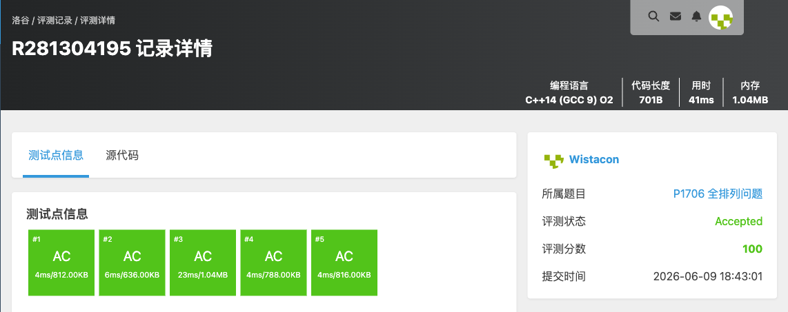

# P1706 全排列问题

## 题目信息

题目链接：https://www.luogu.com.cn/problem/P1706

知识点：深度优先搜索（DFS）、回溯、枚举

## 题目简述

> 给定整数 $n$，按字典序输出 $1\sim n$ 的所有不重复的全排列，每行一个排列，每个数字占 $5$ 个场宽。
>
> 数据范围：$1 \le n \le 9$。
>
> 时间限制：1S，空间限制：128MB。

## 题目分析

### 详细版

**1. 读题**

题目要求输出 $1\sim n$ 的全部全排列，且要求按**字典序**升序输出。$n\le 9$，全排列共有 $n!\le 362880$ 个，规模很小，直接枚举即可。

**2. 性质观察**

全排列的本质是：在 $n$ 个位置上依次填入互不相同的数字。若我们在每个位置上**按从小到大的顺序**尝试填入还没用过的数字，那么先生成的排列自然满足字典序在前。这正是 DFS + 回溯天然具备的性质——只要每层循环从小到大枚举候选数字，得到的结果就是字典序有序的。

**3. 数据结构与算法选择**

- 用布尔数组 `used[i]` 标记数字 $i$ 是否已被使用；
- 用 `vector<int> nums` 作为当前已填入的排列（栈式增删）；
- 用递归函数 `dfs(n, us)` 表示当前已经填好了 `us` 个位置。

**4. 程序设计**

`dfs(n, us)` 的执行过程：

1. **边界**：当 `us == n` 时，说明排列已填满，按 `%5d` 格式输出 `nums` 中的所有数字并换行，返回；
2. **枚举**：从 $1$ 到 $n$ 顺序枚举数字 $i$，若 `used[i]` 为假，则：
   - 将 $i$ 压入 `nums`，置 `used[i]=true`；
   - 递归 `dfs(n, us+1)`；
   - 回溯：弹出 $i$，置 `used[i]=false`，恢复现场以便枚举下一个数字。

由于内层循环始终从小到大枚举，输出天然按字典序排列。

**5. 时空复杂度分析**

共有 $n!$ 个排列，每个排列需要 $O(n)$ 的时间输出，故时间复杂度为 $O(n\cdot n!)$；递归深度为 $O(n)$，`used` 与 `nums` 均为 $O(n)$，空间复杂度 $O(n)$。$n\le 9$ 时完全可以通过。

### 省流版

DFS + 回溯枚举全排列。`used` 标记数字是否用过，每层从小到大枚举未使用的数字填入，填满 $n$ 个即输出。内层从小到大枚举保证输出天然满足字典序。时间复杂度 $O(n\cdot n!)$。

## 代码实现



```cpp
#include <stdio.h>
#include <stdlib.h>
#include <string.h>
#include <vector>
#include <list>
#include <map>
#include <set>
#include <queue>
#include <stack>
#include <string>
#include <algorithm>
#include <ext/pb_ds/assoc_container.hpp>
#include <ext/pb_ds/tree_policy.hpp>

using namespace std;

bool used[10];
vector<int> nums;

void dfs(int n, int us){
	if(n == us){
		for(auto& it : nums){
			printf("%5d", it);
		}
		printf("\n");
		return;
	}

	for(int i = 1; i <= n; i++){
		if(!used[i]){
			nums.push_back(i);
			used[i] = true;
			dfs(n, us + 1);
			used[i] = false;
			nums.pop_back();
		}
	}

	return;
}

int main(){
	int n;
	scanf("%d", &n);
	memset(used, 0, sizeof(used));

	dfs(n, 0);
}
```

## 代码链接

代码发布于：https://github.com/Flutter-Misdreavus/csu_algorithm
