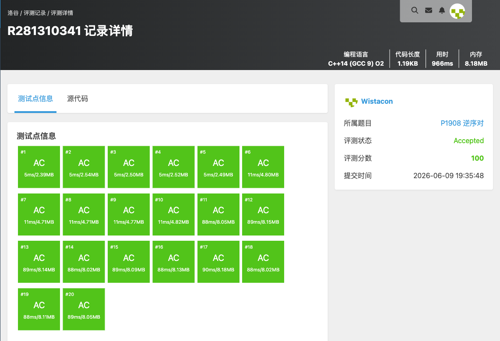

# P1908 逆序对

## 题目信息

题目链接：https://www.luogu.com.cn/problem/P1908

知识点：分治、归并排序

## 题目简述

> 给定一个长度为 $n$ 的序列，统计其中逆序对的数目，即满足 $i<j$ 且 $a_i>a_j$ 的有序对 $(i,j)$ 的个数。序列中可能有重复数字。
>
> 数据范围：$1 \le n \le 5\times 10^5$，$1\le a_i \le 10^9$。
>
> 时间限制：1S，空间限制：128MB。

## 题目分析

### 详细版

**1. 读题**

逆序对即「前面的数比后面的数大」的对数。$n$ 最大 $5\times 10^5$，$O(n^2)$ 暴力枚举约 $2.5\times 10^{11}$ 次，必然超时；题目末尾也提示「应该不会有人 $O(n^2)$ 过 50 万吧」。因此需要 $O(n\log n)$ 的算法。逆序对数最多约 $n^2/2\approx 1.25\times 10^{11}$，必须用 `long long` 存储。

**2. 性质观察**

逆序对的统计可以借助**归并排序**完成。归并排序在合并两个有序子数组时，左半 $[l,mid]$ 与右半 $[mid+1,r]$ 都已有序。当合并指针发现右半的元素 `a[rr]` 小于左半的元素 `a[ll]` 时，由于左半从 `ll` 到 `mid` 都 $\ge a[ll] > a[rr]$，这些元素都与 `a[rr]` 构成逆序对，一次性贡献 `mid - ll + 1` 个逆序对。

**3. 数据结构与算法选择**

- 使用数组存储序列；
- 使用归并排序的分治框架，在「合并」步骤中累加逆序对计数；
- 计数变量 `ans` 用 `long long`。

**4. 程序设计**

`msort(left, right)` 的执行过程：

1. **边界**：`left >= right` 时区间内不足两个元素，直接返回；
2. **分治**：取中点 `mid`，递归排序左右两半；
3. **合并**：双指针 `ll`、`rr` 分别指向左右两半，逐个取较小者放入临时数组；当取右半元素时，累加 `ans += mid - ll + 1`；最后将临时数组写回原数组。

主函数读入序列后调用 `msort(0, n-1)`，输出 `ans`。

**5. 时空复杂度分析**

归并排序时间复杂度 $O(n\log n)$，临时数组占用 $O(n)$ 额外空间，递归深度 $O(\log n)$。$n=5\times 10^5$ 时约 $10^7$ 级别运算，可以通过。

### 省流版

逆序对经典做法：归并排序。合并两个有序段时，每次从右半取出一个元素，就说明左半剩余的 `mid-ll+1` 个元素都比它大，累加进答案。时间复杂度 $O(n\log n)$，答案用 `long long`。

## 代码实现



```cpp
#include <stdio.h>
#include <stdlib.h>
#include <string.h>
#include <vector>
#include <list>
#include <map>
#include <set>
#include <queue>
#include <stack>
#include <string>
#include <algorithm>
#include <ext/pb_ds/assoc_container.hpp>
#include <ext/pb_ds/tree_policy.hpp>

using namespace std;

long nums[500010];
long tmp[500010];
long long ans = 0;

void msort(int left, int right){
	if(left >= right){
		return;
	}

	int mid = left + right;
	mid = mid >> 1;

	msort(left, mid);
	msort(mid + 1, right);

	int tmplo = 0;
	int ll, rr;
	for(ll = left, rr = mid + 1; ll <= mid && rr <= right;){
		if(nums[ll] <= nums[rr]){
			tmp[tmplo] = nums[ll];
			ll++;
			tmplo++;
		}else{
			tmp[tmplo] = nums[rr];
			rr++;
			tmplo++;
			ans += mid - ll + 1; // 加上左边数组的数量
		}
	}
	while(ll <= mid){
		tmp[tmplo] = nums[ll];
		ll++;
		tmplo++;
	}
	while(rr <= right){
		tmp[tmplo] = nums[rr];
		rr++;
		tmplo++;
	}

	tmplo = 0;
	for(int i = left; i <= mid; i++){
		nums[i] = tmp[tmplo];
		tmplo++;
	}
	for(int j = mid + 1; j <= right; j++){
		nums[j] = tmp[tmplo];
		tmplo++;
	}

	return;
}

int main(){
	int n;
	scanf("%d", &n);
	for(int i = 0; i < n; i++){
		scanf("%ld", &nums[i]);
	}

	msort(0, n - 1);
	printf("%lld\n", ans);
}
```

## 代码链接

代码发布于：https://github.com/Flutter-Misdreavus/csu_algorithm
