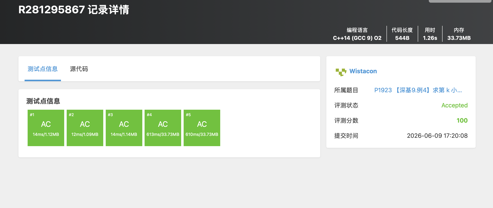

# P1923 【深基9.例4】求第 k 小的数

## 题目信息

题目链接：https://www.luogu.com.cn/problem/P1923

知识点：分治法、快速选择、堆、第 k 小数

## 题目简述

> 输入 $n$ 个数字 $a_i$，输出这些数字中第 $k$ 小的数。最小的数是第 0 小。
>
> 数据范围：$1 \le a_i \lt 10^9$，$1 \le n \lt 5 \times 10^6$，且 $n$ 为奇数。
>
> 时间限制：2s，空间限制：125MB。

## 题目分析

### 详细版

**1. 读题**

本题要求从 $n$ 个数中找出第 $k$ 小的数。注意题目规定最小的数是第 0 小，因此第 $k$ 小对应排序后下标为 $k$ 的元素（从 0 开始计数）。

**2. 朴素做法的问题**

最朴素的做法是先对 $n$ 个数排序，然后直接输出第 $k$ 个。排序时间复杂度为 $O(n \log n)$，对于 $n \lt 5 \times 10^6$ 的数据规模，虽然可以通过，但题目更强调练习分治思想。

**3. 分治算法：快速选择（Quick Select）**

快速选择算法是快速排序的变种，用于在 $O(n)$ 平均时间复杂度内找到第 $k$ 小的元素。

核心思想：
- 选定一个基准值（pivot），将数组划分为三部分：小于 pivot、等于 pivot、大于 pivot。
- 根据 $k$ 与三部分元素个数的关系，决定递归处理哪一部分：
  - 如果 $k$ 落在小于 pivot 的部分，则在该部分继续查找第 $k$ 小。
  - 如果 $k$ 落在等于 pivot 的部分，则 pivot 就是答案。
  - 如果 $k$ 落在大于 pivot 的部分，则在该部分查找第 $k - \text{小于部分大小} - \text{等于部分大小}$ 小的元素。

平均时间复杂度为 $O(n)$，最坏情况下为 $O(n^2)$，但可以通过随机化 pivot 来避免最坏情况。

**4. 代码实现中的堆做法**

本代码采用了一种更简洁的做法：维护一个小根堆，将所有数入堆，然后弹出前 $k$ 个元素，此时堆顶就是第 $k$ 小的数。

- 入堆操作：$O(n \log n)$
- 弹出 $k$ 次：$O(k \log n)$
- 总复杂度：$O((n + k) \log n)$

虽然题目提示尽量不要使用 `nth_element`，但使用优先队列是另一种可行的实现方式，同样能够 AC。

**5. 程序设计**

- 读入 $n, k$。
- 读入 $n$ 个数字，依次加入小根堆。
- 循环 $k$ 次，每次弹出堆顶。
- 输出当前堆顶。

**6. 时空复杂度分析**

时间复杂度：$O((n + k) \log n)$。所有元素入堆需要 $O(n \log n)$，弹出 $k$ 次需要 $O(k \log n)$。

空间复杂度：$O(n)$，优先队列需要存储所有 $n$ 个元素。

### 省流版

将所有数字放入小根堆，弹出前 $k$ 个元素后，堆顶即为第 $k$ 小的数。也可以用快速选择算法在平均 $O(n)$ 时间内解决。

## 代码实现



```cpp
#include <stdio.h>
#include <stdlib.h>
#include <string.h>
#include <vector>
#include <list>
#include <map>
#include <set>
#include <queue>
#include <stack>
#include <string>
#include <algorithm>
#include <ext/pb_ds/assoc_container.hpp>
#include <ext/pb_ds/tree_policy.hpp>

using namespace std;

priority_queue<int, vector<int>, greater<int>> pd;

int main(){
    int n, k;
    int x;
    scanf("%d%d", &n, &k);
    for(int i = 0; i < n; i++){
        scanf("%d", &x);
        pd.push(x);
    }

    for(int i = 0; i < k; i++){
        pd.pop();
    }

    printf("%d\n", pd.top());
}
```

## 代码链接

代码发布于：https://github.com/Flutter-Misdreavus/csu_algorithm
