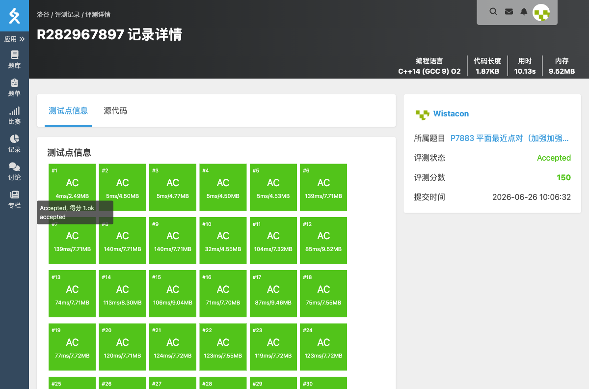

# P7883 平面最近点对（加强加强版）

## 题目信息

- **题目链接**：https://www.luogu.com.cn/problem/P7883
- **知识点**：分治、平面最近点对
- **时间限制**：350ms
- **内存限制**：256MB

## 题目简述

> 给定平面上 $n$ 个整点，求距离最近的两个点的距离的平方。> 
> 数据范围：$2 \le n \le 4 \times 10^5$，$-10^7 \le x_i,y_i \le 10^7$。

## 题目分析

### 详细版

**1. 读题**

暴力 $O(n^2)$ 枚举显然不可行，需要用平面最近点对的经典分治算法，时间复杂度 $O(n \log n)$。

**2. 算法思想**

- 先把所有点按 $x$ 坐标排序。
- 递归地把点集分成左右两半，分别求出左右两半内部的最小距离平方 $d$。
- 合并时只需考虑跨越左右分界线、且 $x$ 坐标与分界线距离小于 $\sqrt{d}$ 的带状区域内的点。
- 把这个带状区域内的点按 $y$ 坐标排序，对每个点只需检查其后 $y$ 方向距离小于 $\sqrt{d}$ 的常数个点。

**3. 关键实现细节**

- 递归返回前，把当前区间按 $y$ 坐标排好序，方便父层用 `merge` 合并，避免每层 $O(n \log n)$ 排序。
- 分界线的 $x$ 坐标必须在递归前、当前区间仍按 $x$ 排序时保存，不能在递归后（已按 $y$ 排序）再取 `p[mid].x`。
- 为了避免浮点误差，全程使用距离平方进行比较。

**4. 程序设计**

- 读入 $n$ 和 $n$ 个点。
- 按 $x$ 坐标排序后进入分治。
- 递归函数返回当前区间的最近距离平方，并保证当前区间已按 $y$ 坐标有序。
- 最后输出答案。

**5. 时空复杂度分析**

- 时间复杂度：$O(n \log n)$。
- 空间复杂度：$O(n)$。

### 省流版

按 $x$ 分治求最近点对，合并时检查跨越中线且 $y$ 方向接近的常数个点；注意在递归前保存中线的 $x$ 坐标。

## 代码实现



```cpp
// P7883 平面最近点对（加强加强版）
/*
链接：https://www.luogu.com.cn/problem/P7883
知识点：分治、平面最近点对
*/
#include <stdio.h>
#include <stdlib.h>
#include <string.h>
#include <math.h>
#include <stack>
#include <string>
#include <queue>
#include <vector>
#include <list>
#include <map>
#include <set>
#include <algorithm>
#include <ext/pb_ds/assoc_container.hpp>
#include <ext/pb_ds/tree_policy.hpp>

using namespace std;

struct Point{
	int x, y;
};

Point p[400005];
Point tmp[400005];
Point t2[400005];

bool cmpx(Point a, Point b){
	if(a.x != b.x) return a.x < b.x;
	return a.y < b.y;
}

bool cmpy(Point a, Point b){
	if(a.y != b.y) return a.y < b.y;
	return a.x < b.x;
}

inline long long dist2(Point a, Point b){
	long long dx = (long long)a.x - b.x;
	long long dy = (long long)a.y - b.y;
	return dx * dx + dy * dy;
}

long long guibing(int left, int right){
	if(left >= right){
		return (1LL << 62);
	}

	if(right - left <= 3){
		long long d = (1LL << 62);
		for(int i = left; i <= right; i++){
			for(int j = i + 1; j <= right; j++){
				d = min(d, dist2(p[i], p[j]));
			}
		}
		sort(p + left, p + right + 1, cmpy);
		return d;
	}

	int mid = (left + right) >> 1;
	int midx = p[mid].x;
	long long d = min(guibing(left, mid), guibing(mid + 1, right));

	merge(p + left, p + mid + 1, p + mid + 1, p + right + 1, tmp, cmpy);
	for(int i = left; i <= right; i++){
		p[i] = tmp[i - left];
	}

	int cnt = 0;
	for(int i = left; i <= right; i++){
		long long dx = (long long)p[i].x - midx;
		if(dx * dx < d){
			t2[cnt++] = p[i];
		}
	}

	for(int i = 0; i < cnt; i++){
		for(int j = i + 1; j < cnt; j++){
			long long dy = (long long)t2[j].y - t2[i].y;
			if(dy * dy >= d){
				break;
			}
			d = min(d, dist2(t2[i], t2[j]));
		}
	}

	return d;
}

int main(){
	int n;
	scanf("%d", &n);
	for(int i = 0; i < n; i++){
		scanf("%d%d", &p[i].x, &p[i].y);
	}

	sort(p, p + n, cmpx);
	long long ans = guibing(0, n - 1);
	printf("%lld\n", ans);
}
```

## 代码链接

代码发布于：https://github.com/Flutter-Misdreavus/csu_algorithm
