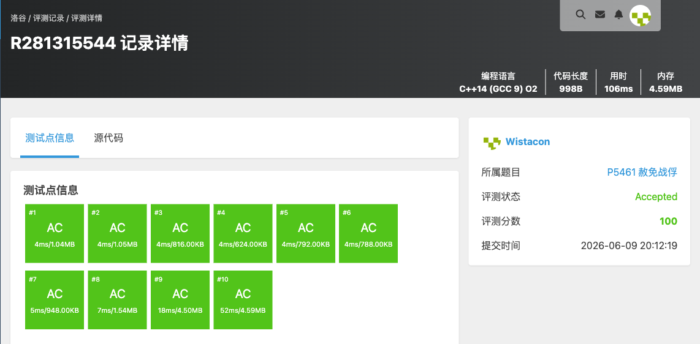

# 算法分析与设计练习题（二）— 完整题目解析报告

## 一、题单概述

### 1.1 题单信息

- **对应章节**：第 4 章减治法、第 5 章分治法及相关拓展专题
- **题目总数**：16 道
- **核心算法思想**：分治、递归、归并排序、DFS 枚举、快速选择、拓扑排序、二分答案、平面最近点对、凸包

### 1.2 知识点总览

| 题号 | 题目名称 | 核心知识点 | 难度 |
|------|----------|-----------|------|
| P12890 | [蓝桥杯 2025 国 Java B] 道具摆放 | 分治、归并排序求逆序对、奇偶性分析 | 中等 |
| P1429 | 平面最近点对（加强版） | 分治、计算几何、归并排序 | 困难 |
| P1498 | [NOIP 2004 普及组] 南蛮图腾 | 递归、分形图形绘制 | 简单 |
| P1706 | 全排列问题 | DFS、回溯、枚举 | 简单 |
| P1908 | 逆序对 | 分治、归并排序 | 中等 |
| P1923 | 【深基9.例4】求第 k 小的数 | 分治法、快速选择、堆 | 中等 |
| P5461 | 赦免战俘 | 分治、递归 | 简单 |
| B3644 | 【模板】拓扑排序 / 家谱树 | 拓扑排序、Kahn 算法 | 简单 |
| P1038 | [NOIP 2003 提高组] 神经网络 | 拓扑排序、模拟 | 中等 |
| P13956 | [ICPC 2023 Nanjing R] 等价重写 | 拓扑排序、构造 | 困难 |
| P2440 | 木材加工 | 二分答案 | 简单 |
| P2678 | [NOIP 2015 提高组] 跳石头 | 二分答案、贪心 | 中等 |
| P1024 | [NOIP 2001 提高组] 一元三次方程求解 | 二分法、枚举 | 简单 |
| P7883 | 平面最近点对（加强加强版） | 分治、平面最近点对 | 困难 |
| P2742 | 【模板】二维凸包 / [USACO5.1] 圈奶牛 | 凸包、Andrew 算法 | 中等 |

### 1.3 题单知识图谱

本题单围绕**分治法**、**减治法**及相关拓展算法展开：
- **分治框架**：归并排序（P1908、P12890）、最近点对（P1429、P7883）、递归分形（P1498、P5461）
- **减治思想**：快速选择（P1923）、DFS 枚举（P1706）
- **拓扑排序**：Kahn 算法（B3644）、拓扑序模拟（P1038）、构造排列（P13956）
- **二分答案**：整数二分（P2440）、二分答案 + 贪心判定（P2678）
- **数值算法**：二分法求根（P1024）
- **计算几何**：凸包（P2742）
- **数学分析**：逆序对与奇偶性（P12890）

分治的核心是“分而治之”：将大问题分解为规模更小的子问题，递归求解后合并结果。本题单中反复出现的归并排序是分治算法的典型代表。

---

## 二、逐题解析

### 2.1 P12890 [蓝桥杯 2025 国 Java B] 道具摆放

**题目链接**：https://www.luogu.com.cn/problem/P12890

**知识点**：分治、归并排序求逆序对、数学（奇偶性分析）

**题目简述**：

> 给定 $1\sim N$ 的一个排列 $P$，每次操作可交换相邻两个元素，目标是把排列还原成升序 $1,2,\ldots,N$。要求**最终的交换次数恰好是 $M$ 的整数倍**，求满足该限制的最少交换次数；若不可能则输出 $-1$。
>
> 数据范围：$1 \le N \le 10^5$，$1 \le M \le 10^9$，$P$ 是 $1\sim N$ 的排列。

#### 详细分析

**1. 读题**

把排列通过相邻交换还原成升序，最少交换次数是一个经典结论；但本题额外要求交换次数是 $M$ 的倍数，因此要在「最少次数」的基础上分析还能凑出哪些次数。

**2. 性质观察**

- **关键结论一**：把一个排列通过相邻交换排成升序，最少交换次数恰好等于该排列的**逆序对数** $inv$。
- **关键结论二**：除了 $inv$ 次，我们还可以「做无用功」——任选相邻两个元素交换两次即可回到原状态，每次这样浪费会使总次数 $+2$。因此**所有可达的交换次数恰好是 $\{inv, inv+2, inv+4, \ldots\}$**，即所有 $\ge inv$ 且与 $inv$ **奇偶性相同**的整数。

于是问题转化为：求最小的 $X$，满足 $X$ 是 $M$ 的倍数、$X \ge inv$、且 $X \equiv inv \pmod 2$。

- 若 $inv=0$，答案为 $0$；
- 若 $inv$ 为偶数：需要 $M$ 的偶数倍。若 $M$ 为偶数，任意倍数都是偶数，取 $\ge inv$ 的最小倍数；若 $M$ 为奇数，则需步长 $2M$ 才能保证偶数，取 $\ge inv$ 的最小 $2M$ 倍数；
- 若 $inv$ 为奇数、$M$ 为偶数：$M$ 的倍数全为偶数，无法得到奇数，输出 $-1$；
- 若 $inv$ 为奇数、$M$ 为奇数：奇数倍 $M,3M,5M,\ldots$ 才是奇数，以 $2M$ 为步长从 $M$ 开始找 $\ge inv$ 的最小值。

**3. 数据结构与算法选择**

- 用**归并排序**在 $O(N\log N)$ 内求逆序对数 $inv$（用 `long long` 防溢出，$inv$ 最大约 $5\times 10^9$）；
- 之后按上面的奇偶性分类讨论，循环累加求最小合法倍数。

**4. 程序设计**

1. 读入排列，归并排序统计 `inx`（逆序对数）；
2. 按 `inx` 与 `m` 的奇偶性分四类讨论：
   - `inx == 0` → 输出 `0`；
   - `inx` 偶：若 `m` 为奇则令 `m <<= 1`，从 `m` 开始按步长 `m` 累加到第一个 $\ge inx$ 的值；
   - `inx` 奇且 `m` 偶 → 输出 `-1`；
   - `inx` 奇且 `m` 奇：以 `2m` 为步长、从 `m` 起累加到第一个 $\ge inx$ 的值。

**5. 时空复杂度分析**

求逆序对 $O(N\log N)$，分类讨论里的循环最多执行 $inv/M$ 次，整体可视为 $O(N\log N)$，空间 $O(N)$。$N=10^5$ 可轻松通过。

#### 省流版

最少相邻交换次数 = 逆序对数 $inv$，且额外两两交换可使次数 $+2$，故可达次数为所有 $\ge inv$ 且与 $inv$ 同奇偶的数。归并排序求 $inv$ 后，按 $inv$、$M$ 的奇偶分类，找最小的、奇偶匹配的 $M$ 的倍数；奇偶冲突（$inv$ 奇、$M$ 偶）时输出 $-1$。时间复杂度 $O(N\log N)$。

#### 代码实现


```cpp
#include <stdio.h>
#include <stdlib.h>
#include <string.h>
#include <stack>
#include <queue>
#include <string>
#include <list>
#include <map>
#include <set>
#include <algorithm>
#include <ext/pb_ds/assoc_container.hpp>
#include <ext/pb_ds/tree_policy.hpp>

using namespace std;

int box[100005];
int tmp[100005];
long long int inx = 0;

void msort(int left, int right){
	if(left >= right){
		return;
	}

	int mid = left + right;
	mid >>= 1;

	msort(left, mid);
	msort(mid + 1, right);

	int tmpf = 0;
	int ll = left, rr = mid + 1;
	while(ll <= mid && rr <= right){
		if(box[ll] <= box[rr]){
			tmp[tmpf] = box[ll];
			tmpf++;
			ll++;
		}else{
			tmp[tmpf] = box[rr];
			inx += mid - ll + 1;
			tmpf++;
			rr++;
		}
	}

	while(ll <= mid){
		tmp[tmpf] = box[ll];
		tmpf++;
		ll++;
	}
	while(rr <= right){
		tmp[tmpf] = box[rr];
		tmpf++;
		rr++;
	}

	for(int i = left; i <= right; i++){
		box[i] = tmp[i - left];
	}

	return;
}

int main(){
	int n, m;
	long long int ans;

	scanf("%d%d", &n, &m);
	for(int i = 0; i < n; i++){
		scanf("%d", &box[i]);
	}

	msort(0, n - 1);

	if(inx == 0){
		printf("0\n");
	}else if((inx & 1) == 0){
		if((m & 1) != 0){
			m <<= 1;
		}
		ans = m;
		while(ans < inx){
			ans += m;
		}
		printf("%lld\n", ans);
	}else if(((inx & 1 )!= 0) && ((m & 1) == 0)){
		printf("-1\n");
	}else{
		ans = m;
		m <<= 1;
		while(ans < inx){
			ans += m;
		}
		printf("%lld\n", ans);
	}
}
```


---

### 2.2 P1429 平面最近点对（加强版）

**题目链接**：https://www.luogu.com.cn/problem/P1429

**知识点**：分治、计算几何、归并排序

**题目简述**：

> 给定平面上 $n$ 个点，求所有点对中的最小欧几里得距离，精确到小数点后 4 位。
>
> 数据范围：$2 \le n \le 2\times 10^5$，$0\le x,y \le 10^9$。

#### 详细分析

**1. 读题**

平面最近点对问题。相比 P1257（$n\le 10^4$），本加强版 $n$ 达到 $2\times 10^5$，$O(n^2)$ 暴力约 $4\times 10^{10}$ 次，无法通过，必须使用分治求解，并把合并步骤的排序优化掉。

**2. 性质观察**

经典分治思路：用竖直中线把点集分成左右两半，最近点对要么落在左半、要么落在右半、要么横跨中线。设左右递归得到的最小距离为 $d$，则横跨中线的点对，两点横坐标距中线都不超过 $d$；把这些点按 $y$ 排序后，每个点只需与其后纵坐标差不超过 $d$ 的若干个点比较（鸽巢原理保证常数个）。

**关键优化**：若每层合并都对条带重新 `sort` 按 $y$ 排序，复杂度是 $O(n\log^2 n)$。本代码借助 `merge` 把子问题已经按 $y$ 有序的结果**归并**起来，使整个点集在递归返回时即按 $y$ 有序，从而把合并降到线性，总复杂度 $O(n\log n)$。

**3. 数据结构与算法选择**

- 结构体 `Point{x,y}` 存点，`cmpx`/`cmpy` 两个比较器；
- 主函数先按 $x$ 排序；
- 递归 `guibing(left,right)`：小区间（$\le 4$ 个点）暴力并按 $y$ 排序返回；否则递归左右两半取 $d$，用 `merge` 把两半按 $y$ 归并，再在宽度 $2d$ 的条带内做有限比较；
- 坐标差用 `long long` 计算平方避免溢出。

**4. 程序设计**

`guibing(left, right)`：

1. 区间元素 $\le 1$ 返回极大值；$\le 4$ 时两两暴力求 $d$，并 `sort` 按 $y$ 排序后返回；
2. 取中点 `mid`，记录中线横坐标 `midx`，递归得 $d=\min$；
3. `merge` 左右两半（已各自按 $y$ 有序）到 `tmp`，写回，使 $[left,right]$ 按 $y$ 有序；
4. 收集横坐标距中线 $<d$ 的点到 `tmp`，对每个点向后比较，纵坐标差 $>d$ 即 `break`，更新 $d$；
5. 返回 $d$。

**5. 时空复杂度分析**

借助归并维护 $y$ 序，每层合并 $O(n)$，递归 $O(\log n)$ 层，总时间 $O(n\log n)$；空间 $O(n)$。$n=2\times 10^5$ 可以通过。

#### 省流版

分治求平面最近点对的加强版。按 $x$ 排序后递归分割，合并时只检查横坐标距中线 $<d$ 的点，按 $y$ 排序后每点只与后面纵坐标差 $\le d$ 的常数个点比较。用 `merge` 在递归回溯时维护全局 $y$ 有序，省去每层重排，复杂度由 $O(n\log^2 n)$ 降到 $O(n\log n)$。

#### 代码实现


```cpp
#include <stdio.h>
#include <stdlib.h>
#include <string.h>
#include <math.h>
#include <stack>
#include <queue>
#include <vector>
#include <list>
#include <map>
#include <set>
#include <algorithm>
#include <ext/pb_ds/assoc_container.hpp>
#include <ext/pb_ds/tree_policy.hpp>

using namespace std;

struct Point
{
	int x;
	int y;
};

Point p[200005];
Point tmp[200005];

bool cmpx(Point a, Point b) {
    return a.x < b.x;
}
bool cmpy(Point a, Point b){
	return a.y < b.y;
}

double dist(Point a, Point b){
	long long int x = a.x - b.x;
	long long int y = a.y - b.y;
	x *= x;
	y *= y;
	return sqrt(x + y);
}

double guibing(int left, int right){
	if(left >= right){
		return 1e100;
	}

	double d = 1e100;
	if(right - left <= 3){
		for(int i = left; i < right; i++){
			for(int j = i + 1; j <= right; j++){
				d = min(d, dist(p[i], p[j]));
			}
		}
		sort(p + left, p + right + 1, cmpy);
		return d;
	}

	int mid = left + right;
	mid >>= 1;
	int midx = p[mid].x;
	d = min(guibing(left, mid), guibing(mid + 1, right));

	merge(p + left, p + mid + 1, p + mid + 1, p + right + 1, tmp, cmpy);
	for(int i = left; i <= right; i++){
		p[i] = tmp[i - left];
	}

	int count = 0;
	for(int i = left; i <= right; i++){
		if(fabs(midx - p[i].x) < d){
			tmp[count] = p[i];
			count++;
		}
	}

	for(int i = 0; i < count; i++){
		for(int j = i + 1; j < count; j++){
			if(tmp[j].y - tmp[i].y > d){
				break;
			}
			d = min(d, dist(tmp[i], tmp[j]));
		}
	}

	return d;
}

int main(){
	int n;
	double d;

	scanf("%d", &n);
	for(int i = 0; i < n; i++){
		scanf("%d%d", &p[i].x, &p[i].y);
	}
	sort(p, p + n, cmpx);
	d = guibing(0, n - 1);
	printf("%.4lf\n", d);
}
```


---

### 2.3 P1498 [NOIP 2004 普及组] 南蛮图腾

**题目链接**：https://www.luogu.com.cn/problem/P1498

**知识点**：递归、分形图形绘制

**题目简述**：

> 给定一个正整数 n（1 ≤ n ≤ 10），参考输出样例，输出一个分形图腾图形。
>
> 该图形由基本的三角形图块递归构成。

#### 详细分析

本题要求绘制一个分形图腾图形，观察输出样例可以发现，这是一个典型的递归分形问题。

**关键性质观察**：
- 当 n = 1 时，图形为最基本的三角形，由两行组成：
  ```
   /\
  /__\
  ```
- 当 n > 1 时，图形由三个 n-1 阶图形拼成：
  - 左上角：一个 n-1 阶图形
  - 右上角：一个 n-1 阶图形
  - 下方：一个 n-1 阶图形，占据左半部分

**递归思想**：
将 n 阶图腾看作由三个 (n-1) 阶图腾组成：
1. 左上角的 (n-1) 阶图腾向右偏移 $2^{n-1}$ 个单位
2. 右上角的 (n-1) 阶图腾向右偏移 $2^n$ 个单位
3. 下方的 (n-1) 阶图腾向下偏移 $2^{n-1}$ 个单位，向右偏移 $2^{n-1}$ 个单位

**基本图形（rank = 1）**：
```
  /\
 /__\
```
占用 2 行 4 列。

**递归绘制函数设计**：
```cpp
void draw(int x, int y, int rank)
```
参数说明：
- x, y: 起始坐标
- rank: 当前阶数

当 rank == 1 时，直接绘制基本图形；
当 rank > 1 时，递归调用三次 draw 函数绘制三个子图形。

**坐标计算**：
- $2^{rank-1}$ 可以用位运算 `1 << (rank-1)` 表示
- 左上角子图腾偏移：x 不变，y + $2^{rank-1}$
- 右上角子图腾偏移：x + $2^{rank-1}$，y + $2^rank$
- 下方子图腾偏移：x + $2^{rank-1}$，y + $2^{rank-1}$

**时空复杂度分析**：
- 时间复杂度：$O(2^n \times 2^n)$，因为最终图形的大小为 $2^{n-1}$ 行 $\times 2^n$ 列，每个位置最多被访问常数次
- 空间复杂度：$O(2^n \times 2^n)$，使用字符数组存储整个图形

#### 省流版

本题是递归绘制分形图腾。n 阶图腾由三个 n-1 阶图腾组成：左上、右上各一个，下方一个。基本图形（rank=1）是一个三角形，占2行4列。递归终止条件为 rank==1，直接绘制基本图形；否则递归调用三次绘制三个子图形。最终图形大小为 $2^{n-1}$ 行 $\times 2^n$ 列，时间和空间复杂度均为 $O(2^n \times 2^n)$。

#### 代码实现


```cpp
//P1498 南蛮图腾
/*
链接：https://www.luogu.com.cn/problem/P1498
知识点：递归、分形图形绘制
*/
#include <stdio.h>
#include <stdlib.h>
#include <string.h>
#include <algorithm>
#include <stack>
#include <queue>

using namespace std;

char tu[2048][2048];

void draw(int x, int y, int rank){
    if(rank == 1){
        // 如果阶数为1，直接画
        tu[x][y] = ' ';
        tu[x][y+1] = '/';
        tu[x][y+2] = '\\';
        tu[x+1][y] = '/';
        tu[x+1][y+1] = '_';
        tu[x+1][y+2] = '_';
        tu[x+1][y+3] = '\\';

        return;
    }

    // 如果阶数不是1，递归调用
    // 采用位运算提高速度，相当于2的幂
    draw(x, y + (2 << (rank - 2)), rank - 1);
    draw(x + (2 << (rank - 2)), y, rank - 1);
    draw(x + (2 << (rank - 2)), y + (2 << (rank - 1)), rank - 1);

    return;
}

int main(){
    int rank;
    memset(tu, ' ', sizeof(tu));

    scanf("%d", &rank);
    draw(0, 0, rank);

    for(int i = 0; i < (2 << (rank - 1)); i++){
        for(int j = 0; j < (2 << rank); j++){
            printf("%c", tu[i][j]);
        }
        printf("\n");
    }
}
```


---

### 2.4 P1706 全排列问题

**题目链接**：https://www.luogu.com.cn/problem/P1706

**知识点**：深度优先搜索（DFS）、回溯、枚举

**题目简述**：

> 给定整数 $n$，按字典序输出 $1\sim n$ 的所有不重复的全排列，每行一个排列，每个数字占 $5$ 个场宽。
>
> 数据范围：$1 \le n \le 9$。

#### 详细分析

**1. 读题**

题目要求输出 $1\sim n$ 的全部全排列，且要求按**字典序**升序输出。$n\le 9$，全排列共有 $n!\le 362880$ 个，规模很小，直接枚举即可。

**2. 性质观察**

全排列的本质是：在 $n$ 个位置上依次填入互不相同的数字。若我们在每个位置上**按从小到大的顺序**尝试填入还没用过的数字，那么先生成的排列自然满足字典序在前。这正是 DFS + 回溯天然具备的性质——只要每层循环从小到大枚举候选数字，得到的结果就是字典序有序的。

**3. 数据结构与算法选择**

- 用布尔数组 `used[i]` 标记数字 $i$ 是否已被使用；
- 用 `vector<int> nums` 作为当前已填入的排列（栈式增删）；
- 用递归函数 `dfs(n, us)` 表示当前已经填好了 `us` 个位置。

**4. 程序设计**

`dfs(n, us)` 的执行过程：

1. **边界**：当 `us == n` 时，说明排列已填满，按 `%5d` 格式输出 `nums` 中的所有数字并换行，返回；
2. **枚举**：从 $1$ 到 $n$ 顺序枚举数字 $i$，若 `used[i]` 为假，则：
   - 将 $i$ 压入 `nums`，置 `used[i]=true`；
   - 递归 `dfs(n, us+1)`；
   - 回溯：弹出 $i$，置 `used[i]=false`，恢复现场以便枚举下一个数字。

由于内层循环始终从小到大枚举，输出天然按字典序排列。

**5. 时空复杂度分析**

共有 $n!$ 个排列，每个排列需要 $O(n)$ 的时间输出，故时间复杂度为 $O(n\cdot n!)$；递归深度为 $O(n)$，`used` 与 `nums` 均为 $O(n)$，空间复杂度 $O(n)$。$n\le 9$ 时完全可以通过。

#### 省流版

DFS + 回溯枚举全排列。`used` 标记数字是否用过，每层从小到大枚举未使用的数字填入，填满 $n$ 个即输出。内层从小到大枚举保证输出天然满足字典序。时间复杂度 $O(n\cdot n!)$。

#### 代码实现


```cpp
#include <stdio.h>
#include <stdlib.h>
#include <string.h>
#include <vector>
#include <list>
#include <map>
#include <set>
#include <queue>
#include <stack>
#include <string>
#include <algorithm>
#include <ext/pb_ds/assoc_container.hpp>
#include <ext/pb_ds/tree_policy.hpp>

using namespace std;

bool used[10];
vector<int> nums;

void dfs(int n, int us){
	if(n == us){
		for(auto& it : nums){
			printf("%5d", it);
		}
		printf("\n");
		return;
	}

	for(int i = 1; i <= n; i++){
		if(!used[i]){
			nums.push_back(i);
			used[i] = true;
			dfs(n, us + 1);
			used[i] = false;
			nums.pop_back();
		}
	}

	return;
}

int main(){
	int n;
	scanf("%d", &n);
	memset(used, 0, sizeof(used));

	dfs(n, 0);
}
```


---

### 2.5 P1908 逆序对

**题目链接**：https://www.luogu.com.cn/problem/P1908

**知识点**：分治、归并排序

**题目简述**：

> 给定一个长度为 $n$ 的序列，统计其中逆序对的数目，即满足 $i<j$ 且 $a_i>a_j$ 的有序对 $(i,j)$ 的个数。序列中可能有重复数字。
>
> 数据范围：$1 \le n \le 5\times 10^5$，$1\le a_i \le 10^9$。

#### 详细分析

**1. 读题**

逆序对即「前面的数比后面的数大」的对数。$n$ 最大 $5\times 10^5$，$O(n^2)$ 暴力枚举约 $2.5\times 10^{11}$ 次，必然超时。因此需要 $O(n\log n)$ 的算法。逆序对数最多约 $n^2/2\approx 1.25\times 10^{11}$，必须用 `long long` 存储。

**2. 性质观察**

逆序对的统计可以借助**归并排序**完成。归并排序在合并两个有序子数组时，左半 $[l,mid]$ 与右半 $[mid+1,r]$ 都已有序。当合并指针发现右半的元素 `a[rr]` 小于左半的元素 `a[ll]` 时，由于左半从 `ll` 到 `mid` 都 $\ge a[ll] > a[rr]$，这些元素都与 `a[rr]` 构成逆序对，一次性贡献 `mid - ll + 1` 个逆序对。

**3. 数据结构与算法选择**

- 使用数组存储序列；
- 使用归并排序的分治框架，在「合并」步骤中累加逆序对计数；
- 计数变量 `ans` 用 `long long`。

**4. 程序设计**

`msort(left, right)` 的执行过程：

1. **边界**：`left >= right` 时区间内不足两个元素，直接返回；
2. **分治**：取中点 `mid`，递归排序左右两半；
3. **合并**：双指针 `ll`、`rr` 分别指向左右两半，逐个取较小者放入临时数组；当取右半元素时，累加 `ans += mid - ll + 1`；最后将临时数组写回原数组。

主函数读入序列后调用 `msort(0, n-1)`，输出 `ans`。

**5. 时空复杂度分析**

归并排序时间复杂度 $O(n\log n)$，临时数组占用 $O(n)$ 额外空间，递归深度 $O(\log n)$。$n=5\times 10^5$ 时约 $10^7$ 级别运算，可以通过。

#### 省流版

逆序对经典做法：归并排序。合并两个有序段时，每次从右半取出一个元素，就说明左半剩余的 `mid-ll+1` 个元素都比它大，累加进答案。时间复杂度 $O(n\log n)$，答案用 `long long`。

#### 代码实现


```cpp
#include <stdio.h>
#include <stdlib.h>
#include <string.h>
#include <vector>
#include <list>
#include <map>
#include <set>
#include <queue>
#include <stack>
#include <string>
#include <algorithm>
#include <ext/pb_ds/assoc_container.hpp>
#include <ext/pb_ds/tree_policy.hpp>

using namespace std;

long nums[500010];
long tmp[500010];
long long ans = 0;

void msort(int left, int right){
	if(left >= right){
		return;
	}

	int mid = left + right;
	mid = mid >> 1;

	msort(left, mid);
	msort(mid + 1, right);

	int tmplo = 0;
	int ll, rr;
	for(ll = left, rr = mid + 1; ll <= mid && rr <= right;){
		if(nums[ll] <= nums[rr]){
			tmp[tmplo] = nums[ll];
			ll++;
			tmplo++;
		}else{
			tmp[tmplo] = nums[rr];
			rr++;
			tmplo++;
			ans += mid - ll + 1; // 加上左边数组的数量
		}
	}
	while(ll <= mid){
		tmp[tmplo] = nums[ll];
		ll++;
		tmplo++;
	}
	while(rr <= right){
		tmp[tmplo] = nums[rr];
		rr++;
		tmplo++;
	}

	tmplo = 0;
	for(int i = left; i <= mid; i++){
		nums[i] = tmp[tmplo];
		tmplo++;
	}
	for(int j = mid + 1; j <= right; j++){
		nums[j] = tmp[tmplo];
		tmplo++;
	}

	return;
}

int main(){
	int n;
	scanf("%d", &n);
	for(int i = 0; i < n; i++){
		scanf("%ld", &nums[i]);
	}

	msort(0, n - 1);
	printf("%lld\n", ans);
}
```


---

### 2.6 P1923 【深基9.例4】求第 k 小的数

**题目链接**：https://www.luogu.com.cn/problem/P1923

**知识点**：分治法、快速选择、堆、第 k 小数

**题目简述**：

> 输入 $n$ 个数字 $a_i$，输出这些数字中第 $k$ 小的数。最小的数是第 0 小。
>
> 数据范围：$1 \le a_i \lt 10^9$，$1 \le n \lt 5 \times 10^6$，且 $n$ 为奇数。

#### 详细分析

**1. 读题**

本题要求从 $n$ 个数中找出第 $k$ 小的数。注意题目规定最小的数是第 0 小，因此第 $k$ 小对应排序后下标为 $k$ 的元素（从 0 开始计数）。

**2. 朴素做法的问题**

最朴素的做法是先对 $n$ 个数排序，然后直接输出第 $k$ 个。排序时间复杂度为 $O(n \log n)$，对于 $n \lt 5 \times 10^6$ 的数据规模，虽然可以通过，但题目更强调练习分治思想。

**3. 分治算法：快速选择（Quick Select）**

快速选择算法是快速排序的变种，用于在 $O(n)$ 平均时间复杂度内找到第 $k$ 小的元素。

核心思想：
- 选定一个基准值（pivot），将数组划分为三部分：小于 pivot、等于 pivot、大于 pivot。
- 根据 $k$ 与三部分元素个数的关系，决定递归处理哪一部分：
  - 如果 $k$ 落在小于 pivot 的部分，则在该部分继续查找第 $k$ 小。
  - 如果 $k$ 落在等于 pivot 的部分，则 pivot 就是答案。
  - 如果 $k$ 落在大于 pivot 的部分，则在该部分查找第 $k - \text{小于部分大小} - \text{等于部分大小}$ 小的元素。

平均时间复杂度为 $O(n)$，最坏情况下为 $O(n^2)$，但可以通过随机化 pivot 来避免最坏情况。

**4. 代码实现中的堆做法**

本代码采用了一种更简洁的做法：维护一个小根堆，将所有数入堆，然后弹出前 $k$ 个元素，此时堆顶就是第 $k$ 小的数。

- 入堆操作：$O(n \log n)$
- 弹出 $k$ 次：$O(k \log n)$
- 总复杂度：$O((n + k) \log n)$

虽然题目提示尽量不要使用 `nth_element`，但使用优先队列是另一种可行的实现方式，同样能够 AC。

**5. 程序设计**

- 读入 $n, k$。
- 读入 $n$ 个数字，依次加入小根堆。
- 循环 $k$ 次，每次弹出堆顶。
- 输出当前堆顶。

**6. 时空复杂度分析**

时间复杂度：$O((n + k) \log n)$。所有元素入堆需要 $O(n \log n)$，弹出 $k$ 次需要 $O(k \log n)$。

空间复杂度：$O(n)$，优先队列需要存储所有 $n$ 个元素。

#### 省流版

将所有数字放入小根堆，弹出前 $k$ 个元素后，堆顶即为第 $k$ 小的数。也可以用快速选择算法在平均 $O(n)$ 时间内解决。

#### 代码实现


```cpp
#include <stdio.h>
#include <stdlib.h>
#include <string.h>
#include <vector>
#include <list>
#include <map>
#include <set>
#include <queue>
#include <stack>
#include <string>
#include <algorithm>
#include <ext/pb_ds/assoc_container.hpp>
#include <ext/pb_ds/tree_policy.hpp>

using namespace std;

priority_queue<int, vector<int>, greater<int>> pd;

int main(){
    int n, k;
    int x;
    scanf("%d%d", &n, &k);
    for(int i = 0; i < n; i++){
        scanf("%d", &x);
        pd.push(x);
    }

    for(int i = 0; i < k; i++){
        pd.pop();
    }

    printf("%d\n", pd.top());
}
```


---

### 2.7 P5461 赦免战俘

**题目链接**：https://www.luogu.com.cn/problem/P5461

**知识点**：分治、递归

**题目简述**：

> 一个 $2^n\times 2^n$ 的方阵（$n\le 10$），将其均分为 $4$ 个子方阵，左上角整块赦免（标 $0$），其余 $3$ 块各自递归地按同样规则处理，直到方阵不可再分。输出最终的 $01$ 矩阵，$0$ 表示赦免，$1$ 表示不赦免。
>
> 数据范围：$n \le 10$，即矩阵边长不超过 $1024$。

#### 详细分析

**1. 读题**

题目本身就是一个明确的递归（分治）定义：把当前正方形分四块，左上块全 $0$，另外三块继续递归，直到边长为 $1$。我们只需把这个过程「翻译」成代码。

**2. 性质观察**

设当前处理的正方形左上角为 $(x_1,y_1)$、边长为 $2^{size}$。它被分成四个边长 $2^{size-1}$ 的子方阵：

- 左上块：整块置 $0$；
- 右上、左下、右下三块：递归处理。

递归边界是 $size=0$（边长 $1$），此时该格不属于任何「左上块」，应置 $1$。

**3. 数据结构与算法选择**

- 二维数组 `ditu[1030][1030]` 存矩阵；
- `draw0(x1,y1,size)`：把以 $(x_1,y_1)$ 为左上角、边长 $2^{size}$ 的方块整体置 $0$；
- `drawz(x1,y1,size)`：递归函数，处理一个边长 $2^{size}$ 的方阵。

**4. 程序设计**

`drawz(x1, y1, size)`：

1. **边界**：`size == 0` 时把 `ditu[x1][y1]=1` 并返回；
2. 令 `size--`，步长 `add = 1<<size`；
3. `draw0(x1, y1, size)` 把左上块整体清零；
4. 对右上 `(x1+add, y1)`、左下 `(x1, y1+add)`、右下 `(x1+add, y1+add)` 三块递归 `drawz`。

主函数读入 $n$，调用 `drawz(0,0,n)`，再按行输出 $2^n\times 2^n$ 矩阵。

**5. 时空复杂度分析**

矩阵规模 $4^n$，每个格子被赋值常数次，时间复杂度 $O(4^n)$（即 $O(\text{矩阵元素总数})$）；空间为矩阵本身 $O(4^n)$。$n\le 10$ 时约 $10^6$，可以通过。

#### 省流版

直接按题意分治：当前正方形分四块，左上块整体置 $0$，其余三块递归；递归到边长 $1$ 时置 $1$。用二维数组存储后整体输出。时间复杂度 $O(4^n)$。

#### 代码实现



```cpp
#include <stdio.h>
#include <stdlib.h>
#include <string.h>
#include <vector>
#include <list>
#include <map>
#include <set>
#include <queue>
#include <stack>
#include <string>
#include <algorithm>
#include <ext/pb_ds/assoc_container.hpp>
#include <ext/pb_ds/tree_policy.hpp>

using namespace std;

int ditu[1030][1030];

void draw0(int x1, int y1, int size){
	int x2 = 1 << size;
	int y2 = 1 << size;
	x2 += x1;
	y2 += y1;

	for(int i = x1; i < x2; i++){
		for(int j = y1; j < y2; j++){
			ditu[i][j] = 0;
		}
	}
}

void drawz(int x1, int y1, int size){
	if(size == 0){
		ditu[x1][y1] = 1;
		return;
	}

	size--;
	int xadd = 1 << size;
	int yadd = 1 << size;

	draw0(x1, y1, size);
	drawz(x1 + xadd, y1, size);
	drawz(x1, y1 + yadd, size);
	drawz(x1 + xadd, y1 + yadd, size);

	return;
}

int main(){
	int n;
	scanf("%d", &n);

	int x2 = 1 << n;
	int y2 = 1 << n;
	drawz(0, 0, n);

	for(int i = 0; i < x2; i++){
		for(int j = 0; j < y2; j++){
			printf("%d ", ditu[i][j]);
		}
		printf("\n");
	}

}
```


---

### 2.8 B3644 【模板】拓扑排序 / 家谱树

**题目链接**：https://www.luogu.com.cn/problem/B3644

**知识点**：拓扑排序、Kahn 算法

**题目简述**：

> 给定 $N$ 个人，第 $i$ 行给出 $i$ 的所有后代编号，以 $0$ 结束。要求输出一个序列，使得每个人的后辈都排在该人之后。
>
> 数据范围：$1 \le N \le 100$。答案不唯一，输出任意一种合法序列即可。

#### 详细分析

**1. 读题**

本题是典型的拓扑排序问题。把「辈分高」的人指向「辈分低」的人，要求输出的序列中所有边都从前往后指。

**2. 性质观察**

- 若 $a$ 是 $b$ 的后代，则 $b$ 必须在 $a$ 之前输出，对应一条有向边 $b \to a$。
- 拓扑排序可以给出满足这种先后顺序的序列。

**3. 数据结构与算法选择**

- **Kahn 算法**：计算每个点的入度，反复取出当前入度为 $0$ 的点加入答案，并将其所有出边删除（邻接点入度减 1）。
- **邻接表**：`vector<int> bian[i]` 存储 $i$ 的所有后代。
- **入度数组 `rudu`**：记录每个点的当前入度。

**4. 程序设计**

- 读入 $N$。
- 对每个人 $i$，读入其后代直到 $0$，建边 $i \to \text{后代}$，并增加后代的入度。
- 将所有入度为 $0$ 的点入队。
- 每次取出一个点加入答案，遍历其出边，将邻接点入度减 1；若入度变为 $0$ 则入队。
- 输出答案序列。

**5. 时空复杂度分析**

- 时间复杂度：$O(N + M)$，其中 $M$ 为总边数（后代关系总数）。
- 空间复杂度：$O(N + M)$。

#### 省流版

把后代关系看作有向边，跑 Kahn 拓扑排序：维护入度，每次取入度为 $0$ 的点加入答案并删去其出边，直到所有点都输出。

#### 代码实现


```cpp
// B3644 【模板】拓扑排序 / 家谱树
/*
链接：https://www.luogu.com.cn/problem/B3644
知识点：拓扑排序、Kahn 算法
*/
#include <stdio.h>
#include <stdlib.h>
#include <string.h>
#include <stack>
#include <string>
#include <queue>
#include <vector>
#include <list>
#include <map>
#include <set>
#include <algorithm>
#include <ext/pb_ds/assoc_container.hpp>
#include <ext/pb_ds/tree_policy.hpp>

using namespace std;

vector<int> bian[105];
int rudu[105];

int main(){
	int n;
	int x;

	scanf("%d", &n);
	for(int i = 1; i <= n; i++){
		while(scanf("%d", &x) && x != 0){
			bian[i].push_back(x);
			rudu[x]++;
		}
	}

	queue<int> q;
	for(int i = 1; i <= n; i++){
		if(rudu[i] == 0){
			q.push(i);
		}
	}

	vector<int> ans;
	while(!q.empty()){
		int u = q.front();
		q.pop();
		ans.push_back(u);

		for(auto &v : bian[u]){
			rudu[v]--;
			if(rudu[v] == 0){
				q.push(v);
			}
		}
	}

	for(int i = 0; i < ans.size(); i++){
		printf("%d", ans[i]);
		if(i != ans.size() - 1){
			printf(" ");
		}
	}
	printf("\n");
}
```


---

### 2.9 P1038 [NOIP 2003 提高组] 神经网络

**题目链接**：https://www.luogu.com.cn/problem/P1038

**知识点**：拓扑排序、模拟

**题目简述**：

> 给定一个由 $n$ 个神经元组成的有向图，每个神经元有状态 $C_i$ 和阈值 $U_i$。输入层神经元状态直接给出；非输入层神经元的状态为
>
> $$C_i = \sum_{(j,i)\in E} W_{ji}C_j - U_i$$
>
> 当 $C_i > 0$ 时，该神经元兴奋并向出边传播信号。求所有输出层神经元中最终状态大于 $0$ 的编号及状态，按编号从小到大输出；若没有则输出 `NULL`。
>
> 数据范围：$1 \le n \le 100$，边权 $|W_{ij}| \le 10^9$。

#### 详细分析

**1. 读题**

题目把神经网络抽象成有向无环图（输入层向输出层单向传递）。输入层神经元没有入边，其余神经元的状态必须由所有前驱神经元的状态加权求和再减去阈值得到。

**2. 性质观察**

- 只有入度为 $0$ 的神经元才是输入层，其初始状态直接给出。
- 非输入层神经元的状态只依赖于其前驱神经元，因此必须等所有前驱计算完毕后才能计算当前神经元。
- 输出层神经元没有出边，即出度为 $0$。
- 最终只输出状态 $>0$ 的输出层神经元。

**3. 数据结构与算法选择**

- **拓扑排序（Kahn 算法）**：保证在计算每个非输入层神经元之前，所有前驱神经元已经计算完毕。
- **邻接表**：`vector<EDGE> bian[i]` 存储神经元 $i$ 的出边及边权。
- **入度数组 `rudu`** 用于拓扑排序；**出度数组 `chudu`** 用于判断输出层；**累加数组 `jia`** 记录前驱对当前神经元的总贡献。

**4. 程序设计**

- 读入 $n,p$ 以及每个神经元的状态和阈值。
- 读入每条边，建边并维护入度、出度。
- 入度为 $0$ 的节点为输入层，入队进行拓扑排序，得到拓扑序。
- 按拓扑序遍历每个神经元：
  - 若非输入层，则 `zhuangtai[u] = jia[u] - yuzhi[u]`。
  - 若状态 $> 0$，遍历其出边，将贡献 `e.w * zhuangtai[u]` 加到后继的 `jia` 中。
- 最后遍历所有出度为 $0$ 且状态 $> 0$ 的神经元，按编号从小到大输出。

**5. 时空复杂度分析**

- 时间复杂度：$O(n + p)$，建图、拓扑排序、模拟各一次。
- 空间复杂度：$O(n + p)$。

#### 省流版

把神经元和带权有向边建图，先跑拓扑排序确定计算顺序；按拓扑序依次求出每个神经元状态，兴奋就向出边传播；最后输出状态为正且没有出边的神经元。

#### 代码实现


```cpp
// P1038 [NOIP 2003 提高组] 神经网络
/*
链接：https://www.luogu.com.cn/problem/P1038
知识点：拓扑排序、模拟
*/
#include <stdio.h>
#include <stdlib.h>
#include <string.h>
#include <stack>
#include <string>
#include <queue>
#include <vector>
#include <list>
#include <map>
#include <set>
#include <algorithm>
#include <ext/pb_ds/assoc_container.hpp>
#include <ext/pb_ds/tree_policy.hpp>

using namespace std;

struct EDGE{
	int to;
	int w;
};

vector<EDGE> bian[105];
int rudu[105];
int chudu[105];
int zhuangtai[105];
int yuzhi[105];
int jia[105]; // 累加来自前驱的贡献
bool shuru[105]; // 是否为输入层

int main(){
	int n, p;
	int a, b, c;

	scanf("%d%d", &n, &p);
	for(int i = 1; i <= n; i++){
		scanf("%d%d", &zhuangtai[i], &yuzhi[i]);
	}

	for(int i = 0; i < p; i++){
		scanf("%d%d%d", &a, &b, &c);
		bian[a].push_back({b, c});
		rudu[b]++;
		chudu[a]++;
	}

	queue<int> q;
	for(int i = 1; i <= n; i++){
		if(rudu[i] == 0){
			shuru[i] = true;
			q.push(i);
		}
	}

	vector<int> topo;
	while(!q.empty()){
		int u = q.front();
		q.pop();
		topo.push_back(u);

		for(auto &e : bian[u]){
			rudu[e.to]--;
			if(rudu[e.to] == 0){
				q.push(e.to);
			}
		}
	}

	for(auto &u : topo){
		if(!shuru[u]){
			// 非输入层节点，状态由前驱贡献与阈值决定
			zhuangtai[u] = jia[u] - yuzhi[u];
		}

		if(zhuangtai[u] > 0){
			for(auto &e : bian[u]){
				jia[e.to] += e.w * zhuangtai[u];
			}
		}
	}

	bool you = false;
	for(int i = 1; i <= n; i++){
		if(chudu[i] == 0 && zhuangtai[i] > 0){
			printf("%d %d\n", i, zhuangtai[i]);
			you = true;
		}
	}

	if(!you){
		printf("NULL\n");
	}
}
```


---

### 2.10 P13956 [ICPC 2023 Nanjing R] 等价重写

**题目链接**：https://www.luogu.com.cn/problem/P13956

**知识点**：拓扑排序、构造

**题目简述**：

> 给定 $T$ 组测试数据。每组数据有一个长度为 $m$ 的初始全 $0$ 序列和 $n$ 个操作，第 $i$ 个操作会把若干位置上的值改为 $i$。按顺序 $1,2,\dots,n$ 执行后得到结果序列 $R$。要求找出一个与恒等排列不同的 $1\sim n$ 的排列 $q$，使得按 $q$ 的顺序执行操作仍得到 $R$；若不存在则输出 `No`。
>
> 数据范围：$1\le n,m\le 10^5$，所有数据的 $(n+m)$ 之和不超过 $2\times 10^6$，所有数据的 $p_i$ 之和不超过 $10^6$。

#### 详细分析

**1. 读题**

原顺序下，序列每个位置的最终值等于覆盖该位置的所有操作中**下标最大**的那个。设 $last[x]$ 表示位置 $x$ 最终的值。

**2. 约束关系**

对于位置 $x$，设 $last[x]=k$，则所有覆盖 $x$ 且编号小于 $k$ 的操作必须在排列中位于 $k$ 之前；否则 $k$ 就不是最后改写 $x$ 的操作。因此每个位置只产生一条约束：覆盖它的所有操作中，除 $k$ 以外的操作都要排在 $k$ 前面。

把所有约束看成一个有向图，边总是从编号较小的点指向编号较大的点，因此该图一定是 DAG，恒等排列本身就是一个合法的拓扑序。

**3. 能否构造另一种排列？**

如果存在相邻的两项 $i$ 和 $i+1$ 之间没有约束边 $i\to i+1$，那么直接把这两项交换，得到的排列仍然满足所有约束（因为其它所有点与它们的相对位置不变，且 $i$ 与 $i+1$ 没有先后要求）。

边 $i\to i+1$ 存在的充要条件是：操作 $i$ 覆盖了某个位置 $x$，且 $last[x]=i+1$。于是只要检查每个 $i\in[1,n-1]$ 是否存在这样的位置即可。

**4. 数据结构与算法选择**

- 直接读入每个操作覆盖的位置，用一个数组 `lastx[x]` 记录位置 $x$ 最后被哪个操作覆盖。
- 再次扫描每个操作 $i$ 中的位置，若发现 `lastx[x] == i+1`，则说明存在边 $i\to i+1$。
- 一旦找到某对 $i,i+1$ 没有这条边，即可输出把 $i$ 与 $i+1$ 交换的排列。

**5. 正确性证明**

- 若找到没有边 $i\to i+1$ 的相邻对，交换后：
  - 对于任意 $k<i$，它在原排列中仍在 $i+1$ 前面，约束满足。
  - 对于任意 $k>i+1$，它在原排列中仍在 $i$ 后面，约束满足。
  - $i$ 与 $i+1$ 无直接约束，交换不产生冲突。
- 若所有相邻对都有边 $i\to i+1$，则对任意 $a<b$ 都存在路径 $a\to a+1\to\dots\to b$，拓扑序唯一，只能是恒等排列，故不存在其它合法排列。

**6. 时空复杂度分析**

- 时间复杂度：$O(\sum p_i)$，即读入与两次扫描的总代价。
- 空间复杂度：$O(n + m + \sum p_i)$。

#### 省流版

每个位置要求覆盖它的操作中编号最大的那个必须在排列中位于其它覆盖者之后。相邻操作 $i$ 和 $i+1$ 若没有“$i$ 覆盖的位置最终值是 $i+1$”这种约束，就可以直接交换；所有相邻对都必须 $i$ 在 $i+1$ 前时答案唯一，输出 `No`。

#### 代码实现


```cpp
// P13956 [ICPC 2023 Nanjing R] 等价重写
/*
链接：https://www.luogu.com.cn/problem/P13956
知识点：拓扑排序、构造
*/
#include <stdio.h>
#include <stdlib.h>
#include <string.h>
#include <stack>
#include <string>
#include <queue>
#include <vector>
#include <list>
#include <map>
#include <set>
#include <algorithm>
#include <ext/pb_ds/assoc_container.hpp>
#include <ext/pb_ds/tree_policy.hpp>

using namespace std;

int lastx[100005];

int main(){
	int T;
	scanf("%d", &T);

	while(T--){
		int n, m;
		scanf("%d%d", &n, &m);

		vector<vector<int> > caozuo(n + 1);
		for(int i = 1; i <= m; i++){
			lastx[i] = 0;
		}

		for(int i = 1; i <= n; i++){
			int p;
			scanf("%d", &p);
			caozuo[i].resize(p);
			for(int j = 0; j < p; j++){
				scanf("%d", &caozuo[i][j]);
				lastx[caozuo[i][j]] = i;
			}
		}

		int pos = -1;
		for(int i = 1; i < n; i++){
			bool you = false;
			for(int j = 0; j < (int)caozuo[i].size(); j++){
				if(lastx[caozuo[i][j]] == i + 1){
					you = true;
					break;
				}
			}
			if(!you){
				pos = i;
				break;
			}
		}

		if(pos == -1){
			printf("No\n");
			continue;
		}

		printf("Yes\n");
		for(int i = 1; i <= n; i++){
			int x;
			if(i == pos){
				x = pos + 1;
			}else if(i == pos + 1){
				x = pos;
			}else{
				x = i;
			}
			printf("%d", x);
			if(i != n){
				printf(" ");
			}
		}
		printf("\n");
	}
}
```


---

### 2.11 P2440 木材加工

**题目链接**：https://www.luogu.com.cn/problem/P2440

**知识点**：二分答案

**题目简述**：

> 有 $n$ 根原木，第 $i$ 根长度为 $L_i$。要把它们切成若干段长度为 $l$ 的小段，总共需要至少 $k$ 段。求 $l$ 的最大值（$l$ 为正整数）；若 $l=1$ 都无法满足，输出 $0$。
>
> 数据范围：$1 \le n \le 10^5$，$1 \le k \le 10^8$，$1 \le L_i \le 10^8$。

#### 详细分析

**1. 读题**

每根原木长度为 $L_i$，若小段长度为 $l$，则该原木可切出 $\lfloor L_i / l \rfloor$ 段。总段数为 $\sum_i \lfloor L_i / l \rfloor$。需要这个总段数不少于 $k$，且让 $l$ 尽可能大。

**2. 单调性**

$l$ 越大，每根原木切出的段数越少，总段数越小。因此存在一个临界值，$l$ 小于等于它时可行，大于它时不可行。具有单调性，适合二分答案。

**3. 数据结构与算法选择**

- **二分答案**：在 $[1, \max(L_i)]$ 上二分，寻找满足总段数 $\ge k$ 的最大 $l$。
- **判定函数**：给定 $mid$，$O(n)$ 计算总段数，与 $k$ 比较。

**4. 程序设计**

- 读入 $n,k$ 和每根原木长度，记录最大长度 `maxL`。
- 二分区间 `[1, maxL]`，初始化答案 `ans = 0`。
- 每次取中点 `mid`，计算能切出的总段数。
- 若总段数 $\ge k$，说明 `mid` 可行，尝试更大的长度，`ans = mid`，`left = mid + 1`；否则 `right = mid - 1`。
- 输出 `ans`。

**5. 时空复杂度分析**

- 时间复杂度：$O(n \log \max(L_i))$。
- 空间复杂度：$O(n)$。

#### 省流版

二分小段长度 $l$，用 $\sum \lfloor L_i / l \rfloor \ge k$ 判定可行性，取满足条件的最大 $l$。

#### 代码实现


```cpp
// P2440 木材加工
/*
链接：https://www.luogu.com.cn/problem/P2440
知识点：二分答案
*/
#include <stdio.h>
#include <stdlib.h>
#include <string.h>
#include <stack>
#include <string>
#include <queue>
#include <vector>
#include <list>
#include <map>
#include <set>
#include <algorithm>
#include <ext/pb_ds/assoc_container.hpp>
#include <ext/pb_ds/tree_policy.hpp>

using namespace std;

long long yuanmu[100005];

int main(){
	int n;
	long long k;
	scanf("%d%lld", &n, &k);

	long long maxL = 0;
	for(int i = 1; i <= n; i++){
		scanf("%lld", &yuanmu[i]);
		if(yuanmu[i] > maxL){
			maxL = yuanmu[i];
		}
	}

	long long left = 1, right = maxL;
	long long ans = 0;
	while(left <= right){
		long long mid = (left + right) / 2;
		long long cnt = 0;
		for(int i = 1; i <= n; i++){
			cnt += yuanmu[i] / mid;
		}

		if(cnt >= k){
			ans = mid;
			left = mid + 1;
		}else{
			right = mid - 1;
		}
	}

	printf("%lld\n", ans);
}
```


---

### 2.12 P2678 [NOIP 2015 提高组] 跳石头

**题目链接**：https://www.luogu.com.cn/problem/P2678

**知识点**：二分答案、贪心

**题目简述**：

> 河道长 $L$，起点为 $0$，终点为 $L$，中间有 $N$ 块石头，第 $i$ 块石头距离起点 $D_i$（递增）。至多移走 $M$ 块石头，要求剩下的石头（含起点、终点）之间相邻距离的最小值尽可能大，输出这个最大值。
>
> 数据范围：$0 \le M \le N \le 50000$，$1 \le L \le 10^9$。

#### 详细分析

**1. 读题**

要求最大化最短跳跃距离。这是一个典型的“最大值最小化”问题，通常用二分答案解决。

**2. 单调性**

设当前猜测的最短距离为 $d$。若存在一种移走不超过 $M$ 块石头的方案，使得所有相邻保留石头距离都 $\ge d$，则任何 $d' \le d$ 也一定可行；若不存在，则更大的 $d$ 也不可行。因此答案具有单调性。

**3. 判定函数（贪心）**

为了判定 $d$ 是否可行，从起点开始贪心扫描：维护上一块保留的石头位置 `last`。对于每一块石头，若它与 `last` 的距离小于 $d$，则必须移走；否则保留它并更新 `last`。

为了让终点也参与约束，可以把终点 $L$ 看作一块“虚拟石头”。这样最后一块保留石头到终点的距离若小于 $d$，贪心会自动把前面那块真实石头计为被移走，从而保证最终所有相邻距离都满足要求。

**4. 程序设计**

- 读入 $L,N,M$ 和 $N$ 块石头位置，将 $L$ 存入数组末尾。
- 二分答案 $d$，区间 $[1, L]$。
- 对中点 $mid$ 执行贪心判定：
  - 统计需要移走的石头数 `cnt`。
  - 若 `cnt \le M`，说明 $mid$ 可行，尝试更大的 $d$；否则缩小 $d$。
- 输出最大的可行 $d$。

**5. 时空复杂度分析**

- 时间复杂度：$O(N \log L)$。
- 空间复杂度：$O(N)$。

#### 省流版

二分最短跳跃距离 $d$，贪心判断能否通过移走不超过 $M$ 块石头使得所有相邻保留距离都 $\ge d$；把终点当作虚拟石头一起扫描，避免单独处理最后一段。

#### 代码实现


```cpp
// P2678 [NOIP 2015 提高组] 跳石头
/*
链接：https://www.luogu.com.cn/problem/P2678
知识点：二分答案、贪心
*/
#include <stdio.h>
#include <stdlib.h>
#include <string.h>
#include <stack>
#include <string>
#include <queue>
#include <vector>
#include <list>
#include <map>
#include <set>
#include <algorithm>
#include <ext/pb_ds/assoc_container.hpp>
#include <ext/pb_ds/tree_policy.hpp>

using namespace std;

int shitou[50005];

int main(){
	int L, n, m;
	scanf("%d%d%d", &L, &n, &m);

	for(int i = 1; i <= n; i++){
		scanf("%d", &shitou[i]);
	}
	shitou[n + 1] = L;

	int left = 1, right = L;
	int ans = 0;
	while(left <= right){
		int mid = (left + right) / 2;

		int cnt = 0;
		int last = 0;
		for(int i = 1; i <= n + 1; i++){
			if(shitou[i] - last < mid){
				cnt++;
			}else{
				last = shitou[i];
			}
		}

		if(cnt > m){
			right = mid - 1;
		}else{
			ans = mid;
			left = mid + 1;
		}
	}

	printf("%d\n", ans);
}
```


---

### 2.13 P1024 [NOIP 2001 提高组] 一元三次方程求解

**题目链接**：https://www.luogu.com.cn/problem/P1024

**知识点**：二分法、枚举

**题目简述**：

> 给定一元三次方程 $ax^3+bx^2+cx+d=0$ 的四个实系数 $a,b,c,d$。已知该方程有三个不同实根，且根的范围在 $[-100,100]$ 内，相邻两根之差的绝对值 $\ge 1$。请从小到大输出这三个实根，保留两位小数。

#### 详细分析

**1. 读题**

由于根与根之间的距离至少为 $1$，每个长度为 $1$ 的整数区间 $[i,i+1]$ 内至多有一个根。因此可以枚举所有区间，找出包含根的区间后用二分法精确求解。

**2. 找根区间**

对于区间 $[i,i+1]$，计算 $f(i)$ 与 $f(i+1)$：

- 若 $f(i)=0$，则 $i$ 是一个根。
- 若 $f(i)\cdot f(i+1)<0$，由介值定理可知区间内部必有一根。

同时需要单独检查右端点 $100$ 是否为根。

**3. 二分求根**

在含根区间 $[l,r]$ 内反复取中点 $mid$：

- 若 $f(l)$ 与 $f(mid)$ 异号或 $f(mid)=0$，则根在 $[l,mid]$ 内，令 $r=mid$。
- 否则根在 $[mid,r]$ 内，令 $l=mid$。

迭代约 $100$ 次即可使区间长度小于 $10^{-30}$，远超两位小数精度要求。

**4. 程序设计**

- 读入 $a,b,c,d$。
- 枚举 $i=-100\sim 99$，检查每个区间并二分求根。
- 单独判断 $x=100$。
- 将三个根排序后按 `%.2f` 格式输出。

**5. 时空复杂度分析**

- 时间复杂度：$O(200 \times \text{迭代次数})$，常数极小。
- 空间复杂度：$O(1)$。

#### 省流版

利用“根间距 $\ge 1$”的性质，在每个整数区间内二分查找变号点，即可依次得到三个实根。

#### 代码实现


```cpp
// P1024 [NOIP 2001 提高组] 一元三次方程求解
/*
链接：https://www.luogu.com.cn/problem/P1024
知识点：二分法、枚举
*/
#include <stdio.h>
#include <stdlib.h>
#include <string.h>
#include <stack>
#include <string>
#include <queue>
#include <vector>
#include <list>
#include <map>
#include <set>
#include <algorithm>
#include <ext/pb_ds/assoc_container.hpp>
#include <ext/pb_ds/tree_policy.hpp>

using namespace std;

double a, b, c, d;

double f(double x){
	return a * x * x * x + b * x * x + c * x + d;
}

int main(){
	scanf("%lf%lf%lf%lf", &a, &b, &c, &d);

	vector<double> gen;
	for(int i = -100; i < 100; i++){
		double l = i, r = i + 1;
		double fl = f(l), fr = f(r);

		if(fl == 0){
			gen.push_back(l);
		}else if(fl * fr < 0){
			// 二分求根
			double left = l, right = r;
			for(int j = 0; j < 100; j++){
				double mid = (left + right) / 2;
				double fm = f(mid);
				if(f(left) * fm <= 0){
					right = mid;
				}else{
					left = mid;
				}
			}
			gen.push_back(left);
		}
	}

	// 处理右端点 100 处的根
	if(f(100) == 0){
		gen.push_back(100.0);
	}

	sort(gen.begin(), gen.end());

	for(int i = 0; i < 3; i++){
		if(i > 0){
			printf(" ");
		}
		printf("%.2f", gen[i]);
	}
	printf("\n");
}
```


---

### 2.14 P7883 平面最近点对（加强加强版）

**题目链接**：https://www.luogu.com.cn/problem/P7883

**知识点**：分治、平面最近点对

**题目简述**：

> 给定平面上 $n$ 个整点，求距离最近的两个点的距离的平方。
>
> 数据范围：$2 \le n \le 4 \times 10^5$，$-10^7 \le x_i,y_i \le 10^7$。

#### 详细分析

**1. 读题**

暴力 $O(n^2)$ 枚举显然不可行，需要用平面最近点对的经典分治算法，时间复杂度 $O(n \log n)$。

**2. 算法思想**

- 先把所有点按 $x$ 坐标排序。
- 递归地把点集分成左右两半，分别求出左右两半内部的最小距离平方 $d$。
- 合并时只需考虑跨越左右分界线、且 $x$ 坐标与分界线距离小于 $\sqrt{d}$ 的带状区域内的点。
- 把这个带状区域内的点按 $y$ 坐标排序，对每个点只需检查其后 $y$ 方向距离小于 $\sqrt{d}$ 的常数个点。

**3. 关键实现细节**

- 递归返回前，把当前区间按 $y$ 坐标排好序，方便父层用 `merge` 合并，避免每层 $O(n \log n)$ 排序。
- 分界线的 $x$ 坐标必须在递归前、当前区间仍按 $x$ 排序时保存，不能在递归后（已按 $y$ 排序）再取 `p[mid].x`。
- 为了避免浮点误差，全程使用距离平方进行比较。

**4. 程序设计**

- 读入 $n$ 和 $n$ 个点。
- 按 $x$ 坐标排序后进入分治。
- 递归函数返回当前区间的最近距离平方，并保证当前区间已按 $y$ 坐标有序。
- 最后输出答案。

**5. 时空复杂度分析**

- 时间复杂度：$O(n \log n)$。
- 空间复杂度：$O(n)$。

#### 省流版

按 $x$ 分治求最近点对，合并时检查跨越中线且 $y$ 方向接近的常数个点；注意在递归前保存中线的 $x$ 坐标。

#### 代码实现


```cpp
// P7883 平面最近点对（加强加强版）
/*
链接：https://www.luogu.com.cn/problem/P7883
知识点：分治、平面最近点对
*/
#include <stdio.h>
#include <stdlib.h>
#include <string.h>
#include <math.h>
#include <stack>
#include <string>
#include <queue>
#include <vector>
#include <list>
#include <map>
#include <set>
#include <algorithm>
#include <ext/pb_ds/assoc_container.hpp>
#include <ext/pb_ds/tree_policy.hpp>

using namespace std;

struct Point{
	int x, y;
};

Point p[400005];
Point tmp[400005];
Point t2[400005];

bool cmpx(Point a, Point b){
	if(a.x != b.x) return a.x < b.x;
	return a.y < b.y;
}

bool cmpy(Point a, Point b){
	if(a.y != b.y) return a.y < b.y;
	return a.x < b.x;
}

inline long long dist2(Point a, Point b){
	long long dx = (long long)a.x - b.x;
	long long dy = (long long)a.y - b.y;
	return dx * dx + dy * dy;
}

long long guibing(int left, int right){
	if(left >= right){
		return (1LL << 62);
	}

	if(right - left <= 3){
		long long d = (1LL << 62);
		for(int i = left; i <= right; i++){
			for(int j = i + 1; j <= right; j++){
				d = min(d, dist2(p[i], p[j]));
			}
		}
		sort(p + left, p + right + 1, cmpy);
		return d;
	}

	int mid = (left + right) >> 1;
	int midx = p[mid].x;
	long long d = min(guibing(left, mid), guibing(mid + 1, right));

	merge(p + left, p + mid + 1, p + mid + 1, p + right + 1, tmp, cmpy);
	for(int i = left; i <= right; i++){
		p[i] = tmp[i - left];
	}

	int cnt = 0;
	for(int i = left; i <= right; i++){
		long long dx = (long long)p[i].x - midx;
		if(dx * dx < d){
			t2[cnt++] = p[i];
		}
	}

	for(int i = 0; i < cnt; i++){
		for(int j = i + 1; j < cnt; j++){
			long long dy = (long long)t2[j].y - t2[i].y;
			if(dy * dy >= d){
				break;
			}
			d = min(d, dist2(t2[i], t2[j]));
		}
	}

	return d;
}

int main(){
	int n;
	scanf("%d", &n);
	for(int i = 0; i < n; i++){
		scanf("%d%d", &p[i].x, &p[i].y);
	}

	sort(p, p + n, cmpx);
	long long ans = guibing(0, n - 1);
	printf("%lld\n", ans);
}
```


---

### 2.15 P2742 【模板】二维凸包 / [USACO5.1] 圈奶牛

**题目链接**：https://www.luogu.com.cn/problem/P2742

**知识点**：凸包、Andrew 算法

**题目简述**：

> 给定平面上 $n$ 个点，求包围所有点的最短围栏长度（即凸包周长），结果四舍五入保留两位小数。
>
> 数据范围：$3 \le n \le 10^5$，坐标绝对值 $\le 10^6$，小数点后最多两位。

#### 详细分析

**1. 读题**

围栏必须是凸的且包含所有点，因此最短围栏就是所有点的凸包。求凸包周长即可。

**2. Andrew 算法**

- 把所有点按 $x$ 坐标排序（$x$ 相同按 $y$ 排序）。
- 分别构造下凸壳和上凸壳：
  - 下凸壳：从左到右扫描，用栈维护，若新点使最后三个点形成非左转（即叉积 $\le 0$），则弹出栈顶点。
  - 上凸壳：从右到左扫描，同样维护。
- 去掉上下凸壳首尾重复的端点，合并得到完整凸包。

**3. 特殊情况**

- 所有点共线时，凸包退化为一条线段，此时围栏长度应为线段长度的两倍（来回）。
- 一般情况直接按凸包顶点顺序累加相邻点距离。

**4. 程序设计**

- 读入 $n$ 和点坐标。
- 排序后构造上下凸壳。
- 计算并输出凸包周长，保留两位小数。

**5. 时空复杂度分析**

- 时间复杂度：$O(n \log n)$，主要来自排序。
- 空间复杂度：$O(n)$。

#### 省流版

用 Andrew 算法求凸包，再按顺序求周长；共线时答案为最长线段长度的两倍。

#### 代码实现


```cpp
// P2742 【模板】二维凸包 / [USACO5.1] 圈奶牛Fencing the Cows
/*
链接：https://www.luogu.com.cn/problem/P2742
知识点：凸包、Andrew 算法
*/
#include <stdio.h>
#include <stdlib.h>
#include <string.h>
#include <math.h>
#include <stack>
#include <string>
#include <queue>
#include <vector>
#include <list>
#include <map>
#include <set>
#include <algorithm>
#include <ext/pb_ds/assoc_container.hpp>
#include <ext/pb_ds/tree_policy.hpp>

using namespace std;

struct Point{
	double x, y;
};

Point p[100005];
Point lower[100005], upper[100005];

bool cmp(Point a, Point b){
	if(a.x != b.x) return a.x < b.x;
	return a.y < b.y;
}

double cross(Point a, Point b, Point c){
	return (b.x - a.x) * (c.y - a.y) - (b.y - a.y) * (c.x - a.x);
}

double dist(Point a, Point b){
	double dx = a.x - b.x;
	double dy = a.y - b.y;
	return sqrt(dx * dx + dy * dy);
}

int main(){
	int n;
	scanf("%d", &n);
	for(int i = 0; i < n; i++){
		scanf("%lf%lf", &p[i].x, &p[i].y);
	}

	sort(p, p + n, cmp);

	int lcnt = 0, ucnt = 0;
	for(int i = 0; i < n; i++){
		while(lcnt >= 2 && cross(lower[lcnt - 2], lower[lcnt - 1], p[i]) <= 0){
			lcnt--;
		}
		lower[lcnt++] = p[i];
	}
	for(int i = n - 1; i >= 0; i--){
		while(ucnt >= 2 && cross(upper[ucnt - 2], upper[ucnt - 1], p[i]) <= 0){
			ucnt--;
		}
		upper[ucnt++] = p[i];
	}

	// 去掉首尾重复的端点
	lcnt--;
	ucnt--;

	vector<Point> hull;
	for(int i = 0; i < lcnt; i++){
		hull.push_back(lower[i]);
	}
	for(int i = 0; i < ucnt; i++){
		hull.push_back(upper[i]);
	}

	double ans = 0;
	int m = hull.size();
	if(m == 2){
		ans = 2 * dist(hull[0], hull[1]);
	}else{
		for(int i = 0; i < m; i++){
			ans += dist(hull[i], hull[(i + 1) % m]);
		}
	}

	printf("%.2f\n", ans);
}
```


---

## 三、算法思想总结

### 3.1 本章核心算法思想

#### 减治法

减治法（Decrease and Conquer）的核心是：每次将问题规模减小一个常数或一个常数因子，然后递归求解规模更小的子问题。

- **P1706 全排列问题**：通过 DFS 每次选择一个数字填入当前位置，问题规模从 $n$ 减小到 $n-1$。
- **P1923 求第 k 小的数**：快速选择算法通过 pivot 将数组划分为更小或更大的部分，问题规模期望减小一半。

#### 分治法

分治法（Divide and Conquer）的核心是：将问题分解为若干个相互独立、规模更小的子问题，递归求解后合并结果。

- **P1908 逆序对**：归并排序将序列分为左右两半，分别统计逆序对，再在合并时统计跨左右的逆序对。
- **P12890 道具摆放**：在归并排序求逆序对的基础上，结合数学奇偶性分析。
- **P1429 平面最近点对**：将点集分为左右两半，分别求最近点对，再处理跨中线的点对。
- **P7883 平面最近点对（加强加强版）**：P1429 的更强版本，$n$ 更大，同样的分治框架。
- **P1498 南蛮图腾 / P5461 赦免战俘**：将图形或矩阵分为四块，按规则递归处理。

#### 拓扑排序

- **B3644 【模板】拓扑排序 / 家谱树**：Kahn 算法入门，维护入度并依次取出入度为 $0$ 的节点。
- **P1038 [NOIP 2003 提高组] 神经网络**：按拓扑序依次计算神经元状态，模拟信号传播。
- **P13956 [ICPC 2023 Nanjing R] 等价重写**：利用拓扑序唯一性判断是否存在不同于恒等排列的合法顺序。

#### 二分与数值方法

- **P2440 木材加工**：最大化切段长度，用 $\sum\lfloor L_i/mid\rfloor$ 判定。
- **P2678 [NOIP 2015 提高组] 跳石头**：最大化最短跳跃距离，贪心判定能否移走不超过 $M$ 块石头。
- **P1024 [NOIP 2001 提高组] 一元三次方程求解**：利用根间距 $\ge 1$ 的性质，在每个整数区间内二分求根。

#### 计算几何

- **P2742 【模板】二维凸包 / [USACO5.1] 圈奶牛**：Andrew 算法求凸包，再计算周长。

### 3.2 题单内算法对比与联系

| 题目 | 算法类型 | 核心技巧 |
|------|----------|----------|
| P1908 | 分治 | 归并排序合并时统计逆序对 |
| P12890 | 分治 + 数学 | 归并排序求逆序对 + 奇偶性分析 |
| P1429 | 分治 + 几何 | 中线条带 + 鸽巢原理控制比较次数 |
| P7883 | 分治 + 几何 | 平面最近点对加强版，$O(n\log n)$ 归并优化 |
| B3644 | 拓扑排序 | Kahn 算法维护入度 |
| P1038 | 拓扑排序 + 模拟 | 按拓扑序计算神经元状态 |
| P13956 | 拓扑排序 + 构造 | 相邻对可交换性判断 |
| P2440 | 二分答案 | 单调性判定总段数 |
| P2678 | 二分答案 + 贪心 | 判定最短跳跃距离可行性 |
| P1024 | 二分法 | 整数区间求根 |
| P2742 | 计算几何 | Andrew 算法求凸包周长 |
| P1498 | 分治（递归） | 分形图形的三个子块递归 |
| P5461 | 分治（递归） | 矩阵四等分，左上清零其余递归 |
| P1706 | 减治（回溯） | 每次选一个数，规模减 1 |
| P1923 | 减治（快速选择） | pivot 划分，期望规模减半 |

### 3.3 常见解题模式与技巧

1. **归并排序的多功能性**：归并排序不仅可以排序，还可以在合并过程中统计逆序对、求小数和等。掌握归并排序的分治框架非常重要。
2. **分治的合并优化**：P1429 / P7883 展示了如何通过 `merge` 维护 y 序，将 $O(n\log^2 n)$ 优化到 $O(n\log n)$。
3. **递归终止条件**：P1498 和 P5461 的递归边界设计要明确，避免越界或死递归。
4. **DFS 回溯模板**：P1706 是全排列的经典回溯模板，`used` 数组 + 递归 + 恢复现场。
5. **数学结论辅助**：P12890 中逆序对与相邻交换次数的等价关系、以及奇偶性分析，体现了算法与数学的结合。
6. **快速选择的期望线性时间**：P1923 介绍了分治求第 k 小数的思想，虽然代码使用堆实现，但快速选择的理论价值更高。
7. **拓扑排序的应用场景**：B3644、P1038、P13956 展示了拓扑排序在偏序约束、模拟传播、构造合法序列等方面的应用。
8. **二分答案模板**：P2440 / P2678 演示了「最大化最小值 / 最小值最大化」类问题的二分答案 + 判定函数框架。
9. **计算几何基础**：P2742 的 Andrew 凸包算法与 P7883 的平面最近点对是计算几何分治入门的经典代表。

