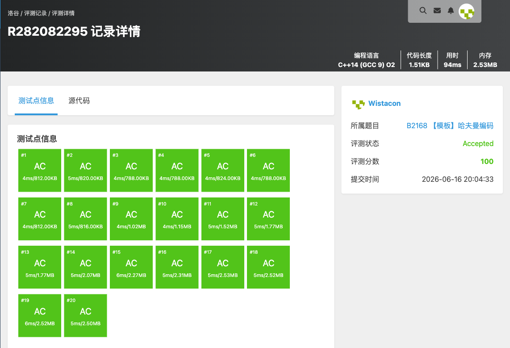

# B2168 【模板】哈夫曼编码

## 题目信息

题目链接：https://www.luogu.com.cn/problem/B2168

知识点：贪心、哈夫曼树、优先队列（小根堆）

## 题目简述

> 给定 $n$ 个互不相同的单词及其频次 $w_i$，构造一种哈夫曼编码方案，使带权路径长度（$\sum$ 编码长度 $\times$ 频次）最小，输出任意一种合法方案，单词顺序与输入一致。
>
> 数据范围：$1\le n\le 1000$，单词长度 $\le 20$，$1\le w_i\le 10^9$。
>
> 时间限制：1S，空间限制：128MB。

## 题目分析

### 详细版

**1. 读题**

哈夫曼编码模板。核心是构造哈夫曼树：频次越高的单词编码越短，从而使 WPL 最小。题目接受任意一种最优方案。

**2. 性质观察**

哈夫曼树的贪心构造：每次取出当前权值**最小的两个**节点合并成一个新节点（权值为两者之和），重复直到只剩一个根。合并时左分支记 $0$、右分支记 $1$，从根到叶子的路径即为该单词的编码。频次大的叶子离根近、编码短，保证 WPL 最小（贪心可证最优）。

**边界**：$n=1$ 时无法构成二叉树分支，需特判，直接给该单词编码 `0`。

**3. 数据结构与算法选择**

- 节点结构体 `NODE{w, id, l, r}`，叶子记录单词编号 `id`，内部节点 `id=-1`；
- **小根堆** `priority_queue`（比较器 `w` 升序）维护当前节点集合，每次弹出两个最小的合并；
- 建树完成后从根 DFS，沿左 $0$ 右 $1$ 累积路径字符串，到叶子时写入 `ans[id]`；
- 最后按输入顺序输出。

**4. 程序设计**

1. 特判 $n=1$：直接输出该单词与编码 `0`；
2. 读入 $n$ 个单词与频次，各建一个叶子节点入堆；
3. 当堆中节点数 $>1$：弹出两个最小节点 $a,b$，合并成 `newNode(a->w+b->w, -1, a, b)` 入堆；
4. 取根，`dfs(root, path, 0)`：到叶子写 `strcpy(ans[id], path)`，否则向左追加 `'0'`、向右追加 `'1'`；
5. 按输入顺序逐行输出单词及其编码。

**5. 时空复杂度分析**

建树需 $n-1$ 次合并，每次堆操作 $O(\log n)$，建树 $O(n\log n)$；DFS 遍历 $O(n\times\text{编码长度})$。$n\le 1000$ 可以通过。频次累加和达 $10^{12}$ 量级，权值用 `long long`。

### 省流版

哈夫曼树贪心：小根堆每次取两个最小权值节点合并，直到剩一个根；左 $0$ 右 $1$，DFS 到叶子得到各单词编码。注意 $n=1$ 特判（编码记为 `0`），权值用 `long long`。建树 $O(n\log n)$。

## 代码实现



```cpp
#include <stdio.h>
#include <stdlib.h>
#include <string.h>
#include <stack>
#include <queue>
#include <vector>
#include <list>
#include <set>
#include <map>
#include <string>
#include <algorithm>
#include <ext/pb_ds/assoc_container.hpp>
#include <ext/pb_ds/tree_policy.hpp>

using namespace std;

struct NODE {
    long long w;
    int id;          // 叶子编号，非叶子 = -1
    NODE *l, *r;
};

struct CMP {
    bool operator()(NODE* a, NODE* b) const {
        return a->w > b->w; // 小根堆
    }
};

priority_queue<NODE*, vector<NODE*>, CMP> pq;

int n;
char s[1005][25];
char ans[1005][2005];

// 创建节点
NODE* newNode(long long w, int id, NODE* l, NODE* r) {
    NODE* p = new NODE();
    p->w = w;
    p->id = id;
    p->l = l;
    p->r = r;
    return p;
}

// DFS生成编码
void dfs(NODE* root, char path[], int depth) {
    if (!root) return;

    // 叶子节点
    if (!root->l && !root->r) {
        path[depth] = '\0';
        strcpy(ans[root->id], path);
        return;
    }

    path[depth] = '0';
    dfs(root->l, path, depth + 1);

    path[depth] = '1';
    dfs(root->r, path, depth + 1);
}

int main() {
    scanf("%d", &n);

    // ⭐ 特判 n = 1（必须）
    if (n == 1) {
        long long w;
        scanf("%s %lld", s[0], &w);
        printf("%s 0\n", s[0]);
        return 0;
    }

    // 读入 + 建叶子节点
    for (int i = 0; i < n; i++) {
        long long w;
        scanf("%s %lld", s[i], &w);
        pq.push(newNode(w, i, NULL, NULL));
    }

    // Huffman建树
    while (pq.size() > 1) {
        NODE* a = pq.top(); pq.pop();
        NODE* b = pq.top(); pq.pop();

        pq.push(newNode(a->w + b->w, -1, a, b));
    }

    NODE* root = pq.top();

    char path[2005];
    dfs(root, path, 0);

    // 按输入顺序输出
    for (int i = 0; i < n; i++) {
        printf("%s %s\n", s[i], ans[i]);
    }

    return 0;
}
```

## 代码链接

代码发布于：https://github.com/Flutter-Misdreavus/csu_algorithm
