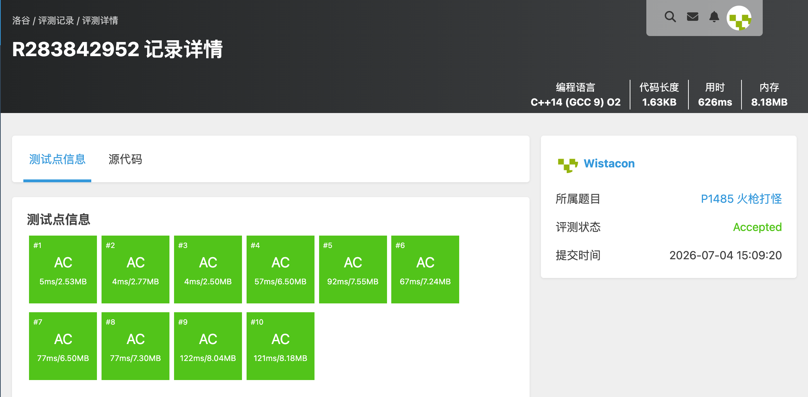

# P1485 火枪打怪

## 题目信息

题目链接：https://www.luogu.com.cn/problem/P1485

知识点：二分答案、贪心、滑动窗口

## 题目简述

> n 只怪物排成一排，第 i 只血量为 m_i。LXL 发射 k 发子弹，每发威力为 p。射向第 i 只怪物时，该怪物掉 p 点血，左边第 j 只怪物（j<i）受到 max(0, p−(i−j)²) 的溅射伤害。求能消灭所有怪物的最小正整数 p。
>
> 数据范围：n,k ≤ 5×10⁵，1 ≤ m_i ≤ 10¹⁰。
>
> 时间限制：1S，空间限制：128MB。

## 题目分析

### 详细版

**1. 读题**

子弹伤害分为直接命中（p）和向左的二次函数衰减溅射。需要找到最小的 p，使得存在一种射击方案用不超过 k 发子弹消灭全部怪物。

**2. 性质观察**

- 对固定的 p，判断可行性具有单调性：p 越大越容易满足，因此可以二分答案。
- 溅射只向左，所以从右向左贪心：每个怪物只需要右侧子弹的溅射加上自己在该位置补射的子弹即可被消灭；补射量取最小值。

**3. 数据结构与算法选择**

- **二分答案**：范围 `[1, maxM + (n−1)² + 1]`，上界对应“一枪打在最右端即可全覆盖”。
- **滑动窗口维护溅射和**：对固定的 p，溅射有效距离 R = max{d | d² < p}。第 i 个怪物只受位置在 `[i+1, i+R]` 的子弹影响。
- 设窗口内子弹数为 S0、带权和 S1 = Σ x_j·j、平方和 S2 = Σ x_j·j²，则怪物 i 收到的溅射为：
  ```
  Σ x_j·(p−(j−i)²) = p·S0 − S2 + 2i·S1 − i²·S0
  ```
  这样可以在 O(1) 时间内计算每个怪物的溅射。

**4. 程序设计**

- 二分 p。
- `check(p)`：从右向左扫描，用三个滑动变量维护窗口 `[i+1, min(n, i+R)]`。
- 若当前怪物 i 的溅射 ≤ m_i，则需补射 `x_i = (m_i − splash)/p + 1` 发。
- 累计子弹数，超过 k 则不可行。
- 扫描完若累计 ≤ k，则 p 可行。

**5. 时空复杂度分析**

时间复杂度：二分 O(log(maxM + n²)) 次，每次 `check` 为 O(n)，总复杂度 O(n log(maxM + n²))。
空间复杂度：O(n)。

### 省流版

二分答案 p，从右向左贪心求最少子弹数；用滑动窗口和三个系数和 O(1) 计算每个怪物受到的溅射伤害。

## 代码实现



```cpp
#include <stdio.h>
#include <stdlib.h>
#include <string.h>
#include <stack>
#include <string>
#include <queue>
#include <vector>
#include <list>
#include <map>
#include <set>
#include <algorithm>
#include <math.h>
#include <ext/pb_ds/assoc_container.hpp>
#include <ext/pb_ds/tree_policy.hpp>

using namespace std;

const int MAXN = 500010;

long long m[MAXN];
long long x[MAXN];
long long n, k;

// 检查威力为 p 时，k 发子弹是否足够
bool check(long long p){
	if(p <= 0) return false;
	// 最大溅射距离：满足 d^2 < p 的最大 d
	long long R = (long long)sqrt((long double)(p - 1));
	while((R + 1) * (R + 1) < p) R++;
	while(R * R >= p) R--;

	memset(x, 0, sizeof(long long) * (n + 2));
	long long S0 = 0, S1 = 0, S2 = 0; // 窗口内 x_j, x_j*j, x_j*j*j
	long long total = 0;

	for(long long i = n; i >= 1; i--){
		// 当前窗口为 [i+1, min(n, i+R)]，已包含所有能溅射到 i 的右侧子弹
		long long splash = p * S0 - S2 + 2LL * i * S1 - i * i * S0;
		if(splash <= m[i]){
			long long need = m[i] - splash;
			x[i] = need / p + 1;
			total += x[i];
			if(total > k) return false;
		}
		// 把第 i 个怪物处的子弹加入窗口，供左侧怪物计算溅射
		S0 += x[i];
		S1 += x[i] * i;
		S2 += x[i] * i * i;
		// 窗口右边界收缩：对于下一个 i-1，窗口上界为 i-1+R，需去掉 i+R
		if(i + R <= n){
			long long j = i + R;
			S0 -= x[j];
			S1 -= x[j] * j;
			S2 -= x[j] * j * j;
		}
	}
	return total <= k;
}

int main(){
	scanf("%lld%lld", &n, &k);
	long long maxM = 0;
	for(long long i = 1; i <= n; i++){
		scanf("%lld", &m[i]);
		if(m[i] > maxM) maxM = m[i];
	}

	long long left = 1;
	long long right = maxM + (n - 1) * (n - 1) + 1;
	while(left < right){
		long long mid = left + (right - left) / 2;
		if(check(mid)){
			right = mid;
		}else{
			left = mid + 1;
		}
	}

	printf("%lld\n", left);
}
```

## 代码链接

代码发布于：https://github.com/Flutter-Misdreavus/csu_algorithm
