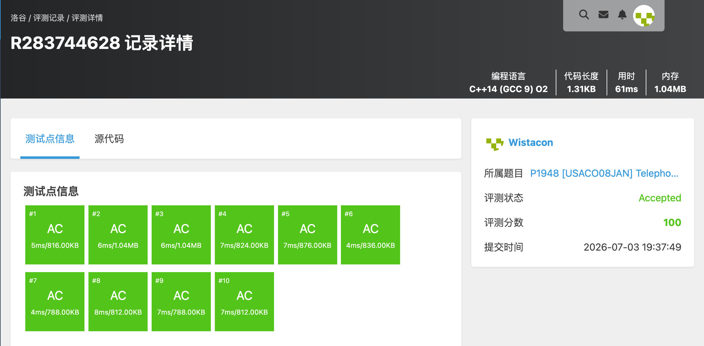

# P1948 [USACO08JAN] Telephone Lines S

## 题目信息

题目链接：https://www.luogu.com.cn/problem/P1948

知识点：图论、最短路、二分答案、0-1 BFS

## 题目简述

> 有 n 根电话线杆、p 条可选双向电话线，第 i 条长度 l_i。电信公司免费连接其中 k 条，其余由自己付费，费用等于剩余电话线中最长的一根。求把 1 号杆连到 n 号杆的最小支出；若无法连通输出 −1。
>
> 数据范围：n ≤ 1000，p ≤ 10000，l_i ≤ 10^6。
>
> 时间限制：1S，空间限制：128MB。

## 题目分析

### 详细版

**1. 读题**

只需要保证 1 到 n 之间存在一条路径，路径上最多 k 条边可以免费，其余边需要自费，费用为这些自费边长度的最大值。要使这个最大值最小。

**2. 性质观察**

对某个费用上限 x，若存在一条 1→n 的路径，其中长度大于 x 的边不超过 k 条，则答案 ≤ x。这个判断具有单调性：x 越大越容易满足，因此可以二分答案。

**3. 数据结构与算法选择**

- **二分答案**：在 `[0, max(l_i)]` 上二分最小可行的 x。
- **0-1 BFS**：对固定的 x，把每条边变成 0（l_i ≤ x）或 1（l_i > x），求 1 到 n 的最少“贵边”数。若该数 ≤ k，则 x 可行。

**4. 程序设计**

- 读入图，记录最大边长。
- 二分 x，调用 `check(x)`：
  - 初始化 `dis[1] = 0`，其余为 INF，双端队列放入 1。
  - 0-1 BFS：0 代价边从队首入队，1 代价边从队尾入队。
  - 返回 `dis[n] <= k`。
- 找到最小可行 x 输出；否则输出 −1。

**5. 时空复杂度分析**

时间复杂度：二分 O(log maxL) 次，每次 0-1 BFS 为 O(n + p)，总复杂度 O((n + p) log maxL)。
空间复杂度：O(n + p)。

### 省流版

二分答案 x，把边按是否大于 x 标为 0/1，跑 0-1 BFS 看 1 到 n 是否需要超过 k 条“贵边”。最小可行的 x 即为答案。

## 代码实现



```cpp
#include <stdio.h>
#include <stdlib.h>
#include <string.h>
#include <stack>
#include <string>
#include <queue>
#include <vector>
#include <list>
#include <map>
#include <set>
#include <algorithm>
#include <ext/pb_ds/assoc_container.hpp>
#include <ext/pb_ds/tree_policy.hpp>

using namespace std;

const int INF = 0x3f3f3f3f;

int n, p, k;
vector<pair<int, int>> g[1010];
int dis[1010];
deque<int> dq;

// 检查是否存在 1 到 n 的路径，其中长度大于 x 的边不超过 k 条
bool check(int x){
	memset(dis, 0x3f, sizeof(dis));
	dis[1] = 0;
	dq.clear();
	dq.push_back(1);
	while(!dq.empty()){
		int u = dq.front();
		dq.pop_front();
		for(int i = 0; i < (int)g[u].size(); i++){
			int v = g[u][i].first;
			int w = g[u][i].second;
			int cost = (w > x) ? 1 : 0;
			if(dis[u] + cost < dis[v]){
				dis[v] = dis[u] + cost;
				if(cost == 0){
					dq.push_front(v);
				}else{
					dq.push_back(v);
				}
			}
		}
	}
	return dis[n] <= k;
}

int main(){
	scanf("%d%d%d", &n, &p, &k);
	int maxL = 0;
	for(int i = 0; i < p; i++){
		int a, b, l;
		scanf("%d%d%d", &a, &b, &l);
		g[a].push_back(make_pair(b, l));
		g[b].push_back(make_pair(a, l));
		if(l > maxL) maxL = l;
	}

	int left = 0, right = maxL, ans = -1;
	while(left <= right){
		int mid = (left + right) / 2;
		if(check(mid)){
			ans = mid;
			right = mid - 1;
		}else{
			left = mid + 1;
		}
	}

	printf("%d\n", ans);
}
```

## 代码链接

代码发布于：https://github.com/Flutter-Misdreavus/csu_algorithm
