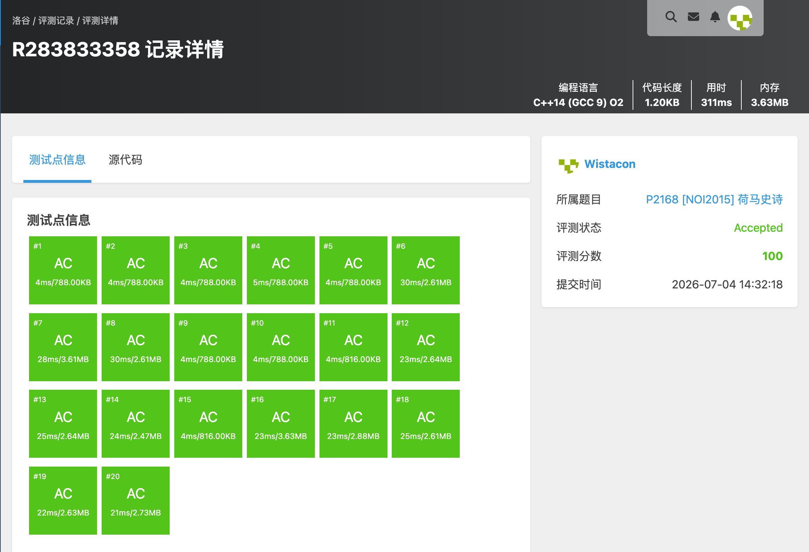

# P2168 [NOI2015] 荷马史诗

## 题目信息

题目链接：https://www.luogu.com.cn/problem/P2168

知识点：贪心、哈夫曼树、K 叉哈夫曼、优先队列

## 题目简述

> 有 n 种单词，第 i 种出现 w_i 次。要用 k 进制字符串 s_i 替换，且任意 s_i 不是 s_j 的前缀。求重新编码后总长度最小值；并在所有最优方案中，求最长字符串长度的最小值。
>
> 数据范围：n ≤ 10^5，k ≤ 9，0 < w_i ≤ 10^11。
>
> 时间限制：1S，空间限制：128MB。

## 题目分析

### 详细版

**1. 读题**

前缀-free 编码等价于构建一棵 k 叉编码树，叶子对应单词，根到叶子的路径字符组成编码。总长度 = Σ w_i × depth_i，最长字符串长度 = 最大叶子深度。

**2. 性质观察**

- 最小化 Σ w_i × depth_i 正是 **k 叉哈夫曼树** 的目标。
- 为使最大深度最小，合并时若权值相同，应优先合并高度较小的节点，让树更平衡。

**3. 数据结构与算法选择**

- **小根堆**：每次取出 k 个权值最小的节点合并；权值相同则取高度较小者。
- **补虚拟节点**：k 叉哈夫曼要求总叶子数 L 满足 (L−1) mod (k−1)=0，否则需补权值为 0 的虚拟叶子。

**4. 程序设计**

- 读入 n、k 与权值，全部作为叶子节点入堆（高度为 0）。
- n=1 时直接输出 `0\n0`。
- 计算需要补齐的虚拟节点数 `pad = (k-1-(n-1)%(k-1))%(k-1)`，并入堆。
- 每次合并 k 个节点：新节点权值为子节点权和，高度为子节点最大高度 +1；累计权和到答案。
- 最后输出累计权和（最小编码总长度）与根节点高度（最长字符串最短长度）。

**5. 时空复杂度分析**

时间复杂度：O(n log n)。
空间复杂度：O(n)。

### 省流版

k 叉哈夫曼树。小根堆每次合并 k 个最小权值节点，权值相同优先合并高度小的；合并过程中累加内部节点权值得到最小编码总长度，根高度即最长字符串的最短长度。

## 代码实现



```cpp
#include <stdio.h>
#include <stdlib.h>
#include <string.h>
#include <stack>
#include <string>
#include <queue>
#include <vector>
#include <list>
#include <map>
#include <set>
#include <algorithm>
#include <ext/pb_ds/assoc_container.hpp>
#include <ext/pb_ds/tree_policy.hpp>

using namespace std;

struct Node{
	long long w;
	int h;
};

struct CMP{
	bool operator()(const Node& a, const Node& b) const {
		if(a.w != b.w) return a.w > b.w; // 小根堆，先合并权值小的
		return a.h > b.h;               // 权值相同时先合并高度小的，保证树更平衡
	}
};

priority_queue<Node, vector<Node>, CMP> pq;

int main(){
	int n, k;
	scanf("%d%d", &n, &k);
	for(int i = 0; i < n; i++){
		long long w;
		scanf("%lld", &w);
		pq.push((Node){w, 0});
	}

	if(n == 1){
		printf("0\n0\n");
		return 0;
	}

	// 补齐虚拟节点，使 (总叶子数 - 1) 能被 (k - 1) 整除
	int pad = (k - 1 - (n - 1) % (k - 1)) % (k - 1);
	for(int i = 0; i < pad; i++){
		pq.push((Node){0, 0});
	}

	long long total = 0;
	while((int)pq.size() > 1){
		long long sum = 0;
		int maxH = 0;
		for(int i = 0; i < k; i++){
			Node cur = pq.top();
			pq.pop();
			sum += cur.w;
			if(cur.h > maxH) maxH = cur.h;
		}
		total += sum;
		pq.push((Node){sum, maxH + 1});
	}

	Node root = pq.top();
	printf("%lld\n%d\n", total, root.h);
}
```

## 代码链接

代码发布于：https://github.com/Flutter-Misdreavus/csu_algorithm
