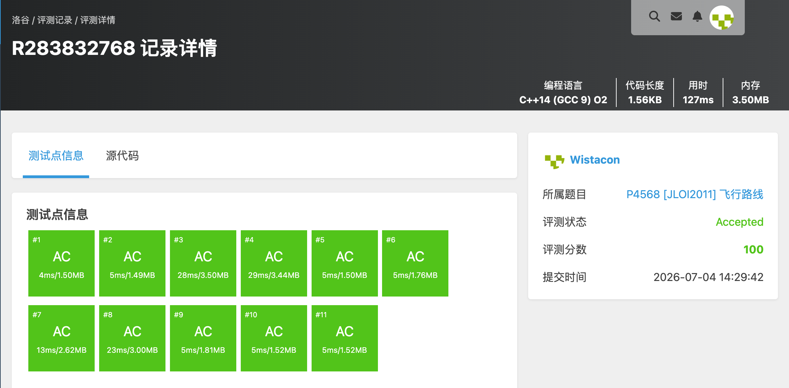

# P4568 [JLOI2011] 飞行路线

## 题目信息

题目链接：https://www.luogu.com.cn/problem/P4568

知识点：图论、最短路、分层图、Dijkstra

## 题目简述

> n 个城市、m 条双向航线，每条航线有价格。从 s 到 t，最多可以免费乘坐 k 条航线，求最小花费。
>
> 数据范围：n ≤ 10^4，m ≤ 5×10^4，k ≤ 10，c ≤ 10^3。
>
> 时间限制：1S，空间限制：128MB。

## 题目分析

### 详细版

**1. 读题**

每条航线最多使用一次免费机会，也可以付费。需要找到从 s 到 t 的最小总花费。

**2. 性质观察**

免费次数 k 很小（≤10），可以把“已经使用了多少次免费机会”作为额外一维状态，构建分层图：第 j 层表示已经使用了 j 次免费机会。

**3. 数据结构与算法选择**

- **分层图 + Dijkstra**：状态为 `(节点, 已用免费次数)`，总状态数不超过 `n×(k+1)`。
- 对每条边有两种转移：
  - 付费走：停留在同一层，花费 +c；
  - 免费走：进入下一层，花费 +0（需满足已用次数 < k）。

**4. 程序设计**

- 读入图。
- 初始化 `dis[s][0] = 0`，优先队列按花费小根堆。
- Dijkstra 过程中同时处理“付费”和“免费”两种转移。
- 答案为 `min(dis[t][0..k])`。

**5. 时空复杂度分析**

时间复杂度：状态数 O(nk)，每个状态扩展 O(deg)，总复杂度 O(mk log(nk))。
空间复杂度：O(nk + m)。

### 省流版

把“已用免费次数”扩展成一维，跑分层图 Dijkstra。每条边可付费同层走或免费进入下一层。

## 代码实现



```cpp
#include <stdio.h>
#include <stdlib.h>
#include <string.h>
#include <stack>
#include <string>
#include <queue>
#include <vector>
#include <list>
#include <map>
#include <set>
#include <algorithm>
#include <ext/pb_ds/assoc_container.hpp>
#include <ext/pb_ds/tree_policy.hpp>

using namespace std;

const long long INF = 0x3f3f3f3f3f3f3f3fLL;

int n, m, k;
int s, t;
vector<pair<int, int>> g[10010];
long long dis[10010][12];
int vis[10010][12];

struct State{
	int u;
	int used;
	long long d;
	bool operator<(const State& other) const {
		return d > other.d;
	}
};

void dijkstra(){
	priority_queue<State> pq;
	memset(dis, 0x3f, sizeof(dis));
	dis[s][0] = 0;
	pq.push((State){s, 0, 0});
	while(!pq.empty()){
		State cur = pq.top();
		pq.pop();
		int u = cur.u;
		int used = cur.used;
		if(vis[u][used]) continue;
		vis[u][used] = 1;
		for(int i = 0; i < (int)g[u].size(); i++){
			int v = g[u][i].first;
			int w = g[u][i].second;
			// 付费走，层数不变
			if(dis[u][used] + w < dis[v][used]){
				dis[v][used] = dis[u][used] + w;
				pq.push((State){v, used, dis[v][used]});
			}
			// 免费走，进入下一层
			if(used < k && dis[u][used] < dis[v][used + 1]){
				dis[v][used + 1] = dis[u][used];
				pq.push((State){v, used + 1, dis[v][used + 1]});
			}
		}
	}
}

int main(){
	scanf("%d%d%d", &n, &m, &k);
	scanf("%d%d", &s, &t);
	for(int i = 0; i < m; i++){
		int a, b, c;
		scanf("%d%d%d", &a, &b, &c);
		g[a].push_back(make_pair(b, c));
		g[b].push_back(make_pair(a, c));
	}

	dijkstra();

	long long ans = INF;
	for(int i = 0; i <= k; i++){
		if(dis[t][i] < ans) ans = dis[t][i];
	}

	printf("%lld\n", ans);
}
```

## 代码链接

代码发布于：https://github.com/Flutter-Misdreavus/csu_algorithm
