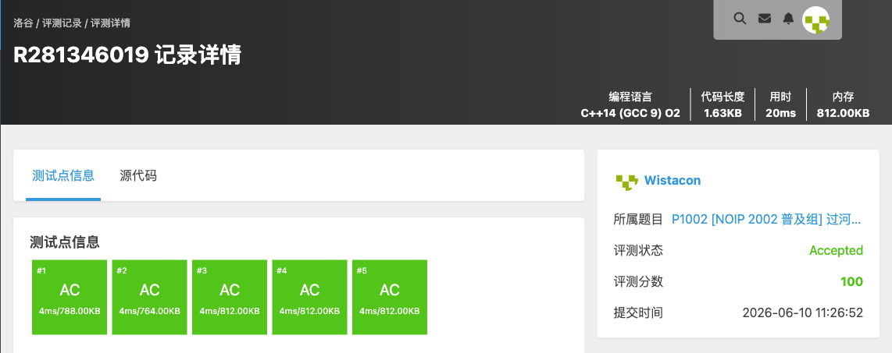

# P1002 [NOIP 2002 普及组] 过河卒

## 题目信息

题目链接：https://www.luogu.com.cn/problem/P1002

知识点：动态规划、网格 DP、递推

## 题目简述

> 过河卒从 $A(0,0)$ 出发，每步只能向右或向下走，要到达 $B(n,m)$。棋盘上有一个对方的「马」，马所在格及其一步可跳到的 $8$ 个格子都是控制点，卒不能经过。求从 $A$ 到 $B$ 不经过任何控制点的路径条数。
>
> 数据范围：$1\le n,m\le 20$，$0\le$ 马坐标 $\le 20$，保证起点不是控制点。
>
> 时间限制：1S，空间限制：128MB。

## 题目分析

### 详细版

**1. 读题**

经典网格路径计数：只能向右或向下，求从左上到右下的路径数，但有若干「禁止经过」的格子（马的 $9$ 个控制点）。$n,m\le 20$，路径数最多为 $\binom{40}{20}\approx 1.4\times 10^{11}$，需用 `long long`。

**2. 性质观察**

设 `f[i][j]` 为从 $(0,0)$ 走到 $(i,j)$ 的路径数。由于每步只能从上方或左方而来，转移为

$$f[i][j]=f[i-1][j]+f[i][j-1].$$

若 $(i,j)$ 是马的控制点，则不能落脚，`f[i][j]=0`。这就是一个无后效性的递推。

**3. 数据结构与算法选择**

- 二维数组 `ditu[22][22]` 存路径数（`long long`）；
- 函数 `ismakong(mx,my,x,y)` 判断 $(x,y)$ 是否为马的控制点（马自身 + 8 个「日」字跳点）；
- 自左上到右下顺序递推。

**4. 程序设计**

1. 初始化 `ditu[0][0]=1`；
2. 先处理第一列、第一行：若该格是控制点则保持 $0$（`continue`），否则继承上一格的值（第一行/列只有一个方向来源）；
3. 双重循环填表 $i,j\ge 1$：控制点置 $0$，否则 `ditu[i][j]=ditu[i-1][j]+ditu[i][j-1]`；
4. 输出 `ditu[n][m]`。

**5. 时空复杂度分析**

填表 $O(nm)$，每格判断控制点为 $O(1)$，总时间 $O(nm)$，空间 $O(nm)$。$n,m\le 20$ 时极小，可以通过。

### 省流版

网格 DP，`f[i][j]=f[i-1][j]+f[i][j-1]`，马的 $9$ 个控制点处 `f=0`。注意先正确处理首行首列，路径数用 `long long`。时间复杂度 $O(nm)$。

## 代码实现



```cpp
#include <stdio.h>
#include <stdlib.h>
#include <string.h>
#include <stack>
#include <queue>
#include <string>
#include <vector>
#include <list>
#include <map>
#include <set>
#include <algorithm>
#include <ext/pb_ds/assoc_container.hpp>
#include <ext/pb_ds/tree_policy.hpp>

using namespace std;

long long int ditu[22][22];

bool ismakong(int mx, int my, int x, int y){
	if(mx == x && my == y){
		return true;
	}
	if(mx - 2 == x && my - 1 == y){
		return true;
	}
	if(mx - 2 == x && my + 1 == y){
		return true;
	}
	if(mx + 2 == x && my - 1 == y){
		return true;
	}
	if(mx + 2 == x && my + 1 == y){
		return true;
	}
	if(mx - 1 == x && my - 2 == y){
		return true;
	}
	if(mx - 1 == x && my + 2 == y){
		return true;
	}
	if(mx + 1 == x && my - 2 == y){
		return true;
	}
	if(mx + 1 == x && my + 2 == y){
		return true;
	}
	return false;
}

int main(){
	int n, m;
	int mx, my;

	scanf("%d%d", &n, &m);
	scanf("%d%d", &mx, &my);
	memset(ditu, 0 ,sizeof(ditu));

	ditu[0][0] = 1;
	for(int i = 1; i <= n; i++){
		if(ismakong(mx, my, i, 0)){
			continue;
		}
		ditu[i][0] = ditu[i - 1][0];
	}
	for(int j = 1; j <= m; j++){
		if(ismakong(mx, my, 0, j)){
			continue;
		}
		ditu[0][j] = ditu[0][j - 1];
	}
	for(int i = 1; i <= n; i++){
		for(int j = 1; j <= m; j++){
			if(ismakong(mx, my, i, j)){
			continue;
			}
			ditu[i][j] = ditu[i - 1][j] + ditu[i][j - 1];
		}
	}

	printf("%lld\n", ditu[n][m]);
}
```

## 代码链接

代码发布于：https://github.com/Flutter-Misdreavus/csu_algorithm
