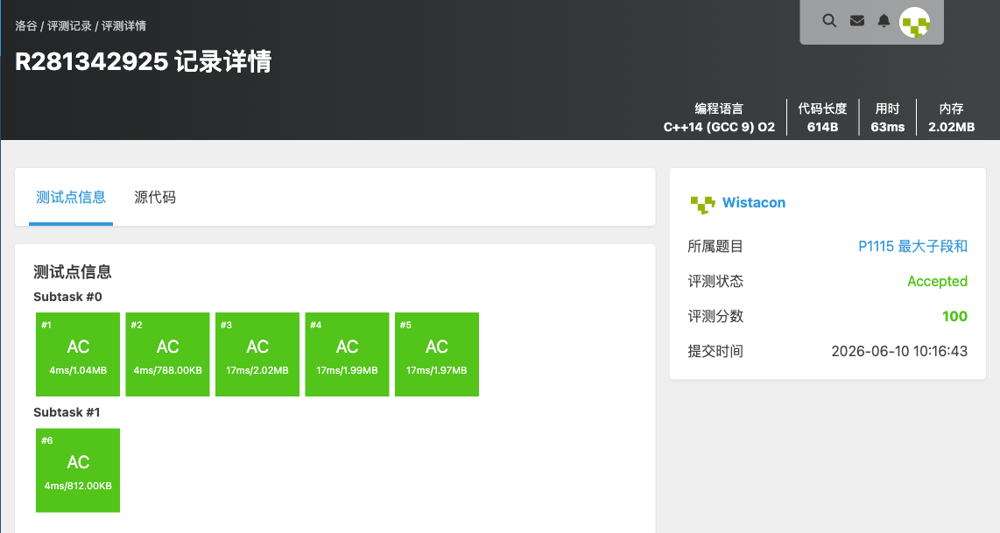

# P1115 最大子段和

## 题目信息

题目链接：https://www.luogu.com.cn/problem/P1115

知识点：动态规划、线性 DP

## 题目简述

> 给定长度为 $n$ 的序列 $a$，选出连续且非空的一段，使该段的和最大，输出最大和。
>
> 数据范围：$1\le n\le 2\times 10^5$，$-10^4\le a_i\le 10^4$。
>
> 时间限制：1S，空间限制：128MB。

## 题目分析

### 详细版

**1. 读题**

最大子段和（最大连续子数组和）模板题。序列含负数，且至少要选一个元素。$n$ 达 $2\times 10^5$，需要线性算法。

**2. 性质观察**

设 `dp[i]` 表示**以第 $i$ 个元素结尾**的最大子段和。要么把前面的最优段接上来，要么从当前元素重新开始：

$$dp[i]=\max(dp[i-1]+a_i,\; a_i).$$

整体答案为所有 `dp[i]` 的最大值。这就是 Kadane 算法的 DP 形式。

**3. 数据结构与算法选择**

- 数组 `nums[]` 存序列，`dp[]` 存以各位置结尾的最大子段和；
- 一次线性扫描完成递推，用 `maxi` 记录全局最大值。

**4. 程序设计**

1. 读入序列；
2. 初始化 `dp[0]=nums[0]`，`maxi=dp[0]`；
3. 从 $1$ 到 $n-1$：`dp[i]=max(dp[i-1]+nums[i], nums[i])`，同时更新 `maxi=max(maxi, dp[i])`；
4. 输出 `maxi`。

**5. 时空复杂度分析**

单次线性扫描，时间复杂度 $O(n)$，空间 $O(n)$（也可用滚动变量优化到 $O(1)$）。$n\le 2\times 10^5$ 可以通过。

### 省流版

最大子段和模板。`dp[i]=max(dp[i-1]+a_i, a_i)` 表示以 $i$ 结尾的最大段和，答案取所有 `dp[i]` 的最大值。时间复杂度 $O(n)$。

## 代码实现



```cpp
#include <stdio.h>
#include <stdlib.h>
#include <string.h>
#include <stack>
#include <queue>
#include <string>
#include <vector>
#include <list>
#include <map>
#include <set>
#include <algorithm>
#include <ext/pb_ds/assoc_container.hpp>
#include <ext/pb_ds/tree_policy.hpp>

using namespace std;

int nums[200010];
int dp[200010]; //0-i的最大和

int main(){
	int n;
	int maxi;

	scanf("%d", &n);
	for(int i = 0; i < n ; i++){
		scanf("%d", &nums[i]);
	}

	dp[0] = nums[0];
	maxi = dp[0];
	for(int i = 1; i < n; i++){
		dp[i] = max(dp[i - 1] + nums[i], nums[i]);
		maxi = max(maxi, dp[i]);
	}
	printf("%d\n", maxi);

}
```

## 代码链接

代码发布于：https://github.com/Flutter-Misdreavus/csu_algorithm
