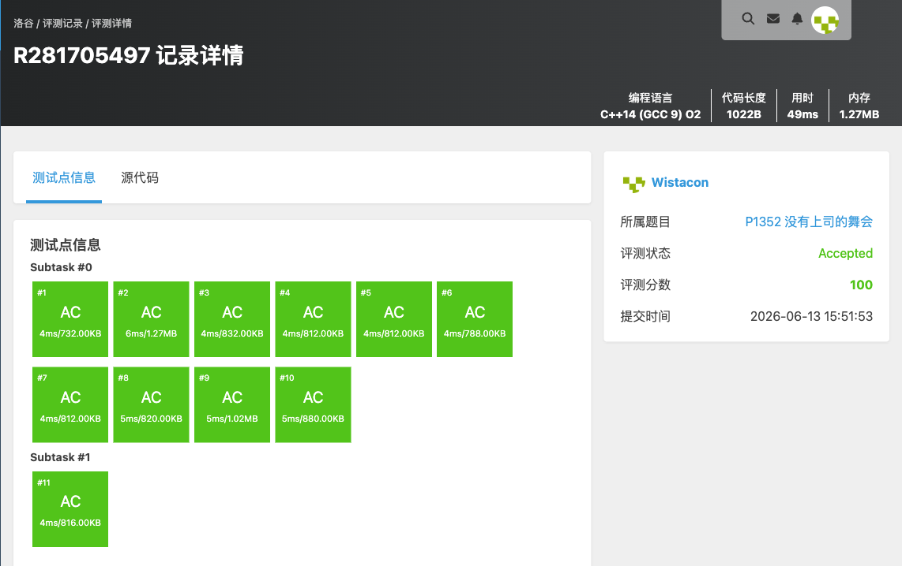

# P1352 没有上司的舞会

## 题目信息

题目链接：https://www.luogu.com.cn/problem/P1352

知识点：树形 DP

## 题目简述

> $n$ 个职员构成一棵以校长为根的树，父结点是子结点的直接上司。每个职员有快乐指数 $r_i$。若某职员的**直接上司**到场，则该职员不会到场。求选取一部分职员使快乐指数之和最大。
>
> 数据范围：$1\le n\le 6\times 10^3$，$-128\le r_i\le 127$。
>
> 时间限制：1S，空间限制：128MB。

## 题目分析

### 详细版

**1. 读题**

约束是「直接上司与下属不能同时到场」，即树上**相邻两结点不能同时选**——这是树上的「最大权独立集」问题，树形 DP 的经典模型。

**2. 性质观察**

对每个结点 $u$ 设两个状态：

- `dpjoin[u]`：$u **到场**时，以 $u$ 为根的子树能取得的最大快乐值；
- `dpunjoin[u]`：$u **不到场**时的最大快乐值。

转移（$v$ 为 $u$ 的孩子）：

- $u$ 到场，则所有孩子都不能到场：$dpjoin[u]=r_u+\sum_v dpunjoin[v]$；
- $u$ 不到场，则每个孩子到不到场都行，取较大者：$dpunjoin[u]=\sum_v \max(dpjoin[v],\,dpunjoin[v])$。

最终答案为 $\max(dpjoin[root],\,dpunjoin[root])$。

**3. 数据结构与算法选择**

- 邻接表 `shangsi[u]` 存「$u$ 的下属」；用 `youdie[]` 标记谁有上司，从而找出根（没有上司者）；
- `dpjoin[]`、`dpunjoin[]` 两个数组；
- 一次 DFS 后序计算。

**4. 程序设计**

1. 读入每个职员的快乐指数；读入关系 `l k`（$k$ 是 $l$ 的上司），加边 `shangsi[l].push_back(k)`，并标记 `youdie[k]=true`；

   > 注意本代码把「上司 $l$ 的下属 $k$」存入 `shangsi[l]`，并用 `youdie[k]` 标记 $k$ 有上司，故未被标记者即为根。
2. 从根 DFS：`dpjoin[u]=happy[u]` 起步，对每个孩子 $v$ 递归后累加 `dpjoin[u]+=dpunjoin[v]`、`dpunjoin[u]+=max(dpjoin[v],dpunjoin[v])`；
3. 输出 `max(dpjoin[root], dpunjoin[root])`。

**5. 时空复杂度分析**

每个结点访问常数次，时间复杂度 $O(n)$；邻接表与递归栈 $O(n)$。$n\le 6\times 10^3$ 可以通过。

### 省流版

树上最大权独立集。`dpjoin[u]=r[u]+Σ dpunjoin[v]`（自己来，孩子都不来），`dpunjoin[u]=Σ max(dpjoin[v], dpunjoin[v])`（自己不来，孩子随意）。找出无上司的根后一次 DFS，答案 `max(dpjoin[root], dpunjoin[root])`。时间复杂度 $O(n)$。

## 代码实现



```cpp
#include <stdio.h>
#include <stdlib.h>
#include <string.h>
#include <stack>
#include <string>
#include <queue>
#include <vector>
#include <list>
#include <map>
#include <set>
#include <algorithm>
#include <ext/pb_ds/assoc_container.hpp>
#include <ext/pb_ds/tree_policy.hpp>

using namespace std;

int happy[6003];
int dpjoin[6003];
int dpunjoin[6003];
vector<int> shangsi[6003];
bool youdie[6003];

void dfs(int dian){
	dpjoin[dian] = happy[dian];

	for(auto& i : shangsi[dian]){
		dfs(i);

		dpjoin[dian] += dpunjoin[i];
		dpunjoin[dian] += max(dpjoin[i], dpunjoin[i]);
	}
}

int main(){
	int n;
	int k, l;
	int root;
	memset(dpjoin, 0, sizeof(dpjoin));
	memset(dpunjoin, 0, sizeof(dpunjoin));

	scanf("%d", &n);
	for(int i = 1; i <= n; i++){
		scanf("%d", &happy[i]);
	}
	for(int i = 1; i< n; i++){
		scanf("%d%d", &k, &l);
		shangsi[l].push_back(k);
		youdie[k] = true;
	}
	for(int i = 1; i <= n; i++){
		if(!youdie[i]){
			root = i;
			break;
		}
	}

	dfs(root);

	printf("%d\n", max(dpjoin[root], dpunjoin[root]));
}
```

## 代码链接

代码发布于：https://github.com/Flutter-Misdreavus/csu_algorithm
