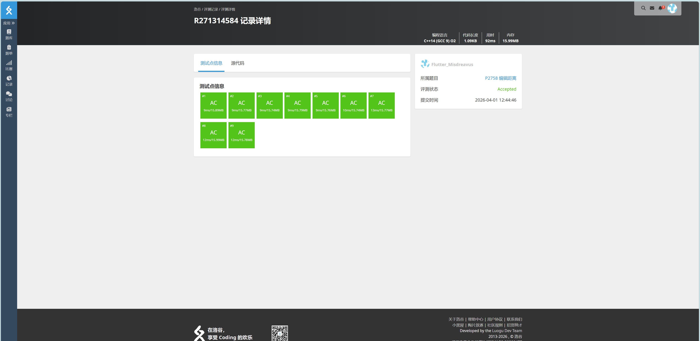

# P2758 编辑距离

## 题目信息

题目链接：https://www.luogu.com.cn/problem/P2758

知识点：动态规划、编辑距离（Levenshtein Distance）

## 题目简述

> 给定两个字符串 A 和 B，通过最少的三种操作（删除、插入、替换字符）将 A 转换为 B。
>
> 字符串长度 $|A|, |B| \le 2000$，只包含小写字母。
>
> 时间限制：1S，空间限制：125MB

## 题目分析

### 详细版

1. **读题**：将字符串 A 通过最少操作次数转换为字符串 B，操作包括：删除一个字符、插入一个字符、替换一个字符。

2. **性质观察**：这是经典的编辑距离问题。考虑将 A 的前 i 个字符转换为 B 的前 j 个字符的最小代价，记为 `dp[i][j]`。当 `A[i] == B[j]` 时无需操作，否则需要在三种操作中选择代价最小的。

3. **程序设计**：
   - 读取字符串 A 和 B
   - 初始化 `dp[i][0] = i`（删掉 i 个字符），`dp[0][j] = j`（插入 j 个字符）
   - 从小到大枚举 i, j 进行 DP 转移
   - 输出 `dp[|A|][|B|]`

4. **数据结构与算法选择**：二维 dp 数组，空间复杂度 O(n×m)，时间复杂度 O(n×m)。

5. **时空复杂度分析**：
   - 时间复杂度：O(|A| × |B|) ≤ 4×10⁶，可轻松通过
   - 空间复杂度：O(|A| × |B|) ≤ 4M 个整数，约 16MB

### 省流版

使用动态规划，`dp[i][j]` 表示将 A 前 i 个字符转为 B 前 j 个字符的最小代价。转移时如果当前字符相同则继承上一步，否则取删除/插入/替换三种操作的最小值+1。最终答案为 `dp[n][m]`。

## 代码实现



```cpp
#include <stdio.h>
#include <stdlib.h>
#include <string.h>
#include <vector>
#include <stack>
#include <queue>
#include <algorithm>
#include <ext/pb_ds/tree_policy.hpp>
#include <ext/pb_ds/assoc_container.hpp>

using namespace std;

int dp[2010][2010];
char a[2010];
char b[2010];

int main(){
    int a_size, b_size;
    memset(dp, 0, sizeof(dp));

    scanf("%s", a);
    scanf("%s", b);

    a_size = strlen(a);
    b_size = strlen(b);

    for(int i = 0; i <= a_size; i++){
        dp[i][0] = i;
    }
    for(int j = 0; j <= b_size; j++){
        dp[0][j] = j;
    }

    for(int i = 1; i <= a_size; i++){
        for(int j = 1; j <= b_size; j++){
            if(a[i - 1] == b[j - 1]){
                // 不用修改
                dp[i][j] = dp[i - 1][j - 1];
            }else{
                dp[i][j] = min(min(dp[i][j - 1] + 1, dp[i - 1][j] + 1), dp[i - 1][j - 1] + 1);
                // dp[i][j - 1] + 1：在a中插入一个字符
                // dp[i - 1][j] + 1：在a中删除一个
                // dp[i - 1][j - 1] + 1：在a中修改一个字符
            }
        }
    }

    printf("%d\n", dp[a_size][b_size]);
}
```

## 代码链接

代码发布于：https://github.com/Flutter-Misdreavus/csu_algorithm