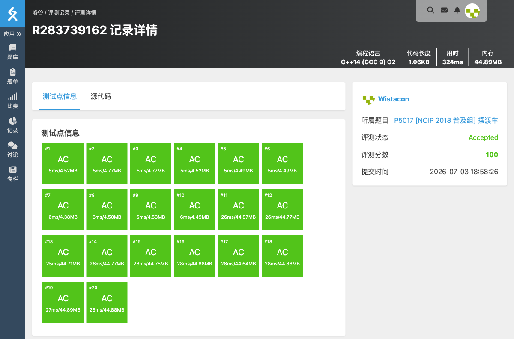

# P5017 [NOIP 2018 普及组] 摆渡车

## 题目信息

题目链接：https://www.luogu.com.cn/problem/P5017

知识点：动态规划、前缀和、剪枝优化

## 题目简述

> 有 n 名同学在第 t[i] 分钟到达车站等车。只有一辆容量无限的摆渡车，往返一趟需要 m 分钟。求安排发车时间，使所有同学等车时间之和最小。
>
> 数据范围：n ≤ 500，m ≤ 100，0 ≤ t[i] ≤ 4×10⁶。
>
> 时间限制：2S，空间限制：256MB。

## 题目分析

### 详细版

**1. 读题**

每一趟车可以搭载任意多名同学，发车时间可以任意选择，但同一辆车连续两趟之间必须间隔至少 m 分钟。目标是使所有同学等待时间之和最小。

**2. 性质观察**

将时间轴展开，每名同学对应一个到达时刻。可以把发车安排看作将时间轴分成若干段，每段长度至少为 m，每段的右端点就是该趟车的发车时刻，该段内所有同学的等待时间等于他们到右端点的距离之和。

最优策略中，每趟车的发车时刻一定等于某名同学的到达时刻或边界情况，不会无缘无故空等。

**3. 数据结构与算法选择**

设 `f[i]` 表示将时间轴上 `(−∞, i]` 分段，且最后一段右边界为 i 时，所有同学等待时间之和的最小值。

设 `cnt[i]` 为到达时刻 ≤ i 的同学人数，`sum[i]` 为这些人的到达时刻之和，通过前缀和预处理。

状态转移：枚举上一段右边界 j，满足 j ≤ i − m（保证段长至少 m），则：

```
f[i] = min{ f[j] + (cnt[i] − cnt[j]) × i − (sum[i] − sum[j]) }
```

其中 `(cnt[i] − cnt[j]) × i − (sum[i] − sum[j])` 表示在 `(j, i]` 这段时间内到达的同学，每人等待 `i − t[k]` 之和。

边界情况：从时间 0 开始作为第一段，`f[i] = cnt[i] × i − sum[i]`。

**4. 程序设计**

- 读入数据，统计每个时刻到达的人数和到达时间之和。
- 预处理前缀和 `cnt[i]` 与 `sum[i]`。
- 对 `f[i]` 进行递推：
  - 若 `i ≥ m` 且 `cnt[i − m] == cnt[i]`，说明 `(i − m, i]` 内无人到达，这段可以省略，令 `f[i] = f[i − m]`。
  - 否则先令 `f[i] = cnt[i] × i − sum[i]`。
  - 再枚举 j 从 `max(i − 2m + 1, 0)` 到 `i − m` 更新 `f[i]`。这里利用了“段长 ≥ 2m 时总可以再切一刀，不会更劣”的剪枝性质。
- 答案在 `i ∈ [t_max, t_max + m)` 范围内取最小值。

**5. 时空复杂度分析**

时间复杂度：通过剪枝，有效位置不超过 nm 个，每个位置枚举 O(m) 个转移，总复杂度 O(nm² + t_max)，可以接受。
空间复杂度：需要 cnt、sum、f 三个长度为 t_max + m 的数组，O(t_max)。

### 省流版

时间轴 DP：f[i] 表示最后一段右端点为 i 的最小等待和，枚举上一段边界 j，用前缀和快速计算转移。配合“空段继承”和“段长限制”两个剪枝优化通过本题。

## 代码实现



```cpp
#include <stdio.h>
#include <stdlib.h>
#include <string.h>
#include <stack>
#include <string>
#include <queue>
#include <vector>
#include <list>
#include <map>
#include <set>
#include <algorithm>
#include <ext/pb_ds/assoc_container.hpp>
#include <ext/pb_ds/tree_policy.hpp>

using namespace std;

const int MAXT = 4000200;

int n, m;
int tmax;
int cnt[MAXT];
int sum[MAXT];
int f[MAXT];

int main(){
	scanf("%d%d", &n, &m);
	for(int i = 0; i < n; i++){
		int ti;
		scanf("%d", &ti);
		if(ti > tmax) tmax = ti;
		cnt[ti]++;
		sum[ti] += ti;
	}

	for(int i = 1; i < tmax + m; i++){
		cnt[i] += cnt[i - 1];
		sum[i] += sum[i - 1];
	}

	for(int i = 0; i < tmax + m; i++){
		if(i >= m && cnt[i - m] == cnt[i]){
			f[i] = f[i - m];
			continue;
		}
		f[i] = cnt[i] * i - sum[i];
		int start = i - m - m + 1;
		if(start < 0) start = 0;
		for(int j = start; j <= i - m; j++){
			int val = f[j] + (cnt[i] - cnt[j]) * i - (sum[i] - sum[j]);
			if(val < f[i]) f[i] = val;
		}
	}

	int ans = 0x3f3f3f3f;
	for(int i = tmax; i < tmax + m; i++){
		if(f[i] < ans) ans = f[i];
	}

	printf("%d\n", ans);
}
```

## 代码链接

代码发布于：https://github.com/Flutter-Misdreavus/csu_algorithm
