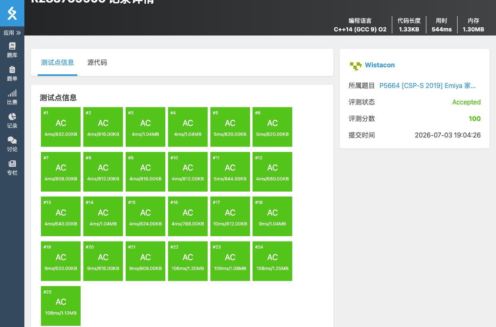

# P5664 [CSP-S 2019] Emiya 家今天的饭

## 题目信息

题目链接：https://www.luogu.com.cn/problem/P5664

知识点：组合计数、动态规划、容斥思想

## 题目简述

> Emiya 会 n 种烹饪方法、m 种主要食材，用方法 i 和食材 j 可做 a[i][j] 道不同的菜。现要选至少一道菜招待朋友，要求：
> 1. 每道菜的烹饪方法互不相同（每种方法至多选一道菜）；
> 2. 每种主要食材至多在一半的菜中被使用。
> 求满足条件的方案数，对 998244353 取模。
>
> 数据范围：n ≤ 100，m ≤ 2000，0 ≤ a[i][j] < 998244353。
>
> 时间限制：1S，空间限制：250MB。

## 题目分析

### 详细版

**1. 读题**

每种烹饪方法最多选一道菜。对于方法 i，可选方案有：不选，或从 m 种食材中选一种 j，再从 a[i][j] 道菜中选一道。

**2. 性质观察**

如果不考虑食材限制，总方案数为：

```
total = ∏(1 + Σ a[i][j]) − 1
```

减 1 是排除全不选的情况。

现在考虑食材限制：设最终选了 k 道菜，食材 j 出现 x_j 次，则要求 x_j ≤ ⌊k/2⌋。

关键观察：**不可能有两种食材同时不合法**。若食材 j1 和 j2 都出现超过 k/2 次，则总菜数 x_{j1} + x_{j2} > k，矛盾。因此“存在不合法食材”这一事件中的各食材方案集合互不相交，可以直接用总方案数减去每个食材的不合法方案数，无需复杂容斥。

**3. 数据结构与算法选择**

对每个食材 j，计算“食材 j 出现次数超过一半”的方案数。将每个方法 i 的选择分为三类：不选、选食材 j、选非 j 食材。设选食材 j 的方案数为 a[i][j]，选非 j 食材的方案数为 c[i] = Σ_{l≠j} a[i][l]。

由于要求食材 j 出现次数 x > 总菜数 k/2，即 x > y（y 为非 j 食材出现次数）。令差值 d = x − y，则只需 d ≥ 1。

用 DP 统计差值为 d 的方案数：
- 不选：d 不变；
- 选食材 j：d + 1；
- 选非 j 食材：d − 1。

偏移 n 后，dp[d] 表示差值为 d − n 的方案数。

**4. 程序设计**

- 读入矩阵，计算每行和 rowsum[i]。
- 计算无限制总方案数 total。
- 对每个食材 j：
  - 初始化 dp[n] = 1。
  - 对每个方法 i，枚举当前差值 d，更新 ndp：
    - ndp[d] += dp[d]（不选）
    - ndp[d+1] += dp[d] × a[i][j]（选 j）
    - ndp[d-1] += dp[d] × c[i]（选非 j）
  - 不合法方案数 bad[j] = Σ dp[d]（d > n）。
- 答案 ans = total − Σ bad[j]，取模修正。

**5. 时空复杂度分析**

时间复杂度：对每个食材 j 做 O(n²) 的 DP，共 O(m × n²) = 2000 × 100² = 2×10⁷。
空间复杂度：O(n² + n × m)。

### 省流版

总方案减去不合法方案。对每个食材用 DP 统计其出现次数超过一半的选法数，利用“最多一个食材不合法”避免容斥。

## 代码实现



```cpp
#include <stdio.h>
#include <stdlib.h>
#include <string.h>
#include <stack>
#include <string>
#include <queue>
#include <vector>
#include <list>
#include <map>
#include <set>
#include <algorithm>
#include <ext/pb_ds/assoc_container.hpp>
#include <ext/pb_ds/tree_policy.hpp>

using namespace std;

const int MOD = 998244353;

int n, m;
int a[110][2010];
int rowsum[110];
int dp[220];
int ndp[220];

int main(){
	scanf("%d%d", &n, &m);
	for(int i = 0; i < n; i++){
		for(int j = 0; j < m; j++){
			scanf("%d", &a[i][j]);
			rowsum[i] = (rowsum[i] + a[i][j]) % MOD;
		}
	}

	int total = 1;
	for(int i = 0; i < n; i++){
		total = (long long)total * (1 + rowsum[i]) % MOD;
	}
	total = (total - 1 + MOD) % MOD;

	int badsum = 0;
	for(int j = 0; j < m; j++){
		memset(dp, 0, sizeof(dp));
		dp[n] = 1;
		for(int i = 0; i < n; i++){
			int c = (rowsum[i] - a[i][j] + MOD) % MOD;
			memset(ndp, 0, sizeof(ndp));
			for(int d = 0; d <= 2 * n; d++){
				if(dp[d] == 0) continue;
				// 不选
				ndp[d] = (ndp[d] + dp[d]) % MOD;
				// 选食材 j
				ndp[d + 1] = (ndp[d + 1] + (long long)dp[d] * a[i][j]) % MOD;
				// 选非 j 食材
				ndp[d - 1] = (ndp[d - 1] + (long long)dp[d] * c) % MOD;
			}
			memcpy(dp, ndp, sizeof(ndp));
		}
		for(int d = n + 1; d <= 2 * n; d++){
			badsum = (badsum + dp[d]) % MOD;
		}
	}

	int ans = (total - badsum + MOD) % MOD;
	printf("%d\n", ans);
}
```

## 代码链接

代码发布于：https://github.com/Flutter-Misdreavus/csu_algorithm
