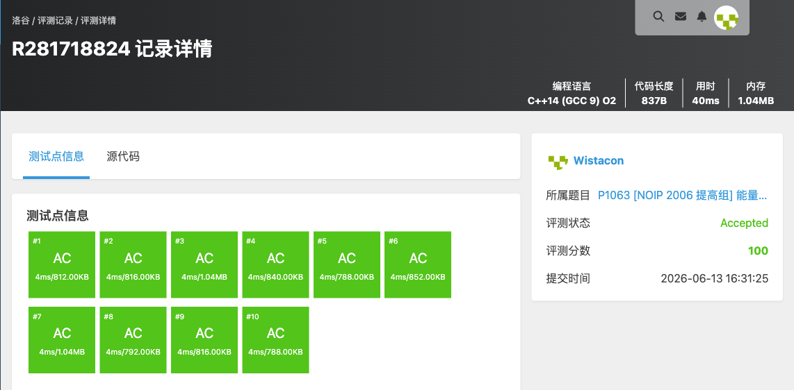
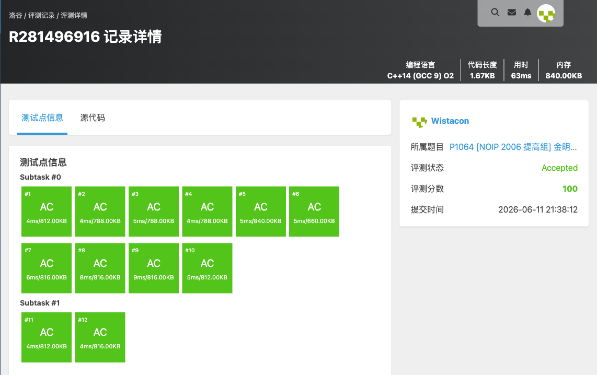
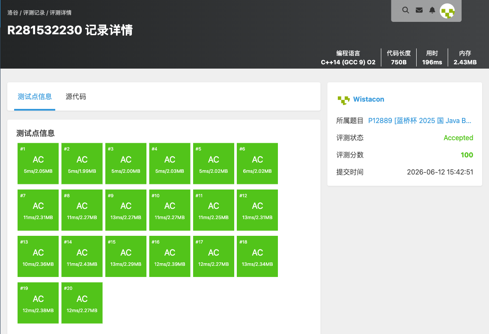
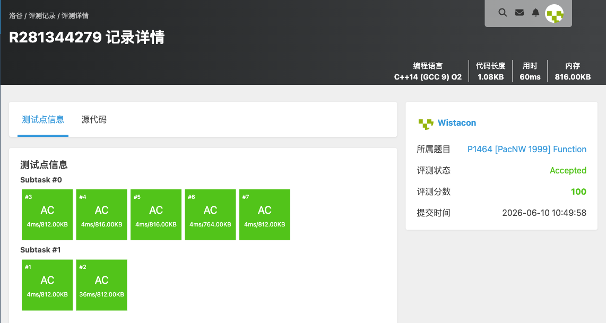
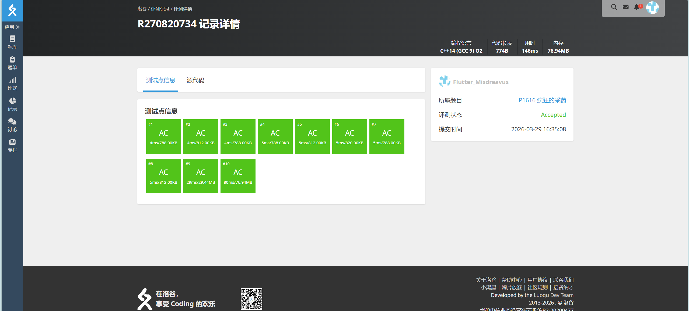
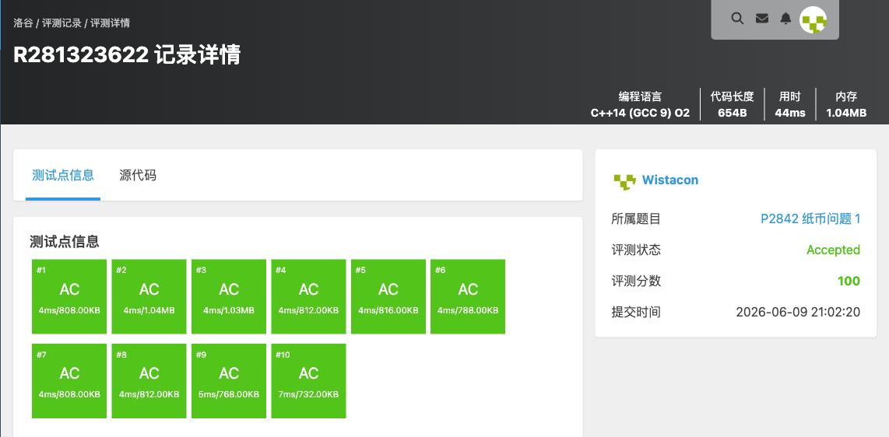
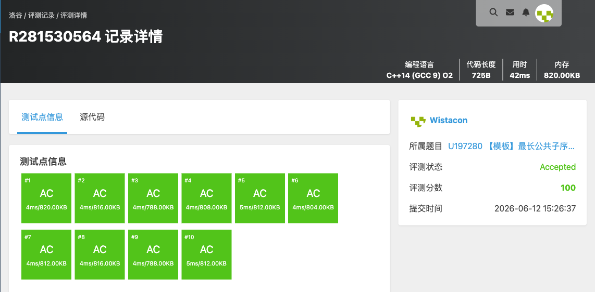

# 算法分析与设计练习题（四）— 完整题目解析报告

## 一、题单概述

### 1.1 题单信息

- **对应章节**：第 8 章动态规划
- **题目总数**：14 道
- **核心算法思想**：动态规划各类模型（线性 DP、树形 DP、区间 DP、背包 DP、计数 DP、记忆化搜索）

### 1.2 知识点总览

| 题号 | 题目名称 | 核心知识点 | 难度 |
|------|----------|-----------|------|
| P1002 | [NOIP 2002 普及组] 过河卒 | 网格 DP、递推 | 简单 |
| P1048 | [NOIP 2005 普及组] 采药 | 0-1 背包 | 简单 |
| P1063 | [NOIP 2006 提高组] 能量项链 | 区间 DP、环形 DP | 困难 |
| P1064 | [NOIP 2006 提高组] 金明的预算方案 | 分组背包、依赖背包 | 中等 |
| P1115 | 最大子段和 | 线性 DP（Kadane） | 简单 |
| P1122 | 最大子树和 | 树形 DP | 中等 |
| P12889 | [蓝桥杯 2025 国 Java B] 情绪链路 | 线性 DP、最大子段和 | 简单 |
| P1352 | 没有上司的舞会 | 树形 DP | 中等 |
| P1464 | [PacNW 1999] Function | 记忆化搜索、递推 | 简单 |
| P1616 | [NOIP 2005 普及组] 疯狂的采药 | 完全背包 | 简单 |
| P1833 | 樱花 | 混合背包、二进制优化 | 中等 |
| P2758 | 编辑距离 | 二维 DP | 中等 |
| P2842 | 纸币问题 1 | 完全背包 | 简单 |
| U197280 | 【模板】最长公共子序列 | LCS | 简单 |

### 1.3 题单知识图谱

本题单是动态规划方法的系统训练，涵盖以下经典模型：
- **线性 DP**：最大子段和（P1115、P12889）
- **树形 DP**：最大子树和（P1122）、树上独立集（P1352）
- **区间 DP**：能量项链（P1063）
- **背包 DP**：0-1 背包（P1048）、完全背包（P1616、P2842）、分组/依赖背包（P1064）、混合背包（P1833）
- **网格 DP**：过河卒（P1002）
- **序列 DP**：编辑距离（P2758）、最长公共子序列（U197280）
- **记忆化搜索**：Function（P1464）

---

## 二、逐题解析

### 2.1 P1002 [NOIP 2002 普及组] 过河卒

**题目链接**：https://www.luogu.com.cn/problem/P1002

**知识点**：动态规划、网格 DP、递推

**题目简述**：

> 过河卒从 $A(0,0)$ 出发，每步只能向右或向下走，要到达 $B(n,m)$。棋盘上有一个对方的「马」，马所在格及其一步可跳到的 $8$ 个格子都是控制点，卒不能经过。求从 $A$ 到 $B$ 不经过任何控制点的路径条数。
>
> 数据范围：$1\le n,m\le 20$，$0\le$ 马坐标 $\le 20$，保证起点不是控制点。

#### 详细分析

**1. 读题**

经典网格路径计数：只能向右或向下，求从左上到右下的路径数，但有若干「禁止经过」的格子（马的 $9$ 个控制点）。$n,m\le 20$，路径数最多为 $\binom{40}{20}\approx 1.4\times 10^{11}$，需用 `long long`。

**2. 性质观察**

设 `f[i][j]` 为从 $(0,0)$ 走到 $(i,j)$ 的路径数。由于每步只能从上方或左方而来，转移为

$$f[i][j]=f[i-1][j]+f[i][j-1].$$

若 $(i,j)$ 是马的控制点，则不能落脚，`f[i][j]=0`。这就是一个无后效性的递推。

**3. 数据结构与算法选择**

- 二维数组 `ditu[22][22]` 存路径数（`long long`）；
- 函数 `ismakong(mx,my,x,y)` 判断 $(x,y)$ 是否为马的控制点（马自身 + 8 个「日」字跳点）；
- 自左上到右下顺序递推。

**4. 程序设计**

1. 初始化 `ditu[0][0]=1`；
2. 先处理第一列、第一行：若该格是控制点则保持 $0$（`continue`），否则继承上一格的值（第一行/列只有一个方向来源）；
3. 双重循环填表 $i,j\ge 1$：控制点置 $0$，否则 `ditu[i][j]=ditu[i-1][j]+ditu[i][j-1]`；
4. 输出 `ditu[n][m]`。

**5. 时空复杂度分析**

填表 $O(nm)$，每格判断控制点为 $O(1)$，总时间 $O(nm)$，空间 $O(nm)$。$n,m\le 20$ 时极小，可以通过。

#### 省流版

网格 DP，`f[i][j]=f[i-1][j]+f[i][j-1]`，马的 $9$ 个控制点处 `f=0`。注意先正确处理首行首列，路径数用 `long long`。时间复杂度 $O(nm)$。

#### 代码实现


```cpp
#include <stdio.h>
#include <stdlib.h>
#include <string.h>
#include <stack>
#include <queue>
#include <string>
#include <vector>
#include <list>
#include <map>
#include <set>
#include <algorithm>
#include <ext/pb_ds/assoc_container.hpp>
#include <ext/pb_ds/tree_policy.hpp>

using namespace std;

long long int ditu[22][22];

bool ismakong(int mx, int my, int x, int y){
	if(mx == x && my == y){
		return true;
	}
	if(mx - 2 == x && my - 1 == y){
		return true;
	}
	if(mx - 2 == x && my + 1 == y){
		return true;
	}
	if(mx + 2 == x && my - 1 == y){
		return true;
	}
	if(mx + 2 == x && my + 1 == y){
		return true;
	}
	if(mx - 1 == x && my - 2 == y){
		return true;
	}
	if(mx - 1 == x && my + 2 == y){
		return true;
	}
	if(mx + 1 == x && my - 2 == y){
		return true;
	}
	if(mx + 1 == x && my + 2 == y){
		return true;
	}
	return false;
}

int main(){
	int n, m;
	int mx, my;

	scanf("%d%d", &n, &m);
	scanf("%d%d", &mx, &my);
	memset(ditu, 0 ,sizeof(ditu));

	ditu[0][0] = 1;
	for(int i = 1; i <= n; i++){
		if(ismakong(mx, my, i, 0)){
			continue;
		}
		ditu[i][0] = ditu[i - 1][0];
	}
	for(int j = 1; j <= m; j++){
		if(ismakong(mx, my, 0, j)){
			continue;
		}
		ditu[0][j] = ditu[0][j - 1];
	}
	for(int i = 1; i <= n; i++){
		for(int j = 1; j <= m; j++){
			if(ismakong(mx, my, i, j)){
			continue;
			}
			ditu[i][j] = ditu[i - 1][j] + ditu[i][j - 1];
		}
	}

	printf("%lld\n", ditu[n][m]);
}
```


---

### 2.2 P1048 [NOIP 2005 普及组] 采药

**题目链接**：https://www.luogu.com.cn/problem/P1048

**知识点**：动态规划（0-1 背包）

**题目简述**：

> 给定一个总时间 T 和 M 株草药，每株草药有两个属性：采摘所需的时间 time 和自身的价值 value。在时间 T 内，选择采摘若干株草药（每株草药只能采摘一次），使得采到的草药总价值最大。
>
> $1 \le T \le 1000, 1 \le M \le 100, 1 \le time, value \le 100$。

#### 详细分析

本题要求在有限的时间内获得最大的草药价值，这是一道经典的**0-1 背包问题**。

将总时间 T 看作背包的容量，每株草药看作一件物品，其采摘时间相当于物品的重量，价值相当于物品的价值。本题要求在不超过背包容量的情况下，选择若干物品使得总价值最大，且每件物品只能选择一次（不能重复采摘同一株草药）。

**关键性质**：本题具有最优子结构性质，即全局最优解可以由子问题的最优解推导而来。这使得动态规划成为解决本题的有效方法。

**动态规划状态定义**：
定义 `maxvalue[i][j]` 表示在前 i 株草药中（考虑到已排序的前 i 株），使用 j 单位时间能够获得的最大价值。

**状态转移方程**：
对于第 j 株草药（时间为 time，价值为 value）：
- 如果当前可用时间 i >= time，则可以选择采摘这株草药：
  `maxvalue[i][j] = max(maxvalue[i][j-1], maxvalue[i-time][j-1] + value)`
  其中 `maxvalue[i][j-1]` 表示不采摘第 j 株草药，`maxvalue[i-time][j-1] + value` 表示采摘第 j 株草药
- 如果当前可用时间 i < time，则不能采摘：
  `maxvalue[i][j] = maxvalue[i][j-1]`

**边界情况**：
代码中 `maxvalue[i][0] = value`（当 j == 0 时，即第一株药材，直接采摘）

**算法流程**：
1. 读取输入的 T 和 M，以及每株草药的时间和价值
2. 对草药按时间升序排序（时间相同时按价值降序排序），便于动态规划处理
3. 使用二维数组进行动态规划，从时间 1 到 T，从第一株草药到最后一株
4. 最终答案为 `maxvalue[T][M-1]`

**时空复杂度分析**：
- 时间复杂度：$O(T \times M)$，其中 T ≤ 1000，M ≤ 100，最坏情况下为 $10^5$ 次操作，轻松通过 1S 限制
- 空间复杂度：$O(T \times M)$，使用了一个 1010 × 110 的二维数组，约 44KB，远小于 125MB 限制

#### 省流版

本题是经典的 0-1 背包问题。将总时间 T 视为背包容量，每株草药的采摘时间视为"重量"，价值视为"价值"，求在时间限制内能获得的最大价值。

使用二维动态规划：`maxvalue[i][j]` 表示用 i 时间采前 j 株草药能获得的最大价值。状态转移时考虑是否采摘当前草药。

时间复杂度 $O(T \times M)$，空间复杂度 $O(T \times M)$，可以通过本题。

#### 代码实现


```cpp
//P1048 [NOIP 2005 普及组] 采药
/*
链接：https://www.luogu.com.cn/problem/P1048
知识点：动态规划（0-1 背包）
*/
#include <stdio.h>
#include <stdlib.h>
#include <string.h>
#include <algorithm>
#include <stack>
#include <queue>

using namespace std;

struct HERB{
    int time;
    int value;
};

int maxvalue[1010][110]; //最大总价值
HERB herbs[110];

int main(){
    int t, m;
    int time, value;
    memset(maxvalue, 0, sizeof(maxvalue));
    memset(herbs, 0, sizeof(herbs));

    scanf("%d%d", &t, &m);
    for(int i = 0; i < m; i++){
        scanf("%d %d", &(herbs[i].time), &(herbs[i].value));
    }

    // 按时间升序排序，时间相同时按价值降序排序
    sort(herbs, herbs + m, [](const HERB& a, const HERB& b){
        if(a.time != b.time){
            return a.time < b.time;
        }
        return a.value > b.value;
    });

    // 动态规划
    for(int i = 1; i <= t; i++){
        for(int j = 0; j < m; j++){
            time = herbs[j].time;
            value = herbs[j].value;
            if(i >= time){
                // 如果可以采
                if(j == 0){
                    // 如果是第一株药材
                    maxvalue[i][j] = value;
                }else{
                    maxvalue[i][j] = max(maxvalue[i][j-1], maxvalue[i - time][j-1] + value);
                }
            }else{
                maxvalue[i][j] = maxvalue[i][j-1];
            }
        }
    }

    printf("%d\n", maxvalue[t][m-1]);

}
```


---

### 2.3 P1063 [NOIP 2006 提高组] 能量项链

**题目链接**：https://www.luogu.com.cn/problem/P1063

**知识点**：区间 DP、环形 DP

**题目简述**：

> 项链上有 $N$ 颗能量珠首尾相接成环，每颗珠子有头标记与尾标记，相邻珠子前一颗的尾标记等于后一颗的头标记。聚合头标记为 $m$、尾标记为 $r$ 与头标记为 $r$、尾标记为 $n$ 的两颗珠子，释放能量 $m\times r\times n$，合并成头 $m$ 尾 $n$ 的新珠。求把整串项链聚合到只剩一颗时能释放的最大总能量。
>
> 数据范围：$4\le N\le 100$，标记值 $\le 1000$，答案 $E\le 2.1\times 10^9$。

#### 详细分析

**1. 读题**

每颗珠子可用一对相邻标记表示。把第 $i$ 颗珠子记为头 `conme[i]`、尾 `conme[i+1]`，则整条项链可用一个长度 $N+1$ 的标记序列描述。由于项链是环，第 $N$ 颗的尾等于第 $1$ 颗的头，需要**断环为链**。

**2. 性质观察**

这是区间 DP 的经典模型。设 `dp[i][j]` 表示把标记从位置 $i$ 到位置 $j$ 这一段的珠子合并为一颗珠子所能释放的最大能量。枚举最后一次合并的分割点 $k$（左段 $[i,k]$、右段 $[k+1,j]$），合并这两段时释放的能量为 $conme[i]\times conme[k+1]\times conme[j+1]$（即左段头 × 分界标记 × 右段尾）：

$$dp[i][j]=\max_{i\le k<j}\big(dp[i][k]+dp[k+1][j]+conme[i]\cdot conme[k+1]\cdot conme[j+1]\big).$$

**断环为链**：将标记序列复制一倍（`conme[2n+1]=conme[1]` 等），让长度为 $n$ 的区间可以从任意起点开始，从而覆盖所有环上的起点选择。

**3. 数据结构与算法选择**

- 一维数组 `conme[]` 存标记（长度约 $2N+1$）；
- 二维数组 `dp[][]` 存区间最优解；
- 三重循环（区间右端点、左端点、分割点）填表，区间长度限制 `i-j < n`。

**4. 程序设计**

1. 读入 $N$ 个头标记构成环，复制一份实现断环为链；
2. 三重循环：外层枚举右端 $i$，中层枚举左端 $j$（限制区间长度 $<n$），内层枚举分割点 $k$，按转移方程更新 `dp[j][i]`；
3. 在所有长度为 $n$ 的区间 `dp[j][j+n-1]`（代码以 `dp[i][i+n-1]` 形式）中取最大值输出。

**5. 时空复杂度分析**

断环为链后区间长度 $O(N)$、起点 $O(N)$、分割点 $O(N)$，时间复杂度 $O(N^3)$；空间 $O(N^2)$。$N\le 100$ 时约 $10^6$，可以通过。

#### 省流版

区间 DP 模板题。把珠子用相邻标记表示，断环为链（标记序列复制一倍）。`dp[i][j]` 表示合并区间 $[i,j]$ 的最大能量，枚举分割点 $k$，合并代价 $conme[i]\cdot conme[k+1]\cdot conme[j+1]$。在所有长度为 $n$ 的区间中取最大值。时间复杂度 $O(N^3)$。

#### 代码实现



```cpp
#include <stdio.h>
#include <stdlib.h>
#include <string.h>
#include <stack>
#include <string>
#include <queue>
#include <vector>
#include <list>
#include <map>
#include <set>
#include <algorithm>
#include <ext/pb_ds/assoc_container.hpp>
#include <ext/pb_ds/tree_policy.hpp>

using namespace std;

int conme[205];
int dp[205][205];

int main(){
	int n;
	int e = 0;
	memset(dp, 0, sizeof(dp));

	scanf("%d", &n);
	for(int i = 1; i <= n; i++){
		scanf("%d", &conme[i]);
		conme[i + n] = conme[i];
	}
	conme[2*n + 1] = conme[1];

	for(int i = 2; i <= 2*n; i++){
		for(int j = i - 1; j >= 1 && i - j < n; j--){
			for(int k = j; k < i; k++){
				dp[j][i] = max(dp[j][i], dp[j][k] + dp[k + 1][i] + conme[j] * conme[k + 1] * conme[i + 1]);
			}
		}
	}

	for(int i = 1; i < 2 * n; i++){
		e = max(dp[i][i + n - 1], e);
	}

	printf("%d\n", e);
}
```


---

### 2.4 P1064 [NOIP 2006 提高组] 金明的预算方案

**题目链接**：https://www.luogu.com.cn/problem/P1064

**知识点**：动态规划、分组背包（依赖背包）

**题目简述**：

> 共 $m$ 件物品，分主件与附件，每个附件从属于某个主件，买附件前必须先买其主件，每个主件至多 $2$ 个附件。每件物品有价格 $v$ 与重要度 $w$（$1\sim 5$）。在总价不超过 $n$ 的前提下，最大化 $\sum v\times w$。
>
> 数据范围：$1\le n\le 3.2\times 10^4$，$1\le m\le 60$，$0\le v\le 10^4$，$1\le p\le 5$。

#### 详细分析

**1. 读题**

带「依赖关系」的 $0/1$ 背包：主件可单独买，附件必须依附主件。每个主件至多 $2$ 个附件，故一个主件连同其附件共有最多 $4$ 种「购买组合」。

**2. 性质观察**

由于一个主件最多带 $2$ 个附件，可以把「一个主件及其附件」看作一个**物品组**，组内有以下互斥的购买方案（最多 $4$ 种，每组只能选一种）：

- 方案 0：只买主件；
- 方案 1：主件 + 附件 1；
- 方案 2：主件 + 附件 2；
- 方案 3：主件 + 附件 1 + 附件 2。

这正是**分组背包**模型：每组内选至多一个方案。把每个方案的「总价」和「总价值（$\sum v\cdot w$）」预处理出来，再跑分组背包即可。

**3. 数据结构与算法选择**

- `que[sl][i]`、`value[sl][i]` 分别记录第 $i$ 个主件第 $sl$ 种方案的总价与总价值（$sl=0\sim 3$）；
- 读入时先标记主件，再把附件并入对应主件，生成 $4$ 种方案；
- 一维滚动数组 `dp[j]`（$j$ 为花费）做分组背包，外层枚举主件、中层逆序枚举容量、内层枚举该组的 $4$ 个方案。

**4. 程序设计**

1. 读入所有物品，主件（$q=0$）直接填入方案 0；
2. 再次遍历，把每个附件并入其主件 $p$：若主件还没有附件则生成方案 1，否则生成方案 2、3（含两附件）；
3. 分组背包：`for 主件 i → for j=n..0 → for 方案 sl(0..3)`，若该方案存在且 `j>=花费`，则 `dp[j]=max(dp[j], dp[j-花费]+价值)`；
4. 输出 `dp[n]`。

注意容量必须**逆序**枚举，保证每组方案只选一次（$0/1$ 性质）。

**5. 时空复杂度分析**

外层 $O(m)$、容量 $O(n)$、方案常数 $4$，时间复杂度 $O(nm)$；空间 $O(n)$。$n\le 3.2\times10^4$、$m\le 60$ 时约 $2\times 10^6$，可以通过。

#### 省流版

依赖背包 → 分组背包。把「一个主件 + 至多两个附件」打包成一组，组内枚举 $4$ 种互斥方案（仅主件 / 主件+附1 / 主件+附2 / 主件+附1+附2），每组至多选一种。一维逆序背包，`dp[j]=max(dp[j], dp[j-cost]+val)`。时间复杂度 $O(nm)$。

#### 代码实现



```cpp
#include <stdio.h>
#include <stdlib.h>
#include <string.h>
#include <vector>
#include <list>
#include <map>
#include <set>
#include <string>
#include <algorithm>
#include <stack>
#include <queue>
#include <ext/pb_ds/assoc_container.hpp>
#include <ext/pb_ds/tree_policy.hpp>

using namespace std;

int vqp[3][62];
long long int que[4][62];
long long int value[4][62]; // 价格乘重要度
// 0: 主件
// 1: 主件+附1
// 2: 主件+附2
// 3: 主件+附12
long long int dp[32010];

int main(){
	int n, m;
	int v, q, p;
	memset(que, 0, sizeof(que));
	memset(value, 0, sizeof(value));
	memset(dp, 0, sizeof(dp));

	scanf("%d%d", &n, &m);
	for(int i = 1; i <= m; i++){
		scanf("%d%d%d", &vqp[0][i], &vqp[1][i], &vqp[2][i]);
		if(vqp[2][i] == 0){
			// 主件
			que[0][i] = vqp[0][i];
			value[0][i] = vqp[0][i] * vqp[1][i];
			continue;
		}
	}
	for(int i = 1; i <= m; i++){
		v = vqp[0][i];
		q = vqp[1][i];
		p = vqp[2][i];


		// 附件
		if(que[1][p] == 0){
			// 附件1
			que[1][p] = que[0][p] + v;
			value[1][p] = value[0][p] + v * q;
		}else{
			que[2][p] = que[0][p] + v;
			value[2][p] = value[0][p] + v * q;
			que[3][p] = que[1][p] + v;
			value[3][p] = value[1][p] + v * q;
		}
	}

	for(int i = 1; i <= m; i++){
		for(int j = n; j >= 0; j--){
			for(int sl = 0; sl < 4; sl++){
				q = que[sl][i];
				if(q == 0 || j < q){
					continue;
				}
				v = value[sl][i];

				dp[j] = max(dp[j], dp[j - q] + v);
			}
		}
	}

	printf("%lld\n", dp[n]);
}
```


---

### 2.5 P1115 最大子段和

**题目链接**：https://www.luogu.com.cn/problem/P1115

**知识点**：动态规划、线性 DP

**题目简述**：

> 给定长度为 $n$ 的序列 $a$，选出连续且非空的一段，使该段的和最大，输出最大和。
>
> 数据范围：$1\le n\le 2\times 10^5$，$-10^4\le a_i\le 10^4$。

#### 详细分析

**1. 读题**

最大子段和（最大连续子数组和）模板题。序列含负数，且至少要选一个元素。$n$ 达 $2\times 10^5$，需要线性算法。

**2. 性质观察**

设 `dp[i]` 表示**以第 $i$ 个元素结尾**的最大子段和。要么把前面的最优段接上来，要么从当前元素重新开始：

$$dp[i]=\max(dp[i-1]+a_i,\; a_i).$$

整体答案为所有 `dp[i]` 的最大值。这就是 Kadane 算法的 DP 形式。

**3. 数据结构与算法选择**

- 数组 `nums[]` 存序列，`dp[]` 存以各位置结尾的最大子段和；
- 一次线性扫描完成递推，用 `maxi` 记录全局最大值。

**4. 程序设计**

1. 读入序列；
2. 初始化 `dp[0]=nums[0]`，`maxi=dp[0]`；
3. 从 $1$ 到 $n-1$：`dp[i]=max(dp[i-1]+nums[i], nums[i])`，同时更新 `maxi=max(maxi, dp[i])`；
4. 输出 `maxi`。

**5. 时空复杂度分析**

单次线性扫描，时间复杂度 $O(n)$，空间 $O(n)$（也可用滚动变量优化到 $O(1)$）。$n\le 2\times 10^5$ 可以通过。

#### 省流版

最大子段和模板。`dp[i]=max(dp[i-1]+a_i, a_i)` 表示以 $i$ 结尾的最大段和，答案取所有 `dp[i]` 的最大值。时间复杂度 $O(n)$。

#### 代码实现


```cpp
#include <stdio.h>
#include <stdlib.h>
#include <string.h>
#include <stack>
#include <queue>
#include <string>
#include <vector>
#include <list>
#include <map>
#include <set>
#include <algorithm>
#include <ext/pb_ds/assoc_container.hpp>
#include <ext/pb_ds/tree_policy.hpp>

using namespace std;

int nums[200010];
int dp[200010]; //0-i的最大和

int main(){
	int n;
	int maxi;

	scanf("%d", &n);
	for(int i = 0; i < n ; i++){
		scanf("%d", &nums[i]);
	}

	dp[0] = nums[0];
	maxi = dp[0];
	for(int i = 1; i < n; i++){
		dp[i] = max(dp[i - 1] + nums[i], nums[i]);
		maxi = max(maxi, dp[i]);
	}
	printf("%d\n", maxi);

}
```


---

### 2.6 P1122 最大子树和

**题目链接**：https://www.luogu.com.cn/problem/P1122

**知识点**：树形 DP、深度优先搜索（DFS）

**题目简述**：

> 一株花卉是一棵 $n$ 个结点、$n-1$ 条边的树，每朵花有「美丽指数」（可正可负）。可以反复「修剪」——去掉一条边后丢弃其中一棵子树，最终剩下一株（连通的）花。求剩下部分美丽指数之和的最大值（也可以不修剪）。
>
> 数据范围：$1\le n\le 16000$，答案绝对值不超过 $2147483647$。

#### 详细分析

**1. 读题**

「修剪后剩下连通的一株花」等价于：在树中选择一个**连通子图**，使所选结点权值之和最大。由于剩下的部分必须连通，这是树形 DP 的经典模型。

**2. 性质观察**

任取一个根（这里取结点 $1$）。设 `dp[u]` 表示**在以 $u$ 为根的子树中、且必须包含 $u$ 的连通块**的最大权值和。对 $u$ 的每个孩子 $v$：若把 $v$ 所在连通块接上来能增加权值（即 `dp[v] > 0`），就接上；否则不接（相当于剪掉这条边）：

$$dp[u]=w_u+\sum_{v\in son(u)}\max(0,\,dp[v]).$$

最终答案不一定在根处取得，而是**所有结点 `dp[u]` 的最大值**（最优连通块可以挂在树的任意位置）。

**3. 数据结构与算法选择**

- 邻接表 `vector<int> bian[]` 存树；
- `dp[]` 记录上述状态；全局 `maxflow` 记录答案；
- 一次 DFS 后序计算。

**4. 程序设计**

`dfs(u, father)`：

1. 初始化 `dp[u]=flower[u]`；
2. 遍历 $u$ 的邻居 $v$，跳过父结点，递归 `dfs(v, u)`，再令 `dp[u] += max(0, dp[v])`；
3. 用 `maxflow = max(maxflow, dp[u])` 更新全局答案。

主函数读图后从结点 $1$ 调用 DFS，输出 `maxflow`。

**5. 时空复杂度分析**

每个结点、每条边各访问常数次，时间复杂度 $O(n)$；邻接表与递归栈空间 $O(n)$。$n\le 16000$ 可以通过。

#### 省流版

树形 DP。`dp[u]` = 含 $u$ 的连通块最大权值和 = `w[u] + Σ max(0, dp[v])`（负贡献的子树直接剪掉）。答案是所有 `dp[u]` 的最大值，因为最优连通块可挂在任意结点。一次 DFS，$O(n)$。

#### 代码实现


```cpp
#include <stdio.h>
#include <stdlib.h>
#include <string.h>
#include <stack>
#include <string>
#include <queue>
#include <vector>
#include <list>
#include <map>
#include <set>
#include <algorithm>
#include <ext/pb_ds/assoc_container.hpp>
#include <ext/pb_ds/tree_policy.hpp>

using namespace std;

int flower[16005];
vector<int> bian[16005];
int dp[16005]; // dp[i]代表以i为根的最大子树
int maxflow;

void dfs(int dian, int father){
	dp[dian] = flower[dian];

	for(auto& i : bian[dian]){
		if(i == father){
			continue;
		}

		dfs(i, dian);
		dp[dian] += max(0, dp[i]);
	}

	maxflow = max(dp[dian], maxflow);
}

int main(){
	int n;
	int a, b;
	memset(dp, 0, sizeof(dp));

	scanf("%d", &n);
	for(int i = 1; i <= n; i++){
		scanf("%d", &flower[i]);
	}
	for(int i = 1; i < n; i++){
		scanf("%d%d", &a, &b);
		bian[a].push_back(b);
		bian[b].push_back(a);
	}

	maxflow = flower[1];
	dfs(1, 0);

	printf("%d\n", maxflow);
}
```


---

### 2.7 P12889 [蓝桥杯 2025 国 Java B] 情绪链路

**题目链接**：https://www.luogu.com.cn/problem/P12889

**知识点**：动态规划、最大子段和

**题目简述**：

> 给定长度为 $n$ 的整数序列 $a$ 与倍率 $k$。必须选择**恰好一段非空连续区间**，将其中每个数都乘以 $k$（只能操作一次），求操作后整个序列元素之和的最大可能值。
>
> 数据范围：$2\le n\le 10^5$，$1\le k\le 10^5$，$-10^5\le a_i\le 10^5$。

#### 详细分析

**1. 读题**

设原序列总和为 $S$。选区间 $[l,r]$ 乘以 $k$ 后，新的总和为

$$S - \text{seg} + k\cdot\text{seg} = S + (k-1)\cdot \text{seg},$$

其中 $\text{seg}$ 是被选区间的元素和。也就是说，操作带来的**增量**为 $(k-1)\cdot\text{seg}$。

**2. 性质观察**

因为题目保证 $k\ge 1$，所以 $(k-1)\ge 0$。要让增量最大，就要让 $\text{seg}$ 取**最大值**，且区间非空——这正是**最大子段和**问题！求出最大子段和 $\text{best}$ 后，答案即 $S+(k-1)\cdot \text{best}$。

（当 $k=1$ 时 $(k-1)=0$，增量恒为 $0$，答案就是 $S$，与公式一致；此时即使最大子段和为负也不影响结果。）

**3. 数据结构与算法选择**

- 一次扫描求总和 $S$；
- 用 DP（Kadane）求最大子段和 `maxk`：`dp[i]=max(dp[i-1]+a_i, a_i)`；
- 答案 `S + (k-1)*maxk`，用 `long long` 防溢出（$n\cdot\max|a_i|\cdot k$ 可达 $10^{15}$ 量级）。

**4. 程序设计**

1. 读入序列同时累加总和 `he`；
2. Kadane 求最大子段和 `maxk`；
3. 令 `maxk *= (k-1)`，再 `he += maxk`；
4. 输出 `he`。

**5. 时空复杂度分析**

两次线性扫描，时间复杂度 $O(n)$，空间 $O(n)$。$n\le 10^5$ 可以通过。

#### 省流版

把一段区间乘 $k$，等价于给总和加上 $(k-1)\times(\text{区间和})$。因 $k\ge 1$，要使增量最大就取最大子段和。答案 = 总和 + $(k-1)\times$ 最大子段和。Kadane 求最大子段和，注意 `long long`。时间复杂度 $O(n)$。

#### 代码实现



```cpp
#include <stdio.h>
#include <stdlib.h>
#include <string.h>
#include <stack>
#include <queue>
#include <vector>
#include <list>
#include <string>
#include <map>
#include <set>
#include <algorithm>
#include <ext/pb_ds/assoc_container.hpp>
#include <ext/pb_ds/tree_policy.hpp>

using namespace std;

int meme[200005];
long long int dp[200005];

int main(){
	int n, k;
	long long int maxk = 0;
	long long int he = 0;
	memset(dp, 0, sizeof(dp));

	scanf("%d%d", &n, &k);
	for(int i = 0; i < n; i ++){
		scanf("%d", &meme[i]);
		he += meme[i];
	}

	dp[0] = meme[0];
	maxk = dp[0];
	for(int i = 1; i < n; i++){
		dp[i] = max(dp[i - 1] + meme[i], (long long int)meme[i]);
		maxk = max(maxk, dp[i]);
	}

	maxk *= k - 1;
	he += maxk;

	printf("%lld\n", he);
}
```


---

### 2.8 P1352 没有上司的舞会

**题目链接**：https://www.luogu.com.cn/problem/P1352

**知识点**：树形 DP

**题目简述**：

> $n$ 个职员构成一棵以校长为根的树，父结点是子结点的直接上司。每个职员有快乐指数 $r_i$。若某职员的**直接上司**到场，则该职员不会到场。求选取一部分职员使快乐指数之和最大。
>
> 数据范围：$1\le n\le 6\times 10^3$，$-128\le r_i\le 127$。

#### 详细分析

**1. 读题**

约束是「直接上司与下属不能同时到场」，即树上**相邻两结点不能同时选**——这是树上的「最大权独立集」问题，树形 DP 的经典模型。

**2. 性质观察**

对每个结点 $u$ 设两个状态：

- `dpjoin[u]`：$u$ **到场**时，以 $u$ 为根的子树能取得的最大快乐值；
- `dpunjoin[u]`：$u$ **不到场**时的最大快乐值。

转移（$v$ 为 $u$ 的孩子）：

- $u$ 到场，则所有孩子都不能到场：$dpjoin[u]=r_u+\sum_v dpunjoin[v]$；
- $u$ 不到场，则每个孩子到不到场都行，取较大者：$dpunjoin[u]=\sum_v \max(dpjoin[v],\,dpunjoin[v])$。

最终答案为 $\max(dpjoin[root],\,dpunjoin[root])$。

**3. 数据结构与算法选择**

- 邻接表 `shangsi[u]` 存「$u$ 的下属」；用 `youdie[]` 标记谁有上司，从而找出根（没有上司者）；
- `dpjoin[]`、`dpunjoin[]` 两个数组；
- 一次 DFS 后序计算。

**4. 程序设计**

1. 读入每个职员的快乐指数；读入关系 `l k`（$k$ 是 $l$ 的上司），加边 `shangsi[l].push_back(k)`，并标记 `youdie[k]=true`；
2. 从根 DFS：`dpjoin[u]=happy[u]` 起步，对每个孩子 $v$ 递归后累加 `dpjoin[u]+=dpunjoin[v]`、`dpunjoin[u]+=max(dpjoin[v],dpunjoin[v])`；
3. 输出 `max(dpjoin[root], dpunjoin[root])`。

**5. 时空复杂度分析**

每个结点访问常数次，时间复杂度 $O(n)$；邻接表与递归栈 $O(n)$。$n\le 6\times 10^3$ 可以通过。

#### 省流版

树上最大权独立集。`dpjoin[u]=r[u]+Σ dpunjoin[v]`（自己来，孩子都不来），`dpunjoin[u]=Σ max(dpjoin[v], dpunjoin[v])`（自己不来，孩子随意）。找出无上司的根后一次 DFS，答案 `max(dpjoin[root], dpunjoin[root])`。时间复杂度 $O(n)$。

#### 代码实现


```cpp
#include <stdio.h>
#include <stdlib.h>
#include <string.h>
#include <stack>
#include <string>
#include <queue>
#include <vector>
#include <list>
#include <map>
#include <set>
#include <algorithm>
#include <ext/pb_ds/assoc_container.hpp>
#include <ext/pb_ds/tree_policy.hpp>

using namespace std;

int happy[6003];
int dpjoin[6003];
int dpunjoin[6003];
vector<int> shangsi[6003];
bool youdie[6003];

void dfs(int dian){
	dpjoin[dian] = happy[dian];

	for(auto& i : shangsi[dian]){
		dfs(i);

		dpjoin[dian] += dpunjoin[i];
		dpunjoin[dian] += max(dpjoin[i], dpunjoin[i]);
	}
}

int main(){
	int n;
	int k, l;
	int root;
	memset(dpjoin, 0, sizeof(dpjoin));
	memset(dpunjoin, 0, sizeof(dpunjoin));

	scanf("%d", &n);
	for(int i = 1; i <= n; i++){
		scanf("%d", &happy[i]);
	}
	for(int i = 1; i< n; i++){
		scanf("%d%d", &k, &l);
		shangsi[l].push_back(k);
		youdie[k] = true;
	}
	for(int i = 1; i <= n; i++){
		if(!youdie[i]){
			root = i;
			break;
		}
	}

	dfs(root);

	printf("%d\n", max(dpjoin[root], dpunjoin[root]));
}
```


---

### 2.9 P1464 [PacNW 1999] Function

**题目链接**：https://www.luogu.com.cn/problem/P1464

**知识点**：记忆化搜索、递推

**题目简述**：

> 给定一个三元递归函数 $w(a,b,c)$：若 $a,b,c$ 任一 $\le 0$ 返回 $1$；若任一 $>20$ 返回 $w(20,20,20)$；若 $a<b<c$ 返回 $w(a,b,c-1)+w(a,b-1,c-1)-w(a,b-1,c)$；否则返回 $w(a-1,b,c)+w(a-1,b-1,c)+w(a-1,b,c-1)-w(a-1,b-1,c-1)$。多组询问，输出每次的 $w(a,b,c)$，以 `-1 -1 -1` 结束。
>
> 数据范围：输入为 64 位整数范围内的整数，询问行数 $1\le T\le 10^5$。

#### 详细分析

**1. 读题**

直接按定义递归会产生大量重复子问题（指数级爆炸）。注意到所有有效状态都被限制在 $1\le a,b,c\le 20$ 内（超出范围会立刻返回 $1$ 或 $w(20,20,20)$），因此只有 $20^3=8000$ 个本质不同的状态，可以**记忆化 / 预处理打表**。

**2. 性质观察**

- 边界：任一参数 $\le 0$ → $1$；任一参数 $>20$ → 等于 $w(20,20,20)$；
- 有效区间 $[1,20]^3$ 的状态值彼此依赖，但都只依赖**更小**的下标，故可以按 $a,b,c$ 从小到大顺序**递推**填表，填表过程中遇到 $\le 0$ 或 $>20$ 的引用直接由 `getw` 处理；
- 数值很大，需用 `long long`。

**3. 数据结构与算法选择**

- 三维数组 `w[21][21][21]` 存所有有效状态；
- 辅助函数 `getw(a,b,c)` 统一处理越界：$\le 0$ 返回 $1$，$>20$ 返回 `w[20][20][20]`，否则返回表中值；
- `iniw()` 三重循环按下标递增预处理整张表；
- 每个询问 $O(1)$ 查表。

**4. 程序设计**

1. `iniw()`：`for a=1..20, b=1..20, c=1..20`，按 $a<b<c$ 与否套用两条转移式，引用处一律调用 `getw`；
2. 主循环读入询问，遇 `-1 -1 -1` 结束，否则调用 `getw(a,b,c)` 输出 `w(a, b, c) = ans`。

**5. 时空复杂度分析**

预处理 $O(20^3)$ 常数级；每个询问 $O(1)$，总时间 $O(20^3+T)$；空间 $O(20^3)$。$T\le 10^5$ 可以通过。

#### 省流版

直接递归会指数爆炸；但有效状态只有 $[1,20]^3=8000$ 个。用三维数组打表 + `getw` 统一处理越界（$\le 0$ 返回 $1$，$>20$ 返回 $w(20,20,20)$），按下标递增预处理后每个询问 $O(1)$ 查表。用 `long long`。

#### 代码实现



```cpp
#include <stdio.h>
#include <stdlib.h>
#include <string.h>
#include <stack>
#include <queue>
#include <string>
#include <vector>
#include <list>
#include <map>
#include <set>
#include <algorithm>
#include <ext/pb_ds/assoc_container.hpp>
#include <ext/pb_ds/tree_policy.hpp>

using namespace std;

long long int w[22][22][22];

long long int getw(long long int a, long long int b, long long int c){
	if(a <= 0 || b <= 0 || c <= 0){
		return 1;
	}

	if(a > 20 || b > 20 || c > 20){
		return w[20][20][20];
	}

	return w[a][b][c];
}

void iniw(){
	for(int a = 1; a <= 20; a++){
		for(int b = 1; b <= 20; b++){
			for(int c = 1; c <= 20; c++){
				if(a < b && b < c){
					w[a][b][c] = getw(a, b, c - 1) + getw(a, b - 1, c - 1) - getw(a, b - 1, c);
				}else{
					w[a][b][c] = getw(a - 1, b, c) + getw(a - 1, b - 1, c) + getw(a - 1, b, c - 1) - getw(a - 1, b - 1, c -  1);
				}
			}
		}
	}
}

int main(){
	long long int a, b, c;
	iniw();

	while(1){
		scanf("%lld%lld%lld", &a, &b, &c);
		if(a == -1 && b == -1 && c == -1){
			break;
		}

		printf("w(%lld, %lld, %lld) = %lld\n", a, b, c, getw(a, b, c));
	}
}
```


---

### 2.10 P1616 [NOIP 2005 普及组] 疯狂的采药

**题目链接**：https://www.luogu.com.cn/problem/P1616

**知识点**：完全背包、动态规划

**题目简述**：

> 山洞里有 $m$ 种草药，每种草药采摘需要 $a_i$ 时间，价值为 $b_i$。给定总时间 $t$，在时间限制内可以无限次采摘每种草药，求能获得的最大总价值。
>
> $1 \leq m \leq 10^4$，$1 \leq t \leq 10^7$，且 $m \times t \leq 10^7$，$1 \leq a_i, b_i \leq 10^4$。

#### 详细分析

1. **读题**：关键信息提取
   - 每种草药可无限次采摘（完全背包）
   - 输入：总时间 t，m 种草药
   - 每种草药：采摘时间 $a_i$，价值 $b_i$
   - 输出：时间不超过 t 内的最大价值

2. **性质观察**
   - 这是典型的完全背包问题，每种物品可取无限次
   - 与 0-1 背包的区别：完全背包中每种物品可重复选
   - 复杂度约束：$m \times t \leq 10^7$，可直接 $O(mt)$ 枚举

3. **程序设计**
   - 读取 t 和 m
   - 存储每种草药的 (时间, 价值)
   - 使用动态规划：$dp[j]$ 表示时间不超过 j 能获得的最大价值
   - 对每种草药，正向遍历时间，更新 dp 数组
   - 输出 dp[t]

4. **数据结构与算法选择**
   - 一维 dp 数组，大小为 t+1
   - 完全背包：正向遍历容量（0 到 t）

5. **时空复杂度分析**
   - 时间复杂度：$O(m \times t) \leq 10^7$
   - 空间复杂度：$O(t)$

#### 省流版

完全背包问题。$dp[j]$ 表示时间不超过 j 的最大价值，对每种草药正向遍历时间更新，取最后 dp[t] 即为答案。时间复杂度 $O(mt)$，空间复杂度 $O(t)$。

#### 代码实现



```cpp
#include <stdio.h>
#include <stdlib.h>
#include <string.h>
#include <stack>
#include <vector>
#include <queue>
#include <algorithm>

using namespace std;

const int mm = 10010, tt = 10000010;
long long int herbvalue[mm], herbtime[mm], dp[tt];

int main(){
    long long int t, m;
    long long int time, value;

    scanf("%lld%lld", &t, &m);
    for(int i = 0; i < m; i++){
        scanf("%lld%lld", &herbtime[i], &herbvalue[i]);
    }

    for(int i = 0; i < m; i++){
        time = herbtime[i];
        value = herbvalue[i];
        for(long long int j = time; j <= t; j++){
            dp[j] = max(dp[j - time] + value, dp[j]);
        }
    }

    printf("%lld\n", dp[t]);
}
```


---

### 2.11 P1833 樱花

**题目链接**：https://www.luogu.com.cn/problem/P1833

**知识点**：动态规划、混合背包（完全背包 + 多重背包二进制优化）

**题目简述**：

> 在总时长 $T_e-T_s$ 分钟内赏樱花，共 $n$ 种樱花树，第 $i$ 种看一遍耗时 $T_i$、美学值 $C_i$，可看次数 $P_i$：$P_i=0$ 表示可看无限次，否则最多看 $P_i$ 次。求在时限内能获得的最大美学值。
>
> 数据范围：$T_e-T_s\le 1000$，$n\le 10^4$，$0<C_i\le 200$，$0<T_i\le 100$，$0\le P_i\le 100$。

#### 详细分析

**1. 读题**

时间是「背包容量」，美学值是「价值」，耗时是「重量」。每种树根据 $P_i$ 的不同分为两类：$P_i=0$ 是**完全背包**（无限次），$P_i>0$ 是**多重背包**（最多 $P_i$ 次）。两者混合，即**混合背包**。输入时间为 `hh:mm` 格式，需换算成分钟求出总容量 `tim`。

**2. 性质观察**

- **完全背包**：容量**正序**枚举，使同一物品可被重复选取；
- **多重背包**：若直接拆成 $P_i$ 个 $0/1$ 物品，最坏 $n\cdot P\cdot T$ 会偏大，故采用**二进制优化**——把 $P_i$ 拆成 $1,2,4,\ldots$ 及余数若干「打包物品」，每个打包物品做 $0/1$ 背包（容量**逆序**），用 $O(\log P_i)$ 个物品表示 $0\sim P_i$ 的任意选取次数。

**3. 数据结构与算法选择**

- 一维 `dp[j]`：时间 $j$ 内的最大美学值；
- 完全背包正序更新；多重背包二进制拆分后逆序更新；
- 读入用 `scanf("%d:%d%d:%d%d", ...)` 解析时间并计算分钟差 `tim`。

**4. 程序设计**

1. 读入起止时间，`tim = 60*(he-hs)+(me-ms)`；
2. 读入每棵树的 $T_i,C_i,P_i$；
3. 对每种树：
   - 若 `P_i==0`：完全背包，`for j=T_i..tim: dp[j]=max(dp[j], dp[j-T_i]+C_i)`；
   - 否则：二进制拆分 $P_i$，对每个系数 $k$（$1,2,4,\ldots$ 及余数）构造重量 $k\cdot T_i$、价值 $k\cdot C_i$ 的物品做 $0/1$ 背包（`for j=tim..k*T_i` 逆序）；
4. 输出 `dp[tim]`。

**5. 时空复杂度分析**

完全背包项 $O(n\cdot tim)$，多重背包项 $O(\sum \log P_i\cdot tim)$，整体约 $O(n\cdot tim\cdot \log P)$；空间 $O(tim)$。$tim\le 1000$、$n\le 10^4$ 时可以通过。

#### 省流版

混合背包：$P_i=0$ 的做完全背包（容量正序），$P_i>0$ 的用二进制优化拆成若干 $0/1$ 物品做多重背包（容量逆序）。时间换算成分钟作为容量。时间复杂度约 $O(n\cdot tim\cdot\log P)$。

#### 代码实现


```cpp
#include <stdio.h>
#include <stdlib.h>
#include <string.h>
#include <stack>
#include <queue>
#include <vector>
#include <list>
#include <string>
#include <map>
#include <set>
#include <algorithm>
#include <ext/pb_ds/assoc_container.hpp>
#include <ext/pb_ds/tree_policy.hpp>

using namespace std;

int treet[10010];
int treec[10010];
int treep[10010];
int dp[1010];

int main(){
	int nowt1, nowt2;
	int schoolt1, schoolt2;
	int n;
	int tim;
	memset(dp, 0, sizeof(dp));

	scanf("%d:%d%d:%d%d", &nowt1, &nowt2, &schoolt1, &schoolt2, &n);
	tim = 60 * (schoolt1 - nowt1) + (schoolt2 - nowt2);

	for(int i = 0; i < n; i++){
		scanf("%d%d%d", &treet[i], &treec[i], &treep[i]);
	}

	for(int i = 0; i < n; i++){
		if(treep[i] == 0){
			// 完全背包
			for(int j = treet[i]; j <= tim; j++){
				dp[j] = max(dp[j], dp[j - treet[i]] + treec[i]);
			}
		}else{
			int trp = treep[i];
			for(int k = 1, trt, trc; k <= trp; k <<= 1){
				trt = k * treet[i];
				trc = k * treec[i];
				for(int j = tim; j >= trt; j--){
					dp[j] = max(dp[j], dp[j - trt] + trc);
				}
				trp -= k;
			}

			if(trp != 0){
				int trt = trp * treet[i];
				int trc = trp * treec[i];
				for(int j = tim; j >= trt; j--){
					dp[j] = max(dp[j], dp[j - trt] + trc);
				}
			}
		}
	}

	printf("%d\n", dp[tim]);
}
```


---

### 2.12 P2758 编辑距离

**题目链接**：https://www.luogu.com.cn/problem/P2758

**知识点**：动态规划、编辑距离（Levenshtein Distance）

**题目简述**：

> 给定两个字符串 A 和 B，通过最少的三种操作（删除、插入、替换字符）将 A 转换为 B。
>
> 字符串长度 $|A|, |B| \le 2000$，只包含小写字母。

#### 详细分析

1. **读题**：将字符串 A 通过最少操作次数转换为字符串 B，操作包括：删除一个字符、插入一个字符、替换一个字符。

2. **性质观察**：这是经典的编辑距离问题。考虑将 A 的前 i 个字符转换为 B 的前 j 个字符的最小代价，记为 `dp[i][j]`。当 `A[i] == B[j]` 时无需操作，否则需要在三种操作中选择代价最小的。

3. **程序设计**：
   - 读取字符串 A 和 B
   - 初始化 `dp[i][0] = i`（删掉 i 个字符），`dp[0][j] = j`（插入 j 个字符）
   - 从小到大枚举 i, j 进行 DP 转移
   - 输出 `dp[|A|][|B|]`

4. **数据结构与算法选择**：二维 dp 数组，空间复杂度 O(n×m)，时间复杂度 O(n×m)。

5. **时空复杂度分析**：
   - 时间复杂度：O(|A| × |B|) ≤ 4×10⁶，可轻松通过
   - 空间复杂度：O(|A| × |B|) ≤ 4M 个整数，约 16MB

#### 省流版

使用动态规划，`dp[i][j]` 表示将 A 前 i 个字符转为 B 前 j 个字符的最小代价。转移时如果当前字符相同则继承上一步，否则取删除/插入/替换三种操作的最小值+1。最终答案为 `dp[n][m]`。

#### 代码实现


```cpp
#include <stdio.h>
#include <stdlib.h>
#include <string.h>
#include <vector>
#include <stack>
#include <queue>
#include <algorithm>
#include <ext/pb_ds/tree_policy.hpp>
#include <ext/pb_ds/assoc_container.hpp>

using namespace std;

int dp[2010][2010];
char a[2010];
char b[2010];

int main(){
    int a_size, b_size;
    memset(dp, 0, sizeof(dp));

    scanf("%s", a);
    scanf("%s", b);

    a_size = strlen(a);
    b_size = strlen(b);

    for(int i = 0; i <= a_size; i++){
        dp[i][0] = i;
    }
    for(int j = 0; j <= b_size; j++){
        dp[0][j] = j;
    }

    for(int i = 1; i <= a_size; i++){
        for(int j = 1; j <= b_size; j++){
            if(a[i - 1] == b[j - 1]){
                // 不用修改
                dp[i][j] = dp[i - 1][j - 1];
            }else{
                dp[i][j] = min(min(dp[i][j - 1] + 1, dp[i - 1][j] + 1), dp[i - 1][j - 1] + 1);
                // dp[i][j - 1] + 1：在a中插入一个字符
                // dp[i - 1][j] + 1：在a中删除一个
                // dp[i - 1][j - 1] + 1：在a中修改一个字符
            }
        }
    }

    printf("%d\n", dp[a_size][b_size]);
}
```


---

### 2.13 P2842 纸币问题 1

**题目链接**：https://www.luogu.com.cn/problem/P2842

**知识点**：动态规划、完全背包

**题目简述**：

> 有 $n$ 种纸币，第 $i$ 种面额 $a_i$ 且数量无限，要凑出金额 $w$（保证可凑出），求所需的最少纸币张数。
>
> 数据范围：$1\le n\le 10^3$，$1\le a_i,w\le 10^4$。

#### 详细分析

**1. 读题**

每种纸币可无限使用，求凑出固定金额的最少张数——典型的**完全背包**（求最小值版本）。

**2. 性质观察**

设 `dp[j]` 为凑出金额 $j$ 所需的最少纸币数。对每种面额 $c$，转移为

$$dp[j]=\min(dp[j],\,dp[j-c]+1).$$

由于每种纸币可重复使用，容量需**正序**枚举（这样 `dp[j-c]` 可能已包含本种纸币）。初值 `dp[0]=0`，其余设为极大值（表示暂不可达）。

**3. 数据结构与算法选择**

- 数组 `bi[]` 存面额，`dp[]` 存最少张数；
- `dp` 初始化为很大的值（`memset 0x7F`），`dp[0]=0`；
- 完全背包正序更新。

**4. 程序设计**

1. 读入 $n,w$ 与各面额；
2. `dp[0]=0`，其余为极大；
3. `for 每种面额 c: for j=c..w: dp[j]=min(dp[j], dp[j-c]+1)`；
4. 输出 `dp[w]`（题目保证可凑出）。

**5. 时空复杂度分析**

双重循环，时间复杂度 $O(n\cdot w)$，空间 $O(w)$。$n\le 10^3$、$w\le 10^4$ 时约 $10^7$，可以通过。

#### 省流版

完全背包求最少张数。`dp[j]=min(dp[j], dp[j-c]+1)`，容量正序枚举，`dp[0]=0` 其余初始化为极大值。时间复杂度 $O(nw)$。

#### 代码实现



```cpp
#include <stdio.h>
#include <stdlib.h>
#include <string.h>
#include <vector>
#include <list>
#include <map>
#include <set>
#include <queue>
#include <stack>
#include <string>
#include <algorithm>
#include <ext/pb_ds/assoc_container.hpp>
#include <ext/pb_ds/tree_policy.hpp>

using namespace std;

int bi[1010];
int dp[10010]; //dp[i] 凑到i元所需要的最少纸币数量

int main(){
	int n, w;
	int co;
	memset(dp, 0X7F, sizeof(dp));
	scanf("%d%d", &n, &w);

	for(int i = 0; i < n; i++){
		scanf("%d", &bi[i]);
	}
	dp[0] = 0;

	for(int i = 0; i < n; i++){
		co = bi[i];
		for(int j = co; j <= w; j++){
			dp[j] = min(dp[j - co] + 1, dp[j]);
		}
	}

	printf("%d\n", dp[w]);
}
```


---

### 2.14 U197280 【模板】最长公共子序列

**题目链接**：https://www.luogu.com.cn/problem/U197280

**知识点**：动态规划、最长公共子序列（LCS）

**题目简述**：

> 给定两个由大写字母组成的字符串 $X$、$Y$，求它们最长公共子序列的长度。子序列允许不连续，但相对顺序保持不变。
>
> 字符串长度不超过 $200$。

#### 详细分析

**1. 读题**

最长公共子序列（LCS）模板题。LCS 与最长公共子串不同，子序列不要求连续。

**2. 性质观察**

设 `dp[i][j]` 表示 $X$ 的前 $i$ 个字符与 $Y$ 的前 $j$ 个字符的 LCS 长度。考虑末尾字符：

- 若 $X_i=Y_j$，则这对字符可同时计入 LCS：$dp[i][j]=dp[i-1][j-1]+1$；
- 否则，至少要放弃其中一个的末字符：$dp[i][j]=\max(dp[i-1][j],\,dp[i][j-1])$。

边界 `dp[0][*]=dp[*][0]=0`。

**3. 数据结构与算法选择**

- 用 `string` 读入两串，二维数组 `dp[205][205]`；
- 下标从 $1$ 开始填表，方便处理边界。

**4. 程序设计**

1. 读入两个字符串 $X,Y$，记长度 `xl,yl`；
2. 双重循环 $i=1..xl$、$j=1..yl$，按上面的转移方程填表（比较 `x[i-1]` 与 `y[j-1]`）；
3. 输出 `dp[xl][yl]`。

**5. 时空复杂度分析**

填表 $O(|X|\cdot|Y|)$，空间 $O(|X|\cdot|Y|)$。本题串长很小，可以轻松通过。

#### 省流版

LCS 模板。`dp[i][j]`：$X$ 前 $i$、$Y$ 前 $j$ 的最长公共子序列长度。末字符相等取 `dp[i-1][j-1]+1`，否则取 `max(dp[i-1][j], dp[i][j-1])`。时间复杂度 $O(|X||Y|)$。

#### 代码实现



```cpp
#include <stdio.h>
#include <stdlib.h>
#include <string.h>
#include <stack>
#include <queue>
#include <vector>
#include <list>
#include <string>
#include <map>
#include <set>
#include <algorithm>
#include <ext/pb_ds/assoc_container.hpp>
#include <ext/pb_ds/tree_policy.hpp>

using namespace std;

char buff[205];
string x, y;
int dp[205][205];

int main(){
	int xl, yl;
	memset(dp, 0, sizeof(dp));

	scanf("%s", buff);
	x = buff;
	scanf("%s", buff);
	y = buff;
	xl = x.size();
	yl = y.size();

	for(int i = 1; i <= xl; i++){
		for(int j = 1; j <= yl; j++){
			if(x[i - 1] == y[j - 1]){
				dp[i][j] = dp[i - 1][j - 1] + 1;
			}else{
				dp[i][j] = max(dp[i - 1][j], dp[i][j - 1]);
			}
		}
	}

	printf("%d\n", dp[xl][yl]);
}
```


---

## 三、算法思想总结

### 3.1 本章核心算法思想

#### 动态规划的基本思想

动态规划（Dynamic Programming, DP）的核心是**最优子结构**和**无后效性**：
- **最优子结构**：问题的最优解包含子问题的最优解；
- **无后效性**：当前状态一旦确定，后续决策只与当前状态有关，与如何到达当前状态无关。

基于这两个性质，我们可以用状态定义和转移方程来高效地求解复杂问题。

#### 各类 DP 模型总结

**1. 线性 DP**

- **P1115 最大子段和 / P12889 情绪链路**：`dp[i]` 表示以位置 $i$ 结尾的最优值，转移只与 `dp[i-1]` 有关。
- **P2758 编辑距离 / U197280 LCS**：`dp[i][j]` 表示两个序列前缀的最优值，转移考虑末尾字符的匹配与否。

**2. 树形 DP**

- **P1122 最大子树和**：`dp[u]` 表示以 $u$ 为根且包含 $u$ 的连通块最大值，通过 DFS 后序转移。
- **P1352 没有上司的舞会**：`dpjoin[u]` / `dpunjoin[u]` 两个状态表示 $u$ 选或不选，体现树上相邻约束。

**3. 区间 DP**

- **P1063 能量项链**：`dp[i][j]` 表示合并区间 $[i,j]$ 的最优值，枚举分割点 $k$，转移为左右子区间的组合。

**4. 背包 DP**

- **0-1 背包（P1048）**：每种物品只能选一次，容量逆序枚举。
- **完全背包（P1616、P2842）**：每种物品可选无限次，容量正序枚举。
- **多重背包（P1833）**：每种物品有次数限制，可用二进制优化拆成 0-1 背包。
- **分组/依赖背包（P1064）**：把主件和附件打包成组，组内互斥选择。

**5. 网格 DP**

- **P1002 过河卒**：`dp[i][j]` 表示到达网格 $(i,j)$ 的路径数，转移来自上方和左方。

**6. 记忆化搜索**

- **P1464 Function**：递归函数存在大量重叠子问题，通过预处理打表（记忆化）避免重复计算。

### 3.2 题单内算法对比与联系

| DP 类型 | 代表题目 | 状态设计 | 转移特点 |
|---------|----------|----------|----------|
| 线性 DP | P1115, P12889 | `dp[i]` 以 i 结尾 | 只与前一状态有关 |
| 树形 DP | P1122, P1352 | `dp[u]` 及子状态 | DFS 后序，孩子向父亲转移 |
| 区间 DP | P1063 | `dp[i][j]` | 枚举分割点，合并子区间 |
| 0-1 背包 | P1048 | `dp[j]` 容量 j | 逆序枚举容量 |
| 完全背包 | P1616, P2842 | `dp[j]` 容量 j | 正序枚举容量 |
| 多重背包 | P1833 | `dp[j]` 容量 j | 二进制拆分后逆序 |
| 分组背包 | P1064 | `dp[j]` 容量 j | 每组内选一种方案 |
| 网格 DP | P1002 | `dp[i][j]` 网格位置 | 从上方/左方转移 |
| 序列 DP | P2758, U197280 | `dp[i][j]` 两串前缀 | 考虑末尾字符关系 |
| 记忆化 | P1464 | 三维数组 | 预处理打表 |

### 3.3 常见解题模式与技巧

1. **状态设计是 DP 的核心**：状态要满足无后效性，且能完整描述决策所需的全部信息。
2. **背包问题的遍历顺序**：0-1 背包逆序，完全背包正序，多重背包二进制拆分后逆序。
3. **树形 DP 的 DFS 顺序**：通常需要后序遍历，先处理子树再处理根。
4. **区间 DP 的枚举顺序**：一般按区间长度从小到大枚举，确保小区间已经计算。
5. **断环为链**：P1063 中环形结构通过复制数组转化为线性区间 DP。
6. **记忆化搜索打表**：P1464 中有效状态有限时，可以预处理所有状态，查询 $O(1)$。
7. **long long 的使用**：当答案可能很大时（路径数、方案数、和值），要及时使用 `long long`。

---

*本报告由题单内各题解析综合整理而成。如需查看单题详细解析，请点击各题后的独立解析链接。*
