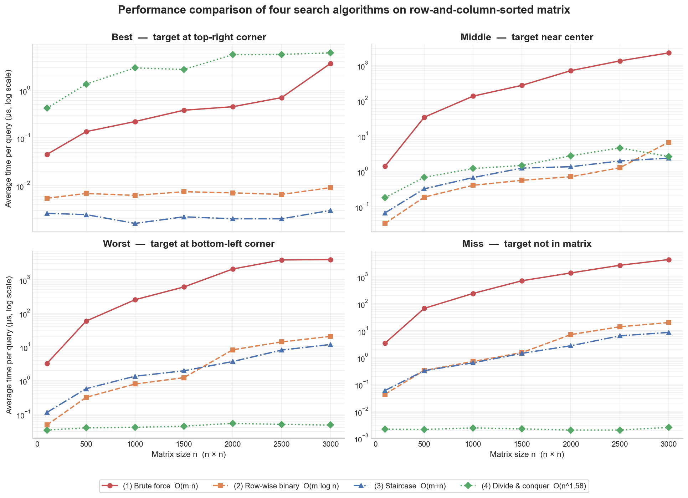
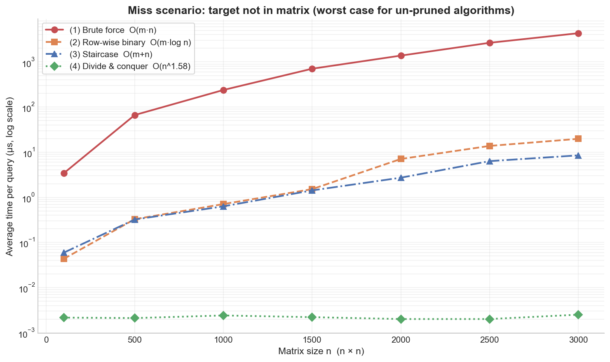

# 行列有序矩阵查找问题

## 题目信息

题目来源：算法分析与设计课程作业（2026-04-27）

知识点：分治、二分查找、矩阵搜索、复杂度分析

## 题目简述

> 给定一个 m × n 的矩阵 A，每一行从左到右严格递增，每一列从上到下严格递增。给定查询元素 target，判断 target 是否存在于 A 中。
>
> 要求：设计**不同策略**实现该查找，并进行**性能分析**。

## 题目分析

### 详细版

1. **读题**
   - 输入：双向严格递增的矩阵 A[m][n]，查询元素 target；
   - 输出：bool（target 是否存在于矩阵中）；
   - 关键约束：行内升序、列内升序——可以分别只利用其一，也可以联合利用。

2. **性质观察**
   - 仅利用行有序性：可对每行做二分查找；
   - 同时利用行 + 列有序性：从矩阵的右上角（或左下角）出发，每次比较都能排除一整行或一整列；
   - 利用区间值范围：若 target < 当前子矩阵的最小元素或 target > 最大元素，整个子矩阵立即可剪枝——这是分治算法效率突变的关键。

3. **算法选择**
   - 朴素：暴力遍历，不利用任何序关系，作为性能基线；
   - 部分利用：逐行二分查找，仅利用行内有序；
   - 完全利用：阶梯查找，每步排除一整行或一整列；
   - 分治：四象限划分，每次排除一个象限并对剩下三个象限递归。

4. **复杂度量纲**：详见各策略推导。

### 省流版

利用行+列双向有序性的"阶梯查找" O(m+n) 是工程最优解；分治法理论复杂度 O(n^1.58) 但常数大、缓存不友好；逐行二分 O(m·log n) 较为平衡；暴力 O(m·n) 仅作基线。实测中阶梯法多场景表现最佳，分治法仅在"不存在"查询的剪枝下才领先。

## 四种策略

### 策略①：暴力遍历 (Brute Force)

**思路**：双重循环逐元素扫描，遇到 target 即返回。完全不利用有序性。

**伪代码**：
```
function BruteForceSearch(A[m][n], target):
    for i from 0 to m - 1:
        for j from 0 to n - 1:
            if A[i][j] == target:
                return true
    return false
```

**复杂度**：时间 O(m·n)，空间 O(1)。

---

### 策略②：逐行二分查找 (Row-wise Binary Search)

**思路**：对每行独立做二分查找。仅利用行有序性，未利用列间有序性。
另加行级剪枝：若 target 不在当前行的 [A[i][0], A[i][n-1]] 区间内，跳过该行。

**伪代码**：
```
function RowBinarySearch(A[m][n], target):
    for i from 0 to m - 1:
        if target < A[i][0] or target > A[i][n - 1]:    // 行剪枝
            continue
        l ← 0,  r ← n - 1
        while l ≤ r:
            mid ← (l + r) / 2
            if A[i][mid] == target:
                return true
            else if A[i][mid] < target:
                l ← mid + 1
            else:
                r ← mid - 1
    return false
```

**复杂度**：时间 O(m·log n)，空间 O(1)。

---

### 策略③：阶梯查找 (Staircase Search)

**思路**：从矩阵右上角 (0, n-1) 出发：
- 当前元素等于 target → 命中；
- 当前元素 > target → 当前列下方所有元素都更大，左移一列（j-- ）；
- 当前元素 < target → 当前行右侧所有元素都已小于 target，下移一行（i++）。

每步至少排除一行或一列，最多走 m + n - 1 步。

**伪代码**：
```
function StaircaseSearch(A[m][n], target):
    i ← 0,  j ← n - 1
    while i < m and j ≥ 0:
        if A[i][j] == target:
            return true
        else if A[i][j] > target:
            j ← j - 1                  // 排除整列 j
        else:
            i ← i + 1                  // 排除整行 i
    return false
```

**正确性证明**（循环不变式）：
- 不变式：循环每一轮开始时，target 若存在则只可能在子矩阵 A[i..m-1][0..j] 中；
- 初始化：i=0, j=n-1，子矩阵即整个 A，平凡成立；
- 保持：
  * 若 A[i][j] > target，则第 j 列的 A[0..m-1][j] 都 ≥ A[0][j] ≥ A[i][j] > target，整列排除安全。j-- 后子矩阵仍包含 target（若存在）；
  * 若 A[i][j] < target，则第 i 行的 A[i][0..j] 都 ≤ A[i][j] < target，整行（在当前子区间内）排除安全。i++ 后子矩阵仍包含 target；
- 终止：i = m 或 j = -1 时子矩阵为空，故 target 不在 A 中。

**复杂度**：时间 O(m + n)，空间 O(1)。

---

### 策略④：分治四分搜索 (Divide and Conquer)

**思路**：取当前考察的子矩阵中心 A[mid_r][mid_c]，其中 mid_r = ⌊(r1+r2)/2⌋, mid_c = ⌊(c1+c2)/2⌋：
- A[mid_r][mid_c] == target → 命中；
- A[mid_r][mid_c] > target → 右下象限 [mid_r..r2][mid_c..c2] 所有元素都 ≥ A[mid_r][mid_c] > target，整体排除；递归剩下左上、上右、下左三个象限；
- A[mid_r][mid_c] < target → 左上象限 [r1..mid_r][c1..mid_c] 所有元素都 ≤ A[mid_r][mid_c] < target，整体排除；递归剩下上右、下左、右下三个象限。

并辅以**区间剪枝**：若 target < A[r1][c1] 或 target > A[r2][c2]，整个子矩阵无解。

**伪代码**：
```
function DivideSearch(A, target, r1, r2, c1, c2):
    if r1 > r2 or c1 > c2:                                 // 空矩阵
        return false
    if target < A[r1][c1] or target > A[r2][c2]:           // 区间剪枝
        return false
    mid_r ← (r1 + r2) / 2
    mid_c ← (c1 + c2) / 2
    if A[mid_r][mid_c] == target:
        return true
    if A[mid_r][mid_c] > target:                           // 排除右下象限
        return DivideSearch(A, target, r1, mid_r - 1, c1, mid_c - 1)   // 左上
            or DivideSearch(A, target, r1, mid_r - 1, mid_c, c2)       // 上右
            or DivideSearch(A, target, mid_r, r2, c1, mid_c - 1)       // 下左
    else:                                                  // 排除左上象限
        return DivideSearch(A, target, r1, mid_r, mid_c + 1, c2)       // 上右
            or DivideSearch(A, target, mid_r + 1, r2, c1, mid_c)       // 下左
            or DivideSearch(A, target, mid_r + 1, r2, mid_c + 1, c2)   // 右下
```

**复杂度推导**：

设方阵规模 n × n，元素数 N = n²。每次将矩阵划分为 4 个 (n/2)×(n/2) 子象限，排除其中 1 个，递归剩下 3 个：

$$T(N) = 3 \cdot T(N/4) + O(1)$$

由主定理（Master Theorem），a = 3, b = 4, f(N) = O(1)，且 log_b(a) = log₄(3) ≈ 0.7925：

$$T(N) = O(N^{\log_4 3}) = O(n^{2 \log_4 3}) = O(n^{1.585})$$

**空间复杂度**：递归栈深度 O(log n)。

---

## 复杂度对比表

| 策略 | 时间复杂度 | 空间复杂度 | 利用的有序性 |
|------|-----------|-----------|-----------|
| ① 暴力遍历 | O(m·n) | O(1) | 不利用 |
| ② 逐行二分 | O(m·log n) | O(1) | 仅行有序 |
| ③ 阶梯查找 | O(m + n) | O(1) | 行 + 列 |
| ④ 分治四分 | O(n^1.585)（方阵） | O(log n) | 行 + 列 + 区间 |

## 性能实验

### 实验设计

- **平台**：g++ 编译选项 `-O2 -std=c++17`，Windows 11
- **矩阵生成**：`A[i][j] = i·n + j`（行内步长 1、列内步长 n，所有元素互不相同）
- **规模**：n ∈ {100, 500, 1000, 1500, 2000, 2500, 3000}（n × n 方阵）
- **场景设计**：
  - **best**：target = A[0][n-1]（右上角，阶梯法 1 步命中）
  - **middle**：target = A[n/2][n/2]（中心位置）
  - **worst**：target = A[n-1][0]（左下角，阶梯法走完整 m+n 步）
  - **miss**：target = n² > A[n-1][n-1]（保证不存在）
- **计时**：`std::chrono::high_resolution_clock`，每组重复多次（暴力 20–200 次，其他 2000–20000 次）取均值，单位 μs。

### 实验数据（关键节点摘录，单位 μs）

| n | 场景 | ① 暴力 | ② 行二分 | ③ 阶梯 | ④ 分治 |
|---|------|--------|---------|--------|---------|
| 100 | best | 0.045 | 0.005 | **0.003** | 0.419 |
| 100 | middle | 1.40 | 0.033 | 0.066 | 0.179 |
| 100 | worst | 3.20 | 0.047 | 0.112 | **0.033** |
| 100 | miss | 3.40 | 0.043 | 0.059 | **0.002** |
| 1000 | best | 0.220 | 0.006 | **0.002** | 2.94 |
| 1000 | middle | 133.5 | **0.400** | 0.662 | 1.19 |
| 1000 | worst | 249.7 | 0.779 | 1.33 | **0.040** |
| 1000 | miss | 238.7 | 0.707 | 0.629 | **0.002** |
| 3000 | best | 3.65 | 0.009 | **0.003** | 6.06 |
| 3000 | middle | 2233 | 6.64 | 2.35 | **2.61** |
| 3000 | worst | 3911 | 20.4 | 11.7 | **0.047** |
| 3000 | miss | 4326 | 19.7 | 8.49 | **0.003** |

> **加粗表示该 (n, 场景) 下的最快算法。** 完整数据见 `results.csv`。

### 性能对比图



> **图 1**：四种场景下的性能对比小倍数图。y 轴为对数坐标。



> **图 2**：miss 场景下的单图对比。可清晰看到分治法（绿色）在区间剪枝下保持几乎水平的常数耗时，而暴力法（红色）随 n² 急剧上升。

### 结果分析

1. **暴力法的 O(m·n) 二次增长非常显著**
   n=3000 在 miss 场景下耗时 4326 μs，比阶梯法慢约 500 倍，比分治剪枝慢 10⁶ 倍。但在 best 场景仅需访问 n 个元素，差距骤减为 1000 倍。这印证了"复杂度是最坏情况上界，实际耗时取决于具体场景"。

2. **阶梯法 ③ 在多数场景下表现最佳**
   在 best 场景下 1 步命中（0.003 μs）；在 worst 场景下需走 m + n - 1 ≈ 2n 步，n=3000 时为 11.7 μs；在 middle / miss 场景表现稳定。整体性能可预测、空间常数最优，是工程实践的首选。

3. **逐行二分 ② 与阶梯 ③ 数量级相近**
   对方阵，二者比较次数分别为 m·log₂(n) ≈ 3·log₂(3000) ≈ 35000 与 m + n ≈ 6000，相差约 5 倍。实测耗时差距也在 2~3 倍范围内。

4. **分治法 ④ 表现极度不均衡**
   - **miss / worst 场景**：区间剪枝 `target < A[r1][c1] ∥ target > A[r2][c2]` 立即生效，几乎是 O(1)（n=3000 仅 0.003 μs）；
   - **best 场景**：反而最慢（n=3000 达 6.06 μs）——必须先逐层访问中心元素再判断方向，做了大量"无效"递归；
   - **middle 场景**：接近其理论复杂度。

5. **理论 vs. 实测**：
   分治法理论 O(n^1.585) 渐近优于行二分 O(n log n)，但**除 miss / worst 外并不占优**。原因：
   - 三路递归切分的子矩阵不连续，缓存命中率差；
   - 函数调用与栈帧开销大；
   - 阶梯 / 二分都是顺序访问，对 CPU 缓存极友好。

   这是经典的"渐近分析忽略常数因子"现象——**对一般查询场景，阶梯查找仍是最佳工程选择**。

## 结论

| 推荐场景 | 首选算法 | 理由 |
|----------|---------|-------|
| 通用查找 | ③ 阶梯查找 | O(m+n)、易实现、缓存友好 |
| 大量"不存在"查询 | ④ 分治四分 | 区间剪枝立即返回 |
| 教学 / 对照基线 | ① 暴力遍历 | 复杂度直观清晰 |
| 行远多于列时 | ② 逐行二分 | 行剪枝效果显著 |

**阶梯查找**以 O(m+n) 的最优渐近时间、O(1) 空间、易实现的特点，是行列有序矩阵查找问题的**工程首选**。**分治法**虽然渐近更优，但仅在区间剪枝有效（未命中查询、查询值远离中心）时才显示出优势，且常数与缓存特性较差，更适合作为"理论 vs. 实践"的对比案例。

## 源代码

- `search.h` — 四种算法实现（C++）
- `search.cpp` — 正确性验证程序（小规模交叉对拍）
- `benchmark.cpp` — 性能测试程序（输出 CSV）
- `plot.py` — 绘图脚本
- `results.csv` — 完整实验数据
- `performance.png` / `performance_miss.png` — 性能对比图
