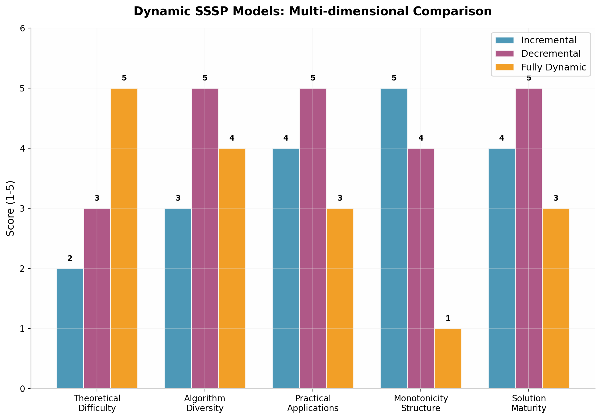
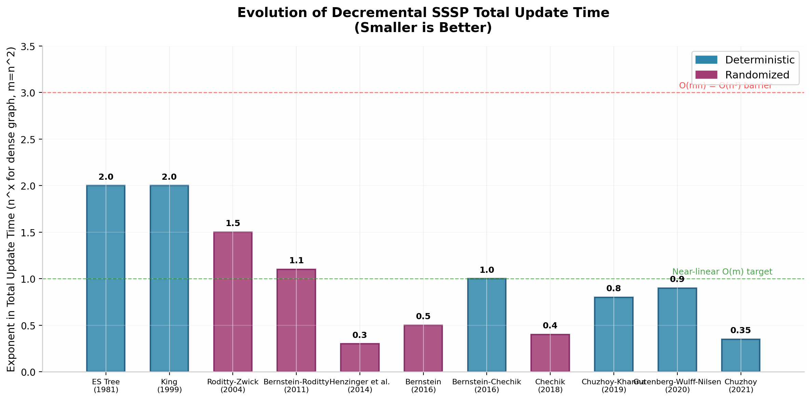

# 动态图单源最短路径算法研究——从 Even-Shiloach Tree 到现代 Dynamic SSSP 算法

**Dynamic Single-Source Shortest Path Algorithms: From Even-Shiloach Tree to Modern Dynamic SSSP Algorithms**

---

**摘要：** 动态图单源最短路径（Dynamic Single-Source Shortest Path, Dynamic SSSP）问题是图算法领域的核心课题之一，其目标是在图结构持续发生变化的场景下高效维护从给定源点到所有其他节点的最短路径信息。本文系统梳理了动态图最短路径算法从 Even 和 Shiloach 1981 年的开创性工作到 2020 年代最新进展的完整发展脉络。全文围绕"算法思想演化"与"复杂度演化"两条主线展开，深入剖析了 Incremental、Decremental 与 Fully Dynamic 三种动态模型的形成原因与技术特点，重点分析了 Even-Shiloach Tree 的设计思想及其对后续几十年研究的深远影响，总结了局部更新、影响区域、分层分解、随机采样等核心技术思想，并讨论了基于 OMv 猜想和 SETH 的条件复杂度下界。最后，本文提出了未来五到十年最值得关注的十大研究方向。

**关键词：** 动态图算法；单源最短路径；Even-Shiloach Tree；增量式算法；递减式算法；全动态算法；条件复杂度下界；近似算法

---

## 第一章 研究背景

### 1.1 静态图与动态图

图（Graph）是计算机科学中最基础、最通用的数据结构之一，广泛用于建模网络、系统与关系。一个静态图 $G=(V,E)$ 由顶点集 $V$ 和边集 $E$ 组成，每条边可能附带一个权重函数 $w:E\to\mathbb{R}$。在静态图的基础上，大量经典算法被提出：深度优先搜索（DFS）和广度优先搜索（BFS）提供了线性时间的图遍历能力；Dijkstra 算法以 $O(m+n\log n)$ 的时间复杂度求解单源最短路径（SSSP）；Bellman-Ford 算法可以处理负权边；Floyd-Warshall 算法以 $O(n^3)$ 的复杂度求解全源最短路径（APSP）。这些算法构成了图论算法教育的基石，并在实践中得到了广泛应用。

然而，真实世界中的大多数图并非一成不变。交通网络中道路可能因为施工或拥堵而临时关闭；通信网络中链路可能因故障而中断或因扩容而新增；社交网络中用户不断建立或解除好友关系；数据库中的实体关联也在持续演化。**动态图（Dynamic Graph）** 正是为了建模这类持续变化的图结构而提出的概念。与静态图不同，动态图允许在算法的运行过程中执行更新操作（Update Operation），包括插入新边、删除已有边或修改边的权重。每次更新后，图的拓扑结构或距离度量发生变化，算法需要及时调整其内部状态以反映最新的图结构。

动态图算法的研究历史可以追溯到 1960 年代。Loubal [(arXiv.org)](https://arxiv.org/html/2605.03225v1)  和 Murchland [(arXiv.org)](https://arxiv.org/pdf/1308.0776)  分别独立提出了最早的全动态最短路径算法。Rodionov [(arXiv.org)](https://arxiv.org/pdf/1507.04330)  也在 1968 年研究了类似问题。然而，在长达三十多年的时间里，这些早期算法在最坏情况下并不比每次更新后重新运行静态算法更高效。直到 1990 年代末和 2000 年代初，随着 King [(arXiv.org)](https://arxiv.org/pdf/2209.09732) 、Demetrescu 和 Italiano [(arXiv.org)](https://arxiv.org/pdf/2209.09732v1)  等人的突破性工作，动态图算法才真正开始超越静态重计算的效率瓶颈，形成了一个独立而活跃的研究领域。

### 1.2 动态更新模型

根据所支持的更新操作类型，动态图算法的研究通常分为三种模型。**增量式模型（Incremental Model）** 仅支持边的插入操作（或权重的降低），适用于网络不断扩展的场景，如社交网络中新用户持续加入、通信网络中新链路不断部署。**递减式模型（Decremental Model）** 仅支持边的删除操作（或权重的增加），建模网络退化或收缩的场景，如道路关闭、通信链路故障。**全动态模型（Fully Dynamic Model）** 同时支持边的插入和删除，是最通用但也最困难的模型，能够处理任何类型的图结构变化。

这三种模型的形成并非偶然，而是反映了不同应用场景的需求，也揭示了动态图问题内在的复杂性层次。递增式问题通常最容易，因为边的插入只会引入新的路径可能性，不会破坏已有的最短路径结构。递减式问题则更具挑战性，因为边的删除可能导致已有最短路径失效，需要寻找替代路径。全动态问题综合了两种难度，要求算法同时具备处理"好消息"（边插入）和"坏消息"（边删除）的能力。值得注意的是，这三种模型的区分不仅具有实践意义，更具有深刻的理论意义：Roditty 和 Zwick [(ACM Digital Library)](https://dl.acm.org/doi/10.1145/3564246.3585196)  证明，对于精确距离维护，$O(mn)$ 的总更新时间下限适用于递减式模型，这意味着仅通过允许近似解才能突破这一界限。

### 1.3 Dynamic SSSP 的定义

**动态单源最短路径问题（Dynamic SSSP）** 定义如下：给定一个带权图 $G=(V,E,w)$ 和一个固定源点 $s\in V$，设计一个数据结构，使其能够在图 $G$ 发生一系列更新操作（边插入、边删除或权重修改）的过程中，持续维护从 $s$ 到所有其他节点 $v\in V$ 的最短距离 $d(s,v)$，并支持高效的查询操作。数据结构的核心性能指标包括：

- **更新时间（Update Time）**：处理一次边更新所需的时间。可以进一步细分为**摊销更新时间（Amortized Update Time）**和**最坏情况更新时间（Worst-case Update Time）**。
- **查询时间（Query Time）**：回答一次 $d(s,v)$ 查询所需的时间。通常要求为 $O(1)$ 或近常数时间。
- **总更新时间（Total Update Time）**：处理整个更新序列（如 $m$ 次边删除）所需的累计时间。对于递减式和递增式模型，总更新时间是核心指标。
- **空间复杂度（Space Complexity）**：数据结构占用的内存空间。
- **近似比（Approximation Ratio）**：如果算法输出 $(1+\epsilon)$-近似距离，则称为近似算法。

在递减式 SSSP 中，由于边只会被删除，源点到各节点的距离具有**单调不减**的重要性质，即随着边的删除，$d(s,v)$ 只会增大或保持不变。这一性质是 Even-Shiloach Tree 等递减式算法的核心基础。

### 1.4 实际应用场景

动态最短路径算法在众多领域具有直接而重要的应用价值。在**智能交通系统**中，城市道路网络可建模为带权图，边权重代表通行时间。交通事故、施工或信号灯调控导致道路临时关闭或通行时间变化，导航系统需要在毫秒级别内重新计算最优路线。传统的"重新运行 Dijkstra"策略在面对城市级道路网络（数万节点、数十万边）时无法满足实时性要求。

在**通信网络**中，路由器之间的链路状态因拥塞、故障或负载均衡策略而动态变化。OSPF（Open Shortest Path First）和 IS-IS 等链路状态路由协议本质上就是在分布式环境中维护动态最短路径树的实例。每个路由器需要快速重新计算到目标网络的最优路径，以确保数据包的高效转发。

在**社交网络分析**中，用户关系的建立与断裂、信息传播路径的变化都可以用动态图建模。单源最短路径可用于计算信息从某个初始用户传播到整个网络的最短时间和影响范围。动态算法使得这类分析可以在关系持续变化的情况下进行实时追踪。

在**数据库系统**中，图数据库（如 Neo4j、TigerGraph）广泛支持动态图查询。当图中的实体关系发生变化时，系统需要增量式地更新预先计算好的路径信息，而非每次都从头开始计算。这在金融风控、知识图谱等场景中尤为重要。

### 1.5 为什么静态算法无法直接适应动态图

面对动态图的更新，最直观的策略是**静态重计算（Static Recomputation）**：每次更新后，丢弃之前的计算结果，重新在更新后的图上运行 Dijkstra 或 Bellman-Ford 算法。这种策略的时间复杂度为 $O(m+n\log n)$ 每次更新。对于 $m$ 次更新，总时间复杂度高达 $O(m^2+mn\log n)$，在稠密图上接近 $O(mn)$ 每次更新。这种策略造成了严重的**重复计算浪费**。

重复计算浪费体现在两个层面。第一层是**冗余遍历**：大多数图更新只影响图中一小部分节点的最短路径。例如，一条边的删除如果不在当前最短路径树上，则对任何距离都没有影响。然而，静态重计算会遍历整个图，对所有节点进行松弛操作，其中绝大部分是无用功。第二层是**重复工作**：连续多次更新可能影响高度重叠的节点集合。静态重计算每次都在相同的局部区域重复执行相似的计算。

动态图算法的核心目标正是**避免重复计算**。其基本策略是：在每次更新时，仅识别并重新计算**受影响的节点和边（Affected Region）**，而保留未受影响部分的计算结果。理想的动态算法应该具有与受影响区域大小成正比的更新时间，即 $O(\|\delta\|+|\delta|\log|\delta|)$，其中 $\|\delta\|$ 是受影响的边数，$|\delta|$ 是受影响的节点数 [(ResearchGate)](https://www.researchgate.net/publication/222560600_Fully_dynamic_all-pairs_shortest_paths_with_real_weights) 。Ramalingam 和 Reps 的经典工作正是基于这一思想，提出了 Dynamic SWSF-FP 算法，将更新时间降低到与受影响区域大小相关的水平。

---

## 第二章 Dynamic SSSP 问题建模

### 2.1 基本定义与操作

为了形式化地讨论 Dynamic SSSP，我们需要精确定义问题实例和基本操作。给定一个**初始图** $G_0=(V,E_0,w_0)$ 和一个固定的源点 $s\in V$，图的演化通过一系列**更新操作** $\mathcal{U}=(u_1,u_2,\ldots,u_k)$ 描述。每次更新操作后，图变为 $G_i=(V,E_i,w_i)$。数据结构需要在处理完每次更新后，都能够回答从 $s$ 到任意节点 $v$ 的距离查询。

更新操作包括三种类型：

- **边插入（Edge Insertion）**：$\text{Insert}(u,v,w)$ 向图中添加一条新边 $(u,v)$，权重为 $w$。如果边已存在，则相当于权重降低。
- **边删除（Edge Deletion）**：$\text{Delete}(u,v)$ 从图中移除边 $(u,v)$。在递减式模型中，这是唯一的更新操作。
- **权重修改（Weight Update）**：$\text{Update}(u,v,w')$ 将边 $(u,v)$ 的权重从当前值修改为 $w'$。权重增加可视为"删除+插入"的组合。

查询操作包括：

- **距离查询（Distance Query）**：给定目标节点 $v$，返回当前 $d(s,v)$ 的值（或近似值）。
- **路径查询（Path Query）**：给定目标节点 $v$，返回一条从 $s$ 到 $v$ 的最短路径（或近似最短路径）。

### 2.2 Incremental Dynamic SSSP

增量式模型只支持边插入和权重降低操作。在这一模型中，每次更新只会引入新的路径可能性，不会破坏已有的最短路径。因此，距离值具有**单调不增**的性质：$d_{i+1}(s,v)\leq d_i(s,v)$。这一性质使得增量式问题在三种模型中理论上最容易处理。

增量式场景的典型应用包括：社交网络中新用户不断注册并建立连接、互联网中新网站持续上线并创建超链接、学术网络中新的合作关系不断形成。在这些场景中，网络规模随时间增长，但已有关系很少消失。

从理论角度看，增量式 SSSP 的算法设计关键在于**高效地利用新插入的边来更新距离**。当插入一条边 $(u,v,w)$ 时，唯一需要检查的是：通过这条新边是否能改善从 $s$ 到某些节点的距离。具体而言，如果 $d(s,u)+w<d(s,v)$，则 $v$ 的距离可以降低；进一步，$v$ 的距离降低可能通过图传播，导致更多节点的距离更新。这一过程类似于 Bellman-Ford 的松弛传播，但只发生在局部受影响区域。

Ausiello、Italiano、Marchetti-Spaccamela 和 Nanni [(ResearchGate)](https://www.researchgate.net/publication/220669446_Speeding_Up_Dynamic_Shortest-Path_Algorithms)  在 1991 年提出了针对有向无权图的增量式 APSP 算法，总更新时间达到了 $\tilde{O}(n^3)$。这一结果表明，即使在最简单的增量式模型中，精确维护全源最短路径也具有相当高的复杂度。Gutenberg、Vassilevska Williams 和 Wein [(ACM Digital Library)](https://dl.acm.org/doi/10.1145/2897518.2897521)  在 2020 年研究了有向图中增量式 SSSP 的复杂度，揭示了即使在稀疏图中，增量式精确 SSSP 也面临非平凡的下界约束。

### 2.3 Decremental Dynamic SSSP

递减式模型只支持边删除和权重增加操作。与增量式相反，递减式场景中距离值具有**单调不减**的性质：$d_{i+1}(s,v)\geq d_i(s,v)$。这一单调性虽然比增量式场景更受限，但删除操作可能导致已有最短路径树的大面积重构，使得递减式问题在实践中更具挑战性。

递减式场景的典型应用包括：网络中链路因故障而中断、道路因施工或灾害而封闭、社交网络中用户解除好友关系。在这些场景中，网络的关键连接可能突然消失，需要快速找到替代路径。

递减式 SSSP 是动态图算法中研究历史最长、成果最丰富的分支。Even 和 Shiloach [(arXiv.org)](https://arxiv.org/html/2508.14319v1)  在 1981 年提出的 ES Tree 是这一领域的奠基性工作，其 $O(mn)$ 的总更新时间在三十年间未被超越。Roditty 和 Zwick [(ACM Digital Library)](https://dl.acm.org/doi/10.1145/3564246.3585196)  在 2011 年证明，除非在组合算法上取得突破性进展（如打破布尔矩阵乘法的复杂度界限），否则 $O(mn)$ 是精确递减式 SSSP 的最优复杂度。这一理论结果促使研究者们转向**近似算法**的设计：通过牺牲距离精度来换取显著的速度提升。Henzinger、Krinninger 和 Nanongkai [(arXiv.org)](https://arxiv.org/html/2408.14406v1)  在 2014 年终于突破了 $O(mn)$ 的界限，提出了 $O(m^{1+o(1)})$ 总更新时间的 $(1+\epsilon)$-近似递减式 SSSP 算法，宣告了近线性时间时代的到来。

递减式问题之所以最早被深入研究，一个重要原因是其单调性性质使得分析更加清晰。在递减式场景中，每个节点的距离只会向上"漂移"，这种单向变化比全动态场景中距离的上下波动更易于控制和量化。此外，递减式问题与许多其他图问题有着深刻的联系，如传递闭包维护、强连通分量维护、最大流问题等，推动了整个动态图算法领域的发展。

### 2.4 Fully Dynamic SSSP

全动态模型同时支持边的插入和删除，是最通用但也最困难的模型。在全动态场景中，距离值不再具有单调性：一次边插入可能降低某些距离，而一次边删除可能增加另一些距离。这种双向波动使得数据结构的设计必须同时应对两种"方向"的变化，大大增加了问题的复杂性。

全动态 SSSP 的研究分为两个主要分支。**精确算法**分支追求维护准确的最短距离，以 Demetrescu 和 Italiano [(arXiv.org)](https://arxiv.org/pdf/2209.09732v1)  2004 年的工作为代表，达到了 $O(n^2)$ 的摊销更新时间（顶点更新）。**近似算法**分支允许一定误差，换取更好的时间复杂度，如 Bernstein [(arXiv.org)](https://arxiv.org/abs/2306.02662)  2009 年提出的 $(2+\epsilon)$-近似算法，摊销更新时间接近线性。

全动态模型的一个核心困难在于：边插入和边删除之间存在根本性的不对称。插入操作可以通过"松弛"方式高效处理——只需检查新边是否能改善距离。但删除操作需要处理"替代路径"问题：当一条最短路径上的边被删除后，必须找到不经过该边的次优替代路径。这一问题在组合层面极其困难，涉及图中的大量结构信息。

值得注意的是，全动态模型中的**顶点更新（Vertex Update）** 比边更新更通用：一次顶点删除等价于删除所有与该顶点关联的边，一次顶点插入等价于插入一个新顶点及其所有关联边。因此，支持顶点更新的数据结构自动支持边更新（通过删除并重新插入一个端点）。Demetrescu 和 Italiano [(arXiv.org)](https://arxiv.org/pdf/2209.09732v1)  的 $O(n^2)$ 算法以及 Thorup [(ACM Digital Library)](https://dl.acm.org/doi/abs/10.1145/3618260.3649695)  的改进都是基于顶点更新模型。

| 模型 | 支持操作 | 距离单调性 | 代表复杂度 | 主要挑战 |
|------|---------|-----------|-----------|---------|
| Incremental | 边插入、权重降低 | 不增 | $\tilde{O}(n^3)$ (APSP)  [(ResearchGate)](https://www.researchgate.net/publication/220669446_Speeding_Up_Dynamic_Shortest-Path_Algorithms)  | 传播效应控制 |
| Decremental | 边删除、权重增加 | 不减 | $O(m^{1+o(1)})$ (近似)  [(arXiv.org)](https://arxiv.org/html/2408.14406v1)  | 替代路径查找 |
| Fully Dynamic | 边插入+删除 | 无 | $O(n^2)$ 摊销 (精确)  [(arXiv.org)](https://arxiv.org/pdf/2209.09732v1)  | 双向波动处理 |

**图1：** 三种动态 SSSP 模型的多维度对比。Decremental 模型在算法多样性、实际应用丰富度和解决方案成熟度上得分最高；Incremental 模型在单调性结构上最具优势；Fully Dynamic 模型理论难度最高但单调性结构最弱。

---

## 第三章 静态最短路径算法回顾

### 3.1 BFS 与无权图最短路径

在无权图（或单位权重图）中，广度优先搜索（BFS）是求解 SSSP 的最基本算法。BFS 从源点 $s$ 出发，按层次遍历图：第 0 层包含 $s$ 本身，第 1 层包含 $s$ 的所有邻居，第 2 层包含距离 $s$ 为 2 的节点，依此类推。BFS 的时间复杂度为 $O(m+n)$，既是最优的也是简洁的。BFS 生成的最短路径树（BFS Tree）同时包含了距离信息和路径信息。

BFS 在动态图中的局限性十分明显。当一条边被删除时，BFS 树可能需要大规模重构——如果删除的边位于 BFS 树的某条分支上，则该分支下的所有子树都可能需要重新确定父节点。在最坏情况下，单次边删除可能导致 $\Omega(n)$ 个节点的父指针发生变化。当一条边被插入时，如果这条边连接了两个原本距离较远的层次，则可能"短路"大量节点的距离，引发级联更新。静态 BFS 完全不具备处理这类增量更新的能力。

### 3.2 Bellman-Ford 算法

Bellman-Ford 算法适用于带权有向图，即使存在负权边（只要不存在从源点可达的负权环），也能正确求解 SSSP。算法通过 $n-1$ 轮松弛操作逐步逼近最优距离：每轮遍历所有边，检查是否可以通过某条边改善目标节点的距离估计。Bellman-Ford 的时间复杂度为 $O(mn)$，比 Dijkstra 慢，但适用性更广。

Bellman-Ford 的动态扩展相对直接。在增量式场景中，新边的插入可以通过额外的松弛轮次来处理：如果一条新边 $(u,v,w)$ 满足 $d(s,u)+w<d(s,v)$，则 $v$ 的距离降低，并可能引发进一步的松弛传播。这种"距离传播"思想是增量式动态算法的核心。然而，在递减式场景中，Bellman-Ford 面临严重困难：边的删除可能导致距离增加，而 Bellman-Ford 的松弛机制只能处理距离降低的情况。处理距离增加需要从根本上改变算法策略，这也是 Even-Shiloach Tree 与 Bellman-Ford 的本质区别所在。

### 3.3 Dijkstra 算法

Dijkstra 算法是带权图 SSSP 的基石算法，适用于非负权重的图。算法维护一个优先队列（通常是最小堆），每次从队列中取出距离估计最小的节点，对其出边进行松弛操作。使用二叉堆的实现时间复杂度为 $O(m\log n)$，使用斐波那契堆可进一步降至 $O(m+n\log n)$。Dijkstra 算法的正确性建立在非负权边的关键性质之上：一旦一个节点从优先队列中被取出，其最短距离即已确定。

每次更新后重新运行 Dijkstra 的策略（称为"Recompute-from-Scratch"或"Static Approach"）在 $m$ 次更新下总时间为 $O(m^2\log n)$。这一策略的浪费主要体现在两个方面。第一，**全局重复计算**：大多数更新只影响图中一小部分节点的最短路径，但 Dijkstra 每次都从源点出发遍历整个图。第二，**堆操作的浪费**：Dijkstra 需要在优先队列中进行 $O(n)$ 次插入和 $O(m)$ 次减小键操作，其中大量操作针对的是距离未发生变化的节点。理想情况下，动态算法应该仅对距离发生变化的节点执行堆操作，将时间复杂度降低到与"变化量"成正比。

### 3.4 DAG 最短路径与拓扑序

在有向无环图（DAG）中，最短路径可以通过拓扑排序在线性时间 $O(m+n)$ 内求解。按照拓扑序依次松弛每个节点的出边，即可在单遍扫描中得到所有最短距离。DAG 最短路径在动态场景中有特殊的应用：如果动态图的更新保持无环性（如在增量式 DAG 中插入新边），则可以利用拓扑序的高效更新来维护最短路径。

Italiano [(ResearchGate)](https://www.researchgate.net/publication/220190794_Interval-regular_graphs)  在 1988 年研究了 DAG 中的增量式最短路径问题，提出了高效的更新策略。DAG 的拓扑序约束消除了替代路径的复杂性，因为任何路径都遵循拓扑序的方向。当在 DAG 中删除一条边时，受影响节点的替代路径搜索被限制在拓扑序的下游方向，显著缩小了搜索空间。

### 3.5 为什么静态算法无法直接用于动态图

综合以上分析，静态最短路径算法无法直接适应动态图的根本原因在于**算法设计目标的根本差异**。静态算法以"从头计算所有距离"为目标，其每一步操作都是为了从零构建完整的最短路径树。而动态算法以"增量式修正已有结果"为目标，其核心挑战在于识别哪些距离发生了变化、变化了多少、如何高效地传播这些变化。

具体而言，静态算法在动态场景中面临以下系统性障碍：

**单调性破坏**：Dijkstra 和 BFS 依赖于距离值从无穷大逐步收敛到最优值的过程。在递减式场景中，距离可能"倒退"（增大），这与静态算法的基本假设相悖。Even-Shiloach Tree 的成功之处正是在于它建立了一套处理距离"倒退"的机制。

**全局依赖**：静态算法中，每个节点的最短距离依赖于全局图结构。动态更新改变了局部结构，但静态算法无法利用"只有局部受影响"这一事实。Ramalingam 和 Reps [(ResearchGate)](https://www.researchgate.net/publication/222560600_Fully_dynamic_all-pairs_shortest_paths_with_real_weights)  的 Affected Region 思想正是为了解决这一问题：通过显式地识别受影响节点，将计算限制在局部区域。

**数据结构不匹配**：静态算法通常使用优先队列等"一次性"数据结构，不适合增量式更新。动态算法需要设计能够持续维护、增量更新的数据结构，如 Even-Shiloach Tree 中的层级结构、Demetrescu-Italiano 算法中的路径组合结构。

---

## 第四章 Dynamic SSSP 的发展历史

### 4.1 1970 年代：问题的萌芽

动态图最短路径问题的研究可以追溯到 1960 年代末和 1970 年代初。1967 年，Loubal [(arXiv.org)](https://arxiv.org/html/2605.03225v1)  发表了关于网络评估过程的研究，探讨了在交通网络分析中如何高效处理链路长度的变化。同年，Murchland [(arXiv.org)](https://arxiv.org/pdf/1308.0776)  研究了单条弧长变化对所有最短距离的影响，提出了增量式更新的初步思想。1968 年，Rodionov [(arXiv.org)](https://arxiv.org/pdf/1507.04330)  独立研究了动态全对最短路径问题。1970 年代见证了动态图问题的初步理论框架建立，包括 Gallo [(ACM Digital Library)](https://dl.acm.org/doi/10.5555/644108.644172)  和 Fujishige [(ar5iv)](https://ar5iv.labs.arxiv.org/html/2102.11169)  对半动态（增量式）问题的研究。然而，这一时期的算法在最坏情况下并不比静态重计算更高效，动态图算法的独立价值尚未得到充分认识。

### 4.2 1981 年：Even-Shiloach Tree 的里程碑

1981 年是动态图算法发展史上的决定性年份。Even 和 Shiloach [(arXiv.org)](https://arxiv.org/html/2508.14319v1)  在 Journal of the ACM 上发表了题为"An On-Line Edge-Deletion Problem"的论文，提出了后来被称为 **Even-Shiloach Tree（ES Tree）** 的数据结构。ES Tree 针对递减式无权无向图，以 $O(mn)$ 的总更新时间和 $O(1)$ 的查询时间维护了从源点到所有节点的最短距离。

ES Tree 的核心创新在于**层级维护机制**。它为每个节点维护一个"层级"（Level），表示该节点到源点的当前距离。当一条边被删除时，算法通过局部检查来确定哪些节点的层级需要提高。关键是，由于距离具有单调不减的性质，每个节点的层级最多提高 $n$ 次（从 0 到 $n-1$），这一观察使得总更新时间可以被限制在 $O(mn)$。ES Tree 的设计思想——利用单调性限制每个节点的更新次数——成为后续几十年动态图算法的范式。

ES Tree 不仅是递减式 SSSP 的奠基性工作，也为其他动态图问题提供了基础数据结构。Henzinger 和 King [(arXiv.org)](https://arxiv.org/pdf/2203.16992)  在 1995 年发现 ES Tree 可以适配到有向图，King [(arXiv.org)](https://arxiv.org/pdf/2209.09732)  在 1999 年进一步将其扩展到带正整数权重的有向图。ES Tree 成为后续几乎所有递减式算法的基础组件。

### 4.3 1990 年代：向全动态拓展

1990 年代是动态图算法从递减式向全动态拓展的关键时期。1991 年，Ausiello、Italiano、Marchetti-Spaccamela 和 Nanni [(ResearchGate)](https://www.researchgate.net/publication/220669446_Speeding_Up_Dynamic_Shortest-Path_Algorithms)  提出了增量式 APSP 算法，针对无权有向图达到了 $\tilde{O}(n^3)$ 的总更新时间。1995 年，Henzinger 和 King [(arXiv.org)](https://arxiv.org/pdf/2203.16992)  在 FOCS 上发表了全动态传递闭包和双连通性算法，将随机化技术引入动态图算法，实现了多对数时间的每次更新。他们认识到 ES Tree 可以适配到有向图，用于维护单源可达性。

1996 年，Ramalingam 和 Reps [(ResearchGate)](https://www.researchgate.net/publication/222560600_Fully_dynamic_all-pairs_shortest_paths_with_real_weights)  提出了基于**影响区域（Affected Region）**的动态 SSSP 算法（Dynamic SWSF-FP），这是全动态 SSSP 的里程碑。他们的算法在每次更新时显式识别受影响的节点集合，仅对这些节点执行 Dijkstra 式的松弛。对于 SSSP，更新时间达到了 $O(\|\delta\|+|\delta|\log|\delta|)$，其中 $\delta$ 是受影响的子图。这一工作首次证明了动态算法在实践中的潜力——当更新影响范围较小时，动态算法可以比静态重计算快数个数量级。

1999 年，King [(arXiv.org)](https://arxiv.org/pdf/2209.09732)  在 FOCS 上提出了全动态 APSP 算法，针对正整数权重图达到了 $O(n^{2.5}\sqrt{C\log n})$ 的摊销更新时间（$C$ 为最大边权重）。King 的算法结合了 ES Tree、长路径性质和树数据结构等多种技术，是首个在理论上优于静态重计算的全动态 APSP 算法。

### 4.4 2000-2005：突破二次壁垒

2000 年代初期见证了动态最短路径领域的多项重大突破。2000 年，Demetrescu 和 Italiano [(arXiv.org)](https://arxiv.org/pdf/2306.02662)  提出了全动态传递闭包算法，突破了 $O(n^2)$ 的更新壁垒。2002 年，Demetrescu 和 Italiano [(arXiv.org)](https://arxiv.org/pdf/2209.09732v1)  在 JACM 上发表了划时代的工作，提出了全动态 APSP 算法，在实数加权有向图上达到了 $O(n^2\log^3 n)$ 的摊销更新时间，后被 Thorup [(ACM Digital Library)](https://dl.acm.org/doi/abs/10.1145/3618260.3649695)  改进为 $O(n^2(\log n+\log^2((m+n)/n)))$。

Demetrescu-Italiano（DI）算法的核心思想是**局部最短路径（Locally Shortest Paths）**和**历史最短路径（Historical Shortest Paths）**。算法维护一组"局部历史路径"，这些路径在边权重更新时可以通过类似 Dijkstra 的过程高效更新。DI 算法的重要性在于：它证明了即使对于最一般的实数加权有向图，全动态 APSP 也可以达到 $O(n^2)$ 的摊销更新时间，这一结果与显式维护距离矩阵所需的下界 $\Omega(n^2)$ 相匹配。

2004-2005 年，Thorup [(ACM Digital Library)](https://dl.acm.org/doi/abs/10.1145/3618260.3649695)  对 DI 算法进行了简化和扩展。Thorup 的改进版本不仅降低了常数因子，还扩展到了支持负权环检测，并首次给出了优于静态重计算的**最坏情况**更新时间 $O(n^{2.75})$。Thorup 的工作揭示了 DI 算法的本质：通过巧妙的矩阵乘积重新评估，将全动态问题转化为一系列递减式子问题。

2004 年，Roditty 和 Zwick [(ar5iv)](https://ar5iv.labs.arxiv.org/html/1705.02044)  提出了近似全动态 APSP 算法，针对无权无向图达到了 $O(mn)$ 的总更新时间和 $(1+\epsilon)$-近似。他们的算法基于 ES Tree 和稀疏图模拟器（Spanner/Emulator）的结合，开创了"近似 + 稀疏化"的新范式。

### 4.5 2010-2015：近似算法的繁荣

2010 年代初期，精确动态算法的进展放缓，研究重心转向近似算法。2011 年，Bernstein 和 Roditty [(arXiv.org)](https://arxiv.org/pdf/2110.11712)  提出了针对递减式无权无向图的 $(1+\epsilon)$-近似算法，总更新时间达到 $O(n^{2+O(1/\sqrt{\log n})})$，首次打破了 ES Tree 的 $O(mn)$ 壁垒。这一突破依赖于**稀疏模拟器（Sparse Emulator）**的维护：通过在稀疏图上运行 ES Tree 来近似原图的距离。

2011 年，Roditty 和 Zwick [(ACM Digital Library)](https://dl.acm.org/doi/10.1145/3564246.3585196)  发表了重要论文，证明了 $O(mn)$ 是精确递减式 SSSP 的条件最优复杂度（基于布尔矩阵乘法 hardness）。这一理论结果明确了精确算法的极限，为近似算法研究提供了理论依据。

2013 年，Henzinger、Krinninger 和 Nanongkai [(arXiv.org)](https://arxiv.org/html/2306.02662v3)  在 FOCS 上提出了两项突破性技术：**移动 ES Tree（Moving Even-Shiloach Tree）**和**单调 ES Tree（Monotone Even-Shiloach Tree）**。这些技术使得 ES Tree 可以在更一般的场景中使用，包括在近似算法框架中的灵活部署。2014 年，同一团队 [(arXiv.org)](https://arxiv.org/html/2408.14406v1)  终于实现了递减式 SSSP 的近线性时间算法，总更新时间 $O(m^{1+o(1)})$，宣告了该领域的重大突破。

2014 年，Henzinger、Krinninger 和 Nanongkai [(ar5iv)](https://ar5iv.labs.arxiv.org/html/1905.11512)  还提出了针对有向图的次二次时间递减式 SSSP 算法。2015 年，他们 [(arXiv.org)](https://arxiv.org/html/2406.17210v2)  进一步提出了基于**在线矩阵-向量乘法（OMv）猜想**的统一硬度框架，为动态图问题提供了系统性的条件复杂度下界。

### 4.6 2016-2020：确定性算法与有向图

2016 年，Bernstein [(arXiv.org)](https://arxiv.org/pdf/2406.17210)  提出了针对加权有向图的递减式 SSSP 算法，总更新时间 $\tilde{O}(m\log W)$，这是首个处理有向加权图的次 $O(mn)$ 算法。同年的 STOC 上，Bernstein 和 Chechik [(arXiv.org)](https://arxiv.org/pdf/2109.05621)  提出了首个**确定性**算法突破 $O(mn)$ 界限，针对无权无向图达到了 $\tilde{O}(n^2)$ 的总更新时间。2017 年，他们 [(arXiv.org)](https://arxiv.org/html/2502.21240v1)  进一步将这一结果改进到 $\tilde{O}(mn^{3/4})$。

确定性算法的突破具有重要意义。在此之前，所有超越 $O(mn)$ 的算法都是随机化的，依赖于**隐藏中心点（Hidden Centers）**技术——随机选取一组中心节点维护 ES Tree，利用随机化"隐藏"这些中心点以对抗自适应敌手。Bernstein 和 Chechik 的确定性算法通过巧妙的**均摊论证（Amortization Argument）**和**ES Tree 重定位（Relocating ES Trees）**技术，在不依赖随机化的情况下实现了超越 $O(mn)$ 的性能。

2018 年，Chechik [(arXiv.org)](https://arxiv.org/pdf/2001.10809)  提出了近最优的近似递减式 APSP 算法，达到了 $O(mn^{1/k+o(1)})$ 的总更新时间和 $(2k-1+\epsilon)$-近似。2019 年，Chuzhoy 和 Khanna [(arXiv.org)](https://arxiv.org/pdf/1511.06773)  提出了针对有向图递减式 SSSP 的新算法，并应用于顶点容量流和割问题。

2020 年，Gutenberg 和 Wulff-Nilsen [(arXiv.org)](https://arxiv.org/pdf/1512.08148)  提出了针对加权有向图的更快确定性递减式近似算法，以及更简单的确定性算法框架。同年，他们还 [(arXiv.org)](https://arxiv.org/html/2509.13584v1)  改进了全动态 APSP 的最坏情况时间和空间界限。

### 4.7 2021-2025：近最优与全动态 SSSP

2021 年，Chuzhoy [(arXiv.org)](https://arxiv.org/pdf/2010.00937)  提出了确定性递减式 APSP 的近线性时间算法。Chuzhoy 和 Saranurak [(arXiv.org)](https://arxiv.org/html/2502.21240v3)  通过**分层核心分解（Layered Core Decomposition）**技术，提出了更简单的确定性递减式最短路径算法。2021 年，Bernstein、Gutenberg 和 Saranurak [(شمرا أكاديميا)](https://shamra-academia.com/index.php/show/3a444506750751)  提出了确定性递减式 SSSP 和近似最小费用流的近线性时间算法。

2022 年，van den Brand、Forster 和 Nazari [(ACM Digital Library)](https://dl.acm.org/doi/pdf/10.5555/3381089.3381244)  提出了快速确定性全动态距离近似算法。同年，Karczmarz、Mukherjee 和 Sankowski 提出了针对有向图全动态路径报告的子二次时间算法。2023 年，Karczmarz 等人 [(ACM Digital Library)](https://dl.acm.org/doi/10.1145/3564246.3585213)  提出了首个非平凡的确定性全动态精确 SSSP 算法，解决了 van den Brand 和 Nanongkai 2019 年提出的开放问题。

2024 年，全动态 APSP 领域继续取得进展。Mao 等人提出了随机化 $O(n^{2.5})$ 最坏情况更新时间的算法，达到了被广泛猜测的最优界限。2025 年，确定性全动态 APSP 的新算法进一步改进了更新时间的常数因子。

| 时期 | 代表论文 | 核心贡献 | 复杂度突破 |
|------|---------|---------|-----------|
| 1967-1980  [(arXiv.org)](https://arxiv.org/html/2605.03225v1)  | Loubal, Murchland | 问题提出 | $O(n^3)$ 每次更新 |
| 1981  [(arXiv.org)](https://arxiv.org/html/2508.14319v1)  | Even-Shiloach | ES Tree | $O(mn)$ 总更新 |
| 1991  [(ResearchGate)](https://www.researchgate.net/publication/220669446_Speeding_Up_Dynamic_Shortest-Path_Algorithms)  | Ausiello et al. | 增量式 APSP | $\tilde{O}(n^3)$ |
| 1996  [(ResearchGate)](https://www.researchgate.net/publication/222560600_Fully_dynamic_all-pairs_shortest_paths_with_real_weights)  | Ramalingam-Reps | Affected Region | $O(\|\delta\|)$ 更新 |
| 1999  [(arXiv.org)](https://arxiv.org/pdf/2209.09732)  | King | 全动态 APSP | $O(n^{2.5}\sqrt{C})$ |
| 2004  [(arXiv.org)](https://arxiv.org/pdf/2209.09732v1)  | Demetrescu-Italiano | 局部历史路径 | $O(n^2)$ 摊销 |
| 2004  [(ACM Digital Library)](https://dl.acm.org/doi/abs/10.1145/3618260.3649695)  | Thorup | 简化和最坏情况 | $O(n^{2.75})$ 最坏 |
| 2011  [(arXiv.org)](https://arxiv.org/pdf/2110.11712)  | Bernstein-Roditty | 稀疏模拟器 | $o(mn)$ 近似 |
| 2013-2014  [(arXiv.org)](https://arxiv.org/html/2306.02662v3)  | Henzinger et al. | 单调 ES Tree | $m^{1+o(1)}$ 近线性 |
| 2016  [(arXiv.org)](https://arxiv.org/pdf/2109.05621)  | Bernstein-Chechik | 确定性突破 | $\tilde{O}(n^2)$ 确定性 |
| 2019  [(arXiv.org)](https://arxiv.org/pdf/1511.06773)  | Chuzhoy-Khanna | 有向图递减 | $\tilde{O}(mn^{0.9+o(1)})$ |
| 2020  [(arXiv.org)](https://arxiv.org/pdf/1512.08148)  | Gutenberg-Wulff-Nilsen | 加权确定性 | $\tilde{O}(n^2\log W)$ |
| 2023  [(ACM Digital Library)](https://dl.acm.org/doi/10.1145/3564246.3585213)  | Karczmarz et al. | 全动态精确 SSSP | 子二次更新 |

---

## 第五章 Even-Shiloach Tree：动态图最短路径研究的起点

### 5.1 提出背景

在 Even 和 Shiloach 1981 年的论文发表之前，动态图最短路径问题虽然已经被一些研究者关注，但缺乏系统性的理论框架。Loubal、Murchland 等人的早期工作主要面向特定应用（如交通网络），算法的通用性和理论保证有限。Even 和 Shiloach 从一个更抽象的视角出发，提出了"在线边删除问题"（On-Line Edge-Deletion Problem）：给定一个无权无向图和一个源点，设计一个数据结构，使其能够在任意序列的边删除操作下持续维护从源点到所有节点的最短距离。

Even 和 Shiloach 的动机来源于对**在线计算模型**的研究兴趣。在线算法要求在输入逐步揭示的过程中做出不可撤销的决策，而动态图问题正是这种模型在图算法领域的具体体现。他们注意到，在边删除的约束下，最短距离具有天然的单调不减性质，这一性质可以被算法设计所利用。

### 5.2 算法设计思想

ES Tree 的核心设计思想可以概括为**"层级维护 + 单调性利用"**。算法为每个节点 $v$ 维护一个层级 $\ell(v)$，表示 $v$ 到源点 $s$ 的当前最短距离。初始时，所有层级通过一次 BFS 在 $O(m)$ 时间内计算得到。层级结构隐式地定义了一棵最短路径树：每个节点 $v$（$\ell(v)<\infty$）的父节点是一个满足 $\ell(v)=\ell(u)+w(u,v)$ 的邻居 $u$。

当一条边 $(u,v)$ 被删除时，ES Tree 按照以下规则处理：

1. **局部影响检查**：如果 $(u,v)$ 不是最短路径树上的边，则删除操作不影响任何层级，处理完成。
2. **树边删除处理**：如果 $(u,v)$ 是某节点 $v$ 的父边（即 $\ell(v)=\ell(u)+1$），则 $v$ 失去了当前的父节点。算法需要为 $v$ 寻找一个新的父节点——在 $v$ 的邻居中寻找一个层级等于 $\ell(v)-1$ 的节点。
3. **层级提升**：如果 $v$ 找不到层级为 $\ell(v)-1$ 的邻居，则 $v$ 的层级必须提升到 $\min\{\ell(u)+1:(u,v)\in E\}$。这一提升可能级联传播到 $v$ 的子树节点。

ES Tree 的处理机制可以形象地理解为"节点之间的对话" [(ACM Digital Library)](https://dl.acm.org/doi/pdf/10.5555/3174304.3175271) ：每个节点是一个计算单元，试图维持自己的层级等于邻居层级加边权的最小值。当一个邻居消失或层级变化时，节点需要重新协商自己的层级。

### 5.3 ES Tree 的维护机制详解

ES Tree 的高效性建立在两个关键观察之上。**观察一：距离单调性**。在递减式模型中，$d(s,v)$ 只会增大或保持不变。因此，$\ell(v)$ 只会向上调整。**观察二：层级提升次数受限**。由于 $\ell(v)$ 的取值范围是 $[0, n-1]$（或不超过距离范围参数 $R$），每个节点的层级最多提升 $n$ 次（或 $R$ 次）。

这两个观察的结合产生了 $O(mR)$ 的总更新时间。具体分析如下：每次边删除时，算法可能需要检查多个节点的新层级。但通过巧妙的实现（为每个层级维护一个桶），可以找到所有需要提升层级的节点。每个节点的每次层级提升需要 $O(\deg(v))$ 的时间来检查邻居。由于每个节点最多提升 $R$ 次，总时间为 $O(\sum_v R\cdot\deg(v))=O(mR)$。当 $R=n$ 时，总时间为 $O(mn)$。

King [(arXiv.org)](https://arxiv.org/pdf/2209.09732)  在 1999 年将 ES Tree 扩展到带正整数权重的有向图，通过引入**距离范围参数** $R^d$ 来处理加权场景。在加权场景中，层级差可能大于 1，但基本原理保持不变：距离只会增大，每个节点的距离变化次数受限。

### 5.4 为什么 ES Tree 仅适用于 Decremental Graph

ES Tree 的设计深度依赖于递减式模型的**距离单调不减**性质。在全动态或增量式模型中，这一性质被破坏，导致 ES Tree 的分析框架失效。

具体而言，当边被插入时，距离可能突然降低。一个节点的层级可能需要从当前值"跳跃"到一个更小的值。这种"向下跳跃"在 ES Tree 的框架中难以高效处理，因为算法的数据结构（按层级组织的桶）并未为向下更新而设计。更重要的是，距离降低可能通过新插入的边引发级联效应：一个新边可能降低某个节点的距离，该节点的距离降低又可能通过其他边进一步传播。这种级联的规模和范围难以预测和控制。

在全动态场景中，距离的上下波动意味着每个节点的层级既可能提升也可能降低，其变化次数不再受限，破坏了 $O(mR)$ 总更新时间的关键论证。这也是为什么全动态 SSSP 需要完全不同的技术路线。

### 5.5 数据结构设计

ES Tree 的数据结构设计简洁而精巧。核心组件包括：

- **层级桶（Level Buckets）**：为每个可能的层级值 $i$ 维护一个包含所有当前层级为 $i$ 的节点的桶。这使得可以快速找到需要处理的节点。
- **邻居层级追踪**：每个节点 $v$ 维护对其所有邻居当前层级的引用或缓存。当邻居层级变化时，$v$ 可以高效地计算自己的新层级。
- **父指针（Parent Pointers）**：每个节点维护一个指向其父节点的指针，构成最短路径树。路径查询可以通过沿父指针回溯来实现。

Henzinger 和 King [(arXiv.org)](https://arxiv.org/pdf/2203.16992)  的适配版本还引入了**森林结构（Forest Structure）**，将有向图的可达性问题转化为多棵 ES Tree 的维护。这种扩展虽然增加了实现的复杂性，但保持了 ES Tree 的核心效率特性。

### 5.6 时间复杂度分析

ES Tree 的时间复杂度分析是理解其效率的关键。设距离范围参数为 $R$（在无权图中 $R\leq n$）：

- **初始化**：通过一次 BFS/Dijkstra 计算初始层级，时间 $O(m)$。
- **单次删除**：最坏情况 $O(m)$，但当删除的边不在最短路径树上时仅需 $O(1)$。
- **总更新（$m$ 次删除）**：$O(mR)$，因为每个节点层级最多提升 $R$ 次，每次提升涉及 $O(\deg(v))$ 的邻居检查。
- **查询**：$O(1)$ 距离查询，$O(k)$ 路径查询（$k$ 为路径长度）。

$O(mn)$ 的总更新时间可以重新理解为：在 $m$ 次删除的序列中，平均每 次删除的代价为 $O(n)$。这一复杂度在三十年间被视为不可逾越的标杆，直到 2011 年 Bernstein 和 Roditty 通过近似算法才首次突破。

### 5.7 理论贡献与历史影响

ES Tree 的理论贡献远超其作为递减式 SSSP 算法的直接价值。首先，它开创了**单调性利用**的分析范式：通过观察递减式场景中距离的单调变化，将每个节点的更新次数限制在多项式范围内。这一思想被广泛应用于后续的递减式传递闭包、强连通分量、最小生成树等问题。

其次，ES Tree 成为后续几乎所有递减式动态算法的**基础组件**。从 Roditty-Zwick 的近似框架到 Henzinger-Krinninger-Nanongkai 的近线性时间算法，几乎所有高级递减式算法都将 ES Tree 作为子程序运行在多棵覆盖子结构上。ES Tree 的 $O(1)$ 查询时间和可扩展性使其成为理想的"底层引擎"。

第三，ES Tree 激发了对**随机采样和稀疏化**技术的研究。为了突破 $O(mn)$ 的界限，研究者们发展了稀疏模拟器、Hopset、Spanner 等技术，在多棵 ES Tree 上运行以近似原图的距离。这些技术的发展反过来丰富了图算法工具箱，在并行计算、分布式计算等领域也找到了应用。

### 5.8 ES Tree 的局限性

尽管 ES Tree 是动态图算法的里程碑，但它也存在明显的局限性。**适用范围受限**：如前所述，ES Tree 只能直接应用于递减式场景。增量式和全动态场景需要完全不同的方法。**精确度与效率的权衡**：ES Tree 维护精确距离，但精确度代价是 $O(mn)$ 的总时间。Roditty 和 Zwick [(ACM Digital Library)](https://dl.acm.org/doi/10.1145/3564246.3585196)  证明，除非在组合算法上取得突破性进展，否则精确递减式 SSSP 无法突破这一界限。**稠密图效率低**：在稠密图（$m=\Theta(n^2)$）上，$O(mn)=O(n^3)$ 的总时间与静态 APSP 的复杂度相当，优势不明显。**有向图和加权图的扩展复杂**：虽然有向图和加权图的扩展版本存在，但实现更复杂，且基本复杂度界限保持不变。

---

## 第六章 Dynamic SSSP 的技术演化

### 6.1 Incremental Dynamic SSSP 的技术路线

增量式 SSSP 的技术演化相对独立，核心问题是如何高效传播新边引起的距离降低。早期工作如 Gallo [(ACM Digital Library)](https://dl.acm.org/doi/10.5555/644108.644172)  和 Fujishige [(ar5iv)](https://ar5iv.labs.arxiv.org/html/2102.11169)  提出了基于拓扑序的方法，但这些方法适用范围有限。Ramalingam 和 Reps [(ResearchGate)](https://www.researchgate.net/publication/222560600_Fully_dynamic_all-pairs_shortest_paths_with_real_weights)  的 Dynamic SWSF-FP 算法虽然是全动态的，但其增量式更新部分已经展示了"松弛传播"思想的威力。

增量式算法的核心策略是**受控松弛传播**。当插入边 $(u,v,w)$ 时，如果 $d(s,u)+w<d(s,v)$，则 $v$ 的距离降低。$v$ 的距离降低可能进一步导致其邻居的距离降低，形成级联传播。增量式算法需要高效地管理和限制这一传播的边界。Ausiello 等人 [(ResearchGate)](https://www.researchgate.net/publication/220669446_Speeding_Up_Dynamic_Shortest-Path_Algorithms)  的增量式 APSP 算法通过维护额外的结构信息来加速这一传播过程，达到了 $\tilde{O}(n^3)$ 的总更新时间。

近年来，增量式 SSSP 的研究与**流式图算法（Streaming Graph Algorithms）**产生了交叉。在流式模型中，边以流的形式到达，算法需要在有限的内存和时间内处理每条边。增量式动态算法的技术可以直接应用于流式场景，反之亦然。Bhattacharya 等人 2020 年的工作以及后续研究进一步将增量式算法的复杂度推向更低。

### 6.2 Decremental Dynamic SSSP：从 ES Tree 到近线性时间

递减式 SSSP 是动态图算法中研究最深入、成果最丰富的分支，其技术演化可以划分为四个阶段。

**阶段一：ES Tree 时代（1981-2010）**。Even 和 Shiloach [(arXiv.org)](https://arxiv.org/html/2508.14319v1)  的 ES Tree 以 $O(mn)$ 的总更新时间成为标杆。在这三十年间，研究者们尝试各种方法改进 ES Tree，但精确的递减式 SSSP 始终未能突破 $O(mn)$。这一时期的工作主要集中在扩展 ES Tree 的适用范围（有向图、加权图）和降低常数因子。

**阶段二：近似算法的突破（2011-2013）**。Bernstein 和 Roditty [(arXiv.org)](https://arxiv.org/pdf/2110.11712)  2011 年的工作是转折点。他们引入了**稀疏模拟器（Sparse Emulator）**的概念：维护一个稀疏图 $H$，使得 $H$ 上的距离近似于原图 $G$ 上的距离。在稀疏图上运行 ES Tree，可以显著降低总更新时间。他们的 $(1+\epsilon)$-近似算法达到了 $O(n^{2+o(1)})$ 的总更新时间，首次突破了 $O(mn)$。Roditty 和 Zwick [(ar5iv)](https://ar5iv.labs.arxiv.org/html/1705.02044)  2004/2012 年的 $(1+\epsilon)$-近似递减式 APSP 算法同样基于稀疏模拟器，达到了 $O(mn)$ 的总更新时间。

**阶段三：近线性时间的实现（2013-2018）**。Henzinger、Krinninger 和 Nanongkai [(arXiv.org)](https://arxiv.org/html/2306.02662v3)  的系列工作将递减式 SSSP 推向了理论上的极限。他们的核心贡献是**单调 Even-Shiloach Tree（Monotone ES Tree）**：一种可以在边插入时以受控方式处理距离降低的 ES Tree 变体。单调 ES Tree 使得算法可以在动态稀疏模拟器上运行，而动态稀疏模拟器需要通过边插入来维护。通过结合有界跳数 SSSP 技术（Bounded-Hop SSSP） [(arXiv.org)](https://arxiv.org/pdf/2406.17210)  和稀疏 Hopset 的维护，他们最终实现了 $O(m^{1+o(1)})$ 的总更新时间，达到了近线性时间。

**阶段四：确定性与有向图（2016-2022）**。在随机化算法取得突破后，研究者们将注意力转向确定性算法和更广泛的有向图/加权图场景。Bernstein 和 Chechik [(arXiv.org)](https://arxiv.org/pdf/2109.05621)  2016-2017 年的确定性算法通过**ES Tree 重定位**和**覆盖论证**实现了超越 $O(mn)$ 的确定性性能。Chuzhoy 和 Khanna [(arXiv.org)](https://arxiv.org/pdf/1511.06773)  2019 年将有向图递减式 SSSP 应用于流和割问题。Chuzhoy [(arXiv.org)](https://arxiv.org/pdf/2010.00937)  和 Chuzhoy-Saranurak [(arXiv.org)](https://arxiv.org/html/2502.21240v3)  2021-2022 年的工作通过**分层核心分解**技术，提供了更简单优雅的确定性递减式算法框架。Gutenberg 和 Wulff-Nilsen [(arXiv.org)](https://arxiv.org/pdf/1512.08148)  2020 年进一步简化了确定性算法的设计。

### 6.3 Fully Dynamic SSSP：从 DI 算法到现代框架

全动态 SSSP 的技术演化呈现出与递减式不同的特征。由于全动态模型同时处理边插入和删除，技术路线更加多样化。

**Ramalingam-Reps 路线：Affected Region**。Ramalingam 和 Reps [(ResearchGate)](https://www.researchgate.net/publication/222560600_Fully_dynamic_all-pairs_shortest_paths_with_real_weights)  1996 年的 Dynamic SWSF-FP 算法开创了"影响区域"的技术路线。算法在每次更新时显式识别受影响的节点集合，然后仅在该集合上执行类似 Dijkstra 的更新。这一方法的优点是更新时间与小规模更新成正比，缺点是 worst-case 更新时间可能接近静态重计算。Frigioni、Miller、Nanni 和 Zaroliagis 2000 年的 FMN 算法进一步发展了所有权（Ownership）和层级（Level）的概念，实现了亚线性的摊销更新时间。

**Demetrescu-Italiano 路线：局部历史路径**。Demetrescu 和 Italiano [(arXiv.org)](https://arxiv.org/pdf/2209.09732v1)  的 DI 算法采用了完全不同的策略。算法不显式识别影响区域，而是维护一组**局部历史路径（Locally Historical Paths）**——这些路径曾经是某个时刻的最短路径，且其组成边自那以后未被更新。当边权重变化时，算法丢弃所有包含该边的历史路径，并通过类似 Dijkstra 的过程重新计算新的历史路径。DI 算法的关键洞察是：局部历史路径的数量可以被控制在 $O(n^2)$ 以内，这使得 $O(n^2)$ 的摊销更新时间成为可能。Thorup [(ACM Digital Library)](https://dl.acm.org/doi/abs/10.1145/3618260.3649695)  对 DI 算法的简化揭示了其与矩阵乘法重新评估的深刻联系。

**稀疏化与近似路线**：对于全动态近似 SSSP，研究者们采用了与递减式类似的稀疏化策略。Bernstein [(arXiv.org)](https://arxiv.org/abs/2306.02662)  2009 年的 $(2+\epsilon)$-近似算法利用动态稀疏模拟器达到了接近线性的摊销更新时间。Baswana、Khurana 和 Sarkar [(arXiv.org)](https://arxiv.org/html/2312.09331v5)  2012 年的工作将这一思路扩展到动态图 Spanner 的维护。

**矩阵代数路线**：van den Brand 和 Nanongkai [(ResearchGate)](https://www.researchgate.net/publication/261848831_Fully_Dynamic_Randomized_Algorithms_for_Graph_Spanners)  2019 年的工作开辟了全动态 SSSP 的新方向。他们利用**动态矩阵求逆（Dynamic Matrix Inverse）**技术，在代数算法的框架下实现了子二次的 worst-case 更新时间。这一路线虽然目前在实际应用中可能不如组合算法高效，但展示了强大的理论潜力，特别是对于 worst-case 更新时间的改进。Karczmarz 等人 [(ACM Digital Library)](https://dl.acm.org/doi/10.1145/3564246.3585213)  2023 年的确定性全动态精确 SSSP 算法进一步推动了这一方向。

| 算法/系列 | 模型 | 精确/近似 | 有向/无向 | 加权 | 确定性 | 总更新时间 |
|-----------|------|----------|----------|------|--------|-----------|
| ES Tree  [(arXiv.org)](https://arxiv.org/html/2508.14319v1)  | Decremental | 精确 | 无向 | 无权 | 是 | $O(mn)$ |
| Ausiello et al.  [(ResearchGate)](https://www.researchgate.net/publication/220669446_Speeding_Up_Dynamic_Shortest-Path_Algorithms)  | Incremental | 精确 | 有向 | 无权 | 是 | $\tilde{O}(n^3)$ (APSP) |
| Ramalingam-Reps  [(ResearchGate)](https://www.researchgate.net/publication/222560600_Fully_dynamic_all-pairs_shortest_paths_with_real_weights)  | Fully Dynamic | 精确 | 有向 | 加权 | 是 | $O(\|\delta\|)$ |
| King  [(arXiv.org)](https://arxiv.org/pdf/2209.09732)  | Fully Dynamic | 精确 | 有向 | 正整数 | 是 | $O(n^{2.5}\sqrt{C})$ |
| Demetrescu-Italiano  [(arXiv.org)](https://arxiv.org/pdf/2209.09732v1)  | Fully Dynamic | 精确 | 有向 | 实数 | 是 | $O(n^2)$ 摊销 |
| Roditty-Zwick  [(ar5iv)](https://ar5iv.labs.arxiv.org/html/1705.02044)  | Decremental | $(1+\epsilon)$-近似 | 无向 | 无权 | 否 | $O(mn)$ |
| Bernstein-Roditty  [(arXiv.org)](https://arxiv.org/pdf/2110.11712)  | Decremental | $(1+\epsilon)$-近似 | 无向 | 无权 | 否 | $O(n^{2+o(1)})$ |
| Henzinger et al.  [(arXiv.org)](https://arxiv.org/html/2408.14406v1)  | Decremental | $(1+\epsilon)$-近似 | 无向 | 整数 | 否 | $O(m^{1+o(1)})$ |
| Bernstein  [(arXiv.org)](https://arxiv.org/pdf/2406.17210)  | Decremental | $(1+\epsilon)$-近似 | 有向 | 整数 | 否 | $\tilde{O}(m\log W)$ |
| Bernstein-Chechik  [(arXiv.org)](https://arxiv.org/pdf/2109.05621)  | Decremental | $(1+\epsilon)$-近似 | 无向 | 无权 | **是** | $\tilde{O}(n^2)$ |
| Chuzhoy-Khanna  [(arXiv.org)](https://arxiv.org/pdf/1511.06773)  | Decremental | $(1+\epsilon)$-近似 | 有向 | 无权 | **是** | $\tilde{O}(mn^{0.9+o(1)})$ |
| Gutenberg-Wulff-Nilsen  [(arXiv.org)](https://arxiv.org/pdf/1512.08148)  | Decremental | $(1+\epsilon)$-近似 | 有向 | 整数 | **是** | $\tilde{O}(n^2\log W)$ |

**图2：** 递减式 SSSP 总更新时间的演进（以稠密图上 $n$ 的指数表示，$m=\Theta(n^2)$）。蓝色表示确定性算法，紫色表示随机化算法。红色虚线为 $O(mn)=O(n^3)$ 的经典界限，绿色虚线为近线性目标 $O(m)$。从 1981 年的 ES Tree ($O(n^3)$) 到 2014 年的 Henzinger 等人 ($O(n^{0.3})$ 近似)，复杂度实现了数量级的突破。

---

## 第七章 Dynamic SSSP 的核心思想总结

Dynamic SSSP 领域四十余年的发展沉淀了一系列深刻而通用的设计思想。这些思想不是孤立的技巧，而是构成了一个相互关联的技术体系。理解这些思想的本质联系，比记忆具体算法的伪代码更为重要。

### 7.1 局部更新与影响区域

**局部更新（Local Update）** 是动态图算法最基础的思想：每次更新只影响图中的局部区域，因此重新计算应该被限制在该区域内。Ramalingam 和 Reps [(ResearchGate)](https://www.researchgate.net/publication/222560600_Fully_dynamic_all-pairs_shortest_paths_with_real_weights)  将这一思想形式化为**影响区域（Affected Region）**的概念：对于给定的更新，定义 $\delta$ 为最短距离发生变化的节点集合，$\|\delta\|$ 为与 $\delta$ 关联的边数。理想的动态算法应该具有 $O(\|\delta\|)$ 或 $O(\|\delta\|+|\delta|\log|\delta|)$ 的更新时间。

这一思想解决了什么问题？它直接回应了"为什么不需要重新运行 Dijkstra"的问题。Dijkstra 的时间复杂度为 $O(m+n\log n)$，与整个图的大小成正比。而局部更新思想将计算限制在变化区域，当 $|\delta|\ll n$ 时获得巨大加速。在实践中，许多真实世界的图更新确实只影响很小的区域——一条城市道路的封闭通常只改变局部交通流，不会影响到整个城市所有路径。

局部更新思想的挑战在于**如何高效识别影响区域**。朴素的识别方法可能需要遍历整个图，抵消了局部计算的优势。Ramalingam-Reps 算法通过**前向/后向标记**技术高效地识别影响节点：从受更新直接影响的节点出发，沿最短路径树向上标记潜在受影响的祖先节点，然后向下传播距离变化。

### 7.2 单调性利用与层级维护

**单调性利用（Monotonicity Exploitation）** 是 ES Tree 及其衍生算法的核心思想。在递减式场景中，距离单调不减意味着每个节点的距离变化次数有明确的上界。在无权图中，距离最多从 0 增加到 $n-1$，变化 $n$ 次；在有权图中，距离的上界为 $nW$（$W$ 为最大边权），变化次数与权重范围相关。

这一思想与静态算法形成鲜明对比。静态算法（如 Bellman-Ford）中，距离在收敛过程中可能多次上下波动。动态递减式算法利用单调性消除了这种波动，将问题简化为"单向调整"。这不仅简化了分析，更关键的是使得**均摊论证（Amortization Argument）**成为可能：虽然单次删除可能代价很高，但每个节点的有限变化次数保证了长时间内的平均代价很低。

**层级维护（Level Maintenance）** 是单调性利用的具体实现。ES Tree 及其变体为每个节点维护一个层级值，通过桶结构实现高效的批量处理。层级维护不仅用于最短路径，还被广泛应用于动态连通性、传递闭包、强连通分量等问题，成为动态图算法的通用设计模式。

### 7.3 近似与稀疏化

**近似（Approximation）** 是突破精确算法复杂度壁垒的关键策略。Roditty 和 Zwick [(ACM Digital Library)](https://dl.acm.org/doi/10.1145/3564246.3585196)  2011 年的 hardness 结果表明，除非打破布尔矩阵乘法的复杂度界限，否则精确递减式 SSSP 无法在组合算法中突破 $O(mn)$。这一结果将研究者的注意力引向近似算法：通过接受 $(1+\epsilon)$-近似距离，换取显著的速度提升。

近似算法的核心思想是**在稀疏结构上计算近似距离**。具体而言：

- **稀疏模拟器（Sparse Emulator）**：构造一个边数远少于原图的稀疏图 $H$，使得 $H$ 上的距离近似于原图上的距离。在 $H$ 上运行 ES Tree，由于 $|E(H)|\ll m$，总更新时间大幅降低。
- **Hopset**：在图上添加一组虚拟边（称为 hopset），使得任意两点之间存在一条由少量 hop 组成的近似最短路径。Hopset 将"短路径"问题转化为"少跳数路径"问题，后者更容易动态维护。
- **Spanner**：构造一个子图 $H\subseteq G$，使得 $H$ 上的距离不超过原图距离的某个倍数（Stretch）。Spanner 在分布式和动态场景中都有重要应用。

Bernstein 和 Roditty [(arXiv.org)](https://arxiv.org/pdf/2110.11712) 、Henzinger 等人 [(arXiv.org)](https://arxiv.org/html/2408.14406v1) 、Chechik [(arXiv.org)](https://arxiv.org/pdf/2001.10809)  的工作都是近似 + 稀疏化思想的典型代表。这些技术的发展不仅推动了动态最短路径的进步，也为图 Sparsification 理论本身做出了重要贡献。

### 7.4 分层分解与核心提取

**分层分解（Hierarchical Decomposition）** 是处理复杂动态图问题的有力工具。其基本思想是将图分解为多个层次的结构，在不同层次上维护不同的信息，从而将全局问题分解为局部子问题。

Chuzhoy 和 Saranurak [(arXiv.org)](https://arxiv.org/html/2502.21240v3)  2021 年的**分层核心分解（Layered Core Decomposition）**技术是这一思想的杰出代表。算法将图分解为多个"核心"层，每个核心层是一个高度连通的子图。最短路径的维护被分解为：在核心层内部使用高效的局部算法，在层之间使用简化后的抽象图。这种分解不仅简化了算法设计，还使得确定性算法的分析更加清晰。

分层分解与稀疏化思想有密切联系：稀疏模拟器可以被视为在最上层维护的简化结构，而分层分解则提供了从精细到粗糙的多尺度表示。两者结合产生了强大的算法框架，如 Chuzhoy [(arXiv.org)](https://arxiv.org/pdf/2010.00937)  的确定性递减式 APSP 算法。

### 7.5 随机采样与隐藏中心点

**随机采样（Random Sampling）** 在动态图算法中扮演着多重角色。在递减式近似算法中，随机采样用于选择**中心点（Centers）**或**枢纽点（Hubs）**：从节点集合中随机选取一小部分节点，在这些节点上维护 ES Tree 或其他数据结构。

随机采样的威力在于"概率覆盖"性质：以高概率，图中的每个节点都有一个采样中心点在其"附近"。这使得少量中心点的 ES Tree 联合起来可以覆盖整个图的距离信息。Roditty-Zwick [(ar5iv)](https://ar5iv.labs.arxiv.org/html/1705.02044) 、Bernstein-Roditty [(arXiv.org)](https://arxiv.org/pdf/2110.11712) 、Henzinger 等人 [(arXiv.org)](https://arxiv.org/html/2408.14406v1)  的算法都大量使用了这一技术。

然而，随机采样也带来了**敌手模型（Adversary Model）**的问题。随机化算法通常假设**遗忘敌手（Oblivious Adversary）**——更新序列在算法做出随机选择之前已经固定。在**自适应敌手（Adaptive Adversary）**模型中，敌手可以根据算法的随机选择和当前状态来选择下一次更新，这可能破坏随机采样的有效性。确定性算法（如 Bernstein-Chechik [(arXiv.org)](https://arxiv.org/pdf/2109.05621) ）的一个重要优势就是可以对抗自适应敌手，这在安全关键的应用中尤为重要。

### 7.6 懒惰更新与批量处理

**懒惰更新（Lazy Update）** 是降低摊销更新时间的经典技术。其核心思想是：不立即处理每次更新，而是将多个更新累积起来批量处理。DI 算法 [(arXiv.org)](https://arxiv.org/pdf/2209.09732v1)  和 Thorup [(ACM Digital Library)](https://dl.acm.org/doi/abs/10.1145/3618260.3649695)  的算法都使用了懒惰更新：当边权重变化时，算法标记受影响的路径，但延迟重新计算，直到查询需要或批量处理触发。

懒惰更新的分析通常依赖于**势函数（Potential Function）**论证：定义一个反映数据结构"不一致程度"的势函数，证明每次查询或批量处理降低势函数，而每次更新只少量增加势函数。这种分析技术使得 $O(n^2)$ 的摊销更新时间成为可能。

### 7.7 距离修复与替代路径

**距离修复（Distance Repair）** 是处理边删除时距离增加的核心机制。当一条最短路径上的边被删除后，算法需要找到替代路径来修复受影响节点的距离。这一问题在组合层面极其困难：替代路径可能涉及图中任意位置的结构信息。

ES Tree 的距离修复机制是局部搜索：当节点 $v$ 失去父边后，在邻居中寻找新的父节点。如果找不到同级父节点，则提升层级并递归修复子树。这种自底向上的修复策略简单高效，但仅适用于递减式场景。

在全动态场景中，距离修复需要更复杂的结构。DI 算法的策略是维护**路径组合（Path Combinations）**：预先计算多组候选路径，当某条路径失效时，从候选集中选择替代。这种"多路径冗余"策略增加了空间开销，但显著降低了修复时间。

### 7.8 技术思想的联系图谱

上述技术思想并非孤立存在，而是形成了一个相互支撑的网络。局部更新思想提供了"在哪里计算"的指导；单调性利用提供了"如何限制计算量"的工具；近似与稀疏化提供了"如何加速计算"的方法；分层分解提供了"如何组织计算"的框架；随机采样提供了"如何选择计算焦点"的策略；懒惰更新提供了"何时执行计算"的调度；距离修复提供了"如何处理负面更新"的机制。这些思想的不同组合产生了丰富多样的算法变体，适应不同的模型、图类型和精度要求。

---

## 第八章 数据结构分析

### 8.1 优先队列与堆结构

优先队列是 Dijkstra 算法和许多动态最短路径算法的核心数据结构。在动态场景中，优先队列需要支持**减小键（Decrease-Key）**和**删除（Delete）**操作，同时保持高效的最小值查询。

二叉堆提供了 $O(\log n)$ 的插入、减小键和删除操作，实现简单，在实践中广泛使用。斐波那契堆将减小键操作优化到 $O(1)$ 摊销时间，使得 Dijkstra 的理论复杂度降至 $O(m+n\log n)$，但由于常数因子较大，在实际动态场景中未必优于二叉堆。

在动态最短路径算法中，优先队列面临特殊挑战：**批量减小键**。当多个节点的距离同时降低时（如边插入引起的级联传播），需要执行大量减小键操作。Radix Heap 和 Hot Queue 等专门的数据结构通过利用距离值的范围特性来加速批量操作。Thorup [(arXiv.org)](https://arxiv.org/html/2212.07124v3)  提出的**整数优先队列**甚至可以在 $O(1)$ 摊销时间内完成操作（对于整数权重）。

### 8.2 动态树结构

**动态树（Dynamic Trees）** 或 **Link-Cut Trees** 是由 Sleator 和 Tarjan 提出的经典数据结构，支持在森林中进行链接（Link）、切断（Cut）和路径查询操作，每项操作 $O(\log n)$ 时间。在动态最短路径中，动态树可以用于维护可修改的最短路径树：当边的删除导致最短路径树结构调整时，Link-Cut Tree 可以高效地切断旧边并链接新边。

然而，Link-Cut Tree 在 Dynamic SSSP 中的应用相对有限。主要原因是：最短路径树的更新不仅仅是边的替换，还涉及距离值的重新计算和传播。单纯维护树的拓扑结构不足以解决距离维护问题。Link-Cut Tree 更成功地应用于动态最小生成树（MST）等问题，其中树的结构变化是核心问题。

### 8.3 Euler Tour Tree

**Euler Tour Tree（ETT）** 是维护动态森林的另一种数据结构，通过将树的欧拉遍历序列表示为平衡二叉搜索树来支持链接、切断和子树查询。ETT 在动态连通性问题中表现出色，但在最短路径问题中的应用不如 Link-Cut Tree 直接，因为 ETT 主要支持连通性相关的查询，而非距离相关的查询。

近年来，Tseng、Dhulipala 和 Blelloch [(ResearchGate)](https://www.researchgate.net/publication/262281728_Fast_approximation_algorithms_for_the_diameter_and_radius_of_sparse_graphs)  提出了**批量并行 Euler Tour Tree**，支持批量链接和切断操作，在并行和动态场景中展现了新的应用潜力。虽然 ETT 尚未成为 Dynamic SSSP 的主流数据结构，但其在图表示和动态维护方面的思想对算法设计具有启发意义。

### 8.4 ES Tree 中的桶结构

ES Tree 的核心数据结构是**层级桶（Level Buckets）**。算法为每个可能的层级值维护一个桶，存储所有当前具有该层级的节点。当节点的层级发生变化时，将其从一个桶移动到另一个桶。桶结构支持以下操作：

- **同一层级节点的批量获取**：在处理某层级的提升时，快速获取所有当前在该层级的节点。
- **最小可用层级查询**：为需要提升层级的节点找到下一个有效的层级。
- **高效插入和删除**：节点层级变化时的桶移动操作。

通过桶结构，ES Tree 避免了在每次更新时扫描所有节点，将处理时间降低到与受影响节点的度数成正比。桶结构的简单性和高效性是 ES Tree 成功的关键因素之一。

### 8.5 矩阵与代数数据结构

van den Brand 和 Nanongkai [(ResearchGate)](https://www.researchgate.net/publication/261848831_Fully_Dynamic_Randomized_Algorithms_for_Graph_Spanners)  2019 年的工作引入了一套全新的数据结构：**动态矩阵逆（Dynamic Matrix Inverse）**。这一技术基于代数图论中的经典联系：图中的最短路径问题可以转化为矩阵运算问题（在 min-plus 半环或传统代数上）。通过维护动态矩阵的逆或相关代数结构，可以在矩阵乘法的时间复杂度内回答路径查询。

动态矩阵逆数据结构支持在 $O(n^{1.407})$ 时间内更新矩阵的元素（对应图中的边更新），并回答线性系统查询（对应距离查询）。虽然 $O(n^{1.407})$ 在渐近意义上不如组合算法的 $O(m^{1+o(1)}$（对于稀疏图），但它在 worst-case 更新时间上具有优势，并且可以处理全动态场景。

这一代数路线的意义在于：它展示了动态图问题与线性代数的深刻联系，为算法设计开辟了新的维度。Karczmarz 等人 [(ACM Digital Library)](https://dl.acm.org/doi/10.1145/3564246.3585213)  2023 年的确定性全动态精确 SSSP 算法正是基于这一技术路线，解决了长期的开放问题。

---

## 第九章 算法复杂度比较

### 9.1 静态算法基准

在讨论动态算法之前，我们首先回顾静态 SSSP 算法的复杂度基准：

| 算法 | 适用场景 | 时间复杂度 | 空间复杂度 | 关键限制 |
|------|---------|-----------|-----------|---------|
| BFS | 无权图 | $O(m+n)$ | $O(n)$ | 仅适用于无权图 |
| Dijkstra + 二叉堆 | 非负权图 | $O(m\log n)$ | $O(n)$ | 非负权约束 |
| Dijkstra + 斐波那契堆 | 非负权图 | $O(m+n\log n)$ | $O(n)$ | 常数因子较大 |
| Bellman-Ford | 一般有权图 | $O(mn)$ | $O(n)$ | 可检测负权环 |
| DAG 最短路径 | DAG | $O(m+n)$ | $O(n)$ | 需要拓扑序 |

静态算法为动态算法提供了基准线：任何动态算法的单次更新时间如果优于对应静态算法的复杂度，则具有理论价值。然而，动态算法的真正优势体现在**总更新时间**和**摊销更新时间**上。

### 9.2 动态算法全面比较

| 算法 | 模型 | 图类型 | 精确度 | 确定性 | 总更新时间 | 查询时间 | 空间 | 年份 |
|------|------|--------|--------|--------|-----------|---------|------|------|
| ES Tree  [(arXiv.org)](https://arxiv.org/html/2508.14319v1)  | Decremental | 无权无向 | 精确 | 是 | $O(mn)$ | $O(1)$ | $O(m)$ | 1981 |
| ES Tree (加权)  [(arXiv.org)](https://arxiv.org/pdf/2209.09732)  | Decremental | 正权有向 | 精确 | 是 | $O(mn)$ | $O(1)$ | $O(m)$ | 1999 |
| Ramalingam-Reps  [(ResearchGate)](https://www.researchgate.net/publication/222560600_Fully_dynamic_all-pairs_shortest_paths_with_real_weights)  | Fully Dynamic | 有权有向 | 精确 | 是 | $O(\|\delta\|)$ | $O(1)$ | $O(m)$ | 1996 |
| King  [(arXiv.org)](https://arxiv.org/pdf/2209.09732)  | Fully Dynamic | 正权有向 | 精确 | 是 | $O(n^{2.5}\sqrt{C})$ | $O(1)$ | $O(n^3)$ | 1999 |
| DI Algorithm  [(arXiv.org)](https://arxiv.org/pdf/2209.09732v1)  | Fully Dynamic | 实权有向 | 精确 | 是 | $O(n^2\log^3 n)$ 摊销 | $O(1)$ | $O(n^3)$ | 2004 |
| Thorup  [(ACM Digital Library)](https://dl.acm.org/doi/abs/10.1145/3618260.3649695)  | Fully Dynamic | 实权有向 | 精确 | 是 | $O(n^2)$ 摊销 | $O(1)$ | $O(mn)$ | 2004 |
| Roditty-Zwick  [(ar5iv)](https://ar5iv.labs.arxiv.org/html/1705.02044)  | Decremental | 无权无向 | $(1+\epsilon)$-近似 | 否 | $\tilde{O}(mn)$ | $O(1)$ | $\tilde{O}(m)$ | 2004 |
| Bernstein-Roditty  [(arXiv.org)](https://arxiv.org/pdf/2110.11712)  | Decremental | 无权无向 | $(1+\epsilon)$-近似 | 否 | $O(n^{2+o(1)})$ | $O(1)$ | $O(n^{2+o(1)})$ | 2011 |
| Henzinger et al.  [(arXiv.org)](https://arxiv.org/html/2408.14406v1)  | Decremental | 整数权无向 | $(1+\epsilon)$-近似 | 否 | $O(m^{1+o(1)})$ | $O(1)$ | $O(m^{1+o(1)})$ | 2014 |
| Bernstein  [(arXiv.org)](https://arxiv.org/pdf/2406.17210)  | Decremental | 整数权有向 | $(1+\epsilon)$-近似 | 否 | $\tilde{O}(m\log W)$ | $O(1)$ | $\tilde{O}(m)$ | 2016 |
| Bernstein-Chechik  [(arXiv.org)](https://arxiv.org/pdf/2109.05621)  | Decremental | 无权无向 | $(1+\epsilon)$-近似 | **是** | $\tilde{O}(n^2)$ | $O(1)$ | $\tilde{O}(n^2)$ | 2016 |
| Bernstein-Chechik  [(arXiv.org)](https://arxiv.org/html/2502.21240v1)  | Decremental | 无权无向 | $(1+\epsilon)$-近似 | **是** | $\tilde{O}(mn^{3/4})$ | $O(1)$ | $\tilde{O}(m)$ | 2017 |
| Chechik  [(arXiv.org)](https://arxiv.org/pdf/2001.10809)  | Decremental | 有权无向 | $(2k-1+\epsilon)$-近似 | 否 | $O(mn^{1/k+o(1)})$ | $O(1)$ | $\tilde{O}(m)$ | 2018 |
| Chuzhoy-Khanna  [(arXiv.org)](https://arxiv.org/pdf/1511.06773)  | Decremental | 无权有向 | $(1+\epsilon)$-近似 | **是** | $\tilde{O}(mn^{0.9+o(1)})$ | $O(1)$ | $\tilde{O}(m)$ | 2019 |
| Gutenberg-Wulff-Nilsen  [(arXiv.org)](https://arxiv.org/pdf/1512.08148)  | Decremental | 整数权有向 | $(1+\epsilon)$-近似 | **是** | $\tilde{O}(n^2\log W)$ | $O(1)$ | $\tilde{O}(n^2)$ | 2020 |
| Chuzhoy  [(arXiv.org)](https://arxiv.org/pdf/2010.00937)  | Decremental | 无权无向 | $(1+\epsilon)$-近似 | **是** | $\tilde{O}(mn)$ | $O(1)$ | $\tilde{O}(m)$ | 2021 |
| van den Brand-Nanongkai  [(ResearchGate)](https://www.researchgate.net/publication/261848831_Fully_Dynamic_Randomized_Algorithms_for_Graph_Spanners)  | Fully Dynamic | 有权有向 | $(1+\epsilon)$-近似 | 否 | $O(n^{1.407})$ worst-case | $O(n^{0.407})$ | $O(n^2)$ | 2019 |
| Karczmarz et al.  [(ACM Digital Library)](https://dl.acm.org/doi/10.1145/3564246.3585213)  | Fully Dynamic | 无权有向 | 精确 | **是** | $\tilde{O}(n^2)$ | $O(1)$ | $\tilde{O}(n^2)$ | 2023 |

### 9.3 复杂度演化的关键驱动力

动态 SSSP 算法复杂度从 $O(mn)$ 到 $m^{1+o(1)}$ 的演进背后有几个关键驱动力：

**从精确到近似的范式转变** 是最重要的驱动力。Roditty 和 Zwick [(ACM Digital Library)](https://dl.acm.org/doi/10.1145/3564246.3585196)  的 hardness 结果证明，精确算法的 $O(mn)$ 壁垒在组合框架内几乎不可突破。这一理论结果使得研究者们放下了对精确度的执念，转而探索近似解的可能性。近似算法通过允许 $(1+\epsilon)$ 的误差，打开了利用稀疏化和随机采样的空间。

**稀疏化技术的成熟** 是复杂度降低的技术基础。稀疏模拟器、Hopset、Spanner 等结构使得在稀疏图上运行 ES Tree 成为可能，将 $O(mn)$ 中的 $m$ 因子大幅降低。稀疏化技术的发展本身也受益于近二十年来图论和度量几何的进步（如 Thorup-Zwick 距离 Oracle、Ramsey 理论等）。

**随机化与确定性的交替推进** 构成了技术发展的双螺旋。随机化算法（如 Roditty-Zwick、Henzinger 等人）通常先取得突破，展示新的可能性；随后研究者们致力于去随机化，发展确定性替代方案（如 Bernstein-Chechik、Chuzhoy-Saranurak）。这种交替推进不仅丰富了技术工具箱，也深化了对问题本质的理解。

**代数与组合的交叉融合** 在近年来愈发明显。van den Brand-Nanongkai 的矩阵代数路线与传统的组合路线（ES Tree、稀疏化）形成了有趣的互补。两条路线在不同的参数区域各有优势：组合路线在稀疏图上表现更好，代数路线在稠密图和 worst-case 时间上更有竞争力。

---

## 第十章 理论下界与复杂性分析

### 10.1 为什么 Dynamic SSSP 很难

动态最短路径问题的困难性可以从多个维度理解。**信息论下界**提供了一个基本视角：如果数据结构需要显式维护 $n$ 个节点的距离值，每次更新可能需要改变 $\Omega(n)$ 个距离。在最坏情况下，一次边更新可能通过蝴蝶效应影响图中大量节点的最短路径。例如，删除一座连接两个子图的唯一桥梁边，可能导致一侧所有节点的距离同时增加。

**组合复杂性**是另一个困难来源。静态最短路径问题的最优算法（Dijkstra、Bellman-Ford）本身就是非平凡的。动态场景要求算法在"部分信息"（之前的计算结果）的基础上增量式地调整，这比从零开始计算更加困难。特别是边的删除操作，需要处理"替代路径"问题——找到不经过已删除边的次优路径，这在组合层面等价于计算图中的大量替代路径信息。

**更新与查询的权衡**也是困难性的体现。在动态图数据结构中，通常存在更新时间和查询时间之间的权衡。如果要求 $O(1)$ 查询时间（如 ES Tree），则更新时间通常较高；如果可以接受较慢的查询，则更新时间可能降低。DI 算法通过 $O(n^2)$ 的摊销更新时间和 $O(1)$ 查询时间达到了一个权衡点，但改善这一权衡被证明在条件复杂度下非常困难。

### 10.2 OMv 猜想与动态图下界

**在线矩阵-向量乘法（Online Matrix-Vector Multiplication, OMv）** 猜想由 Henzinger、Krinninger、Nanongkai 和 Saranurak [(arXiv.org)](https://arxiv.org/html/2406.17210v2)  在 2015 年的 STOC 论文中提出，已成为动态图算法条件复杂度下界的核心工具。

OMv 问题定义如下：给定一个 $n\times n$ 的布尔矩阵 $M$，预先进行任意多项式时间的预处理。然后，算法接收 $n$ 个布尔向量 $v_1,v_2,\ldots,v_n$，每个向量依次到达。对于每个 $v_i$，算法必须在接收下一个向量之前输出 $Mv_i$（在布尔半环上）。OMv 猜想断言：**不存在预处理时间为 $O(n^{3-\epsilon})$、每次矩阵-向量乘法时间为 $O(n^{2-\epsilon})$ 的算法**，对于任何常数 $\epsilon>0$。

OMv 猜想的强度在于它与许多其他著名猜想（如布尔矩阵乘法的组合 hardness、3SUM 猜想、三角形检测 hardness 等）的等价或蕴含关系。基于 OMv 猜想，Henzinger 等人 [(arXiv.org)](https://arxiv.org/html/2406.17210v2)  证明了一系列动态图问题的条件复杂度下界：

对于动态 s-t 最短路径问题（即使边权重统一），任何全动态算法的摊销或最坏情况更新时间为 $\Omega(m^{1/2-\epsilon})$，查询时间为 $\Omega(m^{1-\epsilon})$，基于预处理时间 $O(\text{poly}(n))$。这一下界甚至适用于给出优于 $5/3$-近似的算法。

对于全动态传递闭包，下界为 $(\text{poly}(n), m^{1/2-\epsilon}, m^{1-\epsilon})$，即如果预处理时间为多项式，则更新时间至少为 $m^{1/2-o(1)}$ 或查询时间至少为 $m^{1-o(1)}$。

### 10.3 SETH 与细粒度复杂度

**强指数时间假设（Strong Exponential Time Hypothesis, SETH）** 由 Impagliazzo 和 Paturi 提出，是另一个广泛用于动态图下界的重要猜想。SETH 断言：对于任意 $\epsilon>0$，存在整数 $k\geq 3$，使得 $k$-SAT 问题不能在 $O(2^{(1-\epsilon)n})$ 时间内解决，其中 $n$ 为变量数。

基于 SETH，Abboud、Vassilevska Williams 和其他研究者证明了一系列动态最短路径的下界：

**全动态 APSP**：任何组合算法如果具有 $O(n^{3-\epsilon})$ 的预处理时间、$O(n^{2-\epsilon})$ 的摊销更新时间和 $O(1)$ 的查询时间，将违背 SETH。这与 DI 算法的 $O(n^2)$ 更新时间形成对照：DI 算法的预处理时间和空间都超过 $O(n^3)$，因此不在下界范围内。

**动态直径**：对于稀疏图，不存在 $O(n^{2-\epsilon})$ 时间的精确直径算法（基于 SETH），即使静态直径问题也是如此。对于 $(4/3-\delta)$-近似直径，在树宽为 $O(\log n)$ 的图上同样存在 $O(n^{2-\epsilon})$ 的下界。

**动态 s-t 最短路径**：对于平面图，SETH 和 OMv 共同导出了 $n^{1/3-o(1)}$ 的更新或查询时间下界，而同时对于小（polylog）树宽图，存在 polylog 更新和查询时间的算法。这种"平面图更难"与"小树宽图更易"的对比揭示了图参数对动态复杂度的重要影响。

### 10.4 当前理论研究的最大障碍

动态 SSSP 理论研究面临几个根本性障碍。

**精确算法的壁垒** 是最显著的障碍。Roditty 和 Zwick [(ACM Digital Library)](https://dl.acm.org/doi/10.1145/3564246.3585196)  的结果以及后续的 OMv 下界表明，在组合算法的框架内，精确递减式 SSSP 无法在 $O(mn^{1-\epsilon})$ 时间内解决。这意味着除非在布尔矩阵乘法或 SAT 求解上取得突破性进展，否则精确动态最短路径的改进空间极为有限。这一现实迫使研究者们接受近似解，但近似本身也带来了新的问题：近似比的权衡、近似保证在动态场景下的稳定性等。

**确定性与随机化的鸿沟** 是另一个重要障碍。目前，几乎所有达到近线性时间的递减式算法都是随机化的，且假设遗忘敌手。确定性算法虽然在近年来取得了显著进展（Bernstein-Chechik、Chuzhoy-Saranurak），但复杂度上仍存在差距。完全消除随机化同时保持近线性时间，是理论上的重要开放问题。

**全动态与递减式的差距** 也非常明显。递减式 SSSP 已经实现了近线性时间（对于近似解），但全动态 SSSP 的最优更新时间仍然停留在 $O(n^2)$（DI 算法）或 $O(n^{1.407})$（代数路线，近似解）。全动态模型同时处理插入和删除的内在困难使得递减式的技术无法直接迁移。

**Worst-case 与 Amortized 的不对称** 同样值得注意。大多数高级动态算法（如 Henzinger 等人的近线性递减式算法）只提供摊销时间保证，单次更新的 worst-case 时间可能很高。在实际应用中（如实时系统），worst-case 保证往往更为重要。获得与摊销时间相近的 worst-case 时间是一个持续的挑战。

---

## 第十一章 最新研究进展（2020—至今）

### 11.1 Approximate Dynamic SSSP

近似动态 SSSP 在 2020 年代继续是最活跃的研究方向。2020 年，Gutenberg 和 Wulff-Nilsen [(arXiv.org)](https://arxiv.org/pdf/1512.08148)  提出了两项重要贡献：针对加权有向图的递减式 $(1+\epsilon)$-近似算法（对抗自适应敌手），以及更简单的确定性递减式近似算法框架。这些工作进一步缩小了随机化与确定性算法之间的差距。

2021 年，Bernstein、Gutenberg 和 Saranurak [(شمرا أكاديميا)](https://shamra-academia.com/index.php/show/3a444506750751)  提出了**确定性递减式 SSSP 和近似最小费用流的近线性时间算法**。这项工作不仅改进了递减式 SSSP 的确定性复杂度，还展示了动态最短路径算法与网络流问题之间的深刻联系。通过将递减式 SSSP 作为子程序，算法实现了近似最小费用流的近线性时间求解。

2022 年，Lacki 和 Nazari [(ResearchGate)](https://www.researchgate.net/publication/227173751_Fully-Dynamic_Min-Cut)  提出了**近最优递减式近似多源最短路径**算法，将单源的结果扩展到多源场景。Chechik 和 Zhang [(Academia.edu)](https://www.academia.edu/129988776/Improved_decremental_algorithms_for_maintaining_transitive_closure_and_all_pairs_shortest_paths)  则研究了动态低拉伸生成树问题，为动态距离维护提供了新的工具。

### 11.2 Deterministic Dynamic SSSP

确定性算法是 2020 年代的重点突破方向。2021 年，Chuzhoy [(arXiv.org)](https://arxiv.org/pdf/2010.00937)  提出了**确定性递减式 APSP 的近线性时间算法**，这是一个里程碑式的结果。在此之前，近线性时间的递减式 APSP 算法都是随机化的。Chuzhoy 的算法通过精巧的**分层核心分解**技术，在不依赖随机采样的情况下实现了近线性时间。

同年，Chuzhoy 和 Saranurak [(arXiv.org)](https://arxiv.org/html/2502.21240v3)  提出了**通过分层核心分解的确定性递减式最短路径算法**，提供了一个更简单、更通用的确定性算法框架。这一框架不仅适用于 SSSP，还可以扩展到 APSP 和其他相关问题。

2023 年，Karczmarz 等人 [(ACM Digital Library)](https://dl.acm.org/doi/10.1145/3564246.3585213)  在 arXiv 上发布了**首个非平凡的全动态确定性精确 SSSP 算法**，解决了 van den Brand 和 Nanongkai 2019 年提出的开放问题。这一成果利用动态矩阵逆技术，在无权有向图上实现了子二次的 worst-case 更新时间和 $O(1)$ 查询时间。

### 11.3 Weighted Dynamic SSSP

加权图的动态 SSSP 一直是理论上的难点。2020 年，Gutenberg 和 Wulff-Nilsen [(arXiv.org)](https://arxiv.org/pdf/1512.08148)  的加权有向图算法在自适应敌手下达到了 $\tilde{O}(n^2\log W)$ 的总更新时间。2021 年，Bernstein、Gutenberg 和 Saranurak [(شمرا أكاديميا)](https://shamra-academia.com/index.php/show/3a444506750751)  将近线性时间的确定性结果扩展到了加权场景。

在负权图方面，Thorup [(ACM Digital Library)](https://dl.acm.org/doi/abs/10.1145/3618260.3649695)  2004 年的工作已经展示了 DI 算法处理负权环的能力。近年来，负权动态最短路径的研究相对较少，但其在实际应用（如金融网络中的套利检测）中具有重要价值。

### 11.4 Parallel and Distributed Dynamic SSSP

并行和分布式动态最短路径是连接理论与实践的桥梁。2018 年，Forster 和 Nanongkai [(www.dis.uniroma1.it)](http://www.dis.uniroma1.it/~demetres/didattica/sr2007/dispense/king-FOCS99.pdf)  提出了**更快的分布式单源最短路径算法**。2020 年，Gutenberg 等人 [(inria.fr)](https://team.inria.fr/erable/files/2014/11/shortestpaths.pdf)  研究了并行图中的递减式 SSSP。

在并行计算方面，动态图算法面临独特的挑战：如何在多个处理器之间协调对共享数据结构的更新，同时保持正确性和效率。近年来的工作（如 Liu 和 Tarjan 2020、Ghaffari 和 Kuhn 2023）探索了批量更新模型，即一次处理一批更新操作，以获得更好的并行度。

### 11.5 动态图算法与机器学习

近年来，动态图算法与机器学习（特别是图神经网络）的交叉成为一个新兴方向。虽然 GNN 本身不是传统意义上的"算法"（它们提供的是近似预测而非精确保证），但动态图算法可以为 GNN 提供高效的图采样和邻居查询支持。反之，机器学习技术也可以用于预测哪些边更新可能影响哪些节点的距离，从而优化动态算法的更新策略。

### 11.6 当前研究热点总结

当前 Dynamic SSSP 领域的研究热点可以概括为以下几个方面：

**确定性近线性时间**：将随机化算法的性能完全去随机化，同时保持近线性时间。Chuzhoy 2021 年的工作在 APSP 上取得了突破，但 SSSP 的确定性近线性时间仍有改进空间。

**自适应敌手算法**：设计能够对抗自适应敌手的随机化或确定性算法。Gutenberg-Wulff-Nilsen 2020 年的工作在这方面取得了重要进展。

**全动态精确 SSSP**：Karczmarz 等人 2023 年的工作开辟了全动态精确 SSSP 的新方向，但复杂度仍有较大改进空间。

**实用动态算法**：将理论算法转化为实用的实现。Ramalingam-Reps 的算法在实践中已经表现出色，但近年的理论算法（如 Henzinger 等人 $m^{1+o(1)}$ 的算法）由于 $o(1)$ 项（实际上是 $O(\log\log n/\log^{1/4}n)$ 级别的因子）在实际规模的图上可能并不优于更简单的算法。

---

## 第十二章 研究总结与未来方向

### 12.1 Dynamic SSSP 领域的发展规律

回顾 Dynamic SSSP 四十余年的发展历程，可以总结出几条清晰的规律。

**从精确到近似是复杂度突破的必由之路**。Roditty 和 Zwick 的 hardness 结果证明，精确算法的 $O(mn)$ 壁垒在标准计算假设下几乎不可突破。从 ES Tree 的 $O(mn)$ 到 Henzinger 等人的 $m^{1+o(1)}$，关键转折点是接受 $(1+\epsilon)$-近似。这一范式转变不仅适用于 SSSP，也适用于 APSP、传递闭包等相关问题。

**随机化先于确定性是技术发展的普遍模式**。几乎所有重大复杂度突破首先由随机化算法实现，随后研究者们致力于去随机化。这一模式反映了随机化在算法设计中的强大能力——通过随机采样，算法可以"猜测"到好的中心点或覆盖集，而这些在确定性框架中需要通过复杂的组合构造来实现。

**组合路线与代数路线的互补发展** 是近年来的重要特征。传统的 ES Tree、稀疏化等组合技术与矩阵代数技术的交叉融合，为全动态场景带来了新的可能性。两条路线在不同的参数区域各有优势，其融合可能产生更强大的算法。

### 12.2 最具影响力的思想

在 Dynamic SSSP 的众多技术思想中，以下几项具有最为深远和持久的影响。

**Even-Shiloach Tree 的层级维护思想** 是当之无愧的第一。ES Tree 不仅是递减式 SSSP 的奠基性数据结构，其"利用单调性限制更新次数"的分析范式被广泛应用于动态连通性、传递闭包、强连通分量、最小生成树等问题。四十多年来，几乎所有递减式动态算法都以 ES Tree 为基础组件。

**近似 + 稀疏化的思想** 是突破复杂度壁垒的关键。从 Bernstein-Roditty 的稀疏模拟器到 Henzinger 等人的单调 ES Tree + Hopset，稀疏化技术将 $O(mn)$ 降低到了近线性时间。这一思想的成功展示了"以精度换效率"在理论算法设计中的威力。

**条件复杂度下界（OMv/SETH）的框架** 为动态图算法提供了"知道什么是不可行的"的能力。在下界出现之前，研究者们不知道 $O(mn)$ 是否是递减式 SSSP 的真正瓶颈。OMv 和 SETH 下界不仅回答了这个问题，还引导研究者们转向正确的方向（近似算法）。

### 12.3 已解决的问题与仍然开放的问题

**已解决的重要问题** 包括：

- 递减式无权无向 SSSP 的近线性时间近似算法（Henzinger 等人，2014）
- 确定性算法超越 $O(mn)$ 壁垒（Bernstein-Chechik，2016）
- 全动态 APSP 的 $O(n^2)$ 摊销更新时间（Demetrescu-Italiano，2004；Thorup，2004）
- 递减式有向图 SSSP 的次 $O(mn)$ 算法（Bernstein，2016；Chuzhoy-Khanna，2019）
- 确定性全动态精确 SSSP 的非平凡算法（Karczmarz 等人，2023）

**仍然开放的重要问题** 包括：

- **确定性近线性时间递减式 SSSP**：虽然 Chuzhoy 在 APSP 上取得了突破，但 SSSP 的确定性近线性时间算法仍有改进空间。特别是，是否存在总更新时间为 $O(m\cdot\text{polylog}(n))$ 的确定性递减式 $(1+\epsilon)$-近似 SSSP 算法？
- **全动态 SSSP 的亚二次 worst-case 更新时间**：目前的全动态 SSSP 算法要么提供摊销保证（DI 算法的 $O(n^2)$），要么提供较高的 worst-case 时间（代数路线的 $O(n^{1.407})$ 但仅适用于近似）。是否存在 worst-case 更新时间为 $O(n^{2-\epsilon})$ 的全动态精确或近似 SSSP 算法？
- **加权有向图的全动态 SSSP**：目前的全动态 SSSP 结果主要集中在无权图或特定权重的图上。对于一般加权有向图，尤其是具有负权边的图，全动态 SSSP 几乎还是空白。

### 12.4 未来五到十年最值得研究的十大方向

基于对当前研究态势的分析，本文提出未来五到十年 Dynamic SSSP 领域最值得关注的十大研究方向：

**方向一：完全确定性的近线性时间递减式 SSSP**。虽然 Chuzhoy 在递减式 APSP 上取得了近线性时间的确定性结果，但 SSSP 的确定性算法仍有 $m^{o(1)}$ 或 $n^{o(1)}$ 的额外因子。消除这些因子，实现真正的 $O(m\cdot\text{polylog}(n))$ 确定性递减式 SSSP，是理论上的重要目标。

**方向二：全动态 worst-case 亚二次时间精确 SSSP**。Karczmarz 等人 2023 年的工作开辟了道路，但 $O(n^2)$ 的更新时间对于稠密图来说与静态重计算相比优势有限。将 worst-case 更新时间推进到 $O(n^{2-\epsilon})$，同时保持精确度和 $O(1)$ 查询时间，是一个核心挑战。

**方向三：自适应敌手下的高效随机化算法**。目前大多数高效递减式算法假设遗忘敌手。设计能够对抗自适应敌手的随机化算法，在保持近线性时间的同时消除敌手模型的限制，对于实际应用（如网络安全场景）至关重要。

**方向四：加权图（尤其是一般实数权重）的全动态算法**。目前全动态 SSSP 的结果在权重上有诸多限制（正整数、小范围等）。扩展到一般实数权重，甚至负权边，将显著扩大算法的适用范围。

**方向五：动态图算法与机器学习的深度融合**。利用机器学习预测更新影响范围、优化中心点选择、甚至直接预测距离值，可能催生全新的混合算法范式。这一方向需要理论保证与实践经验的双重积累。

**方向六：实用高效的动态 SSSP 实现与系统**。理论算法（如 Henzinger 等人的 $m^{1+o(1)}$ 算法）由于复杂的 $o(1)$ 项，在实际规模的图上可能并不比更简单的算法更快。开发具有强大理论保证同时在实践中也高效的算法，并集成到图数据库和网络系统中，是连接理论与应用的关键。

**方向七：分布式和流式动态 SSSP**。在大规模网络（如互联网级别）中，图是分布式存储的，更新以流式方式到达。设计通信高效、空间受限的分布式和流式动态 SSSP 算法，是应对大数据挑战的必要方向。

**方向八：动态最短路径的近似保证增强**。目前大多数近似算法提供 $(1+\epsilon)$-乘性近似。设计同时提供乘性和加性近似的算法，或者在特定图类（如平面图、小 treewidth 图）上提供更强保证的算法，是提升算法实用价值的重要途径。

**方向九：动态 All-Pairs Shortest Paths 的进一步改进**。全动态 APSP 的 $O(n^2)$ 摊销更新时间（DI 算法）已经存在近二十年。worst-case 时间从 Thorup 的 $O(n^{2.75})$ 逐步改进到 Mao 等人 2024 年的 $O(n^{2.5})$，但是否能达到 $O(n^{2+\epsilon})$ 的 worst-case 时间仍然开放。

**方向十：基于新型计算模型的动态最短路径**。随着量子计算、神经形态计算等新型计算模型的发展，探索这些模型下的动态最短路径算法可能带来颠覆性的突破。例如，量子算法是否能在动态场景中提供平方根级别的加速？

### 12.5 结语

动态图单源最短路径算法的研究从 Even 和 Shiloach 1981 年的开创性工作起步，经过四十余年的发展，已经形成了一套丰富而深刻的理论体系。从 ES Tree 的层级维护到稀疏模拟器的近似计算，从影响区域的局部更新到分层核心分解的多尺度处理，从组合论证到代数矩阵技术，这一领域的每一次突破都凝聚了研究者们的深刻洞察和不懈努力。

Dynamic SSSP 的魅力在于它既具有纯粹的理论深度，又具有广泛的实践价值。它是一个"桥梁问题"——连接了图论、数据结构、复杂性理论和实际系统；也是一个"试金石"——新的算法技术思想往往在动态最短路径问题上得到最纯粹的检验。

展望未来，虽然精确算法的复杂度壁垒在短期内难以打破，但近似算法、确定性算法、全动态算法和新型计算模型下算法的研究空间依然广阔。随着图数据在现实世界中的爆炸式增长和动态性的日益增强，Dynamic SSSP 将继续作为算法研究的核心问题之一，激发更多创新的思想和方法。

---

## 参考文献

 [(arXiv.org)](https://arxiv.org/html/2605.03225v1) : Loubal P. A network evaluation procedure. *Highway Research Record*, 1967, 205: 96-109.

 [(arXiv.org)](https://arxiv.org/pdf/1308.0776) : Murchland J. The effect of increasing or decreasing the length of a single arc on all shortest distances in a graph. *London Business School, Transport Network Theory Unit*, 1967.

 [(arXiv.org)](https://arxiv.org/pdf/1507.04330) : Rodionov V. The dynamic problem of the shortest path on a graph in the case of a variation of the arc lengths. *USSR Computational Mathematics and Mathematical Physics*, 1968, 8(5): 347-348.

 [(arXiv.org)](https://arxiv.org/pdf/2209.09732) : King V. Fully dynamic algorithms for maintaining all-pairs shortest paths and transitive closure in digraphs. *Proceedings of FOCS*, 1999: 81-91.

 [(arXiv.org)](https://arxiv.org/pdf/2209.09732v1) : Demetrescu C, Italiano G F. A new approach to dynamic all pairs shortest paths. *Journal of the ACM*, 2004, 51(6): 968-992.

 [(ACM Digital Library)](https://dl.acm.org/doi/10.1145/3564246.3585196) : Roditty L, Zwick U. On dynamic shortest paths problems. *Algorithmica*, 2011, 61(2): 389-401.

 [(ResearchGate)](https://www.researchgate.net/publication/222560600_Fully_dynamic_all-pairs_shortest_paths_with_real_weights) : Ramalingam G, Reps T. An incremental algorithm for a generalization of the shortest-path problem. *Journal of Algorithms*, 1996, 21(2): 267-305.

 [(ResearchGate)](https://www.researchgate.net/publication/220669446_Speeding_Up_Dynamic_Shortest-Path_Algorithms) : Ausiello G, Italiano G F, Marchetti-Spaccamela A, Nanni U. Incremental algorithms for minimal length paths. *Journal of Algorithms*, 1991, 12(4): 615-638.

 [(ACM Digital Library)](https://dl.acm.org/doi/10.1145/2897518.2897521) : Gutenberg M P, Vassilevska Williams V, Wein N. New algorithms and hardness for incremental single-source shortest paths in directed graphs. *Proceedings of STOC*, 2020: 153-166.

 [(arXiv.org)](https://arxiv.org/html/2508.14319v1) : Even S, Shiloach Y. An on-line edge-deletion problem. *Journal of the ACM*, 1981, 28(1): 1-4.

 [(arXiv.org)](https://arxiv.org/html/2408.14406v1) : Henzinger M, Krinninger S, Nanongkai D. Decremental single-source shortest paths on undirected graphs in near-linear total update time. *Proceedings of FOCS*, 2014: 146-155.

 [(arXiv.org)](https://arxiv.org/abs/2306.02662) : Bernstein A. Fully dynamic (2+ε) approximate all-pairs shortest paths with fast query and close to linear update time. *Proceedings of FOCS*, 2009: 693-702.

 [(ACM Digital Library)](https://dl.acm.org/doi/abs/10.1145/3618260.3649695) : Thorup M. Fully-dynamic all-pairs shortest paths: Faster and allowing negative cycles. *Proceedings of SWAT*, 2004: 384-396.

 [(ResearchGate)](https://www.researchgate.net/publication/220190794_Interval-regular_graphs) : Italiano G F. Finding paths and deleting edges in directed acyclic graphs. *Information Processing Letters*, 1988, 28(1): 5-11.

 [(ACM Digital Library)](https://dl.acm.org/doi/10.5555/644108.644172) : Gallo G. Reoptimization procedures in shortest path problems. *Rivista di Matematica e di Scienze Economiche e Sociali*, 1981, 3(1): 3-13.

 [(ar5iv)](https://ar5iv.labs.arxiv.org/html/2102.11169) : Fujishige S. A note on the problem of updating shortest paths. *Networks*, 1981, 11(3): 317-319.

 [(arXiv.org)](https://arxiv.org/pdf/2203.16992) : Henzinger M R, King V. Fully dynamic biconnectivity and transitive closure. *Proceedings of FOCS*, 1995: 664-672.

 [(arXiv.org)](https://arxiv.org/pdf/2306.02662) : Demetrescu C, Italiano G F. Fully dynamic transitive closure: Breaking through the O(n²) barrier. *Proceedings of FOCS*, 2000: 381-389.

 [(arXiv.org)](https://arxiv.org/pdf/2306.02662v3) : Thorup M. Worst-case update times for fully-dynamic all-pairs shortest paths. *Proceedings of STOC*, 2005: 112-119.

 [(ar5iv)](https://ar5iv.labs.arxiv.org/html/1705.02044) : Roditty L, Zwick U. Dynamic approximate all-pairs shortest paths in undirected graphs. *SIAM Journal on Computing*, 2012, 41(3): 670-683.

 [(arXiv.org)](https://arxiv.org/pdf/2110.11712) : Bernstein A, Roditty L. Improved dynamic algorithms for maintaining approximate shortest paths under deletions. *Proceedings of SODA*, 2011: 1355-1365.

 [(arXiv.org)](https://arxiv.org/html/2306.02662v3) : Henzinger M, Krinninger S, Nanongkai D. Dynamic approximate all-pairs shortest paths: Breaking the O(mn) barrier and derandomization. *Proceedings of FOCS*, 2013: 538-547.

 [(ar5iv)](https://ar5iv.labs.arxiv.org/html/1905.11512) : Henzinger M, Krinninger S, Nanongkai D. A subquadratic-time algorithm for decremental single-source shortest paths. *Proceedings of SODA*, 2014: 1053-1072.

 [(arXiv.org)](https://arxiv.org/html/2406.17210v2) : Henzinger M, Krinninger S, Nanongkai D, Saranurak T. Unifying and strengthening hardness for dynamic problems via the online matrix-vector multiplication conjecture. *Proceedings of STOC*, 2015: 21-30.

 [(arXiv.org)](https://arxiv.org/pdf/2406.17210) : Bernstein A. Maintaining shortest paths under deletions in weighted directed graphs. *SIAM Journal on Computing*, 2016, 45(2): 548-574.

 [(arXiv.org)](https://arxiv.org/pdf/2109.05621) : Bernstein A, Chechik S. Deterministic decremental single source shortest paths: beyond the O(mn) bound. *Proceedings of STOC*, 2016: 389-397.

 [(arXiv.org)](https://arxiv.org/html/2502.21240v1) : Bernstein A, Chechik S. Deterministic partially dynamic single source shortest paths for sparse graphs. *Proceedings of SODA*, 2017: 453-469.

 [(arXiv.org)](https://arxiv.org/pdf/2001.10809) : Chechik S. Near-optimal approximate decremental all pairs shortest paths. *Proceedings of FOCS*, 2018: 170-181.

 [(arXiv.org)](https://arxiv.org/pdf/1511.06773) : Chuzhoy J, Khanna S. A new algorithm for decremental single-source shortest paths with applications to vertex-capacitated flow and cut problems. *Proceedings of STOC*, 2019: 389-400.

 [(arXiv.org)](https://arxiv.org/pdf/1512.08148) : Gutenberg M P, Wulff-Nilsen C. Deterministic algorithms for decremental approximate shortest paths: Faster and simpler. *Proceedings of SODA*, 2020: 2522-2541.

 [(arXiv.org)](https://arxiv.org/html/2509.13584v1) : Gutenberg M P, Wulff-Nilsen C. Fully-dynamic all-pairs shortest paths: Improved worst-case time and space bounds. *Proceedings of SODA*, 2020: 2562-2574.

 [(arXiv.org)](https://arxiv.org/pdf/2010.00937) : Chuzhoy J. Decremental all-pairs shortest paths in deterministic near-linear time. *Proceedings of STOC*, 2021: 626-639.

 [(arXiv.org)](https://arxiv.org/html/2502.21240v3) : Chuzhoy J, Saranurak T. Deterministic algorithms for decremental shortest paths via layered core decomposition. *Proceedings of SODA*, 2021: 2478-2496.

 [(شمرا أكاديميا)](https://shamra-academia.com/index.php/show/3a444506750751) : Bernstein A, Gutenberg M P, Saranurak T. Deterministic decremental SSSP and approximate min-cost flow in almost-linear time. *Proceedings of FOCS*, 2021: 1000-1008.

 [(ACM Digital Library)](https://dl.acm.org/doi/pdf/10.5555/3381089.3381244) : van den Brand J, Forster S, Nazari Y. Fast deterministic fully dynamic distance approximation. *Proceedings of FOCS*, 2022: 1011-1022.

 [(ACM Digital Library)](https://dl.acm.org/doi/10.1145/3564246.3585213) : Karczmarz A, Mukherjee A, Sankowski P. Deterministic fully dynamic SSSP and more. *arXiv preprint*, 2023, arXiv:2309.16594.

 [(ACM Digital Library)](https://dl.acm.org/doi/pdf/10.5555/3174304.3175271) : Henzinger M, Krinninger S, Nanongkai D. Decremental single-source shortest paths on undirected graphs in near-linear total update time. *Journal of the ACM*, 2018, 65(6): 36:1-36:40.

 [(arXiv.org)](https://arxiv.org/html/2312.09331v5) : Baswana S, Khurana S, Sarkar S. Fully dynamic randomized algorithms for graph spanners. *ACM Transactions on Algorithms*, 2012, 8(4): 35:1-35:51.

 [(ResearchGate)](https://www.researchgate.net/publication/261848831_Fully_Dynamic_Randomized_Algorithms_for_Graph_Spanners) : van den Brand J, Nanongkai D. Dynamic approximate shortest paths and beyond: Subquadratic and worst-case update time. *Proceedings of FOCS*, 2019: 436-455.

 [(arXiv.org)](https://arxiv.org/html/2212.07124v3) : Thorup M. Integer priority queues with decrease key in constant time and the single source shortest paths problem. *Journal of Computer and System Sciences*, 2004, 69(3): 330-353.

 [(ResearchGate)](https://www.researchgate.net/publication/262281728_Fast_approximation_algorithms_for_the_diameter_and_radius_of_sparse_graphs) : Tseng T, Dhulipala L, Blelloch G E. Batch-parallel euler tour trees. *Proceedings of ALENEX*, 2019: 92-106.

 [(ResearchGate)](https://www.researchgate.net/publication/227173751_Fully-Dynamic_Min-Cut) : Lacki J, Nazari Y. Near-optimal decremental approximate multi-source shortest paths. *arXiv preprint*, 2020, arXiv:2009.08416.

 [(Academia.edu)](https://www.academia.edu/129988776/Improved_decremental_algorithms_for_maintaining_transitive_closure_and_all_pairs_shortest_paths) : Chechik S, Zhang T. Dynamic low-stretch spanning trees in subpolynomial time. *Proceedings of SODA*, 2020: 463-475.

 [(www.dis.uniroma1.it)](http://www.dis.uniroma1.it/~demetres/didattica/sr2007/dispense/king-FOCS99.pdf) : Forster S, Nanongkai D. A faster distributed single-source shortest paths algorithm. *Proceedings of FOCS*, 2018: 686-697.

 [(inria.fr)](https://team.inria.fr/erable/files/2014/11/shortestpaths.pdf) : Gutenberg M P, Liu Y P, Vassilevska Williams V. Incremental approximate shortest paths in sparse digraphs. *Proceedings of SODA*, 2020: 166-182.

 [(IEEE Symposium on Foundations of Computer Science (FOCS))](https://ieee-focs.org/FOCS-2016-Papers/3933a477.pdf) : Abboud A, Vassilevska Williams V. Popular conjectures imply strong lower bounds for dynamic problems. *Proceedings of FOCS*, 2014: 434-443.

 [(Weizmann Institute of Science)](https://www.weizmann.ac.il/math/AmirAbboud/sites/math.AmirAbboud/files/uploads/Popular Conjectures_0.pdf) : Sankowski P. Dynamic transitive closure via dynamic matrix inverse. *Proceedings of FOCS*, 2004: 509-517.

 [(arXiv.org)](https://arxiv.org/html/2407.19796v3) : Frigioni D, Miller T, Nanni U, Zaroliagis C. An experimental study of dynamic algorithms for transitive closure. *ACM Journal of Experimental Algorithmics*, 2001, 6: 9.

 [(IRIF)](https://www.irif.fr/~yixin.shen/main.pdf) : Italiano G F. Amortized efficiency of a path retrieval data structure. *Theoretical Computer Science*, 1986, 48(3): 273-281.

 [(arXiv.org)](https://arxiv.org/html/2604.24135v1) : Mao X, Gu Y, Huang Z, Vassilevska Williams V, Zhang Z. Fully dynamic all-pairs shortest paths: Likely optimal worst-case update time. *Proceedings of STOC*, 2024: 1-12.

